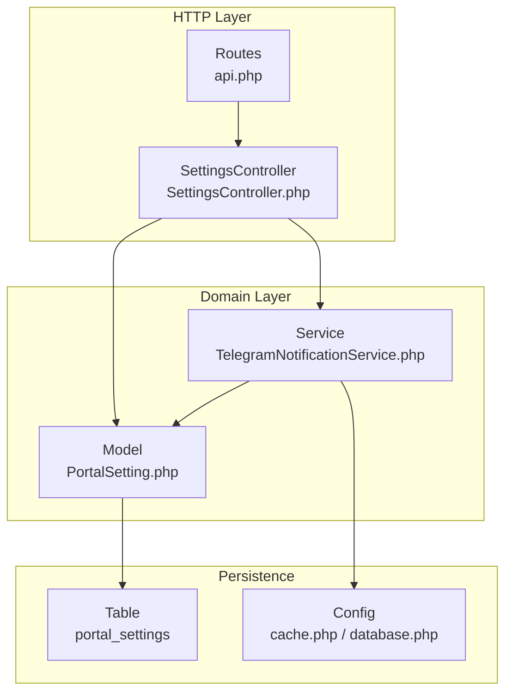
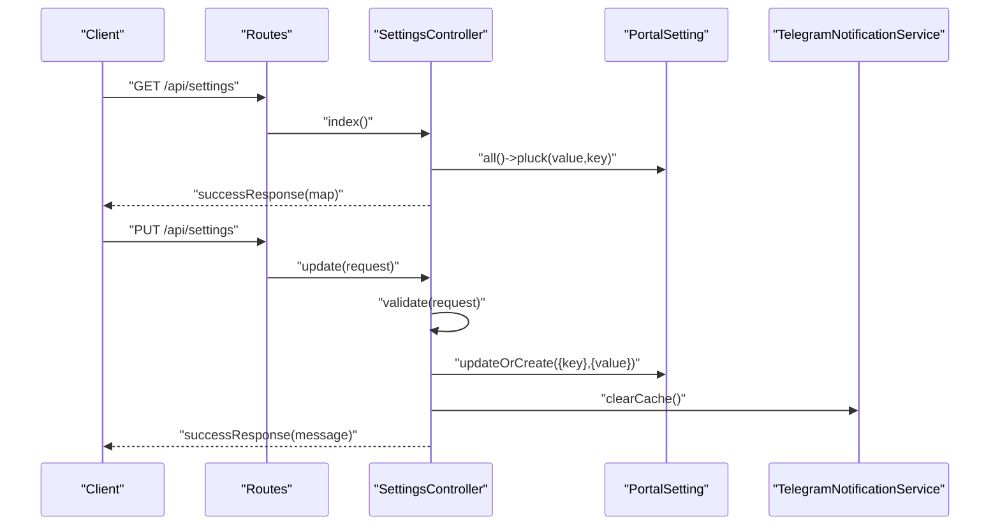
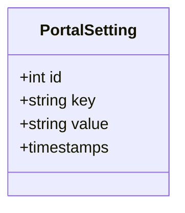
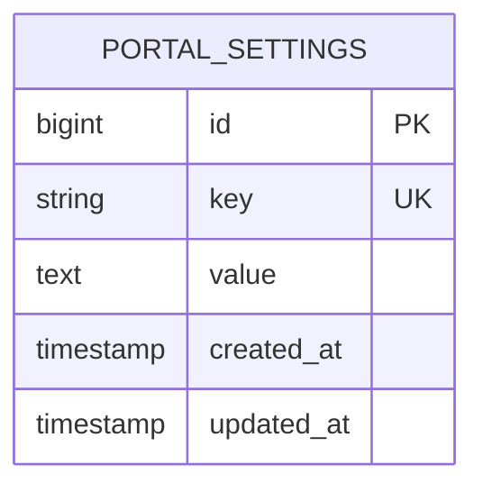
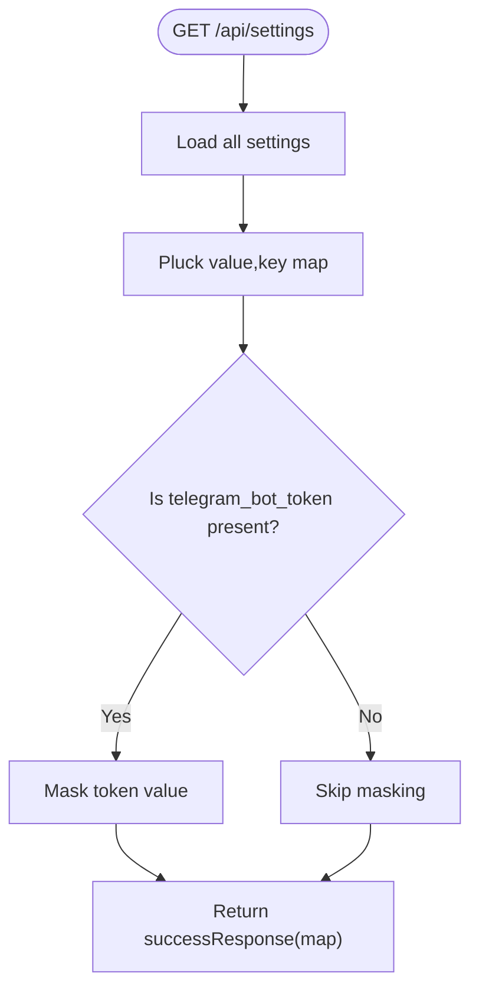
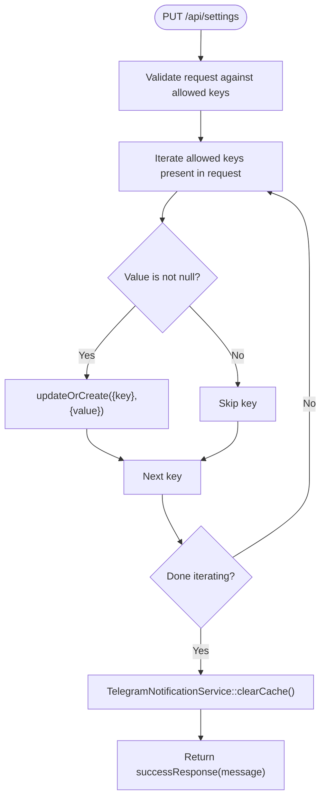
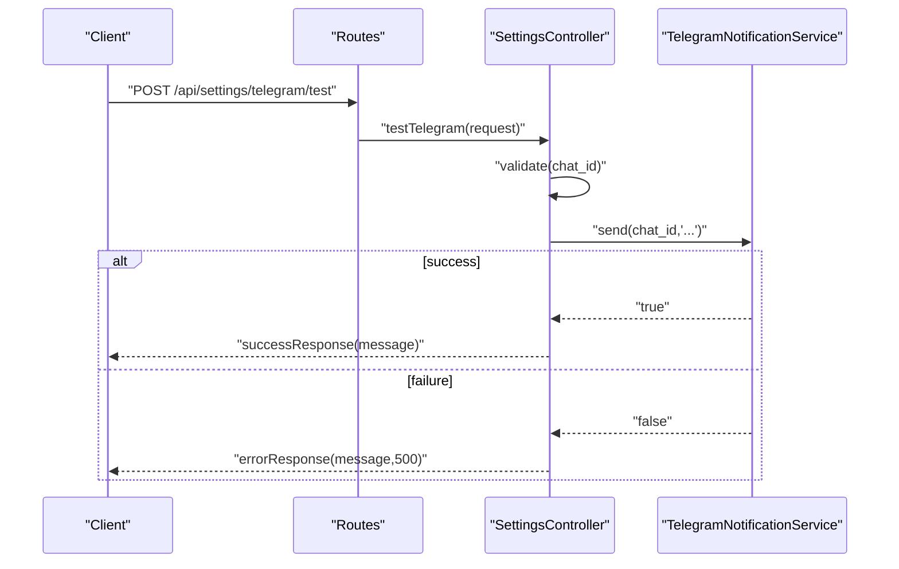
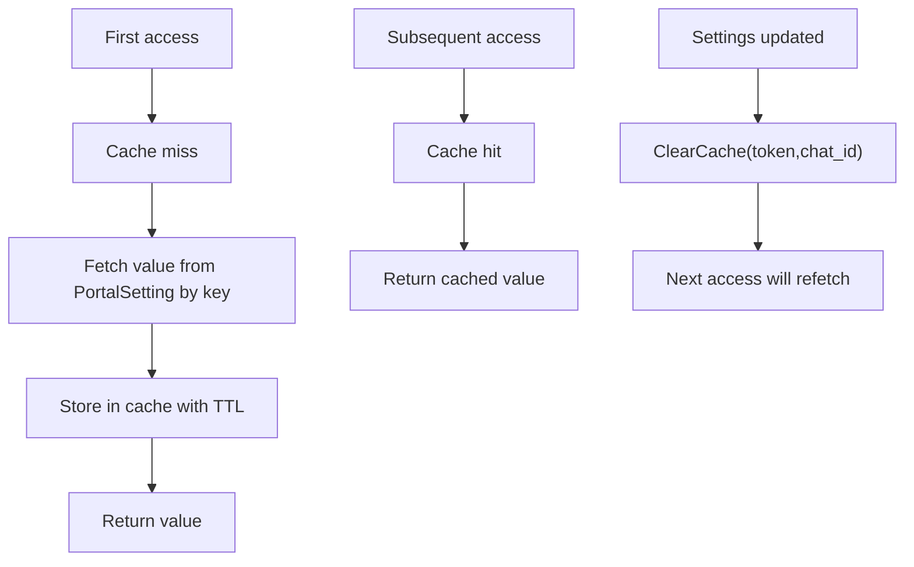
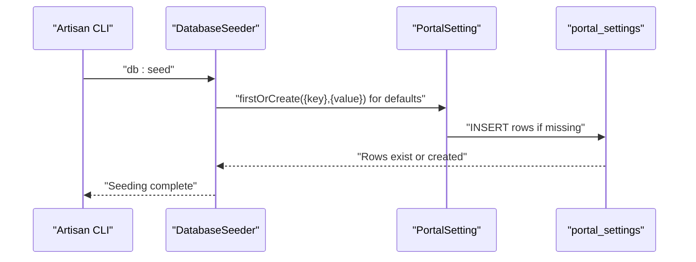
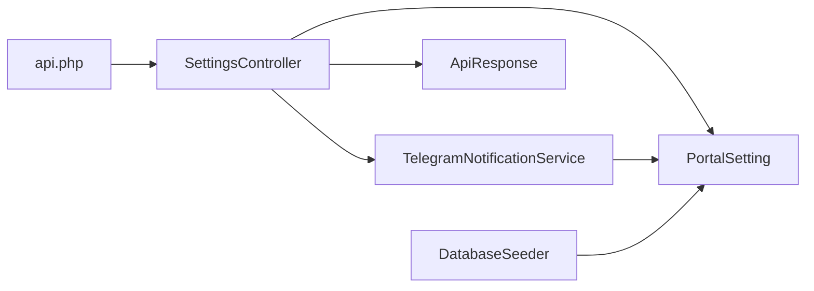

# Application Settings

<cite>
**Referenced Files in This Document**
- [PortalSetting.php](file://portal/app/Models/PortalSetting.php)
- [2026_05_15_070005_create_portal_settings_table.php](file://portal/database/migrations/2026_05_15_070005_create_portal_settings_table.php)
- [SettingsController.php](file://portal/app/Http/Controllers/Portal/SettingsController.php)
- [api.php](file://portal/routes/api.php)
- [DatabaseSeeder.php](file://portal/database/seeders/DatabaseSeeder.php)
- [TelegramNotificationService.php](file://portal/app/Services/TelegramNotificationService.php)
- [ApiResponse.php](file://portal/app/Traits/ApiResponse.php)
- [cache.php](file://portal/config/cache.php)
- [database.php](file://portal/config/database.php)
</cite>

## Table of Contents
1. [Introduction](#introduction)
2. [Project Structure](#project-structure)
3. [Core Components](#core-components)
4. [Architecture Overview](#architecture-overview)
5. [Detailed Component Analysis](#detailed-component-analysis)
6. [Dependency Analysis](#dependency-analysis)
7. [Performance Considerations](#performance-considerations)
8. [Troubleshooting Guide](#troubleshooting-guide)
9. [Conclusion](#conclusion)
10. [Appendices](#appendices)

## Introduction
This document describes the application settings management system used to store and manage key-value configuration pairs across the portal. It explains the model, database schema, retrieval and update flows, validation rules, API endpoints, caching mechanisms, and operational guidance for adding new settings while maintaining backward compatibility.

## Project Structure
The settings system spans a small set of cohesive components:
- Model: defines the PortalSetting entity and fillable attributes
- Migration: creates the portal_settings table with a unique key and nullable value
- Controller: exposes endpoints to list and update settings, plus a Telegram test endpoint
- Routes: registers admin-protected endpoints for settings management
- Seeder: seeds default settings during initial setup
- Service: reads settings via cached retrieval and clears cache on updates
- Config: cache and database configuration affecting settings performance and persistence
- Trait: standardizes API responses returned by controller actions

**Diagram sources**
- [api.php:24-26](file://portal/routes/api.php#L24-L26)
- [SettingsController.php:18-86](file://portal/app/Http/Controllers/Portal/SettingsController.php#L18-L86)
- [PortalSetting.php:7-10](file://portal/app/Models/PortalSetting.php#L7-L10)
- [TelegramNotificationService.php:81-96](file://portal/app/Services/TelegramNotificationService.php#L81-L96)
- [cache.php:18](file://portal/config/cache.php#L18)
- [database.php:20](file://portal/config/database.php#L20)

**Section sources**
- [api.php:24-26](file://portal/routes/api.php#L24-L26)
- [SettingsController.php:18-86](file://portal/app/Http/Controllers/Portal/SettingsController.php#L18-L86)
- [PortalSetting.php:7-10](file://portal/app/Models/PortalSetting.php#L7-L10)
- [TelegramNotificationService.php:81-96](file://portal/app/Services/TelegramNotificationService.php#L81-L96)
- [cache.php:18](file://portal/config/cache.php#L18)
- [database.php:20](file://portal/config/database.php#L20)

## Core Components
- PortalSetting model
  - Declares fillable attributes for key and value
  - Provides a lightweight Eloquent model for settings persistence
- SettingsController
  - GET /api/settings returns all settings as a key/value map with masked sensitive values
  - PUT /api/settings validates and persists allowed keys
  - POST /api/settings/telegram/test triggers a synchronous Telegram test message
- Database schema
  - portal_settings table with unique key, nullable value, timestamps
- Seeder
  - Seeds default settings including Telegram tokens, base URL, ping interval, and retry limits
- TelegramNotificationService
  - Reads settings via cached getters and clears cache on settings updates
- ApiResponse trait
  - Standardizes success and error responses across controllers

**Section sources**
- [PortalSetting.php:7-10](file://portal/app/Models/PortalSetting.php#L7-L10)
- [SettingsController.php:18-86](file://portal/app/Http/Controllers/Portal/SettingsController.php#L18-L86)
- [2026_05_15_070005_create_portal_settings_table.php:11-16](file://portal/database/migrations/2026_05_15_070005_create_portal_settings_table.php#L11-L16)
- [DatabaseSeeder.php:32-46](file://portal/database/seeders/DatabaseSeeder.php#L32-L46)
- [TelegramNotificationService.php:81-105](file://portal/app/Services/TelegramNotificationService.php#L81-L105)
- [ApiResponse.php:9-40](file://portal/app/Traits/ApiResponse.php#L9-L40)

## Architecture Overview
The settings system follows a clean separation of concerns:
- HTTP requests enter via routes and are handled by the SettingsController
- Validation ensures only allowed keys are processed
- Updates leverage Eloquent’s updateOrCreate to maintain uniqueness on key
- Retrieval returns a flattened map of settings, masking sensitive values
- Telegram integration reads cached settings and invalidates cache on changes

**Diagram sources**
- [api.php:24-26](file://portal/routes/api.php#L24-L26)
- [SettingsController.php:18-86](file://portal/app/Http/Controllers/Portal/SettingsController.php#L18-L86)
- [PortalSetting.php:7-10](file://portal/app/Models/PortalSetting.php#L7-L10)
- [TelegramNotificationService.php:101-105](file://portal/app/Services/TelegramNotificationService.php#L101-L105)

## Detailed Component Analysis

### PortalSetting Model
- Purpose: Persist key-value pairs representing application configuration
- Attributes:
  - key: unique string identifier for the setting
  - value: text value (nullable) supporting strings, numbers, or serialized structures
- Behavior:
  - Uses mass assignment protection via fillable attributes
  - No additional scopes or helpers are defined in this model

**Diagram sources**
- [PortalSetting.php:7-10](file://portal/app/Models/PortalSetting.php#L7-L10)
- [2026_05_15_070005_create_portal_settings_table.php:11-16](file://portal/database/migrations/2026_05_15_070005_create_portal_settings_table.php#L11-L16)

**Section sources**
- [PortalSetting.php:7-10](file://portal/app/Models/PortalSetting.php#L7-L10)
- [2026_05_15_070005_create_portal_settings_table.php:11-16](file://portal/database/migrations/2026_05_15_070005_create_portal_settings_table.php#L11-L16)

### Database Schema for Settings Storage
- Table: portal_settings
- Columns:
  - id: auto-incrementing primary key
  - key: unique string identifier (length 100)
  - value: text field (nullable)
  - timestamps: created_at and updated_at
- Constraints:
  - Unique constraint on key prevents duplicates
- Notes:
  - Values are stored as text, enabling flexibility for scalars and serialized data

**Diagram sources**
- [2026_05_15_070005_create_portal_settings_table.php:11-16](file://portal/database/migrations/2026_05_15_070005_create_portal_settings_table.php#L11-L16)

**Section sources**
- [2026_05_15_070005_create_portal_settings_table.php:11-16](file://portal/database/migrations/2026_05_15_070005_create_portal_settings_table.php#L11-L16)

### Settings Retrieval and Masking
- Endpoint: GET /api/settings
- Behavior:
  - Loads all settings and plucks a value map keyed by setting key
  - Masks telegram_bot_token for security
- Response:
  - Returns a success response containing the settings map

**Diagram sources**
- [SettingsController.php:18-28](file://portal/app/Http/Controllers/Portal/SettingsController.php#L18-L28)

**Section sources**
- [SettingsController.php:18-28](file://portal/app/Http/Controllers/Portal/SettingsController.php#L18-L28)

### Settings Update and Validation
- Endpoint: PUT /api/settings
- Allowed keys:
  - telegram_bot_token
  - telegram_default_chat_id
  - portal_base_url
  - agent_ping_interval_minutes
  - max_deployment_retries
- Validation rules:
  - telegram_bot_token: nullable string
  - telegram_default_chat_id: nullable string
  - portal_base_url: nullable URL
  - agent_ping_interval_minutes: nullable integer between 1 and 60
  - max_deployment_retries: nullable integer between 0 and 10
- Persistence:
  - For each allowed key present in the request, updateOrCreate is used to ensure uniqueness on key
- Side effects:
  - Clears Telegram cache to reflect updated credentials

**Diagram sources**
- [SettingsController.php:33-64](file://portal/app/Http/Controllers/Portal/SettingsController.php#L33-L64)
- [TelegramNotificationService.php:101-105](file://portal/app/Services/TelegramNotificationService.php#L101-L105)

**Section sources**
- [SettingsController.php:33-64](file://portal/app/Http/Controllers/Portal/SettingsController.php#L33-L64)

### Telegram Test Endpoint
- Endpoint: POST /api/settings/telegram/test
- Behavior:
  - Validates presence of chat_id
  - Sends a synchronous test message via TelegramNotificationService
  - Returns success or error response accordingly

**Diagram sources**
- [api.php:26](file://portal/routes/api.php#L26)
- [SettingsController.php:69-85](file://portal/app/Http/Controllers/Portal/SettingsController.php#L69-L85)
- [TelegramNotificationService.php:16-48](file://portal/app/Services/TelegramNotificationService.php#L16-L48)

**Section sources**
- [api.php:26](file://portal/routes/api.php#L26)
- [SettingsController.php:69-85](file://portal/app/Http/Controllers/Portal/SettingsController.php#L69-L85)
- [TelegramNotificationService.php:16-48](file://portal/app/Services/TelegramNotificationService.php#L16-L48)

### Settings Caching Mechanisms and Performance Optimizations
- Cached keys:
  - telegram_bot_token
  - telegram_default_chat_id
- Cache strategy:
  - Cached for 300 seconds (5 minutes) using Cache::remember
  - Values fetched from PortalSetting via where(key,value)
- Cache invalidation:
  - On settings update, TelegramNotificationService::clearCache removes cached entries
- Persistence:
  - Cache store is configurable; defaults to database-backed cache
- Database connection:
  - Default database connection is sqlite in this repository configuration

**Diagram sources**
- [TelegramNotificationService.php:81-96](file://portal/app/Services/TelegramNotificationService.php#L81-L96)
- [TelegramNotificationService.php:101-105](file://portal/app/Services/TelegramNotificationService.php#L101-L105)
- [cache.php:18](file://portal/config/cache.php#L18)
- [database.php:20](file://portal/config/database.php#L20)

**Section sources**
- [TelegramNotificationService.php:81-96](file://portal/app/Services/TelegramNotificationService.php#L81-L96)
- [TelegramNotificationService.php:101-105](file://portal/app/Services/TelegramNotificationService.php#L101-L105)
- [cache.php:18](file://portal/config/cache.php#L18)
- [database.php:20](file://portal/config/database.php#L20)

### Settings Migration and Seeding
- Migration:
  - Creates portal_settings table with unique key and nullable value
- Seed:
  - Seeds default settings including:
    - telegram_bot_token: empty string
    - telegram_default_chat_id: empty string
    - portal_base_url: default local URL
    - agent_ping_interval_minutes: 5
    - max_deployment_retries: 3
  - Uses firstOrCreate to avoid overwriting existing seeded values

**Diagram sources**
- [DatabaseSeeder.php:32-46](file://portal/database/seeders/DatabaseSeeder.php#L32-L46)
- [2026_05_15_070005_create_portal_settings_table.php:11-16](file://portal/database/migrations/2026_05_15_070005_create_portal_settings_table.php#L11-L16)

**Section sources**
- [DatabaseSeeder.php:32-46](file://portal/database/seeders/DatabaseSeeder.php#L32-L46)
- [2026_05_15_070005_create_portal_settings_table.php:11-16](file://portal/database/migrations/2026_05_15_070005_create_portal_settings_table.php#L11-L16)

### Adding New Settings and Backward Compatibility
- Steps to add a new setting:
  - Choose a unique key and decide whether the value should be nullable
  - Add the key to the allowed keys list in the controller update method
  - Add validation rules for the new key
  - If the setting is used by services (e.g., caching), add a getter in the service and a cache key
  - Seed a default value in the seeder to preserve backward compatibility
  - Run migrations and seeders to propagate defaults
- Backward compatibility tips:
  - Keep values nullable to avoid breaking reads when a setting is absent
  - Provide sensible defaults in the seeder
  - Avoid removing keys; deprecate by marking unused and leaving in the allowed list

**Section sources**
- [SettingsController.php:43-64](file://portal/app/Http/Controllers/Portal/SettingsController.php#L43-L64)
- [DatabaseSeeder.php:32-46](file://portal/database/seeders/DatabaseSeeder.php#L32-L46)
- [TelegramNotificationService.php:81-96](file://portal/app/Services/TelegramNotificationService.php#L81-L96)

## Dependency Analysis
- Controller depends on:
  - PortalSetting for persistence
  - TelegramNotificationService for cache invalidation
  - ApiResponse trait for response formatting
- Service depends on:
  - PortalSetting for reading values
  - Cache facade for caching and invalidation
- Routes depend on:
  - SettingsController action methods
- Seeder depends on:
  - PortalSetting for seeding defaults

**Diagram sources**
- [api.php:24-26](file://portal/routes/api.php#L24-L26)
- [SettingsController.php:18-86](file://portal/app/Http/Controllers/Portal/SettingsController.php#L18-L86)
- [PortalSetting.php:7-10](file://portal/app/Models/PortalSetting.php#L7-L10)
- [TelegramNotificationService.php:81-105](file://portal/app/Services/TelegramNotificationService.php#L81-L105)
- [ApiResponse.php:9-40](file://portal/app/Traits/ApiResponse.php#L9-L40)
- [DatabaseSeeder.php:32-46](file://portal/database/seeders/DatabaseSeeder.php#L32-L46)

**Section sources**
- [api.php:24-26](file://portal/routes/api.php#L24-L26)
- [SettingsController.php:18-86](file://portal/app/Http/Controllers/Portal/SettingsController.php#L18-L86)
- [PortalSetting.php:7-10](file://portal/app/Models/PortalSetting.php#L7-L10)
- [TelegramNotificationService.php:81-105](file://portal/app/Services/TelegramNotificationService.php#L81-L105)
- [ApiResponse.php:9-40](file://portal/app/Traits/ApiResponse.php#L9-L40)
- [DatabaseSeeder.php:32-46](file://portal/database/seeders/DatabaseSeeder.php#L32-L46)

## Performance Considerations
- Caching:
  - Telegram settings are cached for 300 seconds to reduce database queries
  - Cache invalidation occurs immediately after settings updates
- Database:
  - Unique key constraint ensures efficient lookups
  - SQLite is used by default; consider switching to a production-grade database for higher concurrency
- Network:
  - Telegram API calls are synchronous for testing; consider asynchronous queuing for production workloads

[No sources needed since this section provides general guidance]

## Troubleshooting Guide
- Telegram test fails:
  - Verify telegram_bot_token and telegram_default_chat_id are set
  - Confirm portal_base_url is reachable from the runtime environment
  - Check logs for HTTP errors or exceptions
- Settings not updating:
  - Ensure the request includes only allowed keys
  - Confirm validation rules match the provided values
  - Verify cache was cleared after updates
- Missing settings in cache:
  - Confirm cache store configuration and connectivity
  - Check that the cache TTL is not prematurely expiring values

**Section sources**
- [SettingsController.php:35-41](file://portal/app/Http/Controllers/Portal/SettingsController.php#L35-L41)
- [TelegramNotificationService.php:16-48](file://portal/app/Services/TelegramNotificationService.php#L16-L48)
- [TelegramNotificationService.php:101-105](file://portal/app/Services/TelegramNotificationService.php#L101-L105)

## Conclusion
The settings system provides a simple, extensible mechanism for managing application configuration. It leverages Eloquent for persistence, a whitelist and strict validation for safety, and caching for performance. The Telegram integration demonstrates practical usage of cached settings and proper cache invalidation. By following the recommended steps for adding new settings and maintaining defaults, teams can evolve the configuration surface safely and reliably.

[No sources needed since this section summarizes without analyzing specific files]

## Appendices

### API Endpoints Summary
- GET /api/settings
  - Returns all settings as a key/value map with masked telegram_bot_token
- PUT /api/settings
  - Validates and updates allowed keys; clears Telegram cache on success
- POST /api/settings/telegram/test
  - Sends a test Telegram message to the provided chat_id

**Section sources**
- [api.php:24-26](file://portal/routes/api.php#L24-L26)
- [SettingsController.php:18-86](file://portal/app/Http/Controllers/Portal/SettingsController.php#L18-L86)

### Common Settings Examples
- Branding preferences
  - portal_base_url: base URL for links and notifications
- Feature toggles
  - agent_ping_interval_minutes: agent heartbeat interval (minutes)
  - max_deployment_retries: maximum retries for deployment operations
- System-wide parameters
  - telegram_bot_token: Telegram bot token (masked in listings)
  - telegram_default_chat_id: default chat/channel for notifications

**Section sources**
- [DatabaseSeeder.php:32-46](file://portal/database/seeders/DatabaseSeeder.php#L32-L46)
- [SettingsController.php:35-41](file://portal/app/Http/Controllers/Portal/SettingsController.php#L35-L41)