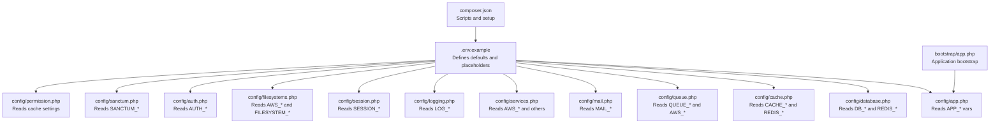
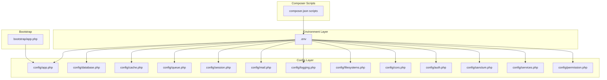
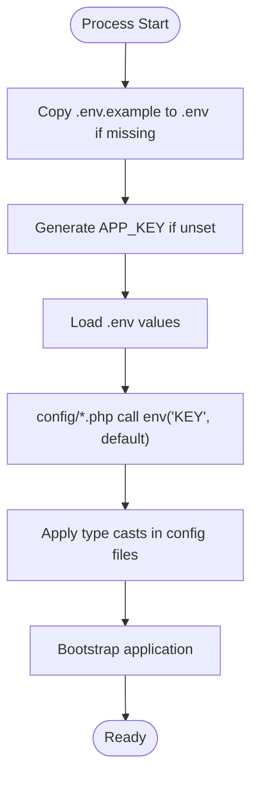
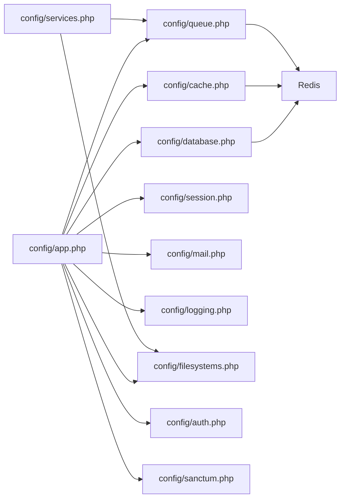

# Environment Configuration

<cite>
**Referenced Files in This Document**
- [.env.example](file://portal/.env.example)
- [config/app.php](file://portal/config/app.php)
- [config/database.php](file://portal/config/database.php)
- [config/cache.php](file://portal/config/cache.php)
- [config/queue.php](file://portal/config/queue.php)
- [config/mail.php](file://portal/config/mail.php)
- [config/services.php](file://portal/config/services.php)
- [config/logging.php](file://portal/config/logging.php)
- [config/session.php](file://portal/config/session.php)
- [config/filesystems.php](file://portal/config/filesystems.php)
- [config/cors.php](file://portal/config/cors.php)
- [config/auth.php](file://portal/config/auth.php)
- [config/sanctum.php](file://portal/config/sanctum.php)
- [config/permission.php](file://portal/config/permission.php)
- [bootstrap/app.php](file://portal/bootstrap/app.php)
- [composer.json](file://portal/composer.json)
</cite>

## Table of Contents
1. [Introduction](#introduction)
2. [Project Structure](#project-structure)
3. [Core Components](#core-components)
4. [Architecture Overview](#architecture-overview)
5. [Detailed Component Analysis](#detailed-component-analysis)
6. [Dependency Analysis](#dependency-analysis)
7. [Performance Considerations](#performance-considerations)
8. [Troubleshooting Guide](#troubleshooting-guide)
9. [Conclusion](#conclusion)
10. [Appendices](#appendices)

## Introduction
This document explains environment-based configuration management for the Laravel portal application. It covers the .env file structure, APP_ENV usage, environment variable definitions across databases, cache, queues, mail, logging, sessions, filesystems, CORS, authentication, Sanctum, and permissions. It also documents configuration loading order, precedence rules, environment-specific settings for development, staging, and production, configuration caching and optimization, validation and type casting, encryption and secure handling of sensitive data, and deployment templates and best practices.

## Project Structure
The environment configuration system centers around:
- A template .env file that defines default values and placeholders
- Configuration files under config/ that read values from environment variables via env()
- Composer scripts that orchestrate setup and environment initialization
- Bootstrap configuration that wires routing and middleware

**Diagram sources**
- [.env.example:1-66](file://portal/.env.example#L1-L66)
- [config/app.php:16-106](file://portal/config/app.php#L16-L106)
- [config/database.php:20-182](file://portal/config/database.php#L20-L182)
- [config/cache.php:18-115](file://portal/config/cache.php#L18-L115)
- [config/queue.php:16-127](file://portal/config/queue.php#L16-L127)
- [config/mail.php:17-116](file://portal/config/mail.php#L17-L116)
- [config/services.php:17-36](file://portal/config/services.php#L17-L36)
- [config/logging.php:21-129](file://portal/config/logging.php#L21-L129)
- [config/session.php:21-215](file://portal/config/session.php#L21-L215)
- [config/filesystems.php:16-61](file://portal/config/filesystems.php#L16-L61)
- [config/auth.php:19-115](file://portal/config/auth.php#L19-L115)
- [config/sanctum.php:21-68](file://portal/config/sanctum.php#L21-L68)
- [config/permission.php:183-205](file://portal/config/permission.php#L183-L205)
- [composer.json:38-67](file://portal/composer.json#L38-L67)
- [bootstrap/app.php:10-38](file://portal/bootstrap/app.php#L10-L38)

**Section sources**
- [.env.example:1-66](file://portal/.env.example#L1-L66)
- [config/app.php:16-106](file://portal/config/app.php#L16-L106)
- [composer.json:38-67](file://portal/composer.json#L38-L67)
- [bootstrap/app.php:10-38](file://portal/bootstrap/app.php#L10-L38)

## Core Components
- Application identity and environment: APP_NAME, APP_ENV, APP_KEY, APP_DEBUG, APP_URL, locales, maintenance driver/store
- Database connections: DB_CONNECTION, DB_* (host, port, database, username, password, charset, collation, SSL options)
- Cache: CACHE_STORE, cache stores, key prefix
- Queues: QUEUE_CONNECTION, queue backends, AWS_* for SQS
- Sessions: SESSION_DRIVER, lifetime, encrypt, cookie attributes
- Mail: MAIL_MAILER, SMTP host/port/credentials, global From address/name
- Logging: LOG_CHANNEL, LOG_STACK, LOG_LEVEL, Slack/Papertrail stderr/syslog
- Redis: REDIS_CLIENT, REDIS_* per client/connection pools
- Filesystems: FILESYSTEM_DISK, S3 credentials and endpoint options
- CORS: paths, methods, origins, headers, credentials
- Authentication and Sanctum: guards/providers, token expiration, stateful domains
- Permissions: cache settings for Spatie Laravel Permission

**Section sources**
- [config/app.php:16-124](file://portal/config/app.php#L16-L124)
- [config/database.php:20-182](file://portal/config/database.php#L20-L182)
- [config/cache.php:18-115](file://portal/config/cache.php#L18-L115)
- [config/queue.php:16-127](file://portal/config/queue.php#L16-L127)
- [config/session.php:21-215](file://portal/config/session.php#L21-L215)
- [config/mail.php:17-116](file://portal/config/mail.php#L17-L116)
- [config/logging.php:21-129](file://portal/config/logging.php#L21-L129)
- [config/filesystems.php:16-61](file://portal/config/filesystems.php#L16-L61)
- [config/cors.php:11-28](file://portal/config/cors.php#L11-L28)
- [config/auth.php:19-115](file://portal/config/auth.php#L19-L115)
- [config/sanctum.php:21-68](file://portal/config/sanctum.php#L21-L68)
- [config/permission.php:183-205](file://portal/config/permission.php#L183-L205)

## Architecture Overview
The configuration architecture follows a layered pattern:
- .env provides environment-specific values
- config/*.php files read env() with fallback defaults
- Application boots via bootstrap/app.php and loads routing/middleware
- Composer scripts automate setup and environment preparation

**Diagram sources**
- [.env.example:1-66](file://portal/.env.example#L1-L66)
- [config/app.php:16-106](file://portal/config/app.php#L16-L106)
- [config/database.php:20-182](file://portal/config/database.php#L20-L182)
- [config/cache.php:18-115](file://portal/config/cache.php#L18-L115)
- [config/queue.php:16-127](file://portal/config/queue.php#L16-L127)
- [config/session.php:21-215](file://portal/config/session.php#L21-L215)
- [config/mail.php:17-116](file://portal/config/mail.php#L17-L116)
- [config/logging.php:21-129](file://portal/config/logging.php#L21-L129)
- [config/filesystems.php:16-61](file://portal/config/filesystems.php#L16-L61)
- [config/cors.php:11-28](file://portal/config/cors.php#L11-L28)
- [config/auth.php:19-115](file://portal/config/auth.php#L19-L115)
- [config/sanctum.php:21-68](file://portal/config/sanctum.php#L21-L68)
- [config/services.php:17-36](file://portal/config/services.php#L17-L36)
- [config/permission.php:183-205](file://portal/config/permission.php#L183-L205)
- [bootstrap/app.php:10-38](file://portal/bootstrap/app.php#L10-L38)
- [composer.json:38-67](file://portal/composer.json#L38-L67)

## Detailed Component Analysis

### Environment Variables and Precedence
- Values are read via env('KEY', 'default') in config files
- .env.example provides defaults and documented keys
- Composer scripts ensure .env exists and APP_KEY is generated during setup
- Type casting is applied in config files (e.g., (int), (bool))
- Placeholders like ${APP_NAME} are expanded by the shell before env() reads them

Key precedence and behavior:
- env('KEY', default) returns the environment value if set, otherwise the default
- Numeric and boolean casts occur in config files after env() retrieval
- Redis and cache key prefixes derive from APP_NAME when not overridden
- S3 and AWS_* values are shared across services and filesystems

**Section sources**
- [.env.example:1-66](file://portal/.env.example#L1-L66)
- [config/app.php:16-106](file://portal/config/app.php#L16-L106)
- [config/database.php:20-182](file://portal/config/database.php#L20-L182)
- [config/cache.php:18-115](file://portal/config/cache.php#L18-L115)
- [config/queue.php:16-127](file://portal/config/queue.php#L16-L127)
- [config/session.php:21-215](file://portal/config/session.php#L21-L215)
- [config/mail.php:17-116](file://portal/config/mail.php#L17-L116)
- [config/logging.php:21-129](file://portal/config/logging.php#L21-L129)
- [config/filesystems.php:16-61](file://portal/config/filesystems.php#L16-L61)
- [composer.json:38-67](file://portal/composer.json#L38-L67)

### Database Configuration
- Default connection is controlled by DB_CONNECTION
- Supported drivers: sqlite, mysql, mariadb, pgsql, sqlsrv
- URL-based connections via DB_URL are supported for all drivers
- SSL/TLS options for MySQL/MariaDB include optional CA path
- Redis client and options are configured centrally for database connections

Examples of critical variables:
- DB_CONNECTION, DB_HOST, DB_PORT, DB_DATABASE, DB_USERNAME, DB_PASSWORD
- DB_URL (alternative to host/port/database)
- MYSQL_ATTR_SSL_CA (optional CA path)
- REDIS_CLIENT, REDIS_HOST, REDIS_PASSWORD, REDIS_PORT, REDIS_DB, REDIS_CACHE_DB

**Section sources**
- [config/database.php:20-182](file://portal/config/database.php#L20-L182)

### Cache Configuration
- Default store via CACHE_STORE
- Stores: array, database, file, memcached, redis, dynamodb, octane, failover, null
- Key prefix derived from APP_NAME if not set
- Redis cache connection and lock connection configurable

Examples of critical variables:
- CACHE_STORE, CACHE_PREFIX
- REDIS_CACHE_CONNECTION, REDIS_CACHE_LOCK_CONNECTION
- DB_CACHE_CONNECTION, DB_CACHE_TABLE, DB_CACHE_LOCK_CONNECTION, DB_CACHE_LOCK_TABLE

**Section sources**
- [config/cache.php:18-115](file://portal/config/cache.php#L18-L115)

### Queue Configuration
- Default queue via QUEUE_CONNECTION
- Backends: sync, database, beanstalkd, sqs, redis, deferred, background, failover
- SQS integration uses AWS_* keys and region
- Retry and block settings per backend

Examples of critical variables:
- QUEUE_CONNECTION, DB_QUEUE_CONNECTION, DB_QUEUE_TABLE, DB_QUEUE, DB_QUEUE_RETRY_AFTER
- BEANSTALKD_QUEUE_HOST, BEANSTALKD_QUEUE, BEANSTALKD_QUEUE_RETRY_AFTER
- SQS_PREFIX, SQS_QUEUE, SQS_SUFFIX, AWS_ACCESS_KEY_ID, AWS_SECRET_ACCESS_KEY, AWS_DEFAULT_REGION
- REDIS_QUEUE_CONNECTION, REDIS_QUEUE, REDIS_QUEUE_RETRY_AFTER
- QUEUE_FAILED_DRIVER, DB_CONNECTION for failed jobs table

**Section sources**
- [config/queue.php:16-127](file://portal/config/queue.php#L16-L127)

### Session Configuration
- Driver via SESSION_DRIVER
- Lifetime, encryption, cookie name/path/domain/secure/http_only/same_site/partitioned
- Database and cache-backed session stores supported

Examples of critical variables:
- SESSION_DRIVER, SESSION_LIFETIME, SESSION_ENCRYPT
- SESSION_CONNECTION, SESSION_TABLE
- SESSION_STORE, SESSION_COOKIE, SESSION_PATH, SESSION_DOMAIN
- SESSION_SECURE_COOKIE, SESSION_HTTP_ONLY, SESSION_SAME_SITE, SESSION_PARTITIONED_COOKIE

**Section sources**
- [config/session.php:21-215](file://portal/config/session.php#L21-L215)

### Mail Configuration
- Default mailer via MAIL_MAILER
- SMTP transport supports scheme/url/host/port/username/password/local_domain
- Global From address and name configurable

Examples of critical variables:
- MAIL_MAILER, MAIL_SCHEME, MAIL_URL, MAIL_HOST, MAIL_PORT, MAIL_USERNAME, MAIL_PASSWORD
- MAIL_FROM_ADDRESS, MAIL_FROM_NAME, MAIL_EHLO_DOMAIN
- MAIL_LOG_CHANNEL

**Section sources**
- [config/mail.php:17-116](file://portal/config/mail.php#L17-L116)

### Logging Configuration
- Default channel via LOG_CHANNEL
- Stack of channels via LOG_STACK
- Levels and retention via LOG_LEVEL, LOG_DAILY_DAYS
- Slack webhook, Papertrail UDP, stderr stream, syslog, errorlog

Examples of critical variables:
- LOG_CHANNEL, LOG_STACK, LOG_LEVEL, LOG_DAILY_DAYS
- LOG_SLACK_WEBHOOK_URL, LOG_SLACK_USERNAME, LOG_SLACK_EMOJI
- LOG_PAPERTRAIL_HANDLER, PAPERTRAIL_URL, PAPERTRAIL_PORT
- LOG_STDERR_FORMATTER, LOG_SYSLOG_FACILITY
- LOG_DEPRECATIONS_CHANNEL, LOG_DEPRECATIONS_TRACE

**Section sources**
- [config/logging.php:21-129](file://portal/config/logging.php#L21-L129)

### Filesystems and Cloud Storage
- Default disk via FILESYSTEM_DISK
- Local disks: private and public
- S3 integration: key, secret, region, bucket, endpoint, path-style

Examples of critical variables:
- FILESYSTEM_DISK, AWS_ACCESS_KEY_ID, AWS_SECRET_ACCESS_KEY, AWS_DEFAULT_REGION, AWS_BUCKET
- AWS_URL, AWS_ENDPOINT, AWS_USE_PATH_STYLE_ENDPOINT

**Section sources**
- [config/filesystems.php:16-61](file://portal/config/filesystems.php#L16-L61)

### CORS Configuration
- Paths, methods, origins, headers, credentials, max_age

**Section sources**
- [config/cors.php:11-28](file://portal/config/cors.php#L11-L28)

### Authentication and Sanctum
- Guards and providers via AUTH_GUARD, AUTH_PASSWORD_BROKER, AUTH_MODEL
- Sanctum stateful domains, token expiration, token prefix
- CSRF and cookie encryption middleware

**Section sources**
- [config/auth.php:19-115](file://portal/config/auth.php#L19-L115)
- [config/sanctum.php:21-68](file://portal/config/sanctum.php#L21-L68)

### Third-Party Services Credentials
- Postmark, Resend, SES (via AWS_*), Slack notifications

**Section sources**
- [config/services.php:17-36](file://portal/config/services.php#L17-L36)

### Permissions Cache
- Spatie Laravel Permission cache expiration, key, and store

**Section sources**
- [config/permission.php:183-205](file://portal/config/permission.php#L183-L205)

### Configuration Loading Order and Precedence
- .env.example defines documented keys and defaults
- During setup, Composer scripts ensure .env exists and APP_KEY is generated
- At runtime, config files call env('KEY', default) to read values
- Type casting occurs in config files (e.g., (int), (bool))
- Placeholders like ${APP_NAME} expand to values before env() reads them

**Diagram sources**
- [composer.json:38-67](file://portal/composer.json#L38-L67)
- [config/app.php:16-106](file://portal/config/app.php#L16-L106)

**Section sources**
- [composer.json:38-67](file://portal/composer.json#L38-L67)
- [config/app.php:16-106](file://portal/config/app.php#L16-L106)

### Environment-Specific Settings
- Development
  - APP_ENV=local
  - APP_DEBUG=true
  - LOG_LEVEL=debug
  - DB_CONNECTION=sqlite (or local MySQL/MariaDB)
  - CACHE_STORE=file or array for speed
  - QUEUE_CONNECTION=sync for local tasks
  - SESSION_DRIVER=file or database
  - MAIL_MAILER=log or smtp for local delivery
- Staging
  - APP_ENV=staging
  - APP_DEBUG=false
  - LOG_LEVEL=notice or info
  - DB_CONNECTION=mysql/mariadb with remote host
  - CACHE_STORE=redis or memcached
  - QUEUE_CONNECTION=redis or sqs
  - MAIL_MAILER=ses or postmark
- Production
  - APP_ENV=production
  - APP_DEBUG=false
  - LOG_LEVEL=error or warning
  - DB_CONNECTION=mysql/mariadb with strict settings and SSL
  - CACHE_STORE=redis or memcached
  - QUEUE_CONNECTION=redis or sqs
  - SESSION_DRIVER=database or redis
  - MAIL_MAILER=ses or mailgun
  - HTTPS enforced via APP_URL and secure cookies

[No sources needed since this section provides general guidance]

### Configuration Caching and Optimization
- Use configuration caching to reduce boot overhead in production
- Clear configuration cache before deployment and after environment changes
- Keep cache warm with appropriate TTLs and failover stores
- Prefer Redis or Memcached for distributed cache and queues in multi-instance deployments

[No sources needed since this section provides general guidance]

### Validation and Type Casting
- env() returns strings; cast to int/bool in config files
- Examples: (int) env('DB_QUEUE_RETRY_AFTER', 90), (bool) env('APP_DEBUG', false)
- Validate presence of required keys (e.g., APP_KEY) during setup

**Section sources**
- [config/queue.php:43-43](file://portal/config/queue.php#L43-L43)
- [config/app.php:42-42](file://portal/config/app.php#L42-L42)

### Encryption and Secure Handling
- APP_KEY must be set and 32 characters long
- SESSION_ENCRYPT toggles encryption for session data
- Sensitive keys (AWS, Postmark, Resend, database passwords) should be managed via secrets manager or CI/CD variables
- Never commit .env to version control; use .gitignore

**Section sources**
- [config/app.php:98-106](file://portal/config/app.php#L98-L106)
- [config/session.php:50-50](file://portal/config/session.php#L50-L50)
- [config/database.php:52-54](file://portal/config/database.php#L52-L54)
- [config/services.php:17-36](file://portal/config/services.php#L17-L36)

### Deployment Templates and Best Practices
- Use CI/CD to inject environment variables per stage
- Template .env.example as the authoritative list of required variables
- Run setup script to generate .env and APP_KEY
- Apply database migrations and queue workers per environment
- For Docker, pass environment variables via compose or secrets

[No sources needed since this section provides general guidance]

## Dependency Analysis
Configuration dependencies across components:

**Diagram sources**
- [config/app.php:16-106](file://portal/config/app.php#L16-L106)
- [config/database.php:20-182](file://portal/config/database.php#L20-L182)
- [config/cache.php:18-115](file://portal/config/cache.php#L18-L115)
- [config/queue.php:16-127](file://portal/config/queue.php#L16-L127)
- [config/session.php:21-215](file://portal/config/session.php#L21-L215)
- [config/mail.php:17-116](file://portal/config/mail.php#L17-L116)
- [config/logging.php:21-129](file://portal/config/logging.php#L21-L129)
- [config/filesystems.php:16-61](file://portal/config/filesystems.php#L16-L61)
- [config/auth.php:19-115](file://portal/config/auth.php#L19-L115)
- [config/sanctum.php:21-68](file://portal/config/sanctum.php#L21-L68)
- [config/services.php:17-36](file://portal/config/services.php#L17-L36)

**Section sources**
- [config/app.php:16-106](file://portal/config/app.php#L16-L106)
- [config/database.php:20-182](file://portal/config/database.php#L20-L182)
- [config/cache.php:18-115](file://portal/config/cache.php#L18-L115)
- [config/queue.php:16-127](file://portal/config/queue.php#L16-L127)
- [config/session.php:21-215](file://portal/config/session.php#L21-L215)
- [config/mail.php:17-116](file://portal/config/mail.php#L17-L116)
- [config/logging.php:21-129](file://portal/config/logging.php#L21-L129)
- [config/filesystems.php:16-61](file://portal/config/filesystems.php#L16-L61)
- [config/auth.php:19-115](file://portal/config/auth.php#L19-L115)
- [config/sanctum.php:21-68](file://portal/config/sanctum.php#L21-L68)
- [config/services.php:17-36](file://portal/config/services.php#L17-L36)

## Performance Considerations
- Use Redis or Memcached for cache and queues in production
- Enable configuration caching and route caching in production
- Tune retry and block settings per backend to balance latency and throughput
- Use database-backed sessions in clustered environments

[No sources needed since this section provides general guidance]

## Troubleshooting Guide
Common issues and resolutions:
- Missing APP_KEY
  - Symptom: Application fails to start or encrypt cookies
  - Resolution: Generate and set APP_KEY via setup script or CLI
- Incorrect DB credentials
  - Symptom: Connection errors or migrations failing
  - Resolution: Verify DB_HOST, DB_PORT, DB_DATABASE, DB_USERNAME, DB_PASSWORD; confirm DB_URL if used
- Redis connectivity problems
  - Symptom: Cache/queue failures
  - Resolution: Confirm REDIS_HOST, REDIS_PORT, REDIS_PASSWORD; ensure client matches REDIS_CLIENT
- Mail delivery issues
  - Symptom: Emails not sent
  - Resolution: Set MAIL_MAILER and credentials; verify SMTP host/port/credentials or use SES/SendGrid
- Logging not capturing
  - Symptom: No logs or wrong level
  - Resolution: Set LOG_CHANNEL, LOG_LEVEL, and stack channels appropriately
- CORS errors
  - Symptom: Frontend blocked by CORS
  - Resolution: Configure allowed_origins and credentials for SPA domains
- Sanctum authentication failures
  - Symptom: CSRF or session auth not recognized
  - Resolution: Add stateful domains and ensure same-site/secure cookie settings align with deployment

**Section sources**
- [composer.json:38-67](file://portal/composer.json#L38-L67)
- [config/database.php:20-182](file://portal/config/database.php#L20-L182)
- [config/cache.php:18-115](file://portal/config/cache.php#L18-L115)
- [config/queue.php:16-127](file://portal/config/queue.php#L16-L127)
- [config/mail.php:17-116](file://portal/config/mail.php#L17-L116)
- [config/logging.php:21-129](file://portal/config/logging.php#L21-L129)
- [config/cors.php:11-28](file://portal/config/cors.php#L11-L28)
- [config/sanctum.php:21-68](file://portal/config/sanctum.php#L21-L68)

## Conclusion
The Laravel portal’s environment configuration system relies on a clean separation between environment variables (.env) and configuration files (config/*.php). By leveraging env() with defaults, explicit type casting, and centralized Redis/cache/queue/mail settings, the application remains flexible across development, staging, and production. Following the recommended practices for encryption, secrets management, and caching ensures robust and secure deployments.

[No sources needed since this section summarizes without analyzing specific files]

## Appendices

### Environment Variable Reference
- Application
  - APP_NAME, APP_ENV, APP_KEY, APP_DEBUG, APP_URL, APP_LOCALE, APP_FALLBACK_LOCALE, APP_FAKER_LOCALE
  - APP_MAINTENANCE_DRIVER, APP_MAINTENANCE_STORE
- Database
  - DB_CONNECTION, DB_URL, DB_HOST, DB_PORT, DB_DATABASE, DB_USERNAME, DB_PASSWORD
  - DB_SOCKET, DB_CHARSET, DB_COLLATION, DB_FOREIGN_KEYS, MYSQL_ATTR_SSL_CA
- Cache
  - CACHE_STORE, CACHE_PREFIX
  - REDIS_CACHE_CONNECTION, REDIS_CACHE_LOCK_CONNECTION
  - DB_CACHE_CONNECTION, DB_CACHE_TABLE, DB_CACHE_LOCK_CONNECTION, DB_CACHE_LOCK_TABLE
- Queue
  - QUEUE_CONNECTION
  - DB_QUEUE_CONNECTION, DB_QUEUE_TABLE, DB_QUEUE, DB_QUEUE_RETRY_AFTER
  - BEANSTALKD_QUEUE_HOST, BEANSTALKD_QUEUE, BEANSTALKD_QUEUE_RETRY_AFTER
  - SQS_PREFIX, SQS_QUEUE, SQS_SUFFIX, AWS_ACCESS_KEY_ID, AWS_SECRET_ACCESS_KEY, AWS_DEFAULT_REGION
  - REDIS_QUEUE_CONNECTION, REDIS_QUEUE, REDIS_QUEUE_RETRY_AFTER
  - QUEUE_FAILED_DRIVER
- Sessions
  - SESSION_DRIVER, SESSION_LIFETIME, SESSION_ENCRYPT, SESSION_CONNECTION, SESSION_TABLE
  - SESSION_STORE, SESSION_COOKIE, SESSION_PATH, SESSION_DOMAIN, SESSION_SECURE_COOKIE
  - SESSION_HTTP_ONLY, SESSION_SAME_SITE, SESSION_PARTITIONED_COOKIE
- Mail
  - MAIL_MAILER, MAIL_SCHEME, MAIL_URL, MAIL_HOST, MAIL_PORT, MAIL_USERNAME, MAIL_PASSWORD
  - MAIL_FROM_ADDRESS, MAIL_FROM_NAME, MAIL_EHLO_DOMAIN, MAIL_LOG_CHANNEL
- Logging
  - LOG_CHANNEL, LOG_STACK, LOG_LEVEL, LOG_DAILY_DAYS
  - LOG_SLACK_WEBHOOK_URL, LOG_SLACK_USERNAME, LOG_SLACK_EMOJI
  - LOG_PAPERTRAIL_HANDLER, PAPERTRAIL_URL, PAPERTRAIL_PORT
  - LOG_STDERR_FORMATTER, LOG_SYSLOG_FACILITY, LOG_DEPRECATIONS_CHANNEL, LOG_DEPRECATIONS_TRACE
- Filesystems
  - FILESYSTEM_DISK, AWS_ACCESS_KEY_ID, AWS_SECRET_ACCESS_KEY, AWS_DEFAULT_REGION, AWS_BUCKET
  - AWS_URL, AWS_ENDPOINT, AWS_USE_PATH_STYLE_ENDPOINT
- CORS
  - CORS paths, methods, origins, headers, credentials, max_age
- Authentication and Sanctum
  - AUTH_GUARD, AUTH_PASSWORD_BROKER, AUTH_MODEL, AUTH_PASSWORD_RESET_TOKEN_TABLE, AUTH_PASSWORD_TIMEOUT
  - SANCTUM_STATEFUL_DOMAINS, SANCTUM_TOKEN_PREFIX
- Services
  - POSTMARK_API_KEY, RESEND_API_KEY, AWS_ACCESS_KEY_ID, AWS_SECRET_ACCESS_KEY, AWS_DEFAULT_REGION, SLACK_BOT_USER_OAUTH_TOKEN, SLACK_BOT_USER_DEFAULT_CHANNEL
- Permissions
  - Spatie Permission cache settings (expiration_time, key, store)

**Section sources**
- [.env.example:1-66](file://portal/.env.example#L1-L66)
- [config/app.php:16-124](file://portal/config/app.php#L16-L124)
- [config/database.php:20-182](file://portal/config/database.php#L20-L182)
- [config/cache.php:18-115](file://portal/config/cache.php#L18-L115)
- [config/queue.php:16-127](file://portal/config/queue.php#L16-L127)
- [config/session.php:21-215](file://portal/config/session.php#L21-L215)
- [config/mail.php:17-116](file://portal/config/mail.php#L17-L116)
- [config/logging.php:21-129](file://portal/config/logging.php#L21-L129)
- [config/filesystems.php:16-61](file://portal/config/filesystems.php#L16-L61)
- [config/cors.php:11-28](file://portal/config/cors.php#L11-L28)
- [config/auth.php:19-115](file://portal/config/auth.php#L19-L115)
- [config/sanctum.php:21-68](file://portal/config/sanctum.php#L21-L68)
- [config/services.php:17-36](file://portal/config/services.php#L17-L36)
- [config/permission.php:183-205](file://portal/config/permission.php#L183-L205)