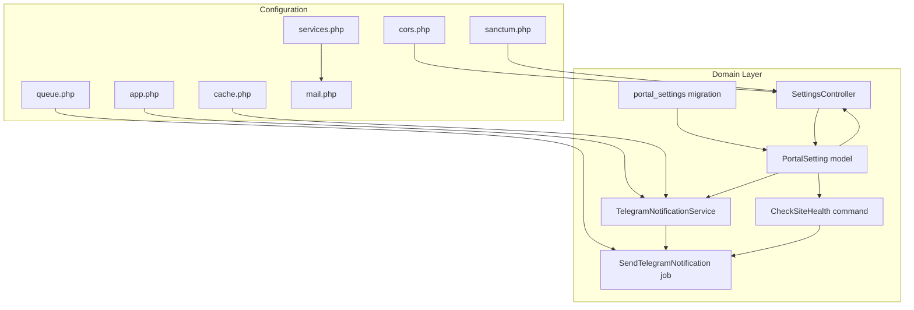
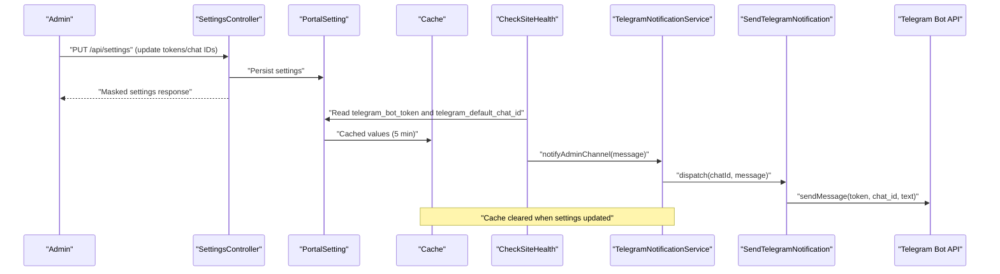
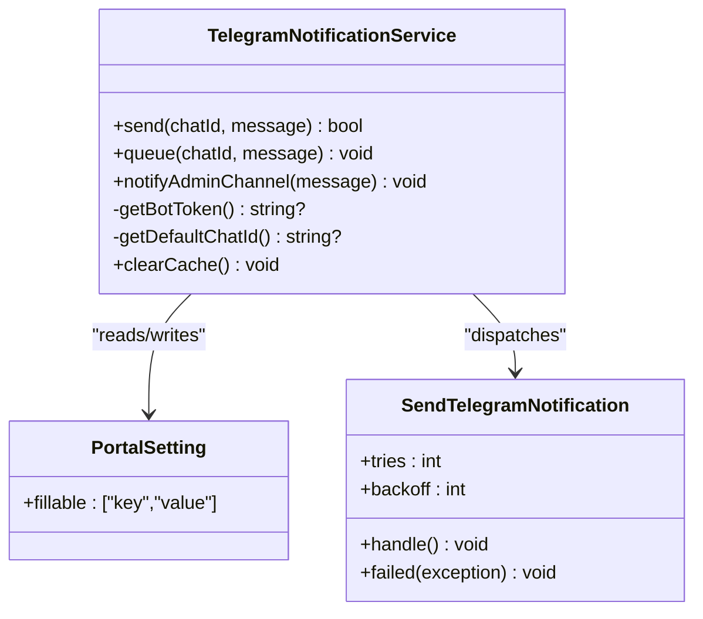
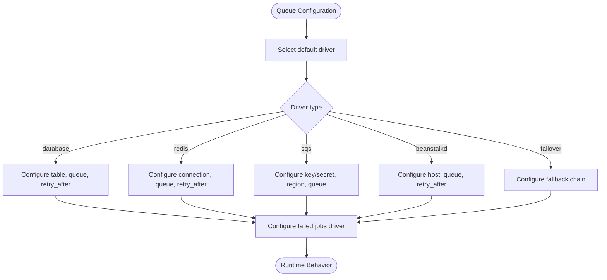
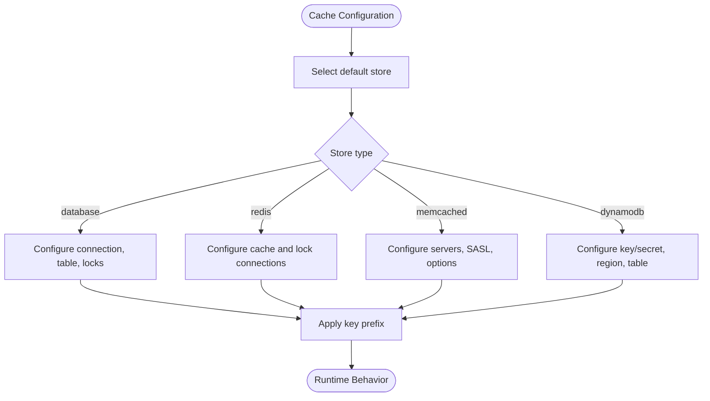
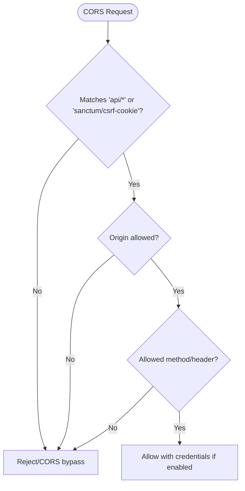
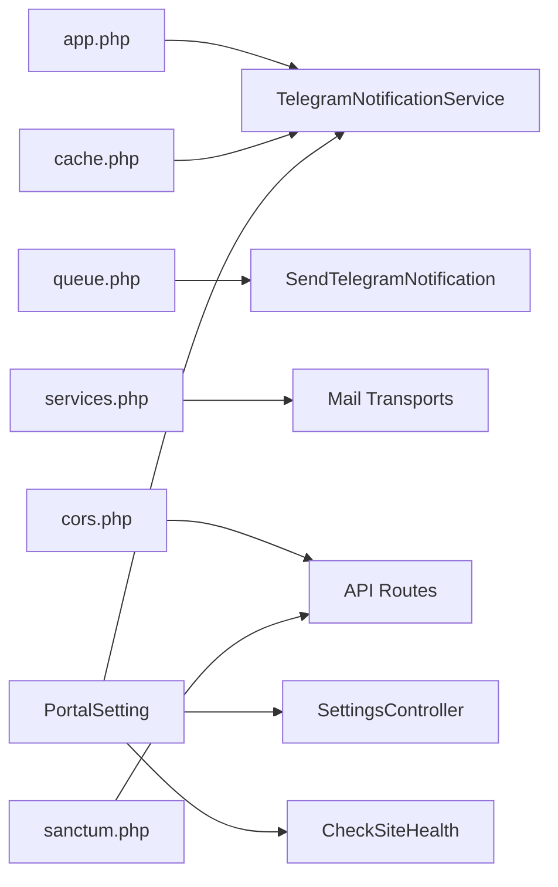

# Integration Configuration

<cite>
**Referenced Files in This Document**
- [services.php](file://portal/config/services.php)
- [queue.php](file://portal/config/queue.php)
- [cache.php](file://portal/config/cache.php)
- [cors.php](file://portal/config/cors.php)
- [app.php](file://portal/config/app.php)
- [mail.php](file://portal/config/mail.php)
- [sanctum.php](file://portal/config/sanctum.php)
- [TelegramNotificationService.php](file://portal/app/Services/TelegramNotificationService.php)
- [SendTelegramNotification.php](file://portal/app/Jobs/SendTelegramNotification.php)
- [CheckSiteHealth.php](file://portal/app/Console/Commands/CheckSiteHealth.php)
- [SettingsController.php](file://portal/app/Http/Controllers/Portal/SettingsController.php)
- [PortalSetting.php](file://portal/app/Models/PortalSetting.php)
- [2026_05_15_070005_create_portal_settings_table.php](file://portal/database/migrations/2026_05_15_070005_create_portal_settings_table.php)
- [api.php](file://portal/routes/api.php)
</cite>

## Table of Contents
1. [Introduction](#introduction)
2. [Project Structure](#project-structure)
3. [Core Components](#core-components)
4. [Architecture Overview](#architecture-overview)
5. [Detailed Component Analysis](#detailed-component-analysis)
6. [Dependency Analysis](#dependency-analysis)
7. [Performance Considerations](#performance-considerations)
8. [Troubleshooting Guide](#troubleshooting-guide)
9. [Conclusion](#conclusion)
10. [Appendices](#appendices)

## Introduction
This document explains how external service integrations are configured and operated in the application. It focuses on:
- Telegram bot integration (bot token, chat IDs, webhook-less notifications)
- Queue configuration for background job processing
- Cache configuration for Redis and other backends
- CORS configuration for cross-origin requests
- Security considerations for API keys and authentication
- Monitoring and health checks
- Setup guides and troubleshooting procedures

## Project Structure
The integration configuration spans configuration files, models, services, jobs, console commands, controllers, and routes. The following diagram shows how these pieces relate to each other.

**Diagram sources**
- [app.php:1-127](file://portal/config/app.php#L1-L127)
- [services.php:1-39](file://portal/config/services.php#L1-L39)
- [queue.php:1-130](file://portal/config/queue.php#L1-L130)
- [cache.php:1-118](file://portal/config/cache.php#L1-L118)
- [cors.php:1-30](file://portal/config/cors.php#L1-L30)
- [sanctum.php:1-88](file://portal/config/sanctum.php#L1-L88)
- [mail.php:1-119](file://portal/config/mail.php#L1-L119)
- [PortalSetting.php:1-11](file://portal/app/Models/PortalSetting.php#L1-L11)
- [2026_05_15_070005_create_portal_settings_table.php:1-24](file://portal/database/migrations/2026_05_15_070005_create_portal_settings_table.php#L1-L24)
- [TelegramNotificationService.php:1-107](file://portal/app/Services/TelegramNotificationService.php#L1-L107)
- [SendTelegramNotification.php:1-62](file://portal/app/Jobs/SendTelegramNotification.php#L1-L62)
- [CheckSiteHealth.php:1-95](file://portal/app/Console/Commands/CheckSiteHealth.php#L1-L95)
- [SettingsController.php:1-49](file://portal/app/Http/Controllers/Portal/SettingsController.php#L1-L49)

**Section sources**
- [app.php:1-127](file://portal/config/app.php#L1-L127)
- [services.php:1-39](file://portal/config/services.php#L1-L39)
- [queue.php:1-130](file://portal/config/queue.php#L1-L130)
- [cache.php:1-118](file://portal/config/cache.php#L1-L118)
- [cors.php:1-30](file://portal/config/cors.php#L1-L30)
- [sanctum.php:1-88](file://portal/config/sanctum.php#L1-L88)
- [mail.php:1-119](file://portal/config/mail.php#L1-L119)
- [PortalSetting.php:1-11](file://portal/app/Models/PortalSetting.php#L1-L11)
- [2026_05_15_070005_create_portal_settings_table.php:1-24](file://portal/database/migrations/2026_05_15_070005_create_portal_settings_table.php#L1-L24)
- [TelegramNotificationService.php:1-107](file://portal/app/Services/TelegramNotificationService.php#L1-L107)
- [SendTelegramNotification.php:1-62](file://portal/app/Jobs/SendTelegramNotification.php#L1-L62)
- [CheckSiteHealth.php:1-95](file://portal/app/Console/Commands/CheckSiteHealth.php#L1-L95)
- [SettingsController.php:1-49](file://portal/app/Http/Controllers/Portal/SettingsController.php#L1-L49)

## Core Components
- Telegram integration
  - Bot token and default chat ID are stored in the portal settings table and cached for 5 minutes.
  - Notifications are sent via a queued job to Telegram’s Bot API.
  - A synchronous test method is available for development and testing.
- Queue configuration
  - Supports drivers: sync, database, beanstalkd, sqs, redis, deferred, background, failover, null.
  - Default is database; failed jobs are stored using a configurable driver.
- Cache configuration
  - Supports drivers: array, database, file, memcached, redis, dynamodb, octane, failover, null.
  - Default is database; key prefixing is supported.
- CORS configuration
  - Enables cross-origin requests for API paths and CSRF cookie endpoint.
  - Credentials are supported; origins include a default localhost origin.
- Authentication and security
  - Sanctum manages stateful authentication for SPA domains and middleware.
  - Mail transport configuration supports multiple providers including Postmark, Resend, SES.
  - Third-party service credentials are loaded from environment variables via the services configuration.

**Section sources**
- [TelegramNotificationService.php:1-107](file://portal/app/Services/TelegramNotificationService.php#L1-L107)
- [SendTelegramNotification.php:1-62](file://portal/app/Jobs/SendTelegramNotification.php#L1-L62)
- [queue.php:1-130](file://portal/config/queue.php#L1-L130)
- [cache.php:1-118](file://portal/config/cache.php#L1-L118)
- [cors.php:1-30](file://portal/config/cors.php#L1-L30)
- [sanctum.php:1-88](file://portal/config/sanctum.php#L1-L88)
- [services.php:1-39](file://portal/config/services.php#L1-L39)
- [mail.php:1-119](file://portal/config/mail.php#L1-L119)

## Architecture Overview
The Telegram integration follows a service-layer pattern with a job for asynchronous delivery. Health checks trigger notifications via the queue. Settings are persisted and cached for fast retrieval.

**Diagram sources**
- [SettingsController.php:1-49](file://portal/app/Http/Controllers/Portal/SettingsController.php#L1-L49)
- [PortalSetting.php:1-11](file://portal/app/Models/PortalSetting.php#L1-L11)
- [TelegramNotificationService.php:1-107](file://portal/app/Services/TelegramNotificationService.php#L1-L107)
- [SendTelegramNotification.php:1-62](file://portal/app/Jobs/SendTelegramNotification.php#L1-L62)
- [CheckSiteHealth.php:1-95](file://portal/app/Console/Commands/CheckSiteHealth.php#L1-L95)

## Detailed Component Analysis

### Telegram Bot Integration
- Configuration keys
  - telegram_bot_token: stored under key “telegram_bot_token”
  - telegram_default_chat_id: stored under key “telegram_default_chat_id”
- Retrieval and caching
  - Values are fetched from the portal settings table and cached for 300 seconds.
  - Cache is cleared when settings are updated.
- Delivery modes
  - Synchronous send for testing and immediate feedback.
  - Asynchronous queue dispatch for background processing.
- Health check integration
  - Console command reads settings and dispatches notifications for site status changes.

**Diagram sources**
- [PortalSetting.php:1-11](file://portal/app/Models/PortalSetting.php#L1-L11)
- [TelegramNotificationService.php:1-107](file://portal/app/Services/TelegramNotificationService.php#L1-L107)
- [SendTelegramNotification.php:1-62](file://portal/app/Jobs/SendTelegramNotification.php#L1-L62)

**Section sources**
- [TelegramNotificationService.php:1-107](file://portal/app/Services/TelegramNotificationService.php#L1-L107)
- [SendTelegramNotification.php:1-62](file://portal/app/Jobs/SendTelegramNotification.php#L1-L62)
- [SettingsController.php:1-49](file://portal/app/Http/Controllers/Portal/SettingsController.php#L1-L49)
- [PortalSetting.php:1-11](file://portal/app/Models/PortalSetting.php#L1-L11)
- [2026_05_15_070005_create_portal_settings_table.php:1-24](file://portal/database/migrations/2026_05_15_070005_create_portal_settings_table.php#L1-L24)
- [CheckSiteHealth.php:1-95](file://portal/app/Console/Commands/CheckSiteHealth.php#L1-L95)

### Queue Configuration
- Default connection
  - Defaults to “database” when QUEUE_CONNECTION is not set.
- Supported drivers
  - sync, database, beanstalkd, sqs, redis, deferred, background, failover, null.
- Failed jobs
  - Driver defaults to “database-uuids”; table name is fixed.
- Environment overrides
  - Per-driver environment variables enable configuration without code changes.

**Diagram sources**
- [queue.php:1-130](file://portal/config/queue.php#L1-L130)

**Section sources**
- [queue.php:1-130](file://portal/config/queue.php#L1-L130)

### Cache Configuration
- Default store
  - Defaults to “database” when CACHE_STORE is not set.
- Supported stores
  - array, database, file, memcached, redis, dynamodb, octane, failover, null.
- Key prefixing
  - Automatically prefixed using app name to avoid collisions.
- Redis-specific
  - Separate cache and lock connections are configurable.

**Diagram sources**
- [cache.php:1-118](file://portal/config/cache.php#L1-L118)

**Section sources**
- [cache.php:1-118](file://portal/config/cache.php#L1-L118)

### CORS Configuration
- Paths
  - Applies to “api/*” and “sanctum/csrf-cookie”.
- Methods and headers
  - Allows all methods and headers by default.
- Origins
  - Includes a default localhost origin; can be extended via environment.
- Credentials
  - Enabled to support cookie-based auth with frontends.

**Diagram sources**
- [cors.php:1-30](file://portal/config/cors.php#L1-L30)

**Section sources**
- [cors.php:1-30](file://portal/config/cors.php#L1-L30)

### Authentication and Security (Sanctum and Mail)
- Sanctum
  - Stateful domains include common local and loopback hosts.
  - Middleware includes cookie encryption, CSRF validation, and session authentication.
  - Token prefixing is configurable.
- Mail transports
  - Supports SMTP, SES, Postmark, Resend, Sendmail, Log, Array, Failover, Roundrobin.
  - Credentials for providers are sourced from environment variables via services configuration.

**Section sources**
- [sanctum.php:1-88](file://portal/config/sanctum.php#L1-L88)
- [services.php:1-39](file://portal/config/services.php#L1-L39)
- [mail.php:1-119](file://portal/config/mail.php#L1-L119)

### Settings Management and API Access
- Settings API
  - Retrieves and updates portal settings including Telegram keys and chat IDs.
  - Returns masked tokens for security.
- Routes
  - API routes are protected by Sanctum and role middleware.
  - Telegram test endpoint exists for administrators.

**Section sources**
- [SettingsController.php:1-49](file://portal/app/Http/Controllers/Portal/SettingsController.php#L1-L49)
- [api.php:1-58](file://portal/routes/api.php#L1-L58)

## Dependency Analysis
The following diagram highlights key dependencies among configuration and runtime components.

**Diagram sources**
- [app.php:1-127](file://portal/config/app.php#L1-L127)
- [cache.php:1-118](file://portal/config/cache.php#L1-L118)
- [queue.php:1-130](file://portal/config/queue.php#L1-L130)
- [services.php:1-39](file://portal/config/services.php#L1-L39)
- [cors.php:1-30](file://portal/config/cors.php#L1-L30)
- [sanctum.php:1-88](file://portal/config/sanctum.php#L1-L88)
- [TelegramNotificationService.php:1-107](file://portal/app/Services/TelegramNotificationService.php#L1-L107)
- [SendTelegramNotification.php:1-62](file://portal/app/Jobs/SendTelegramNotification.php#L1-L62)
- [SettingsController.php:1-49](file://portal/app/Http/Controllers/Portal/SettingsController.php#L1-L49)
- [PortalSetting.php:1-11](file://portal/app/Models/PortalSetting.php#L1-L11)
- [CheckSiteHealth.php:1-95](file://portal/app/Console/Commands/CheckSiteHealth.php#L1-L95)
- [api.php:1-58](file://portal/routes/api.php#L1-L58)

**Section sources**
- [TelegramNotificationService.php:1-107](file://portal/app/Services/TelegramNotificationService.php#L1-L107)
- [SendTelegramNotification.php:1-62](file://portal/app/Jobs/SendTelegramNotification.php#L1-L62)
- [SettingsController.php:1-49](file://portal/app/Http/Controllers/Portal/SettingsController.php#L1-L49)
- [CheckSiteHealth.php:1-95](file://portal/app/Console/Commands/CheckSiteHealth.php#L1-L95)
- [PortalSetting.php:1-11](file://portal/app/Models/PortalSetting.php#L1-L11)
- [api.php:1-58](file://portal/routes/api.php#L1-L58)

## Performance Considerations
- Caching
  - Telegram token and default chat ID are cached for 300 seconds to reduce database queries.
- Queue backoff
  - Telegram job retries with a fixed backoff to avoid thundering herds.
- Database-backed queues
  - Default database driver is straightforward but may require scaling with Redis or managed queues for high throughput.
- Cache key prefixing
  - Prevents collisions when multiple apps share a cache backend.

[No sources needed since this section provides general guidance]

## Troubleshooting Guide
- Telegram notifications not sent
  - Verify telegram_bot_token and telegram_default_chat_id are set in settings.
  - Confirm the queue worker is running if using asynchronous delivery.
  - Check logs for error entries indicating Telegram API failures.
- Settings appear empty or outdated
  - Clear cached settings after updating values.
- Health check notifications not received
  - Ensure agent_ping_interval_minutes is set appropriately.
  - Confirm default chat ID is configured for admin notifications.
- CORS errors in the frontend
  - Add the frontend origin to allowed origins and ensure credentials are supported if using cookies.

**Section sources**
- [TelegramNotificationService.php:1-107](file://portal/app/Services/TelegramNotificationService.php#L1-L107)
- [SendTelegramNotification.php:1-62](file://portal/app/Jobs/SendTelegramNotification.php#L1-L62)
- [SettingsController.php:1-49](file://portal/app/Http/Controllers/Portal/SettingsController.php#L1-L49)
- [CheckSiteHealth.php:1-95](file://portal/app/Console/Commands/CheckSiteHealth.php#L1-L95)
- [cors.php:1-30](file://portal/config/cors.php#L1-L30)

## Conclusion
The application integrates external services through a clean separation of concerns:
- Settings are persisted and cached for efficient retrieval.
- Telegram notifications are delivered either synchronously for testing or asynchronously via queues.
- Queue, cache, CORS, and Sanctum configurations provide flexible deployment and security options.
- Health checks automate operational alerts, ensuring visibility into system status.

[No sources needed since this section summarizes without analyzing specific files]

## Appendices

### Setup Guides

- Telegram bot integration
  - Create a Telegram bot and obtain the token.
  - Determine a target chat ID (or use a group/channel chat ID).
  - Store the token and chat ID in portal settings.
  - Optionally, run the queue worker to process notifications asynchronously.
  - Use the synchronous send method during development for immediate feedback.

- Queue backends
  - For development: use the default database driver.
  - For production: configure Redis or SQS via environment variables and select the appropriate driver.

- Cache backends
  - For development: keep the default database store.
  - For production: configure Redis or DynamoDB depending on infrastructure.

- CORS for SPA
  - Add the SPA origin to allowed origins.
  - Enable credentials if your SPA relies on cookies for authentication.

- Authentication for SPAs
  - Configure Sanctum stateful domains to include your SPA host.
  - Ensure CSRF cookie endpoints are accessible.

**Section sources**
- [TelegramNotificationService.php:1-107](file://portal/app/Services/TelegramNotificationService.php#L1-L107)
- [SendTelegramNotification.php:1-62](file://portal/app/Jobs/SendTelegramNotification.php#L1-L62)
- [queue.php:1-130](file://portal/config/queue.php#L1-L130)
- [cache.php:1-118](file://portal/config/cache.php#L1-L118)
- [cors.php:1-30](file://portal/config/cors.php#L1-L30)
- [sanctum.php:1-88](file://portal/config/sanctum.php#L1-L88)

### Configuration Reference

- Telegram settings
  - Keys: telegram_bot_token, telegram_default_chat_id
  - Storage: portal_settings table
  - Retrieval: cached for 300 seconds

- Queue settings
  - Default: QUEUE_CONNECTION
  - Drivers: sync, database, beanstalkd, sqs, redis, deferred, background, failover, null
  - Failed jobs: QUEUE_FAILED_DRIVER

- Cache settings
  - Default: CACHE_STORE
  - Drivers: array, database, file, memcached, redis, dynamodb, octane, failover, null
  - Prefix: CACHE_PREFIX

- CORS settings
  - Paths: api/*
  - Allowed origins: configured via environment
  - Credentials: supported

- Sanctum settings
  - Stateful domains: SANCTUM_STATEFUL_DOMAINS
  - Middleware: cookie encryption, CSRF validation, session authentication

- Mail settings
  - Default: MAIL_MAILER
  - Providers: smtp, ses, postmark, resend, sendmail, log, array, failover, roundrobin
  - Credentials: loaded from environment via services configuration

**Section sources**
- [TelegramNotificationService.php:1-107](file://portal/app/Services/TelegramNotificationService.php#L1-L107)
- [queue.php:1-130](file://portal/config/queue.php#L1-L130)
- [cache.php:1-118](file://portal/config/cache.php#L1-L118)
- [cors.php:1-30](file://portal/config/cors.php#L1-L30)
- [sanctum.php:1-88](file://portal/config/sanctum.php#L1-L88)
- [services.php:1-39](file://portal/config/services.php#L1-L39)
- [mail.php:1-119](file://portal/config/mail.php#L1-L119)