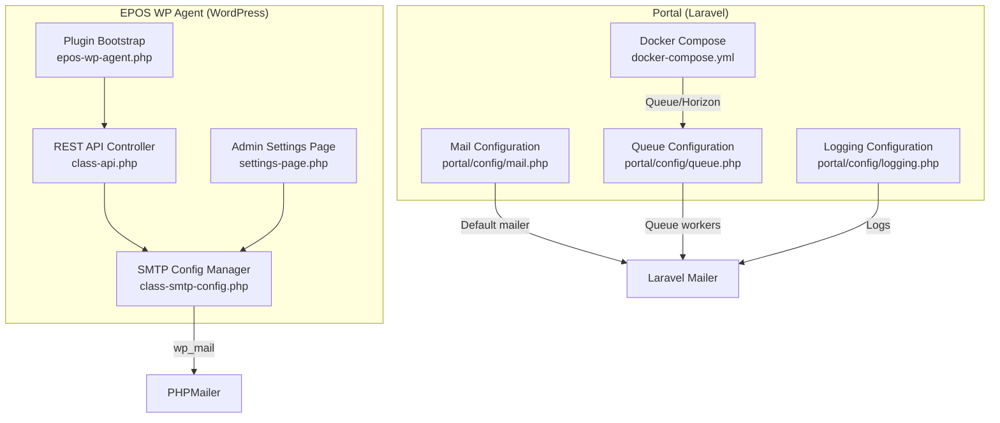
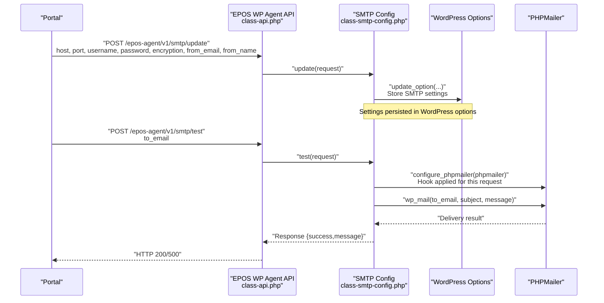
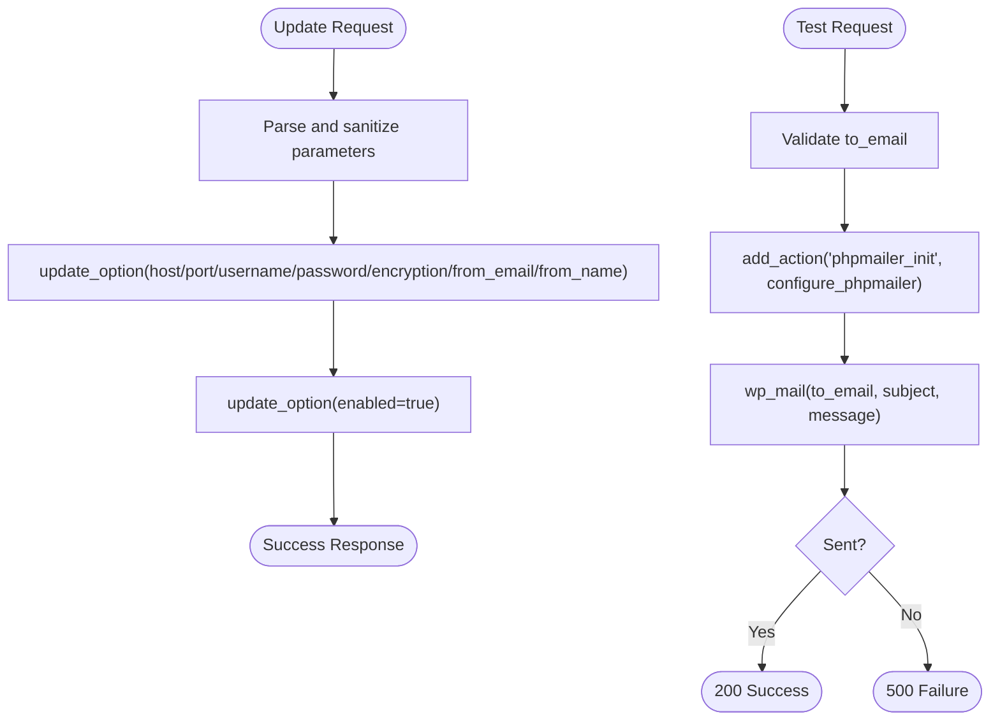
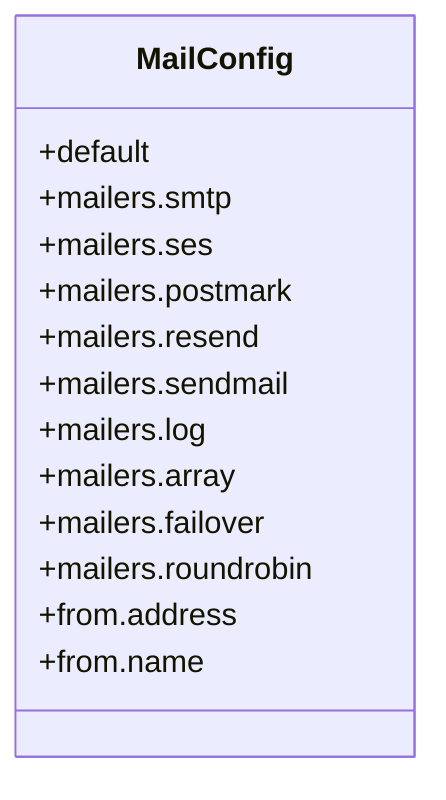
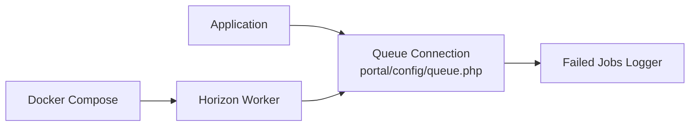
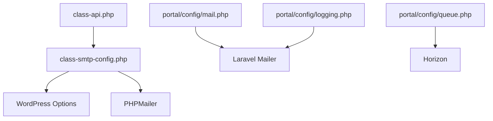

# SMTP Email Configuration

<cite>
**Referenced Files in This Document**
- [mail.php](file://portal/config/mail.php)
- [queue.php](file://portal/config/queue.php)
- [logging.php](file://portal/config/logging.php)
- [class-smtp-config.php](file://agent/epos-wp-agent/includes/class-smtp-config.php)
- [class-api.php](file://agent/epos-wp-agent/includes/class-api.php)
- [settings-page.php](file://agent/epos-wp-agent/admin/settings-page.php)
- [epos-wp-agent.php](file://agent/epos-wp-agent/epos-wp-agent.php)
- [docker-compose.yml](file://docker-compose.yml)
</cite>

## Table of Contents
1. [Introduction](#introduction)
2. [Project Structure](#project-structure)
3. [Core Components](#core-components)
4. [Architecture Overview](#architecture-overview)
5. [Detailed Component Analysis](#detailed-component-analysis)
6. [Dependency Analysis](#dependency-analysis)
7. [Performance Considerations](#performance-considerations)
8. [Troubleshooting Guide](#troubleshooting-guide)
9. [Conclusion](#conclusion)

## Introduction
This document explains how SMTP email is configured and managed across the system. It covers:
- SMTP settings structure and environment-driven configuration
- Driver selection and provider-specific mailers
- Template and message formatting options
- Queue-backed background email processing
- Authentication and security considerations
- Provider examples and fallback/retry strategies
- Delivery tracking and error handling
- Troubleshooting common SMTP issues

## Project Structure
The email stack spans two parts:
- Portal (Laravel) configuration and queue infrastructure
- EPOS WP Agent (WordPress plugin) that manages SMTP settings and test sends

**Diagram sources**
- [mail.php:38-118](file://portal/config/mail.php#L38-L118)
- [queue.php:16-129](file://portal/config/queue.php#L16-L129)
- [logging.php:21-132](file://portal/config/logging.php#L21-L132)
- [class-api.php:15-45](file://agent/epos-wp-agent/includes/class-api.php#L15-L45)
- [class-smtp-config.php:13-41](file://agent/epos-wp-agent/includes/class-smtp-config.php#L13-L41)
- [settings-page.php:116-118](file://agent/epos-wp-agent/admin/settings-page.php#L116-L118)
- [epos-wp-agent.php:43-53](file://agent/epos-wp-agent/epos-wp-agent.php#L43-L53)
- [docker-compose.yml:66-82](file://docker-compose.yml#L66-L82)

**Section sources**
- [mail.php:38-118](file://portal/config/mail.php#L38-L118)
- [queue.php:16-129](file://portal/config/queue.php#L16-L129)
- [logging.php:21-132](file://portal/config/logging.php#L21-L132)
- [class-api.php:15-45](file://agent/epos-wp-agent/includes/class-api.php#L15-L45)
- [class-smtp-config.php:13-41](file://agent/epos-wp-agent/includes/class-smtp-config.php#L13-L41)
- [settings-page.php:116-118](file://agent/epos-wp-agent/admin/settings-page.php#L116-L118)
- [epos-wp-agent.php:43-53](file://agent/epos-wp-agent/epos-wp-agent.php#L43-L53)
- [docker-compose.yml:66-82](file://docker-compose.yml#L66-L82)

## Core Components
- SMTP settings manager (WordPress plugin):
  - Receives SMTP configuration from the Portal via REST API
  - Stores credentials in WordPress options
  - Applies SMTP settings to PHPMailer for outgoing emails
  - Provides a test-send endpoint and UI integration
- Laravel mail configuration:
  - Defines default mailer and multiple transport drivers
  - Supports failover and round-robin strategies
  - Sets global From address
- Queue and logging:
  - Queue connections and failed job handling
  - Logging channels for diagnostics

**Section sources**
- [class-smtp-config.php:13-41](file://agent/epos-wp-agent/includes/class-smtp-config.php#L13-L41)
- [class-api.php:25-37](file://agent/epos-wp-agent/includes/class-api.php#L25-L37)
- [mail.php:17-118](file://portal/config/mail.php#L17-L118)
- [queue.php:16-129](file://portal/config/queue.php#L16-L129)
- [logging.php:21-132](file://portal/config/logging.php#L21-L132)

## Architecture Overview
The Portal orchestrates SMTP configuration updates to WordPress sites. WordPress applies the settings to PHPMailer for outbound emails. Laravel’s mailer and queue infrastructure support background processing and resilience.

**Diagram sources**
- [class-api.php:25-37](file://agent/epos-wp-agent/includes/class-api.php#L25-L37)
- [class-smtp-config.php:13-41](file://agent/epos-wp-agent/includes/class-smtp-config.php#L13-L41)
- [class-smtp-config.php:49-78](file://agent/epos-wp-agent/includes/class-smtp-config.php#L49-L78)
- [settings-page.php:116-118](file://agent/epos-wp-agent/admin/settings-page.php#L116-L118)

## Detailed Component Analysis

### SMTP Settings Structure and Application
- Settings accepted by the plugin:
  - host, port, username, password, encryption, from_email, from_name
- Storage:
  - Credentials saved to WordPress options for persistence
- Application:
  - A dedicated hook applies SMTP settings to PHPMailer for outgoing emails
  - Encryption is set conditionally; “none” disables secure mode

**Diagram sources**
- [class-smtp-config.php:13-41](file://agent/epos-wp-agent/includes/class-smtp-config.php#L13-L41)
- [class-smtp-config.php:49-78](file://agent/epos-wp-agent/includes/class-smtp-config.php#L49-L78)
- [class-smtp-config.php:83-103](file://agent/epos-wp-agent/includes/class-smtp-config.php#L83-L103)

**Section sources**
- [class-smtp-config.php:13-41](file://agent/epos-wp-agent/includes/class-smtp-config.php#L13-L41)
- [class-smtp-config.php:49-78](file://agent/epos-wp-agent/includes/class-smtp-config.php#L49-L78)
- [class-smtp-config.php:83-103](file://agent/epos-wp-agent/includes/class-smtp-config.php#L83-L103)

### Email Driver Configuration and Providers
- Default mailer is environment-driven
- Supported transports include smtp, sendmail, log, array, ses, postmark, resend, plus failover and roundrobin
- SMTP-specific keys:
  - scheme, url, host, port, username, password, timeout, local_domain
- Global From address is configurable

**Diagram sources**
- [mail.php:17-118](file://portal/config/mail.php#L17-L118)

**Section sources**
- [mail.php:17-118](file://portal/config/mail.php#L17-L118)

### Email Template System and Message Formatting
- WordPress plugin applies SMTP settings to PHPMailer for all outgoing emails
- No custom Blade or Laravel templates are present in the referenced files; formatting follows standard PHPMailer usage
- The plugin’s test endpoint demonstrates subject and body composition

**Section sources**
- [class-smtp-config.php:62-65](file://agent/epos-wp-agent/includes/class-smtp-config.php#L62-L65)
- [settings-page.php:116-118](file://agent/epos-wp-agent/admin/settings-page.php#L116-L118)

### Email Queue Configuration for Background Processing
- Default queue connection is environment-driven
- Supported drivers include sync, database, beanstalkd, sqs, redis, deferred, background, failover
- Failed jobs are logged to a configurable driver
- Docker Compose runs Horizon for queue processing

**Diagram sources**
- [queue.php:16-129](file://portal/config/queue.php#L16-L129)
- [docker-compose.yml:66-82](file://docker-compose.yml#L66-L82)

**Section sources**
- [queue.php:16-129](file://portal/config/queue.php#L16-L129)
- [docker-compose.yml:66-82](file://docker-compose.yml#L66-L82)

### Email Authentication Mechanisms and Security
- WordPress plugin:
  - Uses a dedicated API key header for agent-to-portal communication
  - Sanitizes inputs while preserving raw password values
  - Applies SMTP credentials to PHPMailer for authentication
- Laravel mailer:
  - Supports TLS/SSL via SMTPSecure depending on encryption setting
  - Global From address prevents spoofing
- Logging:
  - Centralized logging channels for diagnostics and errors

**Section sources**
- [class-api.php:50-71](file://agent/epos-wp-agent/includes/class-api.php#L50-L71)
- [class-smtp-config.php:13-41](file://agent/epos-wp-agent/includes/class-smtp-config.php#L13-L41)
- [class-smtp-config.php:83-103](file://agent/epos-wp-agent/includes/class-smtp-config.php#L83-L103)
- [logging.php:21-132](file://portal/config/logging.php#L21-L132)

### Fallback Email Systems and Retry Mechanisms
- Failover mailer:
  - Primary: smtp
  - Backup: log
  - Retry window configured per transport
- Round-robin mailer:
  - Alternates between ses and postmark
- Queue failover:
  - Multiple queue connections supported (database, deferred)
  - Failed job logging enabled

**Section sources**
- [mail.php:82-98](file://portal/config/mail.php#L82-L98)
- [queue.php:84-90](file://portal/config/queue.php#L84-L90)

### Delivery Tracking and Error Handling
- WordPress plugin:
  - Test endpoint returns explicit success/failure messages
  - Hook ensures settings are applied only for targeted requests
- Laravel:
  - Queue retries and backoff are handled by the queue driver
  - Failed jobs recorded for inspection

**Section sources**
- [class-smtp-config.php:49-78](file://agent/epos-wp-agent/includes/class-smtp-config.php#L49-L78)
- [queue.php:123-129](file://portal/config/queue.php#L123-L129)

## Dependency Analysis
- WordPress plugin depends on:
  - REST API controller for orchestration
  - PHPMailer for SMTP delivery
  - WordPress options for persistent storage
- Portal depends on:
  - Queue infrastructure for background processing
  - Logging for observability
  - Docker Compose for worker provisioning

**Diagram sources**
- [class-api.php:15-45](file://agent/epos-wp-agent/includes/class-api.php#L15-L45)
- [class-smtp-config.php:83-103](file://agent/epos-wp-agent/includes/class-smtp-config.php#L83-L103)
- [mail.php:38-118](file://portal/config/mail.php#L38-L118)
- [queue.php:16-129](file://portal/config/queue.php#L16-L129)
- [logging.php:21-132](file://portal/config/logging.php#L21-L132)

**Section sources**
- [class-api.php:15-45](file://agent/epos-wp-agent/includes/class-api.php#L15-L45)
- [class-smtp-config.php:83-103](file://agent/epos-wp-agent/includes/class-smtp-config.php#L83-L103)
- [mail.php:38-118](file://portal/config/mail.php#L38-L118)
- [queue.php:16-129](file://portal/config/queue.php#L16-L129)
- [logging.php:21-132](file://portal/config/logging.php#L21-L132)

## Performance Considerations
- Prefer queue-backed email delivery for high volume or reliability
- Use failover or round-robin mailers to distribute load and improve uptime
- Tune retry_after and backoff settings according to provider SLAs
- Ensure proper logging levels to avoid excessive disk usage

## Troubleshooting Guide
Common SMTP connection and authentication issues:
- Incorrect host/port:
  - Verify host and port align with provider settings
- Invalid credentials:
  - Confirm username and password are correct; avoid sanitization pitfalls
- Encryption mismatch:
  - Set encryption to match provider requirements (e.g., tls or ssl)
- Network restrictions:
  - Ensure outbound SMTP ports are permitted
- Test endpoint failures:
  - Use the plugin’s test endpoint to validate configuration
- Logging:
  - Review Laravel logs for queue and mailer errors

Operational checks:
- Confirm WordPress options for SMTP settings are persisted
- Validate REST API key header for agent-to-portal requests
- Monitor queue workers and failed job logs

**Section sources**
- [class-smtp-config.php:49-78](file://agent/epos-wp-agent/includes/class-smtp-config.php#L49-L78)
- [class-api.php:50-71](file://agent/epos-wp-agent/includes/class-api.php#L50-L71)
- [logging.php:21-132](file://portal/config/logging.php#L21-L132)
- [queue.php:123-129](file://portal/config/queue.php#L123-L129)

## Conclusion
The system integrates WordPress SMTP configuration with Laravel’s robust mailer and queue infrastructure. Administrators can securely manage SMTP settings via the Portal, apply them dynamically in WordPress, and rely on queue-backed delivery with built-in fallbacks and logging for resilience and observability.