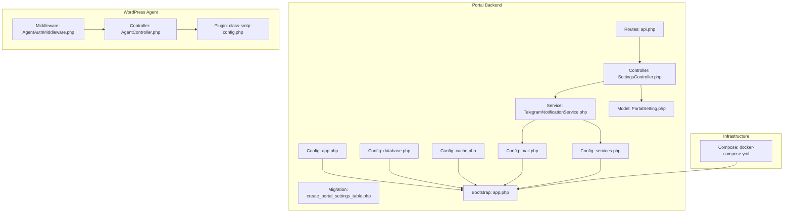
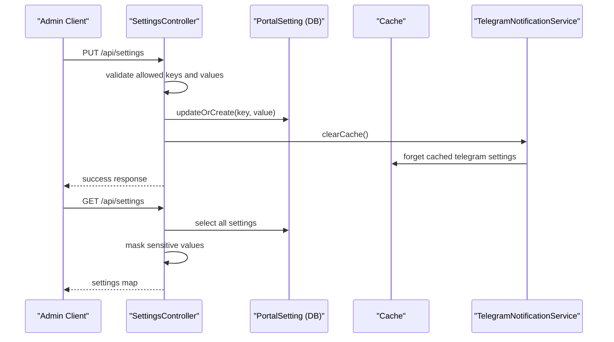
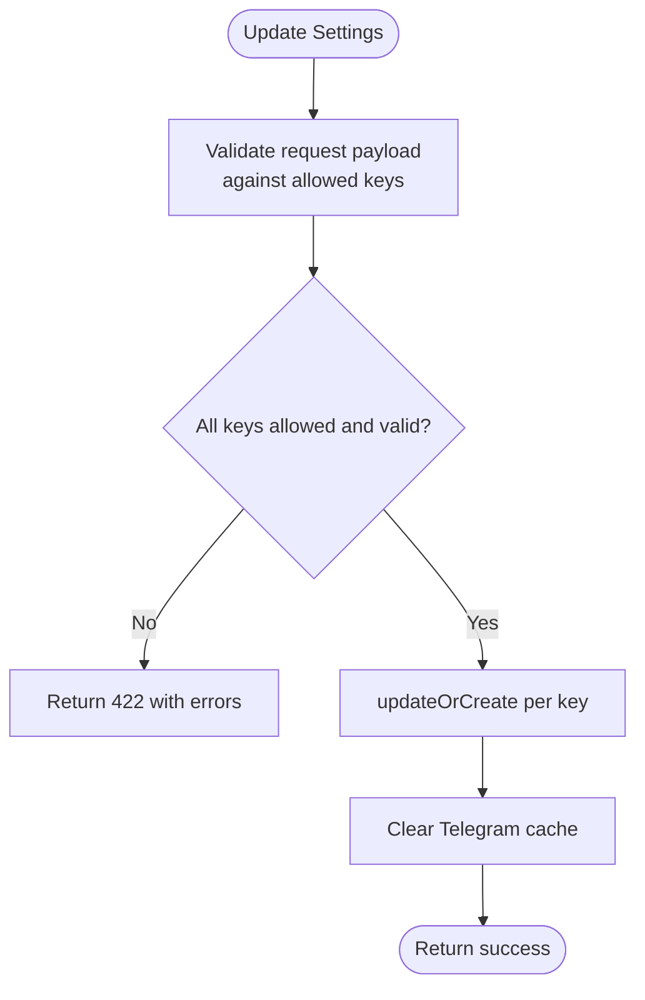
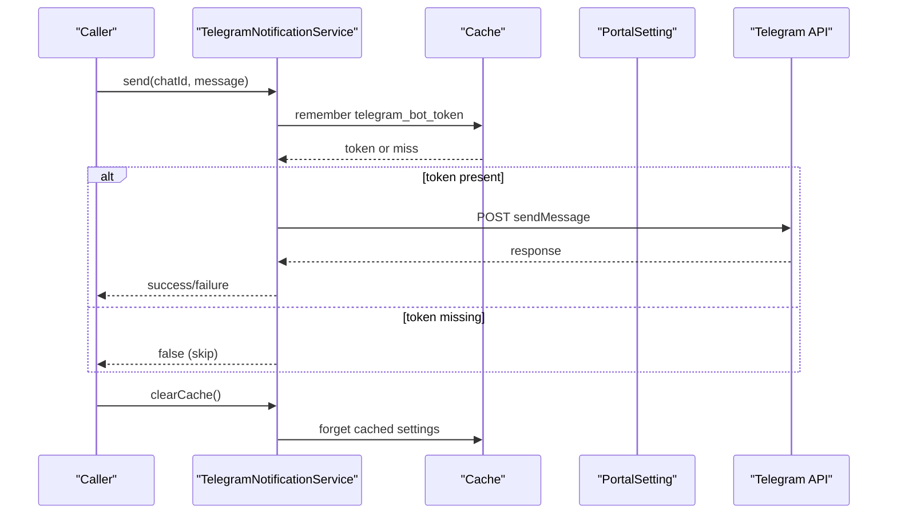
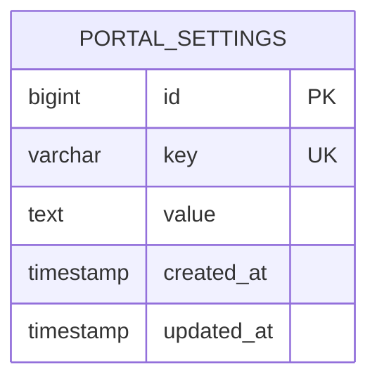
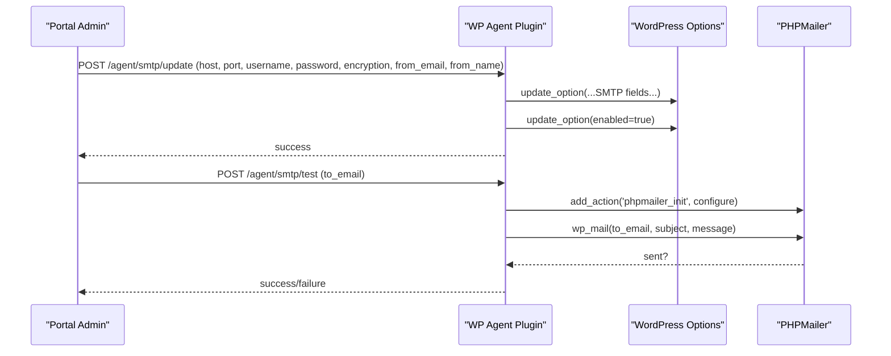
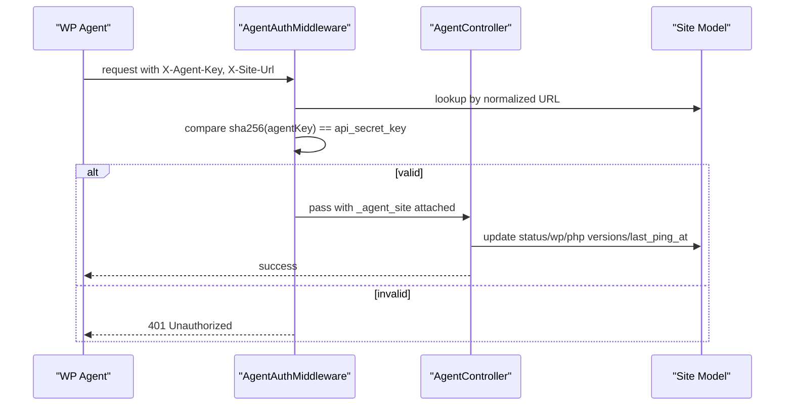

# Settings & Configuration

<cite>
**Referenced Files in This Document**
- [app.php](file://portal/config/app.php)
- [database.php](file://portal/config/database.php)
- [cache.php](file://portal/config/cache.php)
- [mail.php](file://portal/config/mail.php)
- [services.php](file://portal/config/services.php)
- [SettingsController.php](file://portal/app/Http/Controllers/Portal/SettingsController.php)
- [TelegramNotificationService.php](file://portal/app/Services/TelegramNotificationService.php)
- [PortalSetting.php](file://portal/app/Models/PortalSetting.php)
- [2026_05_15_070005_create_portal_settings_table.php](file://portal/database/migrations/2026_05_15_070005_create_portal_settings_table.php)
- [api.php](file://portal/routes/api.php)
- [class-smtp-config.php](file://agent/epos-wp-agent/includes/class-smtp-config.php)
- [AgentAuthMiddleware.php](file://portal/app/Http/Middleware/AgentAuthMiddleware.php)
- [AgentController.php](file://portal/app/Http/Controllers/Agent/AgentController.php)
- [docker-compose.yml](file://docker-compose.yml)
- [app.php](file://portal/bootstrap/app.php)
</cite>

## Table of Contents
1. [Introduction](#introduction)
2. [Project Structure](#project-structure)
3. [Core Components](#core-components)
4. [Architecture Overview](#architecture-overview)
5. [Detailed Component Analysis](#detailed-component-analysis)
6. [Dependency Analysis](#dependency-analysis)
7. [Performance Considerations](#performance-considerations)
8. [Troubleshooting Guide](#troubleshooting-guide)
9. [Conclusion](#conclusion)
10. [Appendices](#appendices)

## Introduction
This document explains the settings and configuration system across the portal backend and the WordPress agent. It covers environment-driven configuration, persistent portal settings, SMTP configuration for WordPress sites, Telegram notifications, caching and database configuration, and operational best practices for environments and deployments.

## Project Structure
The configuration system spans:
- Laravel configuration files for application, database, cache, mail, and third-party services
- A dedicated settings API for portal-wide configuration
- A WordPress plugin that manages per-site SMTP settings and test delivery
- Middleware and controllers that enforce agent authentication and expose agent endpoints
- Docker Compose for local development and worker orchestration



**Diagram sources**
- [app.php:1-127](file://portal/config/app.php#L1-L127)
- [database.php:1-185](file://portal/config/database.php#L1-L185)
- [cache.php:1-118](file://portal/config/cache.php#L1-L118)
- [mail.php:1-119](file://portal/config/mail.php#L1-L119)
- [services.php:1-39](file://portal/config/services.php#L1-L39)
- [api.php:1-48](file://portal/routes/api.php#L1-L48)
- [SettingsController.php:1-87](file://portal/app/Http/Controllers/Portal/SettingsController.php#L1-L87)
- [TelegramNotificationService.php:1-107](file://portal/app/Services/TelegramNotificationService.php#L1-L107)
- [PortalSetting.php:1-11](file://portal/app/Models/PortalSetting.php#L1-L11)
- [2026_05_15_070005_create_portal_settings_table.php:1-24](file://portal/database/migrations/2026_05_15_070005_create_portal_settings_table.php#L1-L24)
- [AgentAuthMiddleware.php:1-57](file://portal/app/Http/Middleware/AgentAuthMiddleware.php#L1-L57)
- [AgentController.php:1-99](file://portal/app/Http/Controllers/Agent/AgentController.php#L1-L99)
- [class-smtp-config.php:1-105](file://agent/epos-wp-agent/includes/class-smtp-config.php#L1-L105)
- [docker-compose.yml:1-109](file://docker-compose.yml#L1-L109)
- [app.php:1-38](file://portal/bootstrap/app.php#L1-L38)

**Section sources**
- [app.php:1-127](file://portal/config/app.php#L1-L127)
- [database.php:1-185](file://portal/config/database.php#L1-L185)
- [cache.php:1-118](file://portal/config/cache.php#L1-L118)
- [mail.php:1-119](file://portal/config/mail.php#L1-L119)
- [services.php:1-39](file://portal/config/services.php#L1-L39)
- [api.php:1-48](file://portal/routes/api.php#L1-L48)
- [SettingsController.php:1-87](file://portal/app/Http/Controllers/Portal/SettingsController.php#L1-L87)
- [TelegramNotificationService.php:1-107](file://portal/app/Services/TelegramNotificationService.php#L1-L107)
- [PortalSetting.php:1-11](file://portal/app/Models/PortalSetting.php#L1-L11)
- [2026_05_15_070005_create_portal_settings_table.php:1-24](file://portal/database/migrations/2026_05_15_070005_create_portal_settings_table.php#L1-L24)
- [AgentAuthMiddleware.php:1-57](file://portal/app/Http/Middleware/AgentAuthMiddleware.php#L1-L57)
- [AgentController.php:1-99](file://portal/app/Http/Controllers/Agent/AgentController.php#L1-L99)
- [class-smtp-config.php:1-105](file://agent/epos-wp-agent/includes/class-smtp-config.php#L1-L105)
- [docker-compose.yml:1-109](file://docker-compose.yml#L1-L109)
- [app.php:1-38](file://portal/bootstrap/app.php#L1-L38)

## Core Components
- Environment-driven configuration: application name, environment, debug, URL, timezone, locale, encryption key, maintenance driver/store.
- Database configuration: SQLite, MySQL, MariaDB, PostgreSQL, SQL Server; Redis client and options.
- Cache configuration: default store, database-backed store, file, Redis, DynamoDB, failover.
- Mail configuration: default mailer, SMTP, SES, Postmark, Resend, Sendmail, Log, Array, Failover, Round-robin; global From address.
- Third-party services: Postmark, Resend, AWS SES credentials, Slack notifications.
- Portal settings model and API: key/value settings persisted in a dedicated table, masked retrieval, validation, and Telegram test.
- Telegram notification service: synchronous send, queued send, admin channel notifications, caching of settings, cache invalidation.
- WordPress agent SMTP plugin: update and test SMTP settings, PHPMailer configuration hook.
- Agent authentication middleware and agent endpoints: handshake and periodic ping with agent key and site URL validation.

**Section sources**
- [app.php:1-127](file://portal/config/app.php#L1-L127)
- [database.php:1-185](file://portal/config/database.php#L1-L185)
- [cache.php:1-118](file://portal/config/cache.php#L1-L118)
- [mail.php:1-119](file://portal/config/mail.php#L1-L119)
- [services.php:1-39](file://portal/config/services.php#L1-L39)
- [PortalSetting.php:1-11](file://portal/app/Models/PortalSetting.php#L1-L11)
- [SettingsController.php:1-87](file://portal/app/Http/Controllers/Portal/SettingsController.php#L1-L87)
- [TelegramNotificationService.php:1-107](file://portal/app/Services/TelegramNotificationService.php#L1-L107)
- [class-smtp-config.php:1-105](file://agent/epos-wp-agent/includes/class-smtp-config.php#L1-L105)
- [AgentAuthMiddleware.php:1-57](file://portal/app/Http/Middleware/AgentAuthMiddleware.php#L1-L57)
- [AgentController.php:1-99](file://portal/app/Http/Controllers/Agent/AgentController.php#L1-L99)

## Architecture Overview
The settings system integrates environment variables, persistent portal settings, and per-site WordPress SMTP configuration. Validation and masking protect sensitive data. Caching improves performance for Telegram settings. Agent endpoints enforce secure authentication using hashed keys.



**Diagram sources**
- [SettingsController.php:1-87](file://portal/app/Http/Controllers/Portal/SettingsController.php#L1-L87)
- [TelegramNotificationService.php:1-107](file://portal/app/Services/TelegramNotificationService.php#L1-L107)
- [PortalSetting.php:1-11](file://portal/app/Models/PortalSetting.php#L1-L11)

## Detailed Component Analysis

### Portal Settings API
- Retrieves all settings as a key/value map, masking sensitive values (e.g., Telegram bot token).
- Validates and persists allowed keys: Telegram bot token, default chat ID, portal base URL, agent ping interval minutes, max deployment retries.
- Clears Telegram cache after updates to ensure immediate effect.



**Diagram sources**
- [SettingsController.php:33-64](file://portal/app/Http/Controllers/Portal/SettingsController.php#L33-L64)

**Section sources**
- [SettingsController.php:1-87](file://portal/app/Http/Controllers/Portal/SettingsController.php#L1-L87)
- [TelegramNotificationService.php:99-106](file://portal/app/Services/TelegramNotificationService.php#L99-L106)

### Telegram Notification Service
- Sends messages synchronously for testing and queues messages for background delivery.
- Reads Telegram bot token and default chat ID from cached portal settings.
- Logs failures and exceptions; clears cache on settings updates.



**Diagram sources**
- [TelegramNotificationService.php:16-48](file://portal/app/Services/TelegramNotificationService.php#L16-L48)
- [TelegramNotificationService.php:78-105](file://portal/app/Services/TelegramNotificationService.php#L78-L105)

**Section sources**
- [TelegramNotificationService.php:1-107](file://portal/app/Services/TelegramNotificationService.php#L1-L107)

### Portal Settings Data Model and Storage
- Settings are stored in a dedicated table with unique keys and nullable values.
- The model allows mass assignment of key/value pairs.



**Diagram sources**
- [2026_05_15_070005_create_portal_settings_table.php:11-16](file://portal/database/migrations/2026_05_15_070005_create_portal_settings_table.php#L11-L16)
- [PortalSetting.php](file://portal/app/Models/PortalSetting.php#L9)

**Section sources**
- [2026_05_15_070005_create_portal_settings_table.php:1-24](file://portal/database/migrations/2026_05_15_070005_create_portal_settings_table.php#L1-L24)
- [PortalSetting.php:1-11](file://portal/app/Models/PortalSetting.php#L1-L11)

### SMTP Configuration for WordPress Sites
- The plugin updates WordPress options for SMTP host, port, username, password, encryption, and sender identity.
- Applies settings via a PHPMailer filter to route subsequent emails through the configured SMTP.
- Provides a test endpoint to validate SMTP connectivity.



**Diagram sources**
- [class-smtp-config.php:13-78](file://agent/epos-wp-agent/includes/class-smtp-config.php#L13-L78)

**Section sources**
- [class-smtp-config.php:1-105](file://agent/epos-wp-agent/includes/class-smtp-config.php#L1-L105)

### Agent Authentication and Endpoints
- Middleware validates agent requests using X-Agent-Key and X-Site-Url headers against hashed API secret.
- Agent endpoints support handshake and periodic ping, updating site status and metadata.



**Diagram sources**
- [AgentAuthMiddleware.php:20-55](file://portal/app/Http/Middleware/AgentAuthMiddleware.php#L20-L55)
- [AgentController.php:16-97](file://portal/app/Http/Controllers/Agent/AgentController.php#L16-L97)

**Section sources**
- [AgentAuthMiddleware.php:1-57](file://portal/app/Http/Middleware/AgentAuthMiddleware.php#L1-L57)
- [AgentController.php:1-99](file://portal/app/Http/Controllers/Agent/AgentController.php#L1-L99)

## Dependency Analysis
- SettingsController depends on PortalSetting for persistence and TelegramNotificationService for cache invalidation.
- TelegramNotificationService depends on PortalSetting and Cache for configuration resolution and on HTTP client for Telegram API calls.
- WordPress SMTP plugin depends on WordPress options and PHPMailer hooks.
- Routes bind admin-only settings endpoints under Sanctum-authenticated, active-user middleware.

```mermaid
graph LR
SettingsController --> PortalSetting
SettingsController --> TelegramNotificationService
TelegramNotificationService --> PortalSetting
TelegramNotificationService --> Cache
TelegramNotificationService --> HTTP["HTTP Client"]
class-smtp-config --> WP_Options["WordPress Options"]
class-smtp-config --> PHPMailer["PHPMailer"]
AgentAuthMiddleware --> SiteModel["Site Model"]
AgentController --> SiteModel
```

**Diagram sources**
- [SettingsController.php:1-87](file://portal/app/Http/Controllers/Portal/SettingsController.php#L1-L87)
- [TelegramNotificationService.php:1-107](file://portal/app/Services/TelegramNotificationService.php#L1-L107)
- [class-smtp-config.php:1-105](file://agent/epos-wp-agent/includes/class-smtp-config.php#L1-L105)
- [AgentAuthMiddleware.php:1-57](file://portal/app/Http/Middleware/AgentAuthMiddleware.php#L1-L57)
- [AgentController.php:1-99](file://portal/app/Http/Controllers/Agent/AgentController.php#L1-L99)

**Section sources**
- [api.php:23-27](file://portal/routes/api.php#L23-L27)
- [SettingsController.php:1-87](file://portal/app/Http/Controllers/Portal/SettingsController.php#L1-L87)
- [TelegramNotificationService.php:1-107](file://portal/app/Services/TelegramNotificationService.php#L1-L107)
- [class-smtp-config.php:1-105](file://agent/epos-wp-agent/includes/class-smtp-config.php#L1-L105)
- [AgentAuthMiddleware.php:1-57](file://portal/app/Http/Middleware/AgentAuthMiddleware.php#L1-L57)
- [AgentController.php:1-99](file://portal/app/Http/Controllers/Agent/AgentController.php#L1-L99)

## Performance Considerations
- Cache usage: Telegram settings are cached to reduce database queries; cache is cleared upon settings updates.
- Database store: The cache can be backed by Redis or database depending on configuration, enabling horizontal scaling.
- Queue workers: Background jobs for notifications improve responsiveness; ensure Horizon is running in worker profiles.

[No sources needed since this section provides general guidance]

## Troubleshooting Guide
- Validation errors: The settings API returns structured validation errors for malformed inputs.
- Telegram failures: Inspect logs for HTTP status and exception details; verify bot token and chat ID; trigger a test message via the Telegram test endpoint.
- SMTP test failures: Confirm host, port, username, password, encryption, and sender fields; ensure PHPMailer is configured and network connectivity exists.
- Agent authentication: Verify X-Agent-Key and X-Site-Url headers; confirm the site URL matches and the hashed key equals the stored secret.

**Section sources**
- [app.php:28-37](file://portal/bootstrap/app.php#L28-L37)
- [SettingsController.php:69-85](file://portal/app/Http/Controllers/Portal/SettingsController.php#L69-L85)
- [TelegramNotificationService.php:39-47](file://portal/app/Services/TelegramNotificationService.php#L39-L47)
- [class-smtp-config.php:49-78](file://agent/epos-wp-agent/includes/class-smtp-config.php#L49-L78)
- [AgentAuthMiddleware.php:22-49](file://portal/app/Http/Middleware/AgentAuthMiddleware.php#L22-L49)

## Conclusion
The settings and configuration system combines environment-driven configuration, persistent portal settings, and per-site WordPress SMTP management. It emphasizes validation, masking of sensitive data, caching for performance, and robust error handling. Agent endpoints enforce secure authentication, while infrastructure is containerized for repeatable deployments.

[No sources needed since this section summarizes without analyzing specific files]

## Appendices

### Configuration Options Reference
- Application
  - Keys: APP_NAME, APP_ENV, APP_DEBUG, APP_URL, APP_LOCALE, APP_FALLBACK_LOCALE, APP_FAKER_LOCALE, APP_KEY, APP_PREVIOUS_KEYS, APP_MAINTENANCE_DRIVER, APP_MAINTENANCE_STORE
  - Defaults: see application configuration file
- Database
  - Keys: DB_CONNECTION, DB_URL, DB_HOST, DB_PORT, DB_DATABASE, DB_USERNAME, DB_PASSWORD, DB_CHARSET, DB_COLLATION, DB_CACHE_CONNECTION, DB_CACHE_TABLE, DB_CACHE_LOCK_CONNECTION, DB_CACHE_LOCK_TABLE, MYSQL_ATTR_SSL_CA, DB_SSLMODE
  - Defaults: see database configuration file
- Cache
  - Keys: CACHE_STORE, CACHE_PREFIX, REDIS_CACHE_CONNECTION, REDIS_CACHE_LOCK_CONNECTION, REDIS_CACHE_DB, REDIS_PREFIX, REDIS_DB, REDIS_PORT, REDIS_HOST, REDIS_PASSWORD, REDIS_USERNAME
  - Defaults: see cache configuration file
- Mail
  - Keys: MAIL_MAILER, MAIL_SCHEME, MAIL_URL, MAIL_HOST, MAIL_PORT, MAIL_USERNAME, MAIL_PASSWORD, MAIL_EHLO_DOMAIN, MAIL_FROM_ADDRESS, MAIL_FROM_NAME, MAIL_SENDMAIL_PATH, MAIL_LOG_CHANNEL
  - Defaults: see mail configuration file
- Services
  - Keys: POSTMARK_API_KEY, RESEND_API_KEY, AWS_ACCESS_KEY_ID, AWS_SECRET_ACCESS_KEY, AWS_DEFAULT_REGION, SLACK_BOT_USER_OAUTH_TOKEN, SLACK_BOT_USER_DEFAULT_CHANNEL
  - Defaults: see services configuration file

**Section sources**
- [app.php:16-124](file://portal/config/app.php#L16-L124)
- [database.php:35-115](file://portal/config/database.php#L35-L115)
- [cache.php:42-101](file://portal/config/cache.php#L42-L101)
- [mail.php:38-118](file://portal/config/mail.php#L38-L118)
- [services.php:17-36](file://portal/config/services.php#L17-L36)

### Portal Settings Keys
- telegram_bot_token
- telegram_default_chat_id
- portal_base_url
- agent_ping_interval_minutes
- max_deployment_retries

These are validated and persisted as key/value pairs.

**Section sources**
- [SettingsController.php:35-49](file://portal/app/Http/Controllers/Portal/SettingsController.php#L35-L49)
- [2026_05_15_070005_create_portal_settings_table.php](file://portal/database/migrations/2026_05_15_070005_create_portal_settings_table.php#L13)

### Configuration Validation and Error Handling
- Validation: SettingsController validates allowed keys and value constraints; returns 422 with errors.
- Error rendering: Bootstrap centralizes exception rendering for JSON/API requests.
- Telegram failures: Logged with status/body; exceptions captured and logged.

**Section sources**
- [SettingsController.php:35-41](file://portal/app/Http/Controllers/Portal/SettingsController.php#L35-L41)
- [app.php:28-37](file://portal/bootstrap/app.php#L28-L37)
- [TelegramNotificationService.php:39-47](file://portal/app/Services/TelegramNotificationService.php#L39-L47)

### Configuration Backup and Restore
- Database: Back up the database container volume or export/import SQL as appropriate for the selected driver.
- Cache: If using Redis, back up the Redis data volume.
- Settings persistence: Portal settings are stored in the portal_settings table; include this in database backups.

**Section sources**
- [docker-compose.yml:51-54](file://docker-compose.yml#L51-L54)
- [docker-compose.yml:61-63](file://docker-compose.yml#L61-L63)
- [2026_05_15_070005_create_portal_settings_table.php:11-16](file://portal/database/migrations/2026_05_15_070005_create_portal_settings_table.php#L11-L16)

### Security Measures and Sensitive Data Handling
- Masking: Telegram bot token is masked in GET /api/settings responses.
- Hashed agent keys: Agent authentication compares a SHA-256 hash of the provided key to the stored hash.
- Environment variables: All secrets are sourced from environment variables; encryption key is required for encrypted values.

**Section sources**
- [SettingsController.php:22-25](file://portal/app/Http/Controllers/Portal/SettingsController.php#L22-L25)
- [AgentAuthMiddleware.php:43-49](file://portal/app/Http/Middleware/AgentAuthMiddleware.php#L43-L49)
- [app.php:98-106](file://portal/config/app.php#L98-L106)

### Configuration Inheritance and Override Mechanisms
- Environment variables override defaults in configuration files.
- Portal settings override default behaviors for Telegram and agent parameters.
- WordPress SMTP plugin overrides global mailer settings for specific sites via PHPMailer hooks.

**Section sources**
- [mail.php:17-118](file://portal/config/mail.php#L17-L118)
- [class-smtp-config.php:83-103](file://agent/epos-wp-agent/includes/class-smtp-config.php#L83-L103)
- [TelegramNotificationService.php:78-96](file://portal/app/Services/TelegramNotificationService.php#L78-L96)

### Environment-Specific Configuration Management and Deployment Best Practices
- Use environment variables for all environment-specific values.
- Separate compose profiles for worker roles (queue and scheduler).
- Persist database and Redis data in named volumes for production deployments.
- Ensure APP_KEY is set and rotated securely; maintain previous keys during rotation.

**Section sources**
- [docker-compose.yml:80-100](file://docker-compose.yml#L80-L100)
- [app.php:100-106](file://portal/config/app.php#L100-L106)