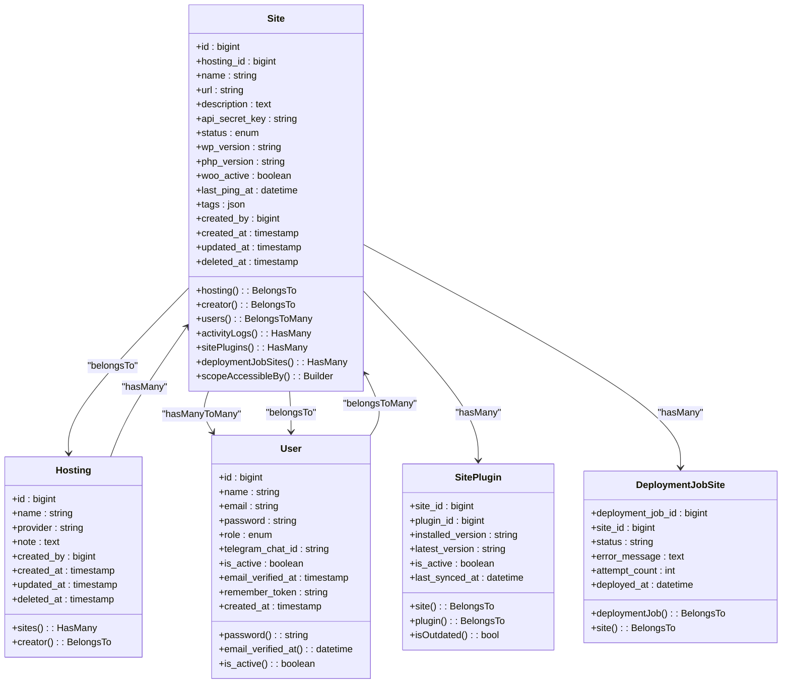
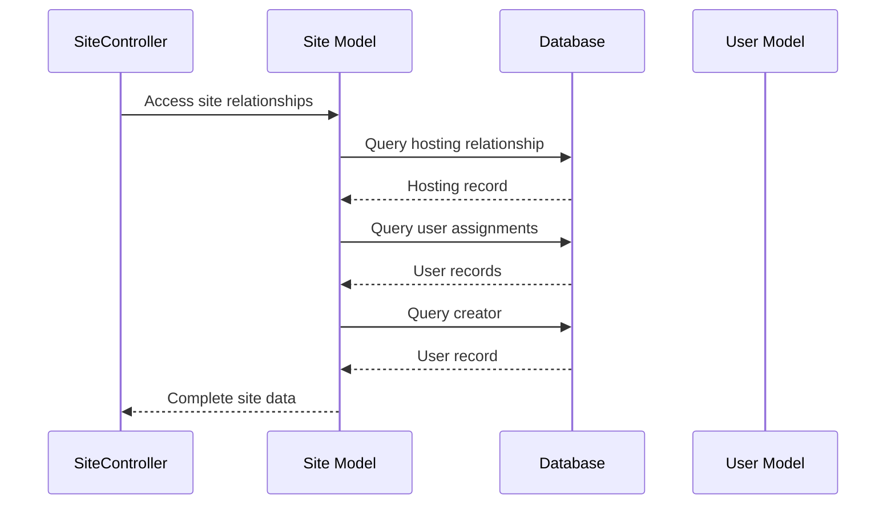
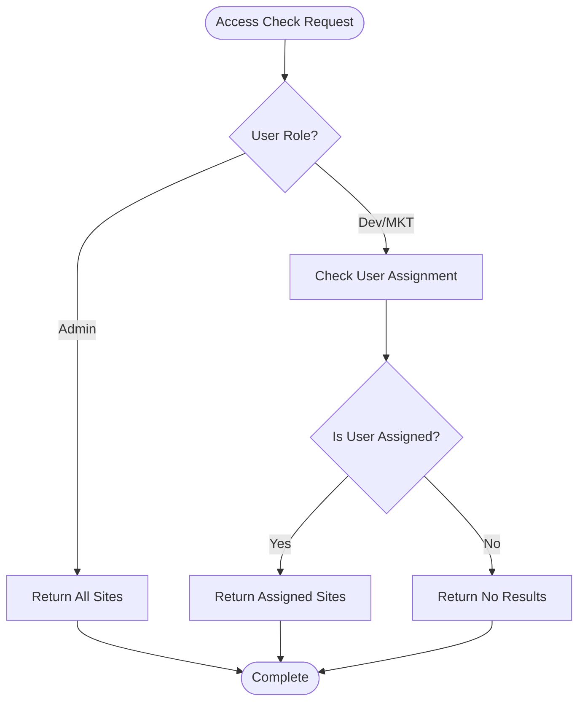
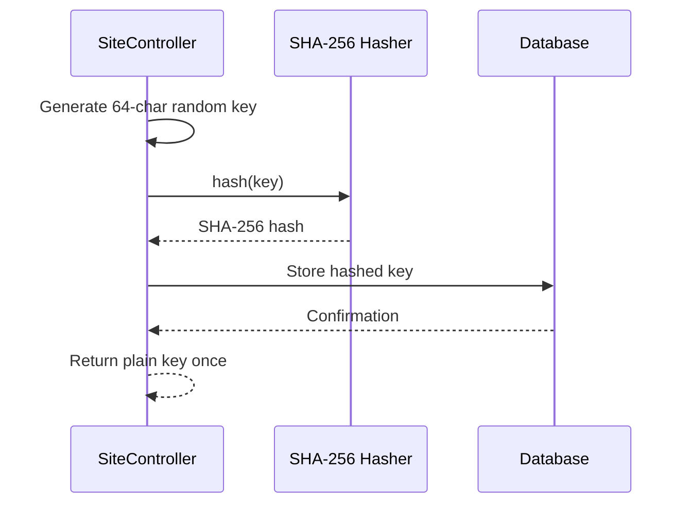
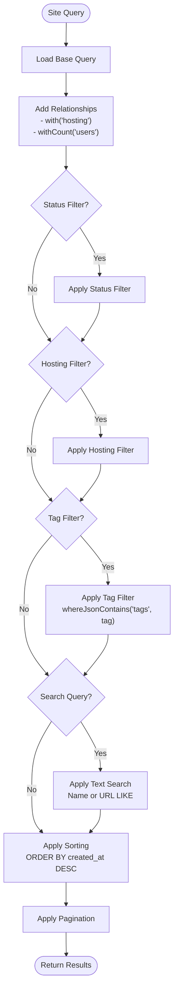
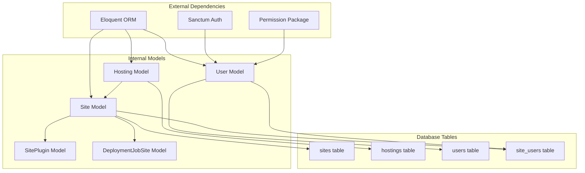

# Site Database Schema

<cite>
**Referenced Files in This Document**
- [2026_05_15_070002_create_sites_table.php](file://portal/database/migrations/2026_05_15_070002_create_sites_table.php)
- [2026_05_15_070003_create_site_users_table.php](file://portal/database/migrations/2026_05_15_070003_create_site_users_table.php)
- [2026_05_15_070001_create_hostings_table.php](file://portal/database/migrations/2026_05_15_070001_create_hostings_table.php)
- [0001_01_01_000000_create_users_table.php](file://portal/database/migrations/0001_01_01_000000_create_users_table.php)
- [Site.php](file://portal/app/Models/Site.php)
- [Hosting.php](file://portal/app/Models/Hosting.php)
- [User.php](file://portal/app/Models/User.php)
- [SiteController.php](file://portal/app/Http/Controllers/Portal/SiteController.php)
- [StoreSiteRequest.php](file://portal/app/Http/Requests/Site/StoreSiteRequest.php)
- [UpdateSiteRequest.php](file://portal/app/Http/Requests/Site/UpdateSiteRequest.php)
- [SitePlugin.php](file://portal/app/Models/SitePlugin.php)
- [DeploymentJobSite.php](file://portal/app/Models/DeploymentJobSite.php)
</cite>

## Table of Contents
1. [Introduction](#introduction)
2. [Project Structure](#project-structure)
3. [Core Components](#core-components)
4. [Architecture Overview](#architecture-overview)
5. [Detailed Component Analysis](#detailed-component-analysis)
6. [Dependency Analysis](#dependency-analysis)
7. [Performance Considerations](#performance-considerations)
8. [Troubleshooting Guide](#troubleshooting-guide)
9. [Conclusion](#conclusion)

## Introduction

This document provides comprehensive data model documentation for the site management database schema used in the portal application. The system manages WordPress sites with hosting provider associations, user assignments, and flexible categorization capabilities. The schema supports secure API key management, audit trails, and efficient querying patterns for common site management operations.

## Project Structure

The site management system follows Laravel's conventional MVC architecture with dedicated models, migrations, controllers, and request validation classes:

```mermaid
graph TB
subgraph "Database Layer"
Sites[sites table]
Hostings[hostings table]
SiteUsers[site_users pivot table]
Users[users table]
end
subgraph "Application Layer"
SiteModel[Site Model]
HostingModel[Hosting Model]
UserModel[User Model]
SiteController[Site Controller]
StoreRequest[StoreSiteRequest]
UpdateRequest[UpdateSiteRequest]
end
subgraph "Relationships"
SiteModel --> HostingModel
SiteModel <- --> UserModel
SiteUsers -.-> SiteModel
SiteUsers -.-> UserModel
end
SiteController --> SiteModel
StoreRequest --> SiteController
UpdateRequest --> SiteController
```

**Diagram sources**
- [Site.php:12-86](file://portal/app/Models/Site.php#L12-L86)
- [Hosting.php:10-31](file://portal/app/Models/Hosting.php#L10-L31)
- [User.php:11-38](file://portal/app/Models/User.php#L11-L38)

**Section sources**
- [2026_05_15_070002_create_sites_table.php:11-27](file://portal/database/migrations/2026_05_15_070002_create_sites_table.php#L11-L27)
- [2026_05_15_070003_create_site_users_table.php:11-17](file://portal/database/migrations/2026_05_15_070003_create_site_users_table.php#L11-L17)

## Core Components

### Sites Table Structure

The `sites` table serves as the central repository for WordPress site information with comprehensive metadata and management capabilities:

| Field | Type | Constraints | Description |
|-------|------|-------------|-------------|
| `id` | bigint unsigned | PRIMARY KEY, AUTO_INCREMENT | Unique identifier for each site |
| `hosting_id` | bigint unsigned | FOREIGN KEY (hostings.id), NULLABLE | Association to hosting provider |
| `name` | varchar(255) | NOT NULL | Human-readable site name |
| `url` | varchar(500) | UNIQUE, NOT NULL | Full URL including protocol |
| `description` | text | NULLABLE | Optional site description |
| `api_secret_key` | varchar(64) | UNIQUE, NOT NULL | SHA-256 hashed API key |
| `status` | enum | DEFAULT 'pending' | Current connection status |
| `wp_version` | varchar(20) | NULLABLE | WordPress version identifier |
| `php_version` | varchar(20) | NULLABLE | PHP version identifier |
| `woo_active` | boolean | DEFAULT false | WooCommerce installation status |
| `last_ping_at` | timestamp | NULLABLE | Last successful agent contact |
| `tags` | json | NULLABLE | Flexible categorization tags |
| `created_by` | bigint unsigned | FOREIGN KEY (users.id) | Audit trail creator |
| `created_at` | timestamp | NULLABLE | Record creation timestamp |
| `updated_at` | timestamp | NULLABLE | Record modification timestamp |
| `deleted_at` | timestamp | NULLABLE | Soft delete timestamp |

**Section sources**
- [2026_05_15_070002_create_sites_table.php:11-27](file://portal/database/migrations/2026_05_15_070002_create_sites_table.php#L11-L27)
- [Site.php:16-39](file://portal/app/Models/Site.php#L16-L39)

### Site Users Pivot Table

The `site_users` table implements a many-to-many relationship between sites and users with cascading deletion support:

| Field | Type | Constraints | Description |
|-------|------|-------------|-------------|
| `id` | bigint unsigned | PRIMARY KEY, AUTO_INCREMENT | Pivot table identifier |
| `site_id` | bigint unsigned | FOREIGN KEY (sites.id), NOT NULL, UNIQUE | Site association |
| `user_id` | bigint unsigned | FOREIGN KEY (users.id), NOT NULL, UNIQUE | User association |
| `created_at` | timestamp | NULLABLE | Assignment creation timestamp |
| `updated_at` | timestamp | NULLABLE | Assignment modification timestamp |

**Section sources**
- [2026_05_15_070003_create_site_users_table.php:11-17](file://portal/database/migrations/2026_05_15_070003_create_site_users_table.php#L11-L17)
- [Site.php:51-54](file://portal/app/Models/Site.php#L51-L54)

### Status Enum Values

The `status` field supports three distinct states:
- `pending`: Site registered but not yet connected
- `connected`: Active connection with successful agent communication
- `disconnected`: Connection lost or inactive

**Section sources**
- [2026_05_15_070002_create_sites_table.php:18](file://portal/database/migrations/2026_05_15_070002_create_sites_table.php#L18)

## Architecture Overview

The site management system implements a comprehensive relationship architecture with clear separation of concerns:



**Diagram sources**
- [Site.php:12-86](file://portal/app/Models/Site.php#L12-L86)
- [Hosting.php:10-31](file://portal/app/Models/Hosting.php#L10-L31)
- [User.php:11-38](file://portal/app/Models/User.php#L11-L38)
- [SitePlugin.php:8-37](file://portal/app/Models/SitePlugin.php#L8-L37)
- [DeploymentJobSite.php:8-26](file://portal/app/Models/DeploymentJobSite.php#L8-L26)

## Detailed Component Analysis

### Site Model Implementation

The Site model encapsulates all business logic and relationships for site management:

#### Relationship Definitions



**Diagram sources**
- [Site.php:41-60](file://portal/app/Models/Site.php#L41-L60)
- [SiteController.php:97-109](file://portal/app/Http/Controllers/Portal/SiteController.php#L97-L109)

#### Access Control Implementation

The `scopeAccessibleBy` method implements role-based access control:



**Diagram sources**
- [Site.php:75-84](file://portal/app/Models/Site.php#L75-L84)

**Section sources**
- [Site.php:41-84](file://portal/app/Models/Site.php#L41-L84)

### API Security Implementation

The system implements robust API security through SHA-256 hashed keys:

#### Key Generation Process



**Diagram sources**
- [SiteController.php:64-91](file://portal/app/Http/Controllers/Portal/SiteController.php#L64-L91)

#### Security Considerations

- API keys are stored as SHA-256 hashes only
- Plain text keys are returned once during creation
- Admin-only regeneration capability
- Status reset to prevent unauthorized access with old keys

**Section sources**
- [SiteController.php:64-91](file://portal/app/Http/Controllers/Portal/SiteController.php#L64-L91)
- [SiteController.php:156-182](file://portal/app/Http/Controllers/Portal/SiteController.php#L156-L182)

### Validation and Request Handling

The system implements comprehensive validation through dedicated request classes:

#### Creation Validation Rules

| Field | Rule | Description |
|-------|------|-------------|
| `name` | required|string|max:255 | Site name validation |
| `url` | required|url|unique:sites,url|max:500 | URL format and uniqueness |
| `hosting_id` | nullable|exists:hostings,id | Hosting provider existence |
| `description` | nullable|string | Optional description |
| `tags` | nullable|array | JSON array validation |
| `tags.*` | string|max:50 | Individual tag constraints |
| `user_ids` | nullable|array | User assignment array |
| `user_ids.*` | exists:users,id | User existence validation |

**Section sources**
- [StoreSiteRequest.php:14-26](file://portal/app/Http/Requests/Site/StoreSiteRequest.php#L14-L26)

#### Update Validation Rules

| Field | Rule | Description |
|-------|------|-------------|
| `name` | sometimes|string|max:255 | Conditional name validation |
| `hosting_id` | nullable|exists:hostings,id | Hosting provider existence |
| `description` | nullable|string | Optional description |
| `tags` | nullable|array | JSON array validation |
| `tags.*` | string|max:50 | Individual tag constraints |
| `user_ids` | nullable|array | User assignment array |
| `user_ids.*` | exists:users,id | User existence validation |

**Section sources**
- [UpdateSiteRequest.php:14-25](file://portal/app/Http/Requests/Site/UpdateSiteRequest.php#L14-L25)

### Advanced Querying Capabilities

The system supports sophisticated querying patterns for site management:

#### Filtering and Search Operations



**Diagram sources**
- [SiteController.php:23-56](file://portal/app/Http/Controllers/Portal/SiteController.php#L23-L56)

**Section sources**
- [SiteController.php:23-56](file://portal/app/Http/Controllers/Portal/SiteController.php#L23-L56)

## Dependency Analysis

The site management system exhibits well-defined dependency relationships:



**Diagram sources**
- [Site.php:12-86](file://portal/app/Models/Site.php#L12-L86)
- [Hosting.php:10-31](file://portal/app/Models/Hosting.php#L10-L31)
- [User.php:11-38](file://portal/app/Models/User.php#L11-L38)

**Section sources**
- [Site.php:12-86](file://portal/app/Models/Site.php#L12-L86)
- [Hosting.php:10-31](file://portal/app/Models/Hosting.php#L10-L31)
- [User.php:11-38](file://portal/app/Models/User.php#L11-L38)

## Performance Considerations

### Indexing Strategy

The current schema includes strategic indexing for optimal performance:

#### Primary Keys
- All tables use auto-increment primary keys for efficient row identification

#### Foreign Key Indexes
- `sites.hosting_id` automatically indexed through foreign key constraint
- `sites.created_by` indexed through foreign key constraint
- `site_users.site_id` indexed through foreign key constraint
- `site_users.user_id` indexed through foreign key constraint

#### Unique Constraints
- `sites.url` unique index for fast URL lookups
- `sites.api_secret_key` unique index for secure key verification
- `site_users.site_id,user_id` composite unique index prevents duplicate assignments

#### Additional Performance Recommendations

For enhanced query performance, consider adding:

```sql
-- For status-based filtering
CREATE INDEX idx_sites_status ON sites(status);

-- For tag-based queries
CREATE INDEX idx_sites_tags ON sites((CAST(tags AS CHAR(500))));

-- For created_by filtering
CREATE INDEX idx_sites_created_by ON sites(created_by);

-- For last_ping_at sorting
CREATE INDEX idx_sites_last_ping_at ON sites(last_ping_at);
```

### Query Optimization Patterns

#### Efficient Loading Strategies
- Use eager loading with `with()` for relationships to prevent N+1 queries
- Implement `withCount()` for counting relationships without loading full collections
- Apply selective field loading with `select()` for read-only operations

#### Search Optimization
- Implement full-text search indexes for large-scale text searches
- Consider implementing search-specific indexes for frequently searched fields
- Use query caching for expensive filtered queries

## Troubleshooting Guide

### Common Issues and Solutions

#### API Key Management Issues
- **Problem**: API key not accepted by agents
- **Solution**: Verify SHA-256 hash matches stored value; regenerate key if needed
- **Security**: Only admin users can regenerate API keys

#### Access Control Problems
- **Problem**: Non-admin users cannot access assigned sites
- **Solution**: Verify user assignment in `site_users` table; check role permissions
- **Audit**: Use `scopeAccessibleBy` method for proper access validation

#### Data Integrity Issues
- **Problem**: Duplicate site URLs or API keys
- **Solution**: Unique constraints prevent duplicates; handle validation errors appropriately
- **Recovery**: Remove conflicting entries before retrying

#### Performance Degradation
- **Problem**: Slow site listing queries
- **Solution**: Implement recommended indexes; optimize search queries
- **Monitoring**: Use database query logs to identify bottlenecks

**Section sources**
- [SiteController.php:99-104](file://portal/app/Http/Controllers/Portal/SiteController.php#L99-L104)
- [SiteController.php:158-161](file://portal/app/Http/Controllers/Portal/SiteController.php#L158-L161)

## Conclusion

The site management database schema provides a robust foundation for WordPress site administration with comprehensive security, flexibility, and performance characteristics. The implementation successfully balances data integrity with operational efficiency while maintaining strong security boundaries through API key hashing and role-based access control.

Key strengths of the implementation include:
- Secure API key management with SHA-256 hashing
- Flexible tagging system for dynamic categorization
- Comprehensive audit trail through created_by tracking
- Efficient many-to-many relationships with proper indexing
- Role-based access control for different user types
- Extensible architecture supporting future enhancements

The schema supports the application's core requirements while providing room for future scaling and feature additions through its modular design and established patterns.