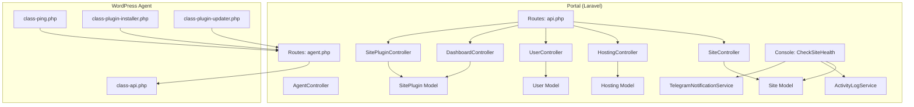
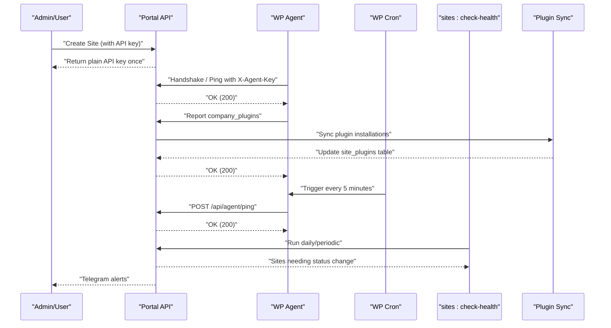
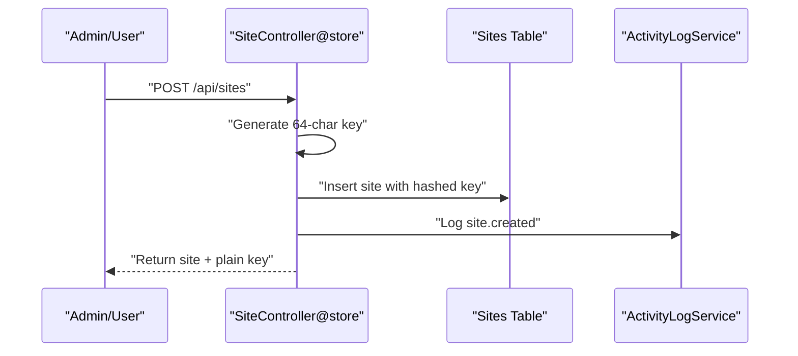
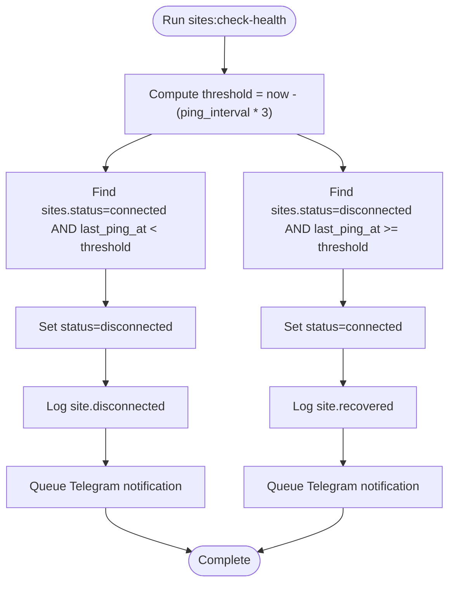
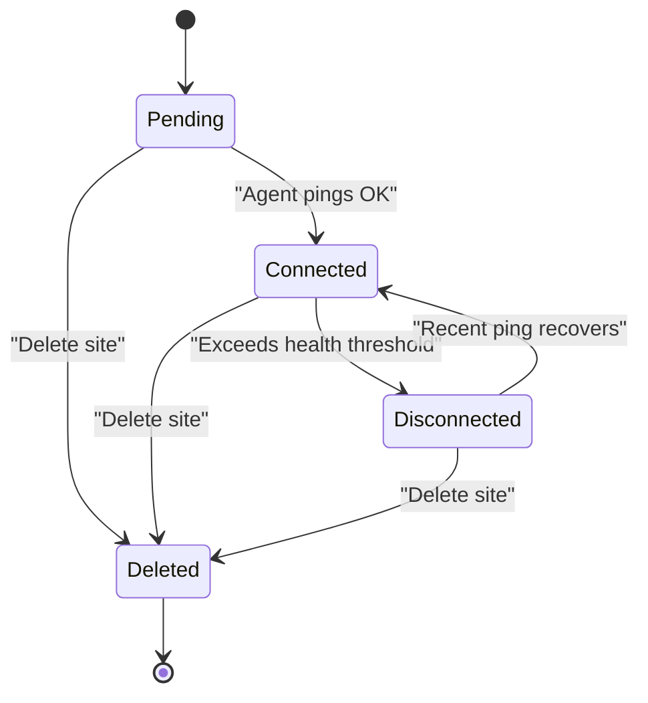
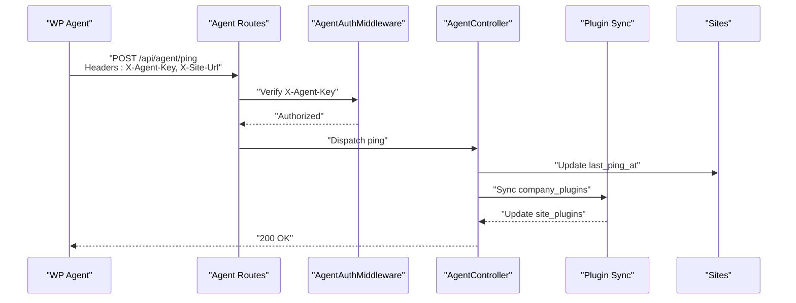
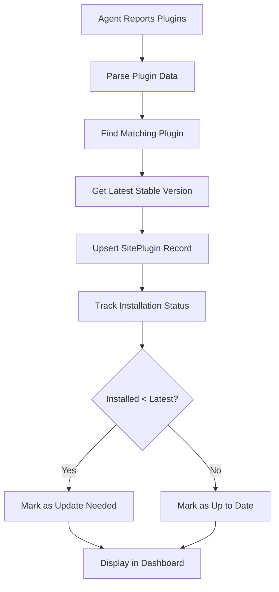
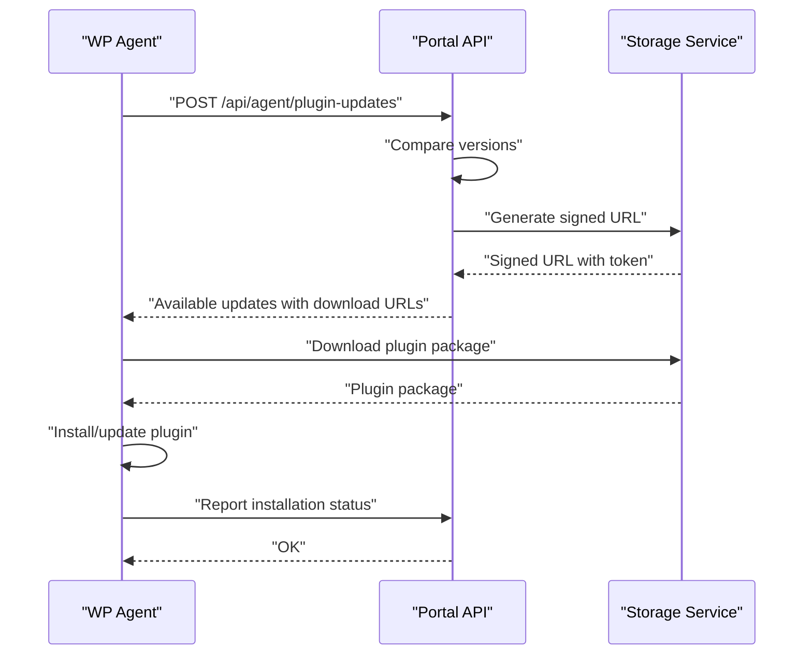
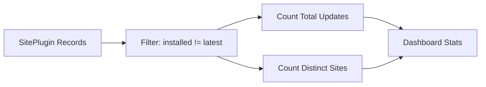
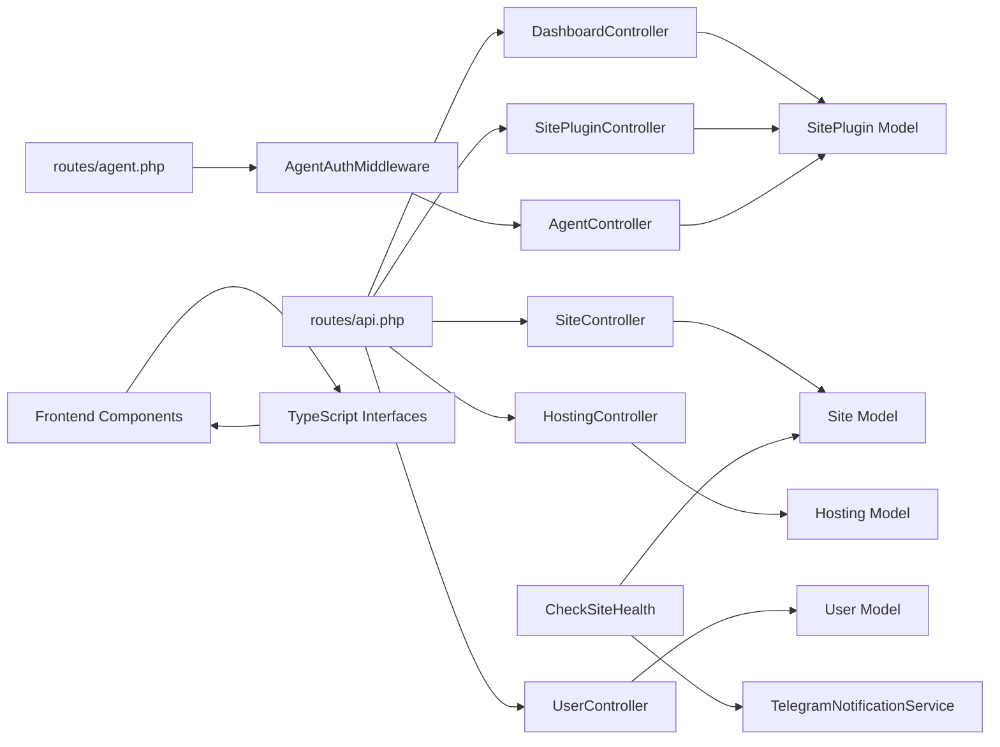

# Site Management System

<cite>
**Referenced Files in This Document**
- [Site.php](file://portal/app/Models/Site.php)
- [Hosting.php](file://portal/app/Models/Hosting.php)
- [User.php](file://portal/app/Models/User.php)
- [SiteController.php](file://portal/app/Http/Controllers/Portal/SiteController.php)
- [HostingController.php](file://portal/app/Http/Controllers/Portal/HostingController.php)
- [UserController.php](file://portal/app/Http/Controllers/Portal/UserController.php)
- [DashboardController.php](file://portal/app/Http/Controllers/Portal/DashboardController.php)
- [SitePluginController.php](file://portal/app/Http/Controllers/Portal/SitePluginController.php)
- [AgentController.php](file://portal/app/Http/Controllers/Agent/AgentController.php)
- [SitePlugin.php](file://portal/app/Models/SitePlugin.php)
- [CheckSiteHealth.php](file://portal/app/Console/Commands/CheckSiteHealth.php)
- [ActivityLogService.php](file://portal/app/Services/ActivityLogService.php)
- [TelegramNotificationService.php](file://portal/app/Services/TelegramNotificationService.php)
- [2026_05_15_070002_create_sites_table.php](file://portal/database/migrations/2026_05_15_070002_create_sites_table.php)
- [2026_05_15_070001_create_hostings_table.php](file://portal/database/migrations/2026_05_15_070001_create_hostings_table.php)
- [2026_05_15_070003_create_site_users_table.php](file://portal/database/migrations/2026_05_15_070003_create_site_users_table.php)
- [2026_05_15_080004_create_site_plugins_table.php](file://portal/database/migrations/2026_05_15_080004_create_site_plugins_table.php)
- [StoreSiteRequest.php](file://portal/app/Http/Requests/Site/StoreSiteRequest.php)
- [UpdateSiteRequest.php](file://portal/app/Http/Requests/Site/UpdateSiteRequest.php)
- [api.php](file://portal/routes/api.php)
- [agent.php](file://portal/routes/agent.php)
- [class-api.php](file://agent/epos-wp-agent/includes/class-api.php)
- [class-ping.php](file://agent/epos-wp-agent/includes/class-ping.php)
- [site-plugins-tab.tsx](file://portal/frontend/src/components/sites/site-plugins-tab.tsx)
- [dashboard.ts](file://portal/frontend/src/lib/services/dashboard.ts)
- [dashboard/page.tsx](file://portal/frontend/src/app/(dashboard)/dashboard/page.tsx)
- [page.tsx](file://portal/frontend/src/app/(dashboard)/sites/[id]/page.tsx)
- [index.ts](file://portal/frontend/src/types/index.ts)
</cite>

## Update Summary
**Changes Made**
- Added comprehensive plugin management system documentation including plugin installation tracking and synchronization
- Enhanced dashboard documentation with plugin update metrics and visualization
- Documented new site plugins tab functionality for managing plugin installations across sites
- Updated site status visualization with plugin update indicators
- Added plugin update metrics to activity feeds and dashboard statistics

## Table of Contents
1. [Introduction](#introduction)
2. [Project Structure](#project-structure)
3. [Core Components](#core-components)
4. [Architecture Overview](#architecture-overview)
5. [Detailed Component Analysis](#detailed-component-analysis)
6. [Plugin Management System](#plugin-management-system)
7. [Enhanced Dashboard and Visualization](#enhanced-dashboard-and-visualization)
8. [Dependency Analysis](#dependency-analysis)
9. [Performance Considerations](#performance-considerations)
10. [Troubleshooting Guide](#troubleshooting-guide)
11. [Conclusion](#conclusion)
12. [Appendices](#appendices)

## Introduction
This document describes the Site Management System used to manage multiple WordPress sites. It covers the WordPress site registration and onboarding process, including API key generation and initial configuration. It documents the site monitoring and health-check system with periodic status tracking and alerting. It explains user management enabling administrators to assign users to specific sites with delegated permissions. It outlines the site lifecycle from registration through decommissioning. It details the database schema for site records, relationships with hosting providers, and user assignments. **Updated** The system now includes comprehensive plugin management capabilities with installation tracking, synchronization with WordPress agents, and real-time plugin update metrics. Finally, it addresses scaling considerations and performance optimization strategies for managing many WordPress sites.

## Project Structure
The system comprises:
- Backend portal built with Laravel, exposing REST APIs for site, hosting, user, plugin, and settings management.
- WordPress plugin agent that communicates with the portal to receive commands, report status, synchronize plugin installations, and send periodic pings.
- Database schema with migrations for sites, hostings, site-user assignments, site-plugins, and activity logs.
- Frontend dashboard with enhanced plugin update metrics and improved site status visualization.



**Diagram sources**
- [api.php:1-110](file://portal/routes/api.php#L1-L110)
- [agent.php:1-20](file://portal/routes/agent.php#L1-L20)
- [SiteController.php:1-204](file://portal/app/Http/Controllers/Portal/SiteController.php#L1-L204)
- [HostingController.php:1-83](file://portal/app/Http/Controllers/Portal/HostingController.php#L1-L83)
- [UserController.php:1-137](file://portal/app/Http/Controllers/Portal/UserController.php#L1-L137)
- [DashboardController.php:1-123](file://portal/app/Http/Controllers/Portal/DashboardController.php#L1-L123)
- [SitePluginController.php:1-32](file://portal/app/Http/Controllers/Portal/SitePluginController.php#L1-L32)
- [AgentController.php:1-243](file://portal/app/Http/Controllers/Agent/AgentController.php#L1-L243)
- [Site.php:1-76](file://portal/app/Models/Site.php#L1-L76)
- [Hosting.php:1-31](file://portal/app/Models/Hosting.php#L1-L31)
- [User.php:1-38](file://portal/app/Models/User.php#L1-L38)
- [SitePlugin.php:1-37](file://portal/app/Models/SitePlugin.php#L1-L37)
- [CheckSiteHealth.php:1-95](file://portal/app/Console/Commands/CheckSiteHealth.php#L1-L95)
- [ActivityLogService.php:1-50](file://portal/app/Services/ActivityLogService.php#L1-L50)
- [TelegramNotificationService.php:1-107](file://portal/app/Services/TelegramNotificationService.php#L1-L107)
- [class-api.php:1-110](file://agent/epos-wp-agent/includes/class-api.php#L1-L110)
- [class-ping.php:1-83](file://agent/epos-wp-agent/includes/class-ping.php#L1-L83)

**Section sources**
- [api.php:1-110](file://portal/routes/api.php#L1-L110)
- [agent.php:1-20](file://portal/routes/agent.php#L1-L20)

## Core Components
- Site model encapsulates site metadata, API key hashing, status, versions, tags, and relationships to hosting, creator, and users. It includes an access scope for filtering sites by user assignment.
- Hosting model represents hosting provider records and links to sites.
- User model supports roles and permissions via Spatie, with API tokens for authentication.
- SiteController handles listing, creation, updates, deletion, API key regeneration, and activity logs retrieval with access controls.
- HostingController manages hosting providers with counts of associated sites.
- UserController manages users, roles, and activity logging.
- DashboardController provides enhanced dashboard statistics including plugin update metrics and recent activity feeds.
- SitePluginController manages plugin installations per site with detailed version tracking and synchronization.
- AgentController handles agent communication, plugin synchronization, and update coordination.
- SitePlugin model tracks plugin installations with version comparison, active status, and synchronization timestamps.
- CheckSiteHealth console command periodically evaluates site connectivity based on last ping timestamps and emits notifications.
- ActivityLogService centralizes activity logging with fallback to logs if the table does not exist.
- TelegramNotificationService provides synchronous and queued Telegram messaging with caching of settings.

**Section sources**
- [Site.php:1-76](file://portal/app/Models/Site.php#L1-L76)
- [Hosting.php:1-31](file://portal/app/Models/Hosting.php#L1-L31)
- [User.php:1-38](file://portal/app/Models/User.php#L1-L38)
- [SiteController.php:1-204](file://portal/app/Http/Controllers/Portal/SiteController.php#L1-L204)
- [HostingController.php:1-83](file://portal/app/Http/Controllers/Portal/HostingController.php#L1-L83)
- [UserController.php:1-137](file://portal/app/Http/Controllers/Portal/UserController.php#L1-L137)
- [DashboardController.php:1-123](file://portal/app/Http/Controllers/Portal/DashboardController.php#L1-L123)
- [SitePluginController.php:1-32](file://portal/app/Http/Controllers/Portal/SitePluginController.php#L1-L32)
- [AgentController.php:1-243](file://portal/app/Http/Controllers/Agent/AgentController.php#L1-L243)
- [SitePlugin.php:1-37](file://portal/app/Models/SitePlugin.php#L1-L37)
- [CheckSiteHealth.php:1-95](file://portal/app/Console/Commands/CheckSiteHealth.php#L1-L95)
- [ActivityLogService.php:1-50](file://portal/app/Services/ActivityLogService.php#L1-L50)
- [TelegramNotificationService.php:1-107](file://portal/app/Services/TelegramNotificationService.php#L1-L107)

## Architecture Overview
The system uses a client-server pattern with enhanced plugin management:
- Portal (Laravel) exposes REST endpoints for management, monitoring, and plugin coordination.
- WordPress Agent plugin runs on each site and communicates via authenticated endpoints, synchronizing plugin installations and reporting status.
- Health checks run on the server to detect disconnections and recoveries.
- Plugin synchronization ensures consistent plugin state across all managed sites.
- Dashboard provides real-time metrics including plugin update availability.
- Notifications are sent via Telegram for critical events.



**Diagram sources**
- [SiteController.php:62-92](file://portal/app/Http/Controllers/Portal/SiteController.php#L62-L92)
- [AgentController.php:94-152](file://portal/app/Http/Controllers/Agent/AgentController.php#L94-L152)
- [class-api.php:15-45](file://agent/epos-wp-agent/includes/class-api.php#L15-L45)
- [class-ping.php:29-81](file://agent/epos-wp-agent/includes/class-ping.php#L29-L81)
- [CheckSiteHealth.php:16-73](file://portal/app/Console/Commands/CheckSiteHealth.php#L16-L73)
- [agent.php:16-19](file://portal/routes/agent.php#L16-L19)

## Detailed Component Analysis

### Site Registration and Onboarding
- API key generation: During site creation, a random 64-character plaintext key is generated and stored as a SHA-256 hash. The plaintext key is returned once to the caller for secure storage.
- Initial configuration: New sites are created with status pending and optional associations to hosting and user assignments.
- Access control: Listing and viewing are filtered by user assignment for non-admin users.



**Diagram sources**
- [SiteController.php:62-92](file://portal/app/Http/Controllers/Portal/SiteController.php#L62-L92)
- [2026_05_15_070002_create_sites_table.php:11-27](file://portal/database/migrations/2026_05_15_070002_create_sites_table.php#L11-L27)
- [ActivityLogService.php:16-48](file://portal/app/Services/ActivityLogService.php#L16-L48)

**Section sources**
- [SiteController.php:62-92](file://portal/app/Http/Controllers/Portal/SiteController.php#L62-L92)
- [StoreSiteRequest.php:14-26](file://portal/app/Http/Requests/Site/StoreSiteRequest.php#L14-L26)
- [2026_05_15_070002_create_sites_table.php:11-27](file://portal/database/migrations/2026_05_15_070002_create_sites_table.php#L11-L27)

### Site Monitoring and Health Checks
- Heartbeat: The WordPress agent sends periodic pings to the portal with site URL and payload. Successful pings set connection status to connected; failures set it to error.
- Health evaluation: A scheduled command inspects last_ping_at timestamps against a threshold derived from the configured ping interval multiplied by a multiplier. Sites exceeding the threshold are marked disconnected; recent pings restore connected status.
- Alerts: Disconnection and recovery events trigger Telegram notifications.



**Diagram sources**
- [CheckSiteHealth.php:16-73](file://portal/app/Console/Commands/CheckSiteHealth.php#L16-L73)
- [TelegramNotificationService.php:53-76](file://portal/app/Services/TelegramNotificationService.php#L53-L76)

**Section sources**
- [class-ping.php:29-81](file://agent/epos-wp-agent/includes/class-ping.php#L29-L81)
- [CheckSiteHealth.php:16-73](file://portal/app/Console/Commands/CheckSiteHealth.php#L16-L73)
- [TelegramNotificationService.php:53-76](file://portal/app/Services/TelegramNotificationService.php#L53-L76)

### Site User Management and Delegated Permissions
- Assignment: Administrators can assign users to sites during creation or update via a user_ids array. The relationship is many-to-many via a pivot table.
- Access filtering: Non-admin users can only view sites they are assigned to; listing is scoped accordingly.
- Roles and permissions: Users are managed with roles; role changes are logged.

```mermaid
classDiagram
class Site {
+int id
+string name
+string url
+string status
+timestamp last_ping_at
+users()
}
class User {
+int id
+string name
+string email
+string role
}
class site_users {
+int site_id
+int user_id
}
Site "1" <---> "n" site_users : "many-to-many"
User "1" <---> "n" site_users : "many-to-many"
```

**Diagram sources**
- [Site.php:51-54](file://portal/app/Models/Site.php#L51-L54)
- [User.php:1-38](file://portal/app/Models/User.php#L1-L38)
- [2026_05_15_070003_create_site_users_table.php:11-17](file://portal/database/migrations/2026_05_15_070003_create_site_users_table.php#L11-L17)

**Section sources**
- [SiteController.php:75-78](file://portal/app/Http/Controllers/Portal/SiteController.php#L75-L78)
- [SiteController.php:118-121](file://portal/app/Http/Controllers/Portal/SiteController.php#L118-L121)
- [Site.php:65-74](file://portal/app/Models/Site.php#L65-L74)
- [2026_05_15_070003_create_site_users_table.php:11-17](file://portal/database/migrations/2026_05_15_070003_create_site_users_table.php#L11-L17)

### Site Lifecycle Management
- Creation: Admin/Dev creates a site with name, URL, optional hosting, tags, and initial user assignments. API key is generated and returned once.
- Operation: Agents ping the portal periodically; status reflects connectivity.
- Updates: Admin/Dev can modify site attributes and reassign users.
- Decommissioning: Sites can be deleted; activity is logged.



**Diagram sources**
- [SiteController.php:62-92](file://portal/app/Http/Controllers/Portal/SiteController.php#L62-L92)
- [CheckSiteHealth.php:22-68](file://portal/app/Console/Commands/CheckSiteHealth.php#L22-L68)
- [SiteController.php:138-150](file://portal/app/Http/Controllers/Portal/SiteController.php#L138-L150)

**Section sources**
- [SiteController.php:62-92](file://portal/app/Http/Controllers/Portal/SiteController.php#L62-L92)
- [SiteController.php:114-133](file://portal/app/Http/Controllers/Portal/SiteController.php#L114-L133)
- [SiteController.php:138-150](file://portal/app/Http/Controllers/Portal/SiteController.php#L138-L150)

### Database Schema and Relationships
- Sites: Contains identifiers, URLs, API key hash, status, versions, tags, timestamps, soft deletes, and foreign keys to hosting and creator.
- Hostings: Provider metadata and creator linkage.
- Site-Users Pivot: Many-to-many with unique constraint and timestamps.
- Site-Plugins: Tracks plugin installations with version comparison, active status, and synchronization timestamps.
- Activity Logs: Centralized audit trail with subject type/id and metadata.

```mermaid
erDiagram
HOSTINGS {
bigint id PK
string name
string provider
text note
bigint created_by FK
timestamps
soft_delete
}
SITES {
bigint id PK
bigint hosting_id FK
string name
string url UK
text description
string api_secret_key
enum status
string wp_version
string php_version
boolean woo_active
timestamp last_ping_at
json tags
bigint created_by FK
timestamps
soft_delete
}
SITE_USERS {
bigint id PK
bigint site_id FK
bigint user_id FK
timestamps
}
SITE_PLUGINS {
bigint id PK
bigint site_id FK
bigint plugin_id FK
string installed_version
string latest_version
boolean is_active
timestamp last_synced_at
unique(site_id, plugin_id)
}
USERS {
bigint id PK
string name
string email
string role
boolean is_active
timestamps
}
HOSTINGS ||--o{ SITES : "hosts"
USERS ||--o{ SITE_USERS : "assigned_to"
SITES ||--o{ SITE_USERS : "assigned_users"
SITES ||--o{ SITE_PLUGINS : "has_plugins"
PLUGINS ||--o{ SITE_PLUGINS : "installed_on_sites"
```

**Diagram sources**
- [2026_05_15_070002_create_sites_table.php:11-27](file://portal/database/migrations/2026_05_15_070002_create_sites_table.php#L11-L27)
- [2026_05_15_070001_create_hostings_table.php:11-19](file://portal/database/migrations/2026_05_15_070001_create_hostings_table.php#L11-L19)
- [2026_05_15_070003_create_site_users_table.php:11-17](file://portal/database/migrations/2026_05_15_070003_create_site_users_table.php#L11-L17)
- [2026_05_15_080004_create_site_plugins_table.php:11-20](file://portal/database/migrations/2026_05_15_080004_create_site_plugins_table.php#L11-L20)
- [Site.php:41-54](file://portal/app/Models/Site.php#L41-L54)
- [Hosting.php:21-24](file://portal/app/Models/Hosting.php#L21-L24)
- [User.php:15-22](file://portal/app/Models/User.php#L15-L22)

**Section sources**
- [2026_05_15_070002_create_sites_table.php:11-27](file://portal/database/migrations/2026_05_15_070002_create_sites_table.php#L11-L27)
- [2026_05_15_070001_create_hostings_table.php:11-19](file://portal/database/migrations/2026_05_15_070001_create_hostings_table.php#L11-L19)
- [2026_05_15_070003_create_site_users_table.php:11-17](file://portal/database/migrations/2026_05_15_070003_create_site_users_table.php#L11-L17)
- [2026_05_15_080004_create_site_plugins_table.php:11-20](file://portal/database/migrations/2026_05_15_080004_create_site_plugins_table.php#L11-L20)
- [Site.php:41-54](file://portal/app/Models/Site.php#L41-L54)
- [Hosting.php:21-24](file://portal/app/Models/Hosting.php#L21-L24)
- [User.php:15-22](file://portal/app/Models/User.php#L15-L22)

### Agent Communication and Authentication
- Authentication: Agent endpoints require a custom X-Agent-Key header validated against the stored hashed key.
- Endpoints: Plugin install/update, SMTP update/test, status retrieval, and plugin update coordination are exposed for administrative commands.
- Heartbeat: Agent posts periodic pings with site URL and payload; response determines connection status.
- Plugin Synchronization: Agent reports company plugins to portal for automatic synchronization and tracking.



**Diagram sources**
- [agent.php:16-19](file://portal/routes/agent.php#L16-L19)
- [class-api.php:50-71](file://agent/epos-wp-agent/includes/class-api.php#L50-L71)
- [class-ping.php:50-81](file://agent/epos-wp-agent/includes/class-ping.php#L50-L81)
- [AgentController.php:94-152](file://portal/app/Http/Controllers/Agent/AgentController.php#L94-L152)

**Section sources**
- [class-api.php:15-45](file://agent/epos-wp-agent/includes/class-api.php#L15-L45)
- [class-api.php:50-71](file://agent/epos-wp-agent/includes/class-api.php#L50-L71)
- [class-ping.php:29-81](file://agent/epos-wp-agent/includes/class-ping.php#L29-L81)
- [agent.php:16-19](file://portal/routes/agent.php#L16-L19)

## Plugin Management System

### Plugin Installation Tracking
The system now includes comprehensive plugin management with automatic installation tracking and synchronization:

- **Plugin Registry**: Maintains company plugins with metadata including slug, author, description, and active status.
- **Version Management**: Tracks plugin versions with stability flags, release dates, file hashes, and changelogs.
- **Installation Tracking**: SitePlugin model tracks which plugins are installed on each site with version information and active status.
- **Automatic Synchronization**: Agent reports installed plugins during handshake and periodic pings, automatically creating/updating site_plugin records.
- **Version Comparison**: Built-in comparison logic identifies outdated plugins and generates update recommendations.



**Diagram sources**
- [AgentController.php:110-152](file://portal/app/Http/Controllers/Agent/AgentController.php#L110-L152)
- [SitePlugin.php:29-35](file://portal/app/Models/SitePlugin.php#L29-L35)

**Section sources**
- [AgentController.php:110-152](file://portal/app/Http/Controllers/Agent/AgentController.php#L110-L152)
- [SitePlugin.php:1-37](file://portal/app/Models/SitePlugin.php#L1-37)
- [2026_05_15_080004_create_site_plugins_table.php:11-20](file://portal/database/migrations/2026_05_15_080004_create_site_plugins_table.php#L11-L20)

### Plugin Update Coordination
The system coordinates plugin updates between portal and agents:

- **Update Discovery**: Agent requests available updates for installed plugins, comparing local versions with latest stable releases.
- **Secure Distribution**: Download URLs are generated with temporary tokens for secure plugin distribution.
- **Changelog Integration**: Update notifications include changelog information for better user experience.
- **Progress Tracking**: Update progress is tracked and reported back to the portal for monitoring.



**Diagram sources**
- [AgentController.php:178-241](file://portal/app/Http/Controllers/Agent/AgentController.php#L178-L241)

**Section sources**
- [AgentController.php:178-241](file://portal/app/Http/Controllers/Agent/AgentController.php#L178-L241)

### Site Plugins Tab Functionality
The frontend provides comprehensive plugin management interface:

- **Real-time Status**: Displays installed vs latest version comparison with visual indicators.
- **Active Status**: Shows whether plugins are currently active or inactive.
- **Last Synced**: Indicates when plugin information was last synchronized.
- **Direct Navigation**: Links to plugin detail pages for further management.
- **Empty State Handling**: Graceful handling when no plugins are installed.

**Section sources**
- [site-plugins-tab.tsx:1-152](file://portal/frontend/src/components/sites/site-plugins-tab.tsx#L1-L152)
- [SitePluginController.php:13-30](file://portal/app/Http/Controllers/Portal/SitePluginController.php#L13-L30)

## Enhanced Dashboard and Visualization

### Plugin Update Metrics
The dashboard now displays comprehensive plugin update metrics:

- **Plugin Updates Pending**: Total count of plugin updates needed across all managed sites.
- **Sites with Updates**: Number of sites requiring plugin updates.
- **Visual Indicators**: Orange-themed metric card with puzzle icon for plugin update awareness.
- **Real-time Calculation**: Dynamic calculation based on site_plugin records with version comparisons.



**Diagram sources**
- [DashboardController.php:37-46](file://portal/app/Http/Controllers/Portal/DashboardController.php#L37-L46)

**Section sources**
- [DashboardController.php:37-46](file://portal/app/Http/Controllers/Portal/DashboardController.php#L37-L46)
- [dashboard/page.tsx:123-133](file://portal/frontend/src/app/(dashboard)/dashboard/page.tsx#L123-L133)
- [dashboard.ts:8](file://portal/frontend/src/lib/services/dashboard.ts#L8)

### Enhanced Site Status Visualization
Site status cards now include plugin update indicators:

- **Status Indicators**: Color-coded dots and badges for site connectivity status.
- **Plugin Update Awareness**: Sites with pending updates are visually highlighted.
- **Recent Activity Feed**: Activity logs include plugin-related actions with appropriate icons.
- **Improved Readability**: Better spacing and typography for status information.

**Section sources**
- [dashboard/page.tsx:274-348](file://portal/frontend/src/app/(dashboard)/dashboard/page.tsx#L274-L348)
- [DashboardController.php:99-121](file://portal/app/Http/Controllers/Portal/DashboardController.php#L99-L121)

### Activity Feed Enhancements
The activity feed now includes plugin-related activities:

- **Plugin Deployment**: Shows plugin deployment actions with user attribution.
- **Version Uploads**: Tracks new plugin version uploads with changelog information.
- **Activity Icons**: Contextual icons for different types of plugin activities.
- **Human-readable Descriptions**: Clear descriptions of plugin-related actions.

**Section sources**
- [DashboardController.php:99-121](file://portal/app/Http/Controllers/Portal/DashboardController.php#L99-L121)
- [dashboard/page.tsx:315-348](file://portal/frontend/src/app/(dashboard)/dashboard/page.tsx#L315-L348)

## Dependency Analysis
- Controllers depend on models, requests, services, and middleware for authorization and role checks.
- Models define relationships and scopes; Site includes an access scope for non-admin filtering.
- DashboardController depends on SitePlugin model for plugin update calculations.
- SitePluginController depends on SitePlugin model for plugin status queries.
- AgentController orchestrates plugin synchronization and update coordination.
- Console command depends on Site model, settings lookup, and notification service.
- Agent routes depend on custom middleware to validate X-Agent-Key.
- Frontend components depend on TypeScript interfaces for type safety.



**Diagram sources**
- [api.php:10-110](file://portal/routes/api.php#L10-L110)
- [SiteController.php:1-204](file://portal/app/Http/Controllers/Portal/SiteController.php#L1-L204)
- [HostingController.php:1-83](file://portal/app/Http/Controllers/Portal/HostingController.php#L1-L83)
- [UserController.php:1-137](file://portal/app/Http/Controllers/Portal/UserController.php#L1-L137)
- [DashboardController.php:1-123](file://portal/app/Http/Controllers/Portal/DashboardController.php#L1-L123)
- [SitePluginController.php:1-32](file://portal/app/Http/Controllers/Portal/SitePluginController.php#L1-L32)
- [Site.php:1-76](file://portal/app/Models/Site.php#L1-L76)
- [Hosting.php:1-31](file://portal/app/Models/Hosting.php#L1-L31)
- [User.php:1-38](file://portal/app/Models/User.php#L1-L38)
- [SitePlugin.php:1-37](file://portal/app/Models/SitePlugin.php#L1-L37)
- [CheckSiteHealth.php:1-95](file://portal/app/Console/Commands/CheckSiteHealth.php#L1-L95)
- [TelegramNotificationService.php:1-107](file://portal/app/Services/TelegramNotificationService.php#L1-L107)
- [agent.php:1-20](file://portal/routes/agent.php#L1-L20)

**Section sources**
- [api.php:10-110](file://portal/routes/api.php#L10-L110)
- [agent.php:16-19](file://portal/routes/agent.php#L16-L19)

## Performance Considerations
- Indexing and constraints: Unique indexes on URL, API key, and site-plugin combinations reduce lookup overhead; foreign keys maintain referential integrity.
- Pagination: Listing endpoints paginate results to limit memory and response size.
- Background jobs: Telegram notifications are queued to avoid blocking request threads.
- Caching: Telegram settings are cached to minimize repeated reads from settings storage.
- Scoping: Accessible-by-user scopes prevent unnecessary joins and filtering.
- Health thresholds: Configurable ping intervals and tripping thresholds balance sensitivity and noise.
- Soft deletes: Soft deletes enable recovery without costly schema changes.
- Plugin Query Optimization: Dashboard queries use efficient joins and distinct counting for plugin update metrics.
- Frontend Caching: Dashboard data is cached in frontend components to reduce API calls.

[No sources needed since this section provides general guidance]

## Troubleshooting Guide
- Unauthorized agent requests: Ensure X-Agent-Key matches the stored hashed key; verify the portal URL and API key are correctly configured in the agent.
- Missing or expired API key: Regenerate the API key via the admin endpoint; the plaintext key is returned only once.
- Disconnected sites: Confirm agent cron is running and network connectivity; review last_ping_at and health thresholds.
- No Telegram alerts: Verify bot token and default chat ID are configured; check queued job processing.
- Access denied: Non-admin users can only view sites they are assigned to; confirm site-user assignments.
- Plugin synchronization issues: Check agent plugin reporting; verify plugin slugs match registry entries.
- Update not available: Ensure plugin versions are marked as stable; verify plugin registry contains matching slugs.
- Dashboard metrics incorrect: Clear browser cache; verify site_plugin records are properly populated.

**Section sources**
- [class-api.php:50-71](file://agent/epos-wp-agent/includes/class-api.php#L50-L71)
- [SiteController.php:156-182](file://portal/app/Http/Controllers/Portal/SiteController.php#L156-L182)
- [CheckSiteHealth.php:75-93](file://portal/app/Console/Commands/CheckSiteHealth.php#L75-L93)
- [TelegramNotificationService.php:81-96](file://portal/app/Services/TelegramNotificationService.php#L81-L96)
- [AgentController.php:110-152](file://portal/app/Http/Controllers/Agent/AgentController.php#L110-L152)

## Conclusion
The Site Management System provides a robust foundation for registering, operating, and monitoring many WordPress sites. It enforces secure authentication via hashed API keys, tracks site health with automated checks and alerts, and enables delegated administration through user-site assignments. **Updated** The system now includes comprehensive plugin management capabilities with automatic installation tracking, real-time synchronization with WordPress agents, and enhanced dashboard metrics for plugin updates. The database schema supports scalability with soft deletes, indexing, and normalized relationships including the new site-plugins table. With background jobs, caching, and improved visualization, the system remains responsive under load while providing strong auditability, operational visibility, and comprehensive plugin lifecycle management.

[No sources needed since this section summarizes without analyzing specific files]

## Appendices

### API Definitions

- Create Site
  - Method: POST
  - Path: /api/sites
  - Authenticated: Yes
  - Roles: admin, dev
  - Body fields: name*, url* (unique), hosting_id (optional), description (optional), tags (optional), user_ids (optional)
  - Returns: site object including api_secret_key_plain (once)
  - Notes: api_secret_key is stored as SHA-256 hash

- Update Site
  - Method: PUT
  - Path: /api/sites/{site}
  - Authenticated: Yes
  - Roles: admin, dev
  - Body fields: same as create except using "sometimes" rules
  - Returns: updated site object

- Delete Site
  - Method: DELETE
  - Path: /api/sites/{site}
  - Authenticated: Yes
  - Roles: admin, dev

- Regenerate API Key
  - Method: POST
  - Path: /api/sites/{site}/regenerate-key
  - Authenticated: Yes
  - Roles: admin
  - Returns: new api_secret_key_plain and message

- List Sites
  - Method: GET
  - Path: /api/sites
  - Authenticated: Yes
  - Roles: admin, dev, marketing
  - Query params: status, hosting_id, tag, search, page
  - Returns: paginated list with hosting and user counts

- View Site
  - Method: GET
  - Path: /api/sites/{site}
  - Authenticated: Yes
  - Roles: admin, dev, marketing
  - Returns: site with hosting and users loaded

- Site Activity Logs
  - Method: GET
  - Path: /api/sites/{site}/activity
  - Authenticated: Yes
  - Roles: admin, dev, marketing
  - Returns: paginated activity logs

- Site Plugins
  - Method: GET
  - Path: /api/sites/{site}/plugins
  - Authenticated: Yes
  - Roles: admin, dev
  - Returns: array of site plugin records with plugin metadata

- Dashboard Statistics
  - Method: GET
  - Path: /api/dashboard/stats
  - Authenticated: Yes
  - Roles: admin, dev, marketing
  - Returns: dashboard metrics including plugin updates pending and sites with updates

- Agent Ping
  - Method: POST
  - Path: /api/agent/ping
  - Middleware: AgentAuthMiddleware
  - Headers: X-Agent-Key*, X-Site-Url*
  - Body: company_plugins, orders (when applicable)
  - Returns: 200 OK on success

- Agent Handshake
  - Method: POST
  - Path: /api/agent/handshake
  - Middleware: AgentAuthMiddleware
  - Returns: handshake response

- Agent Plugin Updates
  - Method: POST
  - Path: /api/agent/plugin-updates
  - Middleware: AgentAuthMiddleware
  - Body: installed_plugins (array of slug/version pairs)
  - Returns: available updates with download URLs and changelog information

**Section sources**
- [api.php:10-110](file://portal/routes/api.php#L10-L110)
- [agent.php:16-19](file://portal/routes/agent.php#L16-L19)
- [SiteController.php:23-56](file://portal/app/Http/Controllers/Portal/SiteController.php#L23-L56)
- [SiteController.php:97-109](file://portal/app/Http/Controllers/Portal/SiteController.php#L97-L109)
- [SiteController.php:187-202](file://portal/app/Http/Controllers/Portal/SiteController.php#L187-L202)
- [SitePluginController.php:13-30](file://portal/app/Http/Controllers/Portal/SitePluginController.php#L13-L30)
- [DashboardController.php:21-94](file://portal/app/Http/Controllers/Portal/DashboardController.php#L21-L94)
- [class-api.php:15-45](file://agent/epos-wp-agent/includes/class-api.php#L15-L45)
- [class-ping.php:50-81](file://agent/epos-wp-agent/includes/class-ping.php#L50-L81)
- [AgentController.php:178-241](file://portal/app/Http/Controllers/Agent/AgentController.php#L178-L241)