# Site Monitoring & Health Checks

<cite>
**Referenced Files in This Document**
- [CheckSiteHealth.php](file://portal/app/Console/Commands/CheckSiteHealth.php)
- [console.php](file://portal/routes/console.php)
- [Site.php](file://portal/app/Models/Site.php)
- [AgentController.php](file://portal/app/Http/Controllers/Agent/AgentController.php)
- [AgentAuthMiddleware.php](file://portal/app/Http/Middleware/AgentAuthMiddleware.php)
- [agent.php](file://portal/routes/agent.php)
- [2026_05_15_070002_create_sites_table.php](file://portal/database/migrations/2026_05_15_070002_create_sites_table.php)
- [ActivityLogService.php](file://portal/app/Services/ActivityLogService.php)
- [ActivityLog.php](file://portal/app/Models/ActivityLog.php)
- [SendTelegramNotification.php](file://portal/app/Jobs/SendTelegramNotification.php)
- [class-ping.php](file://agent/epos-wp-agent/includes/class-ping.php)
- [class-activator.php](file://agent/epos-wp-agent/includes/class-activator.php)
- [class-api.php](file://agent/epos-wp-agent/includes/class-api.php)
- [page.tsx](file://portal/frontend/src/app/(dashboard)/dashboard/page.tsx)
- [index.ts](file://portal/frontend/src/types/index.ts)
</cite>

## Table of Contents
1. [Introduction](#introduction)
2. [Project Structure](#project-structure)
3. [Core Components](#core-components)
4. [Architecture Overview](#architecture-overview)
5. [Detailed Component Analysis](#detailed-component-analysis)
6. [Dependency Analysis](#dependency-analysis)
7. [Performance Considerations](#performance-considerations)
8. [Troubleshooting Guide](#troubleshooting-guide)
9. [Conclusion](#conclusion)
10. [Appendices](#appendices)

## Introduction
This document explains the site monitoring and health check system that continuously tracks WordPress site status and maintains connectivity between agents and the portal. It covers:
- Automated health check command and scheduling
- Heartbeat mechanism between agents and portal
- Site status states and transitions
- Performance metrics collection and monitoring
- Agent communication protocol and portal validation
- Examples of health check results and notifications
- Alert mechanisms and integration with activity logging

## Project Structure
The monitoring system spans two repositories:
- Portal (Laravel backend): orchestrates health checks, validates agent requests, persists site state, and logs activities
- Agent (WordPress plugin): sends periodic heartbeats, performs handshake, and exposes command endpoints

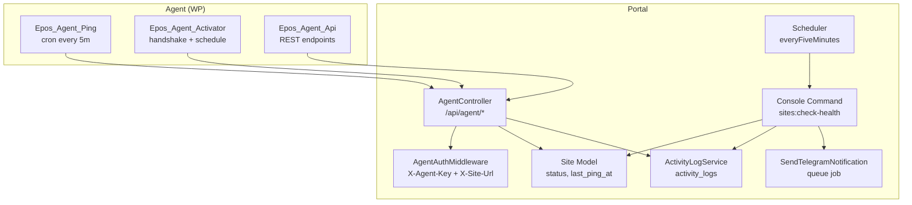

**Diagram sources**
- [CheckSiteHealth.php:16-73](file://portal/app/Console/Commands/CheckSiteHealth.php#L16-L73)
- [console.php:11](file://portal/routes/console.php#L11)
- [AgentController.php:16-97](file://portal/app/Http/Controllers/Agent/AgentController.php#L16-L97)
- [AgentAuthMiddleware.php:20-55](file://portal/app/Http/Middleware/AgentAuthMiddleware.php#L20-L55)
- [Site.php:12-75](file://portal/app/Models/Site.php#L12-L75)
- [ActivityLogService.php:16-48](file://portal/app/Services/ActivityLogService.php#L16-L48)
- [SendTelegramNotification.php:25-52](file://portal/app/Jobs/SendTelegramNotification.php#L25-L52)
- [class-ping.php:29-81](file://agent/epos-wp-agent/includes/class-ping.php#L29-L81)
- [class-activator.php:35-76](file://agent/epos-wp-agent/includes/class-activator.php#L35-L76)
- [class-api.php:15-108](file://agent/epos-wp-agent/includes/class-api.php#L15-L108)

**Section sources**
- [CheckSiteHealth.php:11-14](file://portal/app/Console/Commands/CheckSiteHealth.php#L11-L14)
- [console.php:11](file://portal/routes/console.php#L11)
- [AgentController.php:16-97](file://portal/app/Http/Controllers/Agent/AgentController.php#L16-L97)
- [AgentAuthMiddleware.php:20-55](file://portal/app/Http/Middleware/AgentAuthMiddleware.php#L20-L55)
- [Site.php:12-75](file://portal/app/Models/Site.php#L12-L75)
- [2026_05_15_070002_create_sites_table.php:11-27](file://portal/database/migrations/2026_05_15_070002_create_sites_table.php#L11-L27)

## Core Components
- Automated health check command: runs every five minutes to detect disconnected/recovered sites based on last heartbeat timestamps
- Agent heartbeat: WordPress plugin pings the portal every five minutes with site metadata
- Authentication middleware: validates agent identity using hashed API key and site URL
- Activity logging: records site events for auditability
- Notifications: queues Telegram alerts for offline/online transitions

**Section sources**
- [CheckSiteHealth.php:16-73](file://portal/app/Console/Commands/CheckSiteHealth.php#L16-L73)
- [class-ping.php:29-81](file://agent/epos-wp-agent/includes/class-ping.php#L29-L81)
- [AgentAuthMiddleware.php:20-55](file://portal/app/Http/Middleware/AgentAuthMiddleware.php#L20-L55)
- [ActivityLogService.php:16-48](file://portal/app/Services/ActivityLogService.php#L16-L48)
- [SendTelegramNotification.php:25-52](file://portal/app/Jobs/SendTelegramNotification.php#L25-L52)

## Architecture Overview
The system uses a heartbeat-driven model:
- Agents send periodic pings to the portal
- Portal updates site status and timestamps
- Scheduler periodically evaluates connectivity and triggers alerts

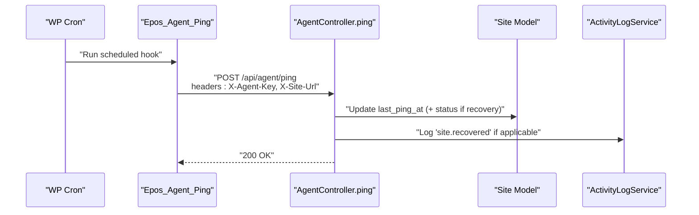

**Diagram sources**
- [class-ping.php:29-81](file://agent/epos-wp-agent/includes/class-ping.php#L29-L81)
- [AgentController.php:61-97](file://portal/app/Http/Controllers/Agent/AgentController.php#L61-L97)
- [Site.php:16-35](file://portal/app/Models/Site.php#L16-L35)
- [ActivityLogService.php:16-48](file://portal/app/Services/ActivityLogService.php#L16-L48)

## Detailed Component Analysis

### Automated Health Check Command
- Purpose: Detect offline/disconnected sites and recover connected ones after downtime
- Threshold calculation: last_ping_at older than 3 × configured ping interval minutes
- Actions:
  - Mark connected sites as disconnected if threshold exceeded
  - Mark disconnected sites as connected if they recently pinged
  - Log events and dispatch Telegram notifications

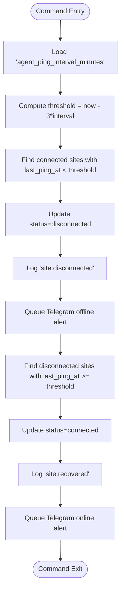

**Diagram sources**
- [CheckSiteHealth.php:16-73](file://portal/app/Console/Commands/CheckSiteHealth.php#L16-L73)
- [ActivityLogService.php:16-48](file://portal/app/Services/ActivityLogService.php#L16-L48)
- [SendTelegramNotification.php:25-52](file://portal/app/Jobs/SendTelegramNotification.php#L25-L52)

**Section sources**
- [CheckSiteHealth.php:16-73](file://portal/app/Console/Commands/CheckSiteHealth.php#L16-L73)
- [console.php:11](file://portal/routes/console.php#L11)

### Heartbeat Mechanism (Agent to Portal)
- Frequency: Every five minutes via WordPress cron
- Request: POST to /api/agent/ping with headers X-Agent-Key and X-Site-Url
- Body: Includes company plugins and optionally recent orders (when WooCommerce is active)
- Outcome: Portal updates last_ping_at and status if recovering from disconnected

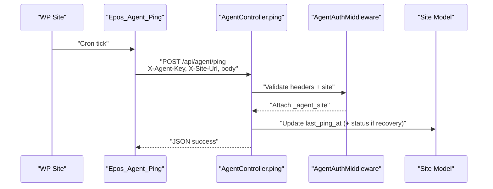

**Diagram sources**
- [class-ping.php:29-81](file://agent/epos-wp-agent/includes/class-ping.php#L29-L81)
- [AgentController.php:61-97](file://portal/app/Http/Controllers/Agent/AgentController.php#L61-L97)
- [AgentAuthMiddleware.php:20-55](file://portal/app/Http/Middleware/AgentAuthMiddleware.php#L20-L55)
- [Site.php:16-35](file://portal/app/Models/Site.php#L16-L35)

**Section sources**
- [class-ping.php:29-81](file://agent/epos-wp-agent/includes/class-ping.php#L29-L81)
- [AgentController.php:61-97](file://portal/app/Http/Controllers/Agent/AgentController.php#L61-L97)
- [AgentAuthMiddleware.php:20-55](file://portal/app/Http/Middleware/AgentAuthMiddleware.php#L20-L55)

### Agent Communication Protocol and Validation
- Headers:
  - X-Agent-Key: Plain API key provided by the agent
  - X-Site-Url: WordPress site URL
- Validation:
  - Lookup site by normalized URL
  - Hash provided key with SHA-256 and compare with stored hash
  - Attach validated site to request for controller use

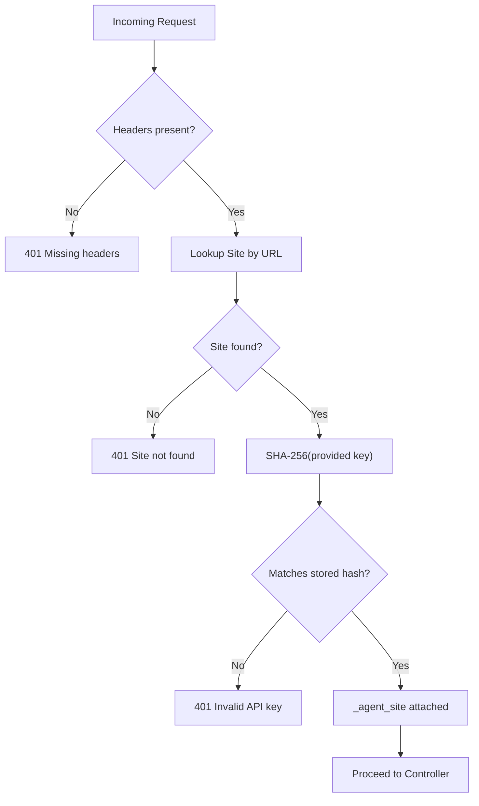

**Diagram sources**
- [AgentAuthMiddleware.php:20-55](file://portal/app/Http/Middleware/AgentAuthMiddleware.php#L20-L55)

**Section sources**
- [AgentAuthMiddleware.php:20-55](file://portal/app/Http/Middleware/AgentAuthMiddleware.php#L20-L55)

### Site Status States and Transitions
- States: pending, connected, disconnected
- Transitions:
  - pending → connected: handshake successful
  - connected → disconnected: heartbeat stops meeting threshold
  - disconnected → connected: heartbeat resumes within threshold

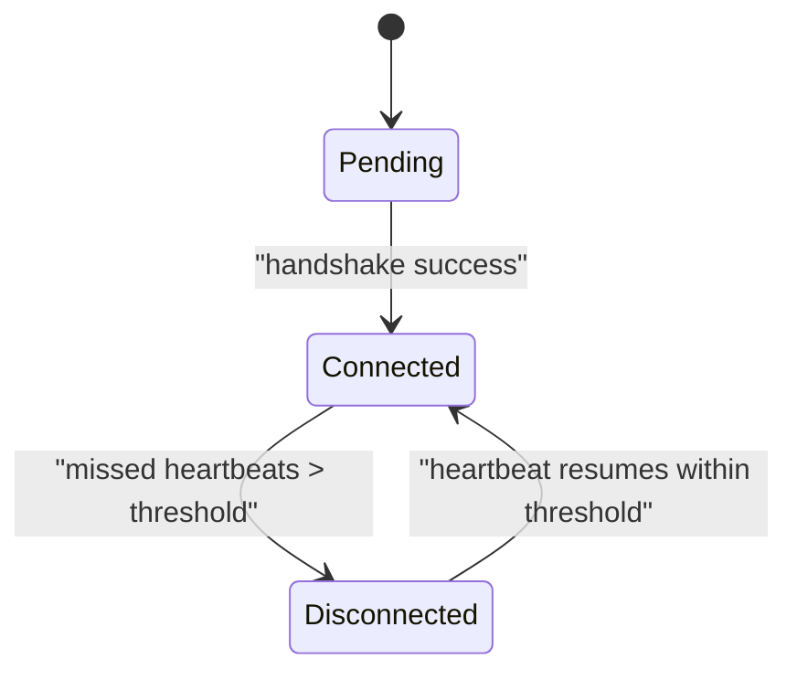

**Diagram sources**
- [2026_05_15_070002_create_sites_table.php:18](file://portal/database/migrations/2026_05_15_070002_create_sites_table.php#L18)
- [AgentController.php:30-54](file://portal/app/Http/Controllers/Agent/AgentController.php#L30-L54)
- [CheckSiteHealth.php:23-28](file://portal/app/Console/Commands/CheckSiteHealth.php#L23-L28)
- [CheckSiteHealth.php:48-53](file://portal/app/Console/Commands/CheckSiteHealth.php#L48-L53)

**Section sources**
- [2026_05_15_070002_create_sites_table.php:18](file://portal/database/migrations/2026_05_15_070002_create_sites_table.php#L18)
- [AgentController.php:30-54](file://portal/app/Http/Controllers/Agent/AgentController.php#L30-L54)
- [CheckSiteHealth.php:23-28](file://portal/app/Console/Commands/CheckSiteHealth.php#L23-L28)
- [CheckSiteHealth.php:48-53](file://portal/app/Console/Commands/CheckSiteHealth.php#L48-L53)

### Performance Metrics Collection
- Response times: Agent measures HTTP round-trip to portal during ping
- Uptime tracking: last_ping_at reflects last successful heartbeat
- Error rate monitoring: agent sets connection status based on HTTP response code
- Orders and plugins: agent may include recent orders and active plugins in heartbeat payload (WooCommerce-dependent)

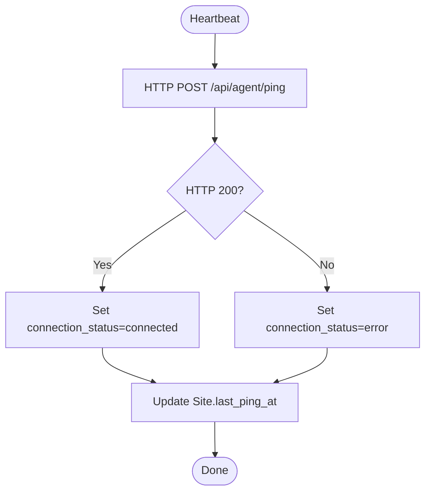

**Diagram sources**
- [class-ping.php:50-81](file://agent/epos-wp-agent/includes/class-ping.php#L50-L81)
- [AgentController.php:73-88](file://portal/app/Http/Controllers/Agent/AgentController.php#L73-L88)

**Section sources**
- [class-ping.php:50-81](file://agent/epos-wp-agent/includes/class-ping.php#L50-L81)
- [AgentController.php:73-88](file://portal/app/Http/Controllers/Agent/AgentController.php#L73-L88)

### Alert Mechanisms and Notifications
- Offline alert: command detects disconnected sites and queues Telegram notification
- Online recovery alert: command detects recovered sites and queues Telegram notification
- Telegram job: retries with backoff and logs failures

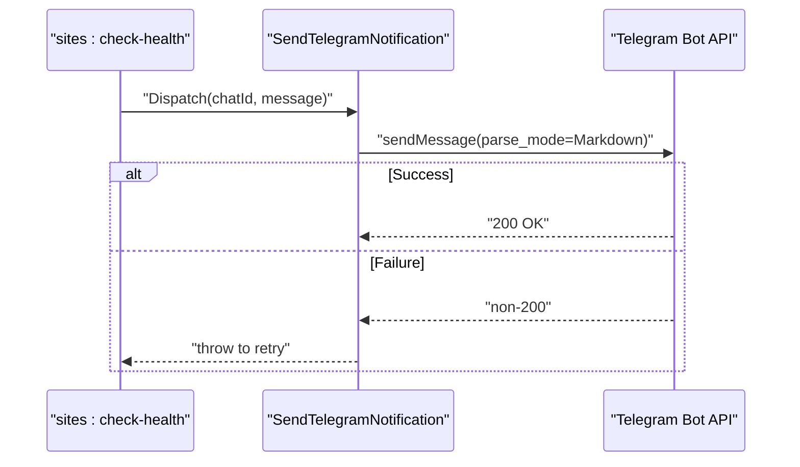

**Diagram sources**
- [CheckSiteHealth.php:38-42](file://portal/app/Console/Commands/CheckSiteHealth.php#L38-L42)
- [CheckSiteHealth.php:62-65](file://portal/app/Console/Commands/CheckSiteHealth.php#L62-L65)
- [SendTelegramNotification.php:25-52](file://portal/app/Jobs/SendTelegramNotification.php#L25-L52)

**Section sources**
- [CheckSiteHealth.php:38-42](file://portal/app/Console/Commands/CheckSiteHealth.php#L38-L42)
- [CheckSiteHealth.php:62-65](file://portal/app/Console/Commands/CheckSiteHealth.php#L62-L65)
- [SendTelegramNotification.php:25-52](file://portal/app/Jobs/SendTelegramNotification.php#L25-L52)

### Integration with Activity Logging
- Handshake and recovery actions are logged with metadata (versions, IP address)
- Activity logs persist to database when available; otherwise fallback to application logs

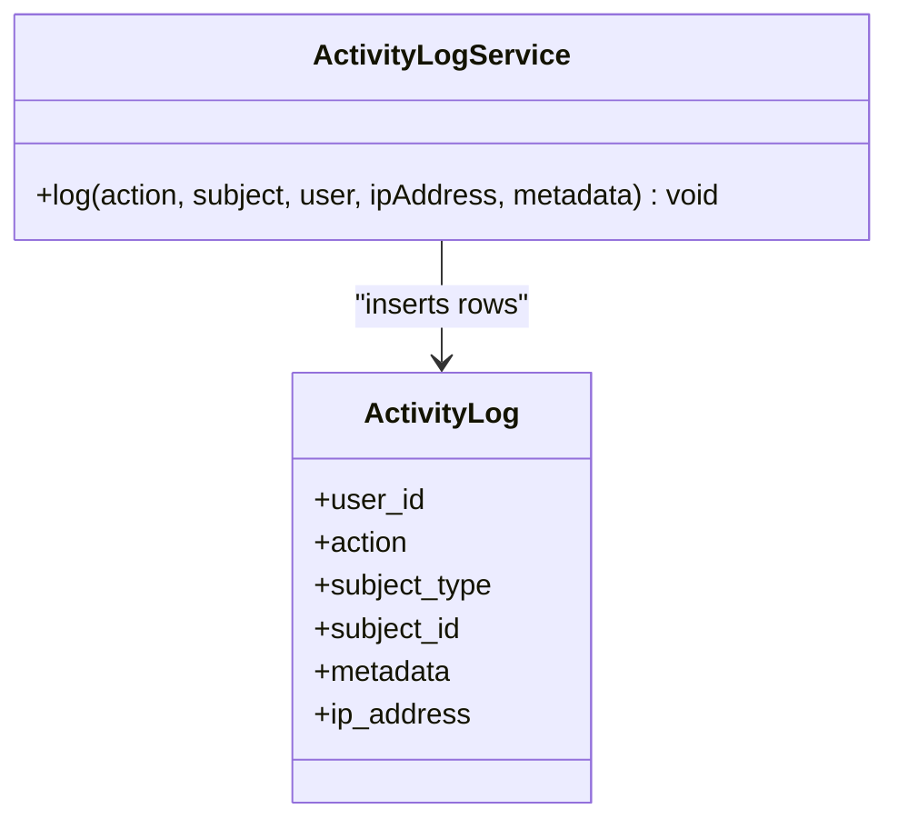

**Diagram sources**
- [ActivityLogService.php:16-48](file://portal/app/Services/ActivityLogService.php#L16-L48)
- [ActivityLog.php:13-25](file://portal/app/Models/ActivityLog.php#L13-L25)

**Section sources**
- [AgentController.php:39-49](file://portal/app/Http/Controllers/Agent/AgentController.php#L39-L49)
- [AgentController.php:80-85](file://portal/app/Http/Controllers/Agent/AgentController.php#L80-L85)
- [ActivityLogService.php:16-48](file://portal/app/Services/ActivityLogService.php#L16-L48)

### Agent Command Endpoints (Portal to Agent)
- REST namespace: epos-agent/v1
- Endpoints:
  - POST /plugin/install
  - POST /smtp/update
  - POST /smtp/test
  - GET /status
- Authentication: X-Agent-Key verification against stored hash

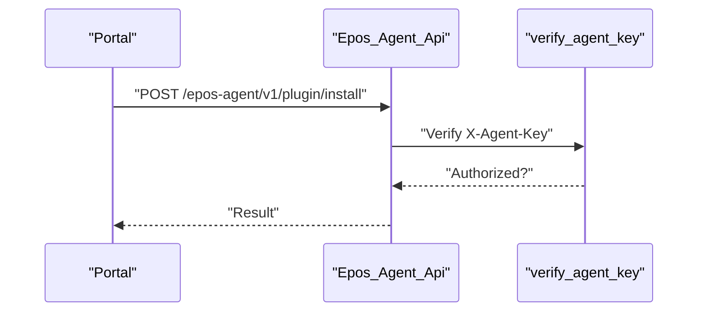

**Diagram sources**
- [class-api.php:15-44](file://agent/epos-wp-agent/includes/class-api.php#L15-L44)
- [class-api.php:49-71](file://agent/epos-wp-agent/includes/class-api.php#L49-L71)

**Section sources**
- [class-api.php:15-44](file://agent/epos-wp-agent/includes/class-api.php#L15-L44)
- [class-api.php:49-71](file://agent/epos-wp-agent/includes/class-api.php#L49-L71)

### Frontend Monitoring Views
- Dashboard displays counts for connected and disconnected sites
- Types define status enums used across the UI

**Section sources**
- [page.tsx:33-38](file://portal/frontend/src/app/(dashboard)/dashboard/page.tsx#L33-L38)
- [index.ts:28](file://portal/frontend/src/types/index.ts#L28)

## Dependency Analysis
- Command depends on Site model, ActivityLogService, and Telegram job
- Agent ping depends on WordPress HTTP API and portal routes
- Middleware depends on Site model and hashing comparison
- Controllers depend on Site model and activity logging service

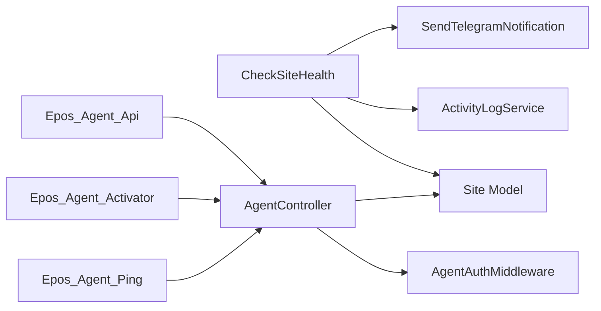

**Diagram sources**
- [CheckSiteHealth.php:5-7](file://portal/app/Console/Commands/CheckSiteHealth.php#L5-L7)
- [Site.php:12-75](file://portal/app/Models/Site.php#L12-L75)
- [ActivityLogService.php:16-48](file://portal/app/Services/ActivityLogService.php#L16-L48)
- [SendTelegramNotification.php:13-23](file://portal/app/Jobs/SendTelegramNotification.php#L13-L23)
- [class-ping.php:29-81](file://agent/epos-wp-agent/includes/class-ping.php#L29-L81)
- [AgentController.php:16-97](file://portal/app/Http/Controllers/Agent/AgentController.php#L16-L97)
- [AgentAuthMiddleware.php:20-55](file://portal/app/Http/Middleware/AgentAuthMiddleware.php#L20-L55)
- [class-activator.php:35-76](file://agent/epos-wp-agent/includes/class-activator.php#L35-L76)
- [class-api.php:15-108](file://agent/epos-wp-agent/includes/class-api.php#L15-L108)

**Section sources**
- [CheckSiteHealth.php:5-7](file://portal/app/Console/Commands/CheckSiteHealth.php#L5-L7)
- [class-ping.php:29-81](file://agent/epos-wp-agent/includes/class-ping.php#L29-L81)
- [AgentController.php:16-97](file://portal/app/Http/Controllers/Agent/AgentController.php#L16-L97)
- [AgentAuthMiddleware.php:20-55](file://portal/app/Http/Middleware/AgentAuthMiddleware.php#L20-L55)
- [class-activator.php:35-76](file://agent/epos-wp-agent/includes/class-activator.php#L35-L76)
- [class-api.php:15-108](file://agent/epos-wp-agent/includes/class-api.php#L15-L108)

## Performance Considerations
- Heartbeat interval: every five minutes balances responsiveness with overhead
- Threshold: 3 × interval ensures transient network issues do not trigger false positives
- Queue retries: Telegram job retries with exponential backoff reduce alert loss
- Database writes: Activity logs are inserted efficiently; fallback to logs prevents failure loops

## Troubleshooting Guide
- No heartbeat received:
  - Verify portal route presence and middleware acceptance of headers
  - Confirm agent cron is scheduled and portal URL/API key are set
- Unauthorized access:
  - Ensure X-Agent-Key and X-Site-Url are present and match stored hash
  - Confirm site URL normalization and trailing slash handling
- Offline alerts without actual outages:
  - Adjust agent_ping_interval_minutes setting and re-run health check
  - Review intermittent network conditions or timeouts
- Telegram notifications not sent:
  - Check bot token and chat ID configuration
  - Inspect queue worker and retry logs

**Section sources**
- [agent.php:16-19](file://portal/routes/agent.php#L16-L19)
- [AgentAuthMiddleware.php:22-54](file://portal/app/Http/Middleware/AgentAuthMiddleware.php#L22-L54)
- [class-activator.php:18-30](file://agent/epos-wp-agent/includes/class-activator.php#L18-L30)
- [class-ping.php:30-81](file://agent/epos-wp-agent/includes/class-ping.php#L30-L81)
- [SendTelegramNotification.php:27-52](file://portal/app/Jobs/SendTelegramNotification.php#L27-L52)

## Conclusion
The monitoring system combines periodic agent heartbeats with scheduled health checks to maintain accurate site status. Robust authentication, activity logging, and alerting provide visibility and reliability. Extending the system to track response times, uptime, and error rates can be achieved by capturing metrics in the heartbeat payload and enhancing the scheduler logic.

## Appendices

### Health Check Results and Status Change Notifications
- Offline detection: command marks sites as disconnected and logs the event with last ping timestamp
- Recovery detection: command restores connected status and logs recovery
- Notifications: Telegram messages are queued for both offline and online transitions

**Section sources**
- [CheckSiteHealth.php:27-45](file://portal/app/Console/Commands/CheckSiteHealth.php#L27-L45)
- [CheckSiteHealth.php:52-68](file://portal/app/Console/Commands/CheckSiteHealth.php#L52-L68)
- [CheckSiteHealth.php:38-42](file://portal/app/Console/Commands/CheckSiteHealth.php#L38-L42)
- [CheckSiteHealth.php:62-65](file://portal/app/Console/Commands/CheckSiteHealth.php#L62-L65)

### Scheduling Configuration
- Laravel scheduler runs the health check command every five minutes
- Agent schedules its own five-minute cron automatically on activation

**Section sources**
- [console.php:11](file://portal/routes/console.php#L11)
- [class-activator.php:13-16](file://agent/epos-wp-agent/includes/class-activator.php#L13-L16)