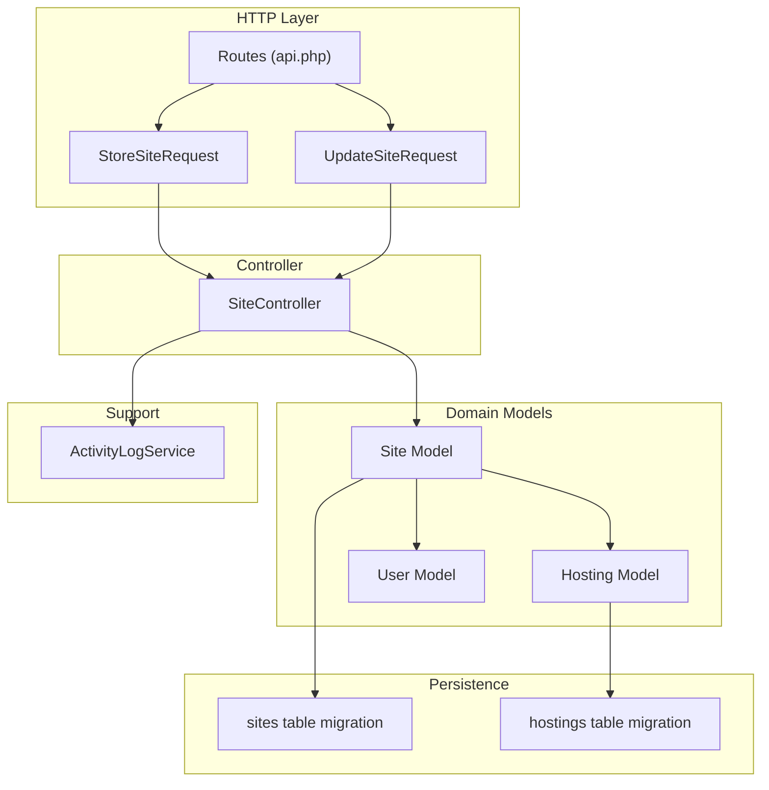
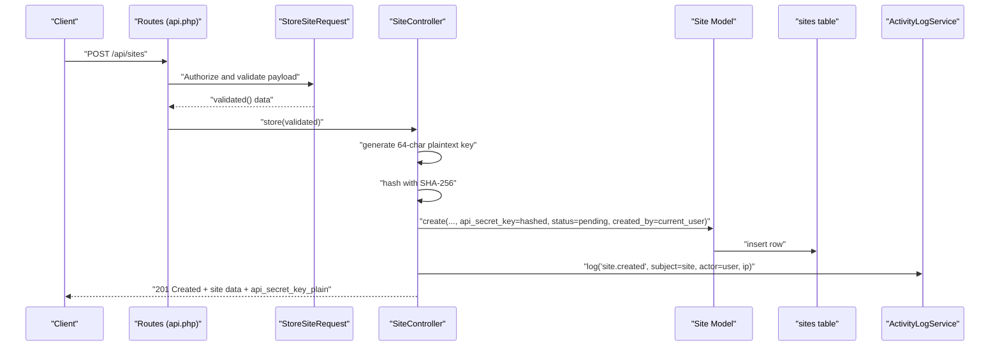
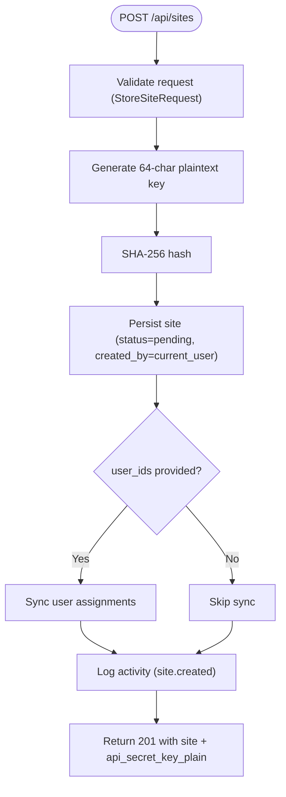
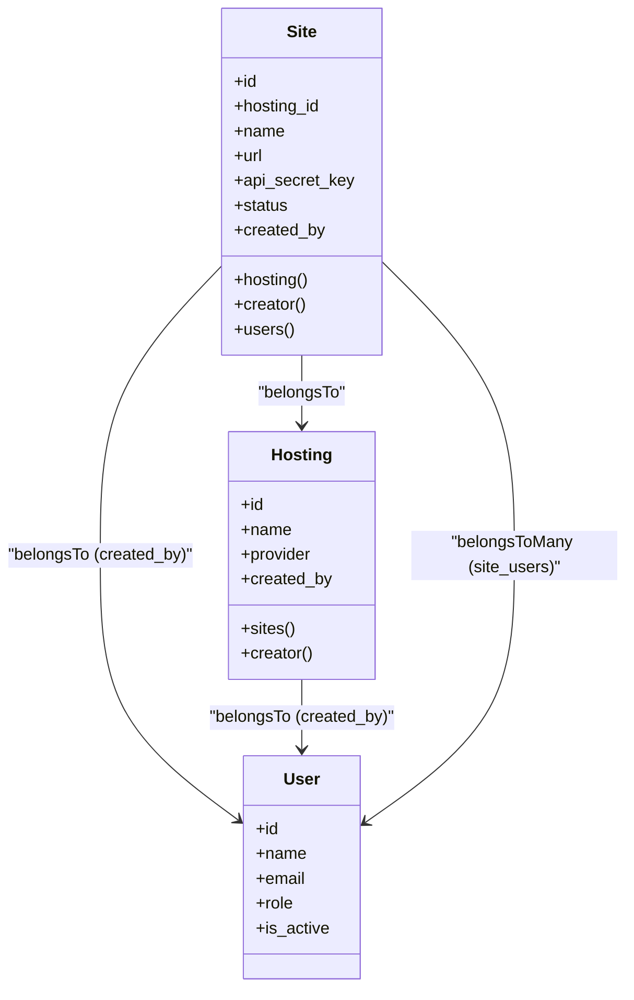
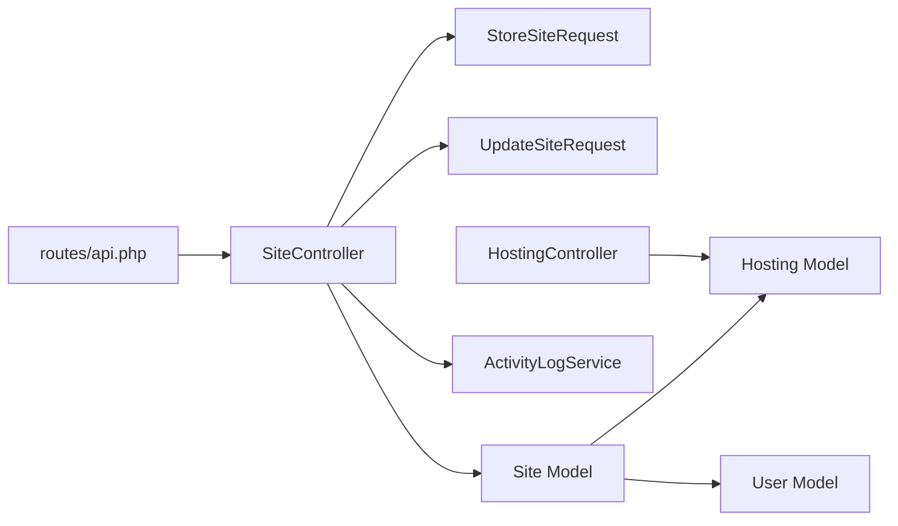

# Site Registration & Configuration

<cite>
**Referenced Files in This Document**
- [StoreSiteRequest.php](file://portal/app/Http/Requests/Site/StoreSiteRequest.php)
- [UpdateSiteRequest.php](file://portal/app/Http/Requests/Site/UpdateSiteRequest.php)
- [SiteController.php](file://portal/app/Http/Controllers/Portal/SiteController.php)
- [Site.php](file://portal/app/Models/Site.php)
- [Hosting.php](file://portal/app/Models/Hosting.php)
- [2026_05_15_070002_create_sites_table.php](file://portal/database/migrations/2026_05_15_070002_create_sites_table.php)
- [2026_05_15_070001_create_hostings_table.php](file://portal/database/migrations/2026_05_15_070001_create_hostings_table.php)
- [api.php](file://portal/routes/api.php)
- [ActivityLogService.php](file://portal/app/Services/ActivityLogService.php)
- [User.php](file://portal/app/Models/User.php)
- [HostingController.php](file://portal/app/Http/Controllers/Portal/HostingController.php)
</cite>

## Table of Contents
1. [Introduction](#introduction)
2. [Project Structure](#project-structure)
3. [Core Components](#core-components)
4. [Architecture Overview](#architecture-overview)
5. [Detailed Component Analysis](#detailed-component-analysis)
6. [Dependency Analysis](#dependency-analysis)
7. [Performance Considerations](#performance-considerations)
8. [Troubleshooting Guide](#troubleshooting-guide)
9. [Conclusion](#conclusion)

## Introduction
This document explains the complete site registration and configuration process for WordPress sites within the portal. It covers:
- API key generation and secure storage
- Validation rules for site creation and updates
- Initial setup and status management during registration
- Pending approval workflow
- User assignment during site creation
- Relationship between sites and hosting providers
- Administrative oversight via created_by and activity logging

## Project Structure
The site registration flow spans the HTTP request layer (validation), controller (orchestration), model (persistence), migration (schema), routing, and activity logging services.

**Diagram sources**
- [api.php:1-48](file://portal/routes/api.php#L1-L48)
- [StoreSiteRequest.php:1-28](file://portal/app/Http/Requests/Site/StoreSiteRequest.php#L1-L28)
- [UpdateSiteRequest.php:1-27](file://portal/app/Http/Requests/Site/UpdateSiteRequest.php#L1-L27)
- [SiteController.php:1-204](file://portal/app/Http/Controllers/Portal/SiteController.php#L1-L204)
- [Site.php:1-76](file://portal/app/Models/Site.php#L1-L76)
- [Hosting.php:1-31](file://portal/app/Models/Hosting.php#L1-L31)
- [2026_05_15_070002_create_sites_table.php:1-35](file://portal/database/migrations/2026_05_15_070002_create_sites_table.php#L1-L35)
- [2026_05_15_070001_create_hostings_table.php:1-27](file://portal/database/migrations/2026_05_15_070001_create_hostings_table.php#L1-L27)
- [ActivityLogService.php:1-50](file://portal/app/Services/ActivityLogService.php#L1-L50)
- [User.php:1-38](file://portal/app/Models/User.php#L1-L38)

**Section sources**
- [api.php:1-48](file://portal/routes/api.php#L1-L48)
- [SiteController.php:1-204](file://portal/app/Http/Controllers/Portal/SiteController.php#L1-L204)
- [Site.php:1-76](file://portal/app/Models/Site.php#L1-L76)
- [Hosting.php:1-31](file://portal/app/Models/Hosting.php#L1-L31)
- [2026_05_15_070002_create_sites_table.php:1-35](file://portal/database/migrations/2026_05_15_070002_create_sites_table.php#L1-L35)
- [2026_05_15_070001_create_hostings_table.php:1-27](file://portal/database/migrations/2026_05_15_070001_create_hostings_table.php#L1-L27)
- [ActivityLogService.php:1-50](file://portal/app/Services/ActivityLogService.php#L1-L50)
- [User.php:1-38](file://portal/app/Models/User.php#L1-L38)

## Core Components
- StoreSiteRequest: Validates incoming site creation requests.
- UpdateSiteRequest: Validates site update requests.
- SiteController: Orchestrates site creation, key generation, status initialization, user assignment, and activity logging.
- Site Model: Defines fillable attributes, relations, and access controls.
- Hosting Model: Links sites to hosting providers and tracks provider metadata.
- ActivityLogService: Records administrative actions for oversight.
- Routes: Expose endpoints for site lifecycle operations.

**Section sources**
- [StoreSiteRequest.php:1-28](file://portal/app/Http/Requests/Site/StoreSiteRequest.php#L1-L28)
- [UpdateSiteRequest.php:1-27](file://portal/app/Http/Requests/Site/UpdateSiteRequest.php#L1-L27)
- [SiteController.php:58-92](file://portal/app/Http/Controllers/Portal/SiteController.php#L58-L92)
- [Site.php:16-75](file://portal/app/Models/Site.php#L16-L75)
- [Hosting.php:14-31](file://portal/app/Models/Hosting.php#L14-L31)
- [ActivityLogService.php:16-47](file://portal/app/Services/ActivityLogService.php#L16-L47)
- [api.php:31-38](file://portal/routes/api.php#L31-L38)

## Architecture Overview
The site registration follows a strict sequence: route dispatch → validation → controller action → persistence → response with one-time plaintext API key → audit logging.

**Diagram sources**
- [api.php:32](file://portal/routes/api.php#L32)
- [StoreSiteRequest.php:14-26](file://portal/app/Http/Requests/Site/StoreSiteRequest.php#L14-L26)
- [SiteController.php:62-92](file://portal/app/Http/Controllers/Portal/SiteController.php#L62-L92)
- [Site.php:16-29](file://portal/app/Models/Site.php#L16-L29)
- [2026_05_15_070002_create_sites_table.php:17-18](file://portal/database/migrations/2026_05_15_070002_create_sites_table.php#L17-L18)
- [ActivityLogService.php:16-47](file://portal/app/Services/ActivityLogService.php#L16-L47)

## Detailed Component Analysis

### StoreSiteRequest Validation
- Purpose: Enforce required fields and constraints for site creation.
- Field requirements:
  - name: required, string, max length 255
  - url: required, valid URL, max length 500, unique across sites
  - hosting_id: optional, must reference existing hosting
  - description: optional, string
  - tags: optional JSON array; each element is a string up to 50 chars
  - user_ids: optional array; each ID must exist in users table
- Authorization: Always authorized for this endpoint.

**Section sources**
- [StoreSiteRequest.php:14-26](file://portal/app/Http/Requests/Site/StoreSiteRequest.php#L14-L26)

### UpdateSiteRequest Validation
- Purpose: Partial updates with flexible fields.
- Field requirements:
  - name: optional, string, max length 255
  - hosting_id: optional, must reference existing hosting
  - description: optional, string
  - tags: optional JSON array; each element is a string up to 50 chars
  - user_ids: optional array; each ID must exist in users table
- Authorization: Always authorized for this endpoint.

**Section sources**
- [UpdateSiteRequest.php:14-25](file://portal/app/Http/Requests/Site/UpdateSiteRequest.php#L14-L25)

### Site Creation Workflow
- Endpoint: POST /api/sites
- Steps:
  1. Generate a random 64-character plaintext API key.
  2. Hash the key using SHA-256 and store only the hashed value.
  3. Persist the site record with:
     - api_secret_key: hashed value
     - status: initialized to pending
     - created_by: current user ID
     - validated attributes from the request
  4. Optionally assign users via user_ids sync.
  5. Log the event via ActivityLogService.
  6. Return the newly created site object plus the plaintext key once (cannot be retrieved again later).
- Access control:
  - Only authenticated users with active status can call this endpoint.
  - Admins and Devs can create sites; MKT users are restricted by role middleware.

**Diagram sources**
- [SiteController.php:62-92](file://portal/app/Http/Controllers/Portal/SiteController.php#L62-L92)
- [StoreSiteRequest.php:14-26](file://portal/app/Http/Requests/Site/StoreSiteRequest.php#L14-L26)
- [ActivityLogService.php:16-47](file://portal/app/Services/ActivityLogService.php#L16-L47)

**Section sources**
- [SiteController.php:62-92](file://portal/app/Http/Controllers/Portal/SiteController.php#L62-L92)
- [api.php:32](file://portal/routes/api.php#L32)

### Site Status Management During Registration
- New sites are created with status set to pending.
- Regenerating the API key resets the status to pending to invalidate old keys.
- Agents can update status via separate mechanisms (not covered here), but creation defaults to pending.

**Section sources**
- [SiteController.php:71](file://portal/app/Http/Controllers/Portal/SiteController.php#L71)
- [SiteController.php:168](file://portal/app/Http/Controllers/Portal/SiteController.php#L168)
- [2026_05_15_070002_create_sites_table.php:18](file://portal/database/migrations/2026_05_15_070002_create_sites_table.php#L18)

### Pending Approval Workflow
- After creation, the site remains in pending status until further action by the platform or agent.
- Administrators can manage agents and hosts; site visibility and access are controlled by roles and user assignments.
- Activity logs capture all administrative actions for oversight.

**Section sources**
- [SiteController.php:71](file://portal/app/Http/Controllers/Portal/SiteController.php#L71)
- [ActivityLogService.php:16-47](file://portal/app/Services/ActivityLogService.php#L16-L47)

### API Key Generation and Security
- One-time plaintext key exposure:
  - The controller returns the plaintext key once upon creation.
  - The stored value in the database is the SHA-256 hash of the key.
- Retrieval:
  - Plaintext keys are not retrievable afterward; clients must store them securely after creation.
- Regeneration:
  - Admins can regenerate keys; this also resets status to pending.

**Section sources**
- [SiteController.php:64-66](file://portal/app/Http/Controllers/Portal/SiteController.php#L64-L66)
- [SiteController.php:89](file://portal/app/Http/Controllers/Portal/SiteController.php#L89)
- [SiteController.php:163-164](file://portal/app/Http/Controllers/Portal/SiteController.php#L163-L164)
- [SiteController.php:178-181](file://portal/app/Http/Controllers/Portal/SiteController.php#L178-L181)
- [2026_05_15_070002_create_sites_table.php:17](file://portal/database/migrations/2026_05_15_070002_create_sites_table.php#L17)

### User Assignment During Site Creation
- Optional user_ids array allows assigning users to a site during creation.
- The controller synchronizes the many-to-many relationship using the provided IDs.
- Access checks ensure non-admin users can only view sites they are assigned to.

**Section sources**
- [StoreSiteRequest.php:23-24](file://portal/app/Http/Requests/Site/StoreSiteRequest.php#L23-L24)
- [SiteController.php:76-78](file://portal/app/Http/Controllers/Portal/SiteController.php#L76-L78)
- [Site.php:51-54](file://portal/app/Models/Site.php#L51-L54)

### Relationship Between Sites and Hosting Providers
- Sites belong to a hosting provider via hosting_id.
- Hosting records include provider metadata and created_by.
- Deleting a hosting provider unlinks associated sites by setting hosting_id to null.

**Diagram sources**
- [Site.php:41-54](file://portal/app/Models/Site.php#L41-L54)
- [Hosting.php:21-29](file://portal/app/Models/Hosting.php#L21-L29)
- [2026_05_15_070002_create_sites_table.php:13-24](file://portal/database/migrations/2026_05_15_070002_create_sites_table.php#L13-L24)
- [2026_05_15_070001_create_hostings_table.php:14-16](file://portal/database/migrations/2026_05_15_070001_create_hostings_table.php#L14-L16)

**Section sources**
- [Site.php:41-54](file://portal/app/Models/Site.php#L41-L54)
- [Hosting.php:21-29](file://portal/app/Models/Hosting.php#L21-L29)
- [HostingController.php:65-68](file://portal/app/Http/Controllers/Portal/HostingController.php#L65-L68)

### Administrative Oversight and created_by Field
- created_by enforces administrative oversight by linking each site and hosting record to the creating user.
- ActivityLogService captures actions with actor, IP, subject, and metadata for auditability.
- Role-based access ensures only authorized users can create or modify sites.

**Section sources**
- [Site.php:28](file://portal/app/Models/Site.php#L28)
- [Hosting.php:18](file://portal/app/Models/Hosting.php#L18)
- [ActivityLogService.php:16-47](file://portal/app/Services/ActivityLogService.php#L16-L47)
- [api.php:17-38](file://portal/routes/api.php#L17-L38)

### Examples of Successful Site Registration Requests and Responses
Note: The following examples describe the expected shape of requests and responses. They are illustrative and intended to guide implementation.

- Request (JSON):
  - name: string (required)
  - url: string (required; unique)
  - hosting_id: integer (optional)
  - description: string (optional)
  - tags: array of strings (optional)
  - user_ids: array of integers (optional)

- Response (JSON):
  - Fields include all site attributes except api_secret_key
  - Plus api_secret_key_plain containing the one-time plaintext key
  - Status code: 201 Created

Administrative actions (e.g., site.created) are logged with metadata for oversight.

**Section sources**
- [StoreSiteRequest.php:14-26](file://portal/app/Http/Requests/Site/StoreSiteRequest.php#L14-L26)
- [SiteController.php:88-91](file://portal/app/Http/Controllers/Portal/SiteController.php#L88-L91)
- [ActivityLogService.php:16-47](file://portal/app/Services/ActivityLogService.php#L16-L47)

## Dependency Analysis
- Routes depend on SiteController actions.
- SiteController depends on StoreSiteRequest/UpdateSiteRequest for validation.
- SiteController persists via Site model; Site model references Hosting and User.
- ActivityLogService is invoked for site lifecycle events.
- HostingController manages hosting records and indirectly affects site relationships.

**Diagram sources**
- [api.php:31-38](file://portal/routes/api.php#L31-L38)
- [SiteController.php:62-133](file://portal/app/Http/Controllers/Portal/SiteController.php#L62-L133)
- [StoreSiteRequest.php:14-26](file://portal/app/Http/Requests/Site/StoreSiteRequest.php#L14-L26)
- [UpdateSiteRequest.php:14-25](file://portal/app/Http/Requests/Site/UpdateSiteRequest.php#L14-L25)
- [Site.php:41-54](file://portal/app/Models/Site.php#L41-L54)
- [Hosting.php:21-29](file://portal/app/Models/Hosting.php#L21-L29)
- [HostingController.php:17-81](file://portal/app/Http/Controllers/Portal/HostingController.php#L17-L81)
- [ActivityLogService.php:16-47](file://portal/app/Services/ActivityLogService.php#L16-L47)

**Section sources**
- [api.php:31-38](file://portal/routes/api.php#L31-L38)
- [SiteController.php:62-133](file://portal/app/Http/Controllers/Portal/SiteController.php#L62-L133)
- [Site.php:41-54](file://portal/app/Models/Site.php#L41-L54)
- [HostingController.php:17-81](file://portal/app/Http/Controllers/Portal/HostingController.php#L17-L81)

## Performance Considerations
- SHA-256 hashing is constant-time and lightweight for single key hashing.
- Unique constraints on url and api_secret_key are indexed in the migration; ensure appropriate indexing for tags and frequent filters.
- Pagination is used for listing sites, reducing memory overhead for large datasets.
- Consider caching frequently accessed hosting lists if needed.

[No sources needed since this section provides general guidance]

## Troubleshooting Guide
- Validation failures:
  - Ensure name and url meet length and uniqueness constraints.
  - Verify hosting_id exists if provided.
  - Confirm user_ids correspond to valid user IDs.
- Missing plaintext key:
  - The plaintext key is returned only once upon creation; store it immediately.
- Unauthorized access:
  - Non-admin users can only view sites they are assigned to.
- API key regeneration:
  - Only admins can regenerate keys; this resets status to pending.

**Section sources**
- [StoreSiteRequest.php:14-26](file://portal/app/Http/Requests/Site/StoreSiteRequest.php#L14-L26)
- [SiteController.php:100-104](file://portal/app/Http/Controllers/Portal/SiteController.php#L100-L104)
- [SiteController.php:158-161](file://portal/app/Http/Controllers/Portal/SiteController.php#L158-L161)
- [SiteController.php:168](file://portal/app/Http/Controllers/Portal/SiteController.php#L168)

## Conclusion
The site registration and configuration process is designed for security and administrative oversight:
- Strong cryptographic key handling with one-time plaintext exposure
- Strict validation and role-based access control
- Clear status management with pending default
- Comprehensive activity logging for auditing
- Well-defined relationships between sites, hosting providers, and users