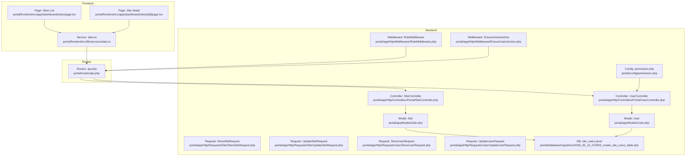
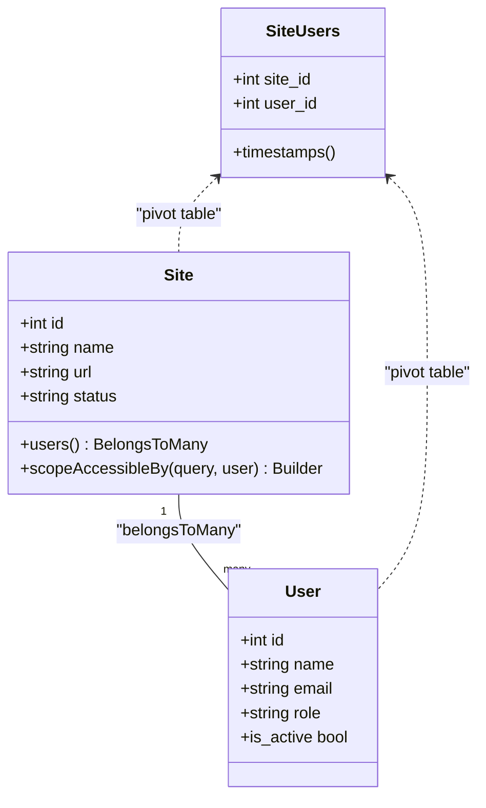
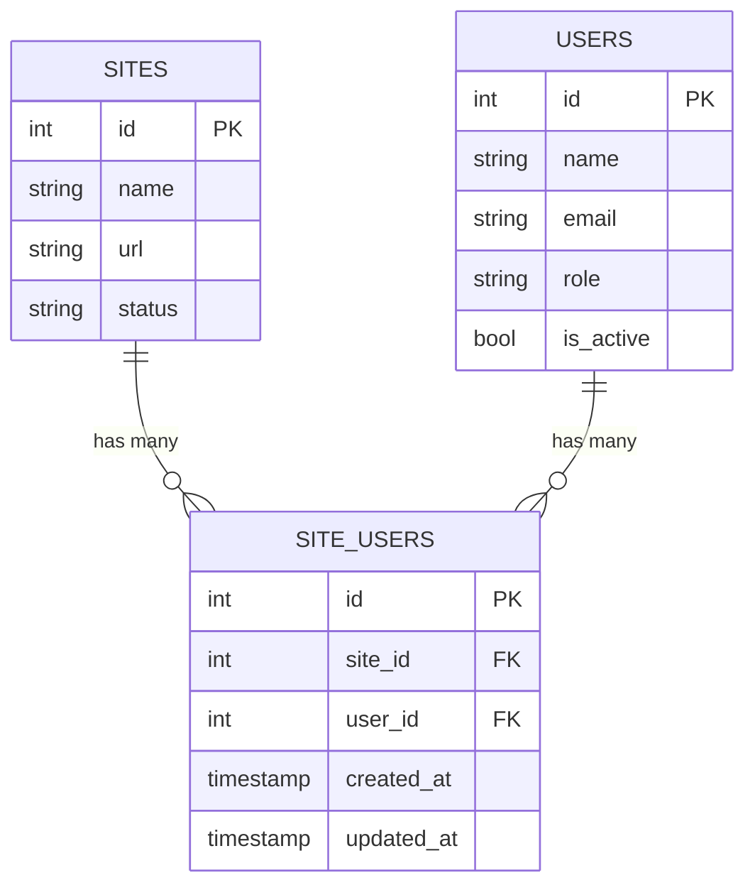
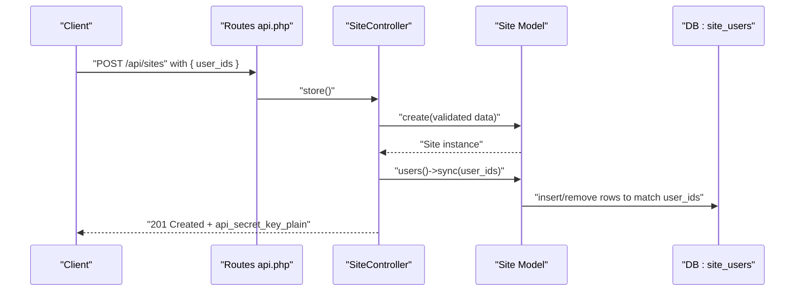
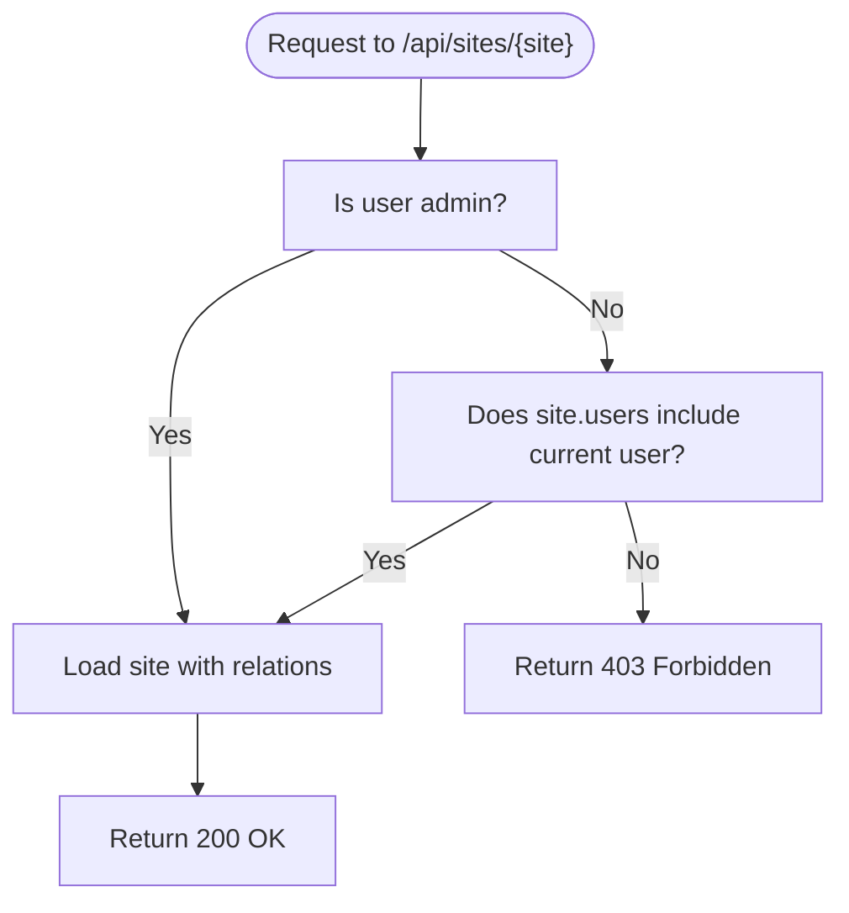
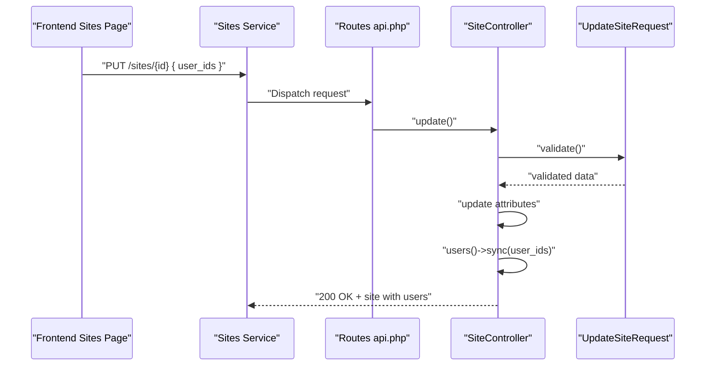
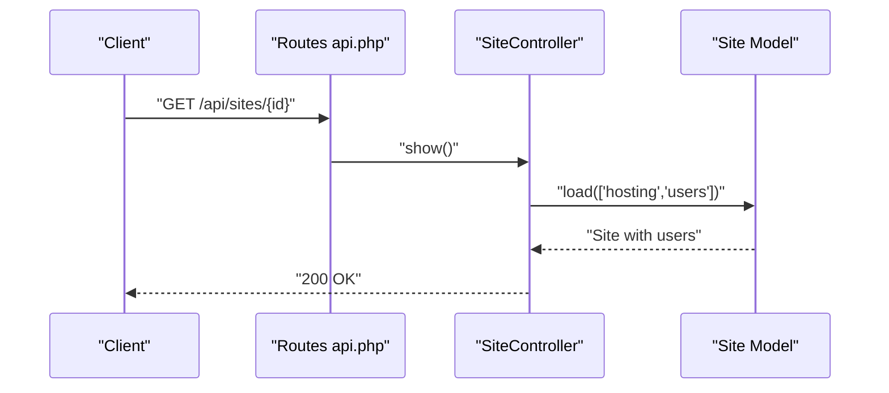
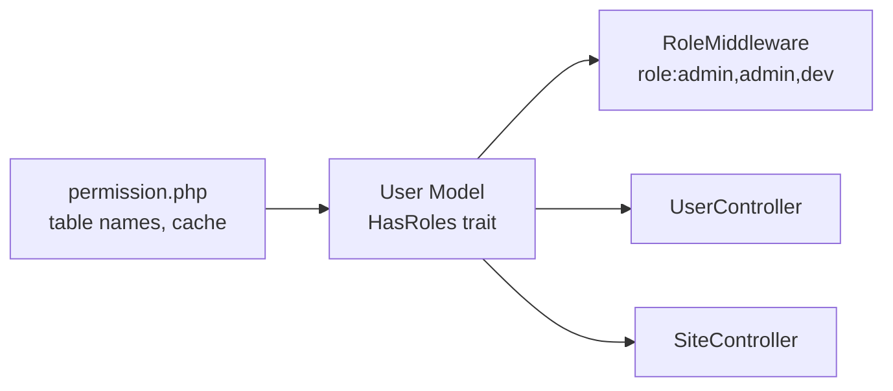
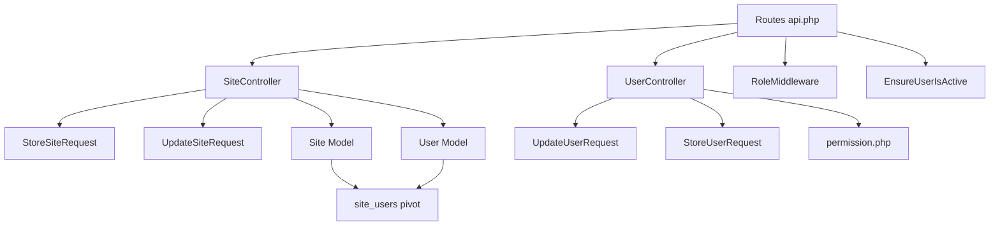

# Site User Management

<cite>
**Referenced Files in This Document**
- [Site.php](file://portal/app/Models/Site.php)
- [User.php](file://portal/app/Models/User.php)
- [2026_05_15_070003_create_site_users_table.php](file://portal/database/migrations/2026_05_15_070003_create_site_users_table.php)
- [SiteController.php](file://portal/app/Http/Controllers/Portal/SiteController.php)
- [UserController.php](file://portal/app/Http/Controllers/Portal/UserController.php)
- [StoreSiteRequest.php](file://portal/app/Http/Requests/Site/StoreSiteRequest.php)
- [UpdateSiteRequest.php](file://portal/app/Http/Requests/Site/UpdateSiteRequest.php)
- [StoreUserRequest.php](file://portal/app/Http/Requests/User/StoreUserRequest.php)
- [UpdateUserRequest.php](file://portal/app/Http/Requests/User/UpdateUserRequest.php)
- [RoleMiddleware.php](file://portal/app/Http/Middleware/RoleMiddleware.php)
- [EnsureUserIsActive.php](file://portal/app/Http/Middleware/EnsureUserIsActive.php)
- [permission.php](file://portal/config/permission.php)
- [api.php](file://portal/routes/api.php)
- [sites.ts](file://portal/frontend/src/lib/services/sites.ts)
- [page.tsx](file://portal/frontend/src/app/(dashboard)/sites/page.tsx)
- [page.tsx](file://portal/frontend/src/app/(dashboard)/sites/[id]/page.tsx)
</cite>

## Table of Contents
1. [Introduction](#introduction)
2. [Project Structure](#project-structure)
3. [Core Components](#core-components)
4. [Architecture Overview](#architecture-overview)
5. [Detailed Component Analysis](#detailed-component-analysis)
6. [Dependency Analysis](#dependency-analysis)
7. [Performance Considerations](#performance-considerations)
8. [Troubleshooting Guide](#troubleshooting-guide)
9. [Conclusion](#conclusion)

## Introduction
This document explains the site user management functionality, focusing on how administrators assign users to specific sites, how delegated permissions are enforced, and how the system restricts access to only those sites a user is assigned to. It covers the site-users relationship via a dedicated pivot table, the synchronization mechanism for updating assignments, access control enforcement, and the user-role-to-site-permission mapping. It also documents the user assignment workflow during site creation and updates, and provides examples of request and response patterns for site management endpoints.

## Project Structure
The site user management feature spans backend models, controllers, requests, middleware, and frontend components:
- Backend models define the site-user relationship and access scoping.
- Controllers implement CRUD operations and enforce access checks.
- Requests validate user-provided data, including user assignment arrays.
- Middleware enforces role-based access and active user status.
- Frontend components collect user assignment data and render assigned users.

**Diagram sources**
- [Site.php:12-85](file://portal/app/Models/Site.php#L12-L85)
- [User.php:11-38](file://portal/app/Models/User.php#L11-L38)
- [SiteController.php:14-204](file://portal/app/Http/Controllers/Portal/SiteController.php#L14-L204)
- [UserController.php:14-137](file://portal/app/Http/Controllers/Portal/UserController.php#L14-L137)
- [StoreSiteRequest.php:7-27](file://portal/app/Http/Requests/Site/StoreSiteRequest.php#L7-L27)
- [UpdateSiteRequest.php:7-27](file://portal/app/Http/Requests/Site/UpdateSiteRequest.php#L7-L27)
- [StoreUserRequest.php:7-26](file://portal/app/Http/Requests/User/StoreUserRequest.php#L7-L26)
- [UpdateUserRequest.php:8-27](file://portal/app/Http/Requests/User/UpdateUserRequest.php#L8-L27)
- [RoleMiddleware.php:9-37](file://portal/app/Http/Middleware/RoleMiddleware.php#L9-L37)
- [EnsureUserIsActive.php:9-26](file://portal/app/Http/Middleware/EnsureUserIsActive.php#L9-L26)
- [permission.php:1-207](file://portal/config/permission.php#L1-L207)
- [2026_05_15_070003_create_site_users_table.php:7-25](file://portal/database/migrations/2026_05_15_070003_create_site_users_table.php#L7-L25)
- [api.php:1-52](file://portal/routes/api.php#L1-L52)
- [sites.ts:1-13](file://portal/frontend/src/lib/services/sites.ts#L1-L13)
- [page.tsx](file://portal/frontend/src/app/(dashboard)/sites/page.tsx#L36-L361)
- [page.tsx](file://portal/frontend/src/app/(dashboard)/sites/[id]/page.tsx#L175-L209)

**Section sources**
- [Site.php:12-85](file://portal/app/Models/Site.php#L12-L85)
- [User.php:11-38](file://portal/app/Models/User.php#L11-L38)
- [2026_05_15_070003_create_site_users_table.php:7-25](file://portal/database/migrations/2026_05_15_070003_create_site_users_table.php#L7-L25)
- [SiteController.php:14-204](file://portal/app/Http/Controllers/Portal/SiteController.php#L14-L204)
- [UserController.php:14-137](file://portal/app/Http/Controllers/Portal/UserController.php#L14-L137)
- [StoreSiteRequest.php:7-27](file://portal/app/Http/Requests/Site/StoreSiteRequest.php#L7-L27)
- [UpdateSiteRequest.php:7-27](file://portal/app/Http/Requests/Site/UpdateSiteRequest.php#L7-L27)
- [StoreUserRequest.php:7-26](file://portal/app/Http/Requests/User/StoreUserRequest.php#L7-L26)
- [UpdateUserRequest.php:8-27](file://portal/app/Http/Requests/User/UpdateUserRequest.php#L8-L27)
- [RoleMiddleware.php:9-37](file://portal/app/Http/Middleware/RoleMiddleware.php#L9-L37)
- [EnsureUserIsActive.php:9-26](file://portal/app/Http/Middleware/EnsureUserIsActive.php#L9-L26)
- [permission.php:1-207](file://portal/config/permission.php#L1-L207)
- [api.php:1-52](file://portal/routes/api.php#L1-L52)
- [sites.ts:1-13](file://portal/frontend/src/lib/services/sites.ts#L1-L13)
- [page.tsx](file://portal/frontend/src/app/(dashboard)/sites/page.tsx#L36-L361)
- [page.tsx](file://portal/frontend/src/app/(dashboard)/sites/[id]/page.tsx#L175-L209)

## Core Components
- Site model defines the belongs-to-many relationship with User through the site_users pivot table and provides an access-scoping method for non-admin users.
- User model integrates role-based permissions via the HasRoles trait.
- SiteController handles listing, creating, updating, and viewing sites, enforcing access checks and synchronizing user assignments.
- UserController manages user lifecycle and role assignments.
- Requests validate user assignment arrays and other fields.
- Middleware enforces role-based access and active user status.
- Routes group endpoints by role and access level.

**Section sources**
- [Site.php:51-84](file://portal/app/Models/Site.php#L51-L84)
- [User.php:11-38](file://portal/app/Models/User.php#L11-L38)
- [SiteController.php:23-133](file://portal/app/Http/Controllers/Portal/SiteController.php#L23-L133)
- [UserController.php:33-112](file://portal/app/Http/Controllers/Portal/UserController.php#L33-L112)
- [StoreSiteRequest.php:14-26](file://portal/app/Http/Requests/Site/StoreSiteRequest.php#L14-L26)
- [UpdateSiteRequest.php:14-25](file://portal/app/Http/Requests/Site/UpdateSiteRequest.php#L14-L25)
- [RoleMiddleware.php:15-35](file://portal/app/Http/Middleware/RoleMiddleware.php#L15-L35)
- [EnsureUserIsActive.php:11-24](file://portal/app/Http/Middleware/EnsureUserIsActive.php#L11-L24)
- [api.php:13-51](file://portal/routes/api.php#L13-L51)

## Architecture Overview
The site user management architecture centers around a many-to-many relationship between sites and users, enforced by a dedicated pivot table. Access control ensures that non-admin users can only view and act upon sites they are assigned to. Administrators can assign users during site creation or update, and the system persists these assignments using a synchronization method.

**Diagram sources**
- [Site.php:12-85](file://portal/app/Models/Site.php#L12-L85)
- [User.php:11-38](file://portal/app/Models/User.php#L11-L38)
- [2026_05_15_070003_create_site_users_table.php:11-17](file://portal/database/migrations/2026_05_15_070003_create_site_users_table.php#L11-L17)

## Detailed Component Analysis

### Site-User Relationship and Pivot Table
- The Site model declares a belongs-to-many relationship with User using the site_users table and timestamps.
- The pivot table enforces uniqueness on the site_id and user_id pair and cascades deletes.
- The access-scoping method filters sites for non-admin users to those where the user is assigned.

**Diagram sources**
- [Site.php:51-54](file://portal/app/Models/Site.php#L51-L54)
- [2026_05_15_070003_create_site_users_table.php:11-17](file://portal/database/migrations/2026_05_15_070003_create_site_users_table.php#L11-L17)

**Section sources**
- [Site.php:51-84](file://portal/app/Models/Site.php#L51-L84)
- [2026_05_15_070003_create_site_users_table.php:11-17](file://portal/database/migrations/2026_05_15_070003_create_site_users_table.php#L11-L17)

### Syncing User Assignments
- During site creation and updates, the controller checks for a user_ids array and synchronizes assignments using a method that replaces existing assignments with the provided set.
- This ensures the site’s user set matches exactly what is sent in the request.

**Diagram sources**
- [SiteController.php:62-92](file://portal/app/Http/Controllers/Portal/SiteController.php#L62-L92)
- [StoreSiteRequest.php:23-24](file://portal/app/Http/Requests/Site/StoreSiteRequest.php#L23-L24)
- [Site.php:51-54](file://portal/app/Models/Site.php#L51-L54)

**Section sources**
- [SiteController.php:75-78](file://portal/app/Http/Controllers/Portal/SiteController.php#L75-L78)
- [StoreSiteRequest.php:23-24](file://portal/app/Http/Requests/Site/StoreSiteRequest.php#L23-L24)

### Access Control and Delegated Permissions
- Non-admin users are restricted to sites they are assigned to via a scope applied to queries.
- On show and activity endpoints, explicit checks ensure non-admin users cannot access unauthorized sites.
- RoleMiddleware enforces role-based access for admin-only endpoints.
- EnsureUserIsActive middleware blocks inactive users.

**Diagram sources**
- [SiteController.php:97-109](file://portal/app/Http/Controllers/Portal/SiteController.php#L97-L109)
- [Site.php:75-84](file://portal/app/Models/Site.php#L75-L84)
- [RoleMiddleware.php:15-35](file://portal/app/Http/Middleware/RoleMiddleware.php#L15-L35)
- [EnsureUserIsActive.php:11-24](file://portal/app/Http/Middleware/EnsureUserIsActive.php#L11-L24)

**Section sources**
- [Site.php:75-84](file://portal/app/Models/Site.php#L75-L84)
- [SiteController.php:97-109](file://portal/app/Http/Controllers/Portal/SiteController.php#L97-L109)
- [RoleMiddleware.php:15-35](file://portal/app/Http/Middleware/RoleMiddleware.php#L15-L35)
- [EnsureUserIsActive.php:11-24](file://portal/app/Http/Middleware/EnsureUserIsActive.php#L11-L24)

### User Assignment Workflow During Site Creation and Updates
- Validation allows optional user_ids array; each ID must exist in the users table.
- On creation, the controller creates the site and immediately syncs user assignments.
- On update, the controller updates attributes and syncs user assignments if provided.

**Diagram sources**
- [page.tsx](file://portal/frontend/src/app/(dashboard)/sites/page.tsx#L90-L122)
- [sites.ts:7-8](file://portal/frontend/src/lib/services/sites.ts#L7-L8)
- [api.php:36-38](file://portal/routes/api.php#L36-L38)
- [SiteController.php:114-133](file://portal/app/Http/Controllers/Portal/SiteController.php#L114-L133)
- [UpdateSiteRequest.php:22-23](file://portal/app/Http/Requests/Site/UpdateSiteRequest.php#L22-L23)

**Section sources**
- [UpdateSiteRequest.php:22-23](file://portal/app/Http/Requests/Site/UpdateSiteRequest.php#L22-L23)
- [SiteController.php:118-121](file://portal/app/Http/Controllers/Portal/SiteController.php#L118-L121)
- [page.tsx](file://portal/frontend/src/app/(dashboard)/sites/page.tsx#L90-L122)

### Automatic Loading of User Associations
- The show endpoint loads hosting and users relationships for display.
- The frontend renders assigned users on the site detail page.

**Diagram sources**
- [SiteController.php](file://portal/app/Http/Controllers/Portal/SiteController.php#L106)
- [page.tsx](file://portal/frontend/src/app/(dashboard)/sites/[id]/page.tsx#L175-L209)

**Section sources**
- [SiteController.php](file://portal/app/Http/Controllers/Portal/SiteController.php#L106)
- [page.tsx](file://portal/frontend/src/app/(dashboard)/sites/[id]/page.tsx#L175-L209)

### Relationship Between User Roles and Site-Level Permissions
- The User model integrates role-based permissions via the HasRoles trait.
- The permission configuration file defines table names and caching behavior for roles and permissions.
- RoleMiddleware enforces role-based access for admin-only endpoints.
- While the site-user pivot controls assignment, role-based middleware governs who can access which endpoints.

**Diagram sources**
- [User.php:11-13](file://portal/app/Models/User.php#L11-L13)
- [permission.php:35-76](file://portal/config/permission.php#L35-L76)
- [RoleMiddleware.php:15-35](file://portal/app/Http/Middleware/RoleMiddleware.php#L15-L35)
- [UserController.php:33-65](file://portal/app/Http/Controllers/Portal/UserController.php#L33-L65)
- [SiteController.php:62-92](file://portal/app/Http/Controllers/Portal/SiteController.php#L62-L92)

**Section sources**
- [User.php:11-13](file://portal/app/Models/User.php#L11-L13)
- [permission.php:35-76](file://portal/config/permission.php#L35-L76)
- [RoleMiddleware.php:15-35](file://portal/app/Http/Middleware/RoleMiddleware.php#L15-L35)
- [UserController.php:44-45](file://portal/app/Http/Controllers/Portal/UserController.php#L44-L45)

### Examples of User Assignment Requests and Responses
- Creating a site with user assignments:
  - Request: POST /api/sites with fields including name, url, hosting_id, description, tags, and user_ids.
  - Response: 201 Created with the created site and api_secret_key_plain (shown once).
- Updating a site’s user assignments:
  - Request: PUT /api/sites/{id} with user_ids array.
  - Response: 200 OK with the updated site including users relationship.
- Listing sites (filtered by assignment for non-admins):
  - Request: GET /api/sites with optional filters (status, hosting_id, tag, search).
  - Response: Paginated list of sites with users_count and filtered by accessible sites.

Note: The examples reference the endpoints and validation rules documented above.

**Section sources**
- [StoreSiteRequest.php:14-26](file://portal/app/Http/Requests/Site/StoreSiteRequest.php#L14-L26)
- [UpdateSiteRequest.php:14-25](file://portal/app/Http/Requests/Site/UpdateSiteRequest.php#L14-L25)
- [SiteController.php:62-92](file://portal/app/Http/Controllers/Portal/SiteController.php#L62-L92)
- [SiteController.php:114-133](file://portal/app/Http/Controllers/Portal/SiteController.php#L114-L133)
- [SiteController.php:23-56](file://portal/app/Http/Controllers/Portal/SiteController.php#L23-L56)

## Dependency Analysis
The site user management feature depends on:
- Eloquent relationships and scopes for access filtering.
- Request validation ensuring user_ids are valid.
- Middleware for role enforcement and active user checks.
- Routes grouping endpoints by role and access level.

**Diagram sources**
- [api.php:13-51](file://portal/routes/api.php#L13-L51)
- [SiteController.php:14-204](file://portal/app/Http/Controllers/Portal/SiteController.php#L14-L204)
- [UserController.php:14-137](file://portal/app/Http/Controllers/Portal/UserController.php#L14-L137)
- [StoreSiteRequest.php:7-27](file://portal/app/Http/Requests/Site/StoreSiteRequest.php#L7-L27)
- [UpdateSiteRequest.php:7-27](file://portal/app/Http/Requests/Site/UpdateSiteRequest.php#L7-L27)
- [UpdateUserRequest.php:8-27](file://portal/app/Http/Requests/User/UpdateUserRequest.php#L8-L27)
- [StoreUserRequest.php:7-26](file://portal/app/Http/Requests/User/StoreUserRequest.php#L7-L26)
- [Site.php:12-85](file://portal/app/Models/Site.php#L12-L85)
- [User.php:11-38](file://portal/app/Models/User.php#L11-L38)
- [RoleMiddleware.php:9-37](file://portal/app/Http/Middleware/RoleMiddleware.php#L9-L37)
- [EnsureUserIsActive.php:9-26](file://portal/app/Http/Middleware/EnsureUserIsActive.php#L9-L26)
- [permission.php:1-207](file://portal/config/permission.php#L1-L207)

**Section sources**
- [api.php:13-51](file://portal/routes/api.php#L13-L51)
- [SiteController.php:14-204](file://portal/app/Http/Controllers/Portal/SiteController.php#L14-L204)
- [UserController.php:14-137](file://portal/app/Http/Controllers/Portal/UserController.php#L14-L137)
- [Site.php:12-85](file://portal/app/Models/Site.php#L12-L85)
- [User.php:11-38](file://portal/app/Models/User.php#L11-L38)
- [RoleMiddleware.php:9-37](file://portal/app/Http/Middleware/RoleMiddleware.php#L9-L37)
- [EnsureUserIsActive.php:9-26](file://portal/app/Http/Middleware/EnsureUserIsActive.php#L9-L26)
- [permission.php:1-207](file://portal/config/permission.php#L1-L207)

## Performance Considerations
- Use eager loading (as implemented) to avoid N+1 queries when accessing sites with users.
- The accessibleBy scope leverages a whereHas clause; ensure appropriate indexing exists on the site_users pivot table for efficient filtering.
- Consider caching roles and permissions to minimize repeated lookups for frequently accessed endpoints.

[No sources needed since this section provides general guidance]

## Troubleshooting Guide
- Access denied for non-admin users:
  - Verify the user is assigned to the requested site; otherwise, the show and activity endpoints will return 403.
- Role-based access errors:
  - Ensure the request passes through RoleMiddleware with the correct roles; otherwise, 403 is returned.
- Inactive user errors:
  - Ensure the user is active; otherwise, EnsureUserIsActive middleware revokes tokens and returns 403.
- Validation failures:
  - Confirm user_ids exist and are provided as an array; validation rules require user IDs to exist in the users table.

**Section sources**
- [SiteController.php:97-109](file://portal/app/Http/Controllers/Portal/SiteController.php#L97-L109)
- [SiteController.php:189-194](file://portal/app/Http/Controllers/Portal/SiteController.php#L189-L194)
- [RoleMiddleware.php:19-32](file://portal/app/Http/Middleware/RoleMiddleware.php#L19-L32)
- [EnsureUserIsActive.php:13-21](file://portal/app/Http/Middleware/EnsureUserIsActive.php#L13-L21)
- [StoreSiteRequest.php:23-24](file://portal/app/Http/Requests/Site/StoreSiteRequest.php#L23-L24)
- [UpdateSiteRequest.php:22-23](file://portal/app/Http/Requests/Site/UpdateSiteRequest.php#L22-L23)

## Conclusion
The site user management feature provides a robust foundation for assigning users to sites and enforcing access control. The site-users relationship is modeled via a dedicated pivot table, and assignments are synchronized through a dedicated method during creation and updates. Access control is enforced both globally via a scope and per-request via explicit checks, while role-based middleware and active user validation ensure secure operations. The frontend integrates seamlessly with these backend capabilities to present assigned users and support user assignment workflows.