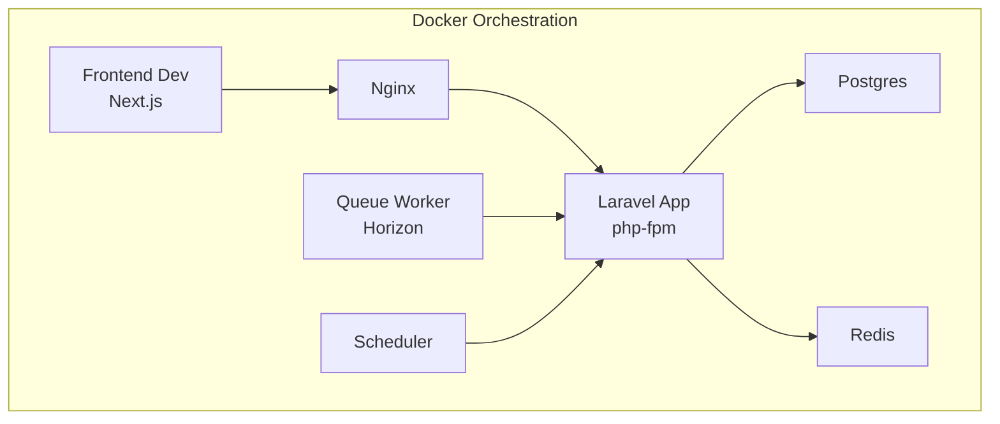
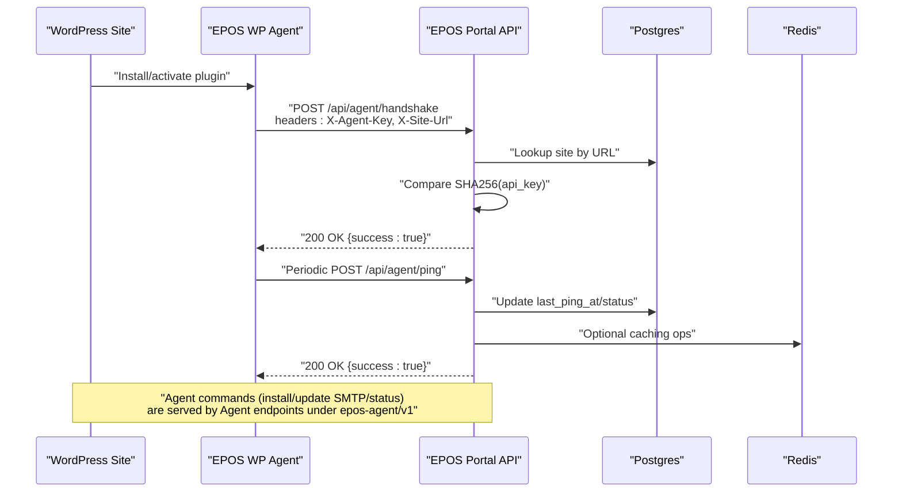
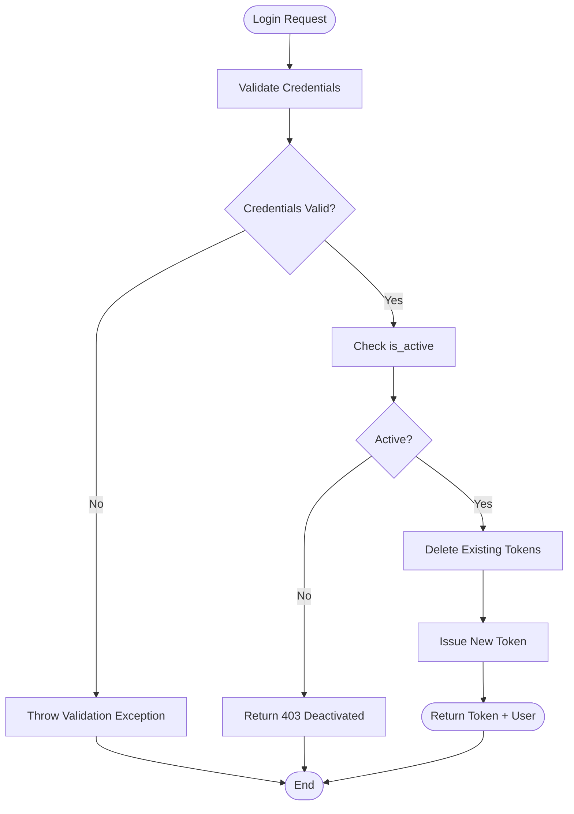
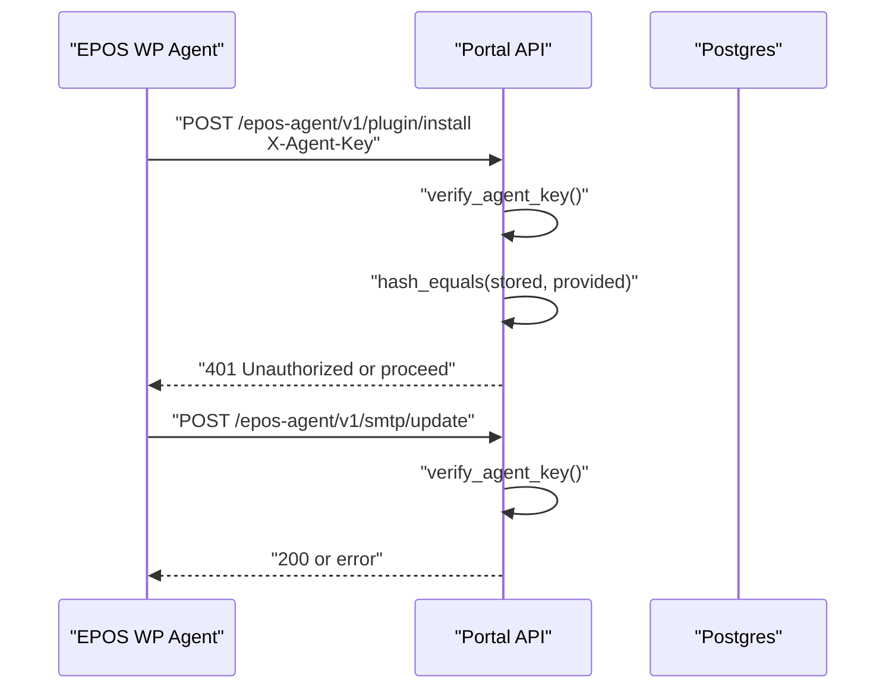
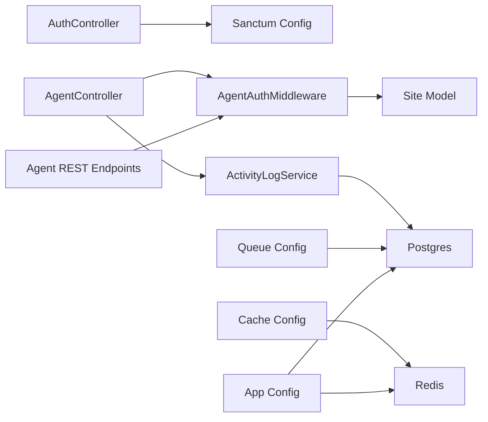

# Troubleshooting & FAQ

<cite>
**Referenced Files in This Document**
- [docker-compose.yml](file://docker-compose.yml)
- [app.php](file://portal/config/app.php)
- [database.php](file://portal/config/database.php)
- [sanctum.php](file://portal/config/sanctum.php)
- [logging.php](file://portal/config/logging.php)
- [queue.php](file://portal/config/queue.php)
- [cache.php](file://portal/config/cache.php)
- [session.php](file://portal/config/session.php)
- [AgentAuthMiddleware.php](file://portal/app/Http/Middleware/AgentAuthMiddleware.php)
- [RoleMiddleware.php](file://portal/app/Http/Middleware/RoleMiddleware.php)
- [AuthController.php](file://portal/app/Http/Controllers/Auth/AuthController.php)
- [AgentController.php](file://portal/app/Http/Controllers/Agent/AgentController.php)
- [class-api.php](file://agent/epos-wp-agent/includes/class-api.php)
- [ActivityLogService.php](file://portal/app/Services/ActivityLogService.php)
- [2026_05_15_070001_create_hostings_table.php](file://portal/database/migrations/2026_05_15_070001_create_hostings_table.php)
</cite>

## Table of Contents
1. [Introduction](#introduction)
2. [Project Structure](#project-structure)
3. [Core Components](#core-components)
4. [Architecture Overview](#architecture-overview)
5. [Detailed Component Analysis](#detailed-component-analysis)
6. [Dependency Analysis](#dependency-analysis)
7. [Performance Considerations](#performance-considerations)
8. [Troubleshooting Guide](#troubleshooting-guide)
9. [Conclusion](#conclusion)
10. [Appendices](#appendices)

## Introduction
This document provides comprehensive troubleshooting guidance and FAQs for the EPOS Portal. It covers installation and setup issues (Docker, database, environment variables), authentication and authorization problems (tokens, permissions, sessions), API and agent communication issues, WordPress plugin conflicts, performance tuning (slow queries, memory, scaling), logging and diagnostics, database migrations, cache and queues, and step-by-step debugging procedures. It also lists support channels and community resources.

## Project Structure
The EPOS Portal consists of:
- Backend service (Laravel) in the portal directory
- Frontend development container (Next.js) in the portal/frontend directory
- WordPress plugin agent (epos-wp-agent) in the agent/epos-wp-agent directory
- Docker Compose orchestration for app, Nginx, Postgres, Redis, queue, and scheduler

**Diagram sources**
- [docker-compose.yml:1-109](file://docker-compose.yml#L1-L109)

**Section sources**
- [docker-compose.yml:1-109](file://docker-compose.yml#L1-L109)

## Core Components
- Authentication and Authorization
  - Sanctum configuration for stateful domains and middleware
  - Role-based access control middleware
  - Personal Access Token creation and revocation
- Agent Communication
  - Agent handshake and periodic ping endpoints
  - Agent-side REST endpoints with API key verification
- Infrastructure
  - Database connections (SQLite, MySQL, MariaDB, PostgreSQL, SQL Server)
  - Redis-backed cache and queue configurations
  - Logging channels and levels
  - Sessions persisted to database by default

**Section sources**
- [sanctum.php:21-26](file://portal/config/sanctum.php#L21-L26)
- [RoleMiddleware.php:15-35](file://portal/app/Http/Middleware/RoleMiddleware.php#L15-L35)
- [AuthController.php:18-66](file://portal/app/Http/Controllers/Auth/AuthController.php#L18-L66)
- [AgentController.php:16-97](file://portal/app/Http/Controllers/Agent/AgentController.php#L16-L97)
- [class-api.php:50-71](file://agent/epos-wp-agent/includes/class-api.php#L50-L71)
- [database.php:20-115](file://portal/config/database.php#L20-L115)
- [cache.php:18-102](file://portal/config/cache.php#L18-L102)
- [queue.php:16-90](file://portal/config/queue.php#L16-L90)
- [logging.php:21-130](file://portal/config/logging.php#L21-L130)
- [session.php:21-104](file://portal/config/session.php#L21-L104)

## Architecture Overview
High-level flow for agent registration and heartbeat, and for user login and token usage.

**Diagram sources**
- [AgentController.php:16-97](file://portal/app/Http/Controllers/Agent/AgentController.php#L16-L97)
- [AgentAuthMiddleware.php:20-55](file://portal/app/Http/Middleware/AgentAuthMiddleware.php#L20-L55)
- [class-api.php:15-45](file://agent/epos-wp-agent/includes/class-api.php#L15-L45)
- [database.php:47-115](file://portal/config/database.php#L47-L115)
- [cache.php:75-79](file://portal/config/cache.php#L75-L79)

## Detailed Component Analysis

### Authentication and Authorization
Common issues:
- Missing or invalid stateful domains for SPA cookies
- Incorrect role middleware usage leading to 403
- Token expiration or revocation behavior
- Session cookie configuration mismatches

Resolution steps:
- Verify SANCTUM_STATEFUL_DOMAINS includes your frontend origin(s)
- Confirm user role matches middleware role requirements
- Ensure tokens are created after login and not revoked unexpectedly
- Check SESSION_* settings for cookie path/domain/security attributes

**Diagram sources**
- [AuthController.php:18-66](file://portal/app/Http/Controllers/Auth/AuthController.php#L18-L66)
- [sanctum.php:21-26](file://portal/config/sanctum.php#L21-L26)
- [session.php:130-202](file://portal/config/session.php#L130-L202)

**Section sources**
- [AuthController.php:18-66](file://portal/app/Http/Controllers/Auth/AuthController.php#L18-L66)
- [RoleMiddleware.php:15-35](file://portal/app/Http/Middleware/RoleMiddleware.php#L15-L35)
- [sanctum.php:21-26](file://portal/config/sanctum.php#L21-L26)
- [session.php:21-104](file://portal/config/session.php#L21-L104)

### Agent Communication and WordPress Plugin Integration
Common issues:
- Missing or mismatched X-Agent-Key and X-Site-Url headers
- Site not found due to URL normalization
- API key hash comparison failure
- Agent endpoints unauthorized due to API key mismatch

Resolution steps:
- Ensure X-Agent-Key and X-Site-Url are present and correct
- Confirm site URL matches stored URL (without trailing slash)
- Verify the agent’s stored API key equals the provided key (SHA256 comparison)
- Confirm agent endpoints are reachable and API key verification passes

**Diagram sources**
- [class-api.php:50-71](file://agent/epos-wp-agent/includes/class-api.php#L50-L71)
- [AgentAuthMiddleware.php:20-55](file://portal/app/Http/Middleware/AgentAuthMiddleware.php#L20-L55)

**Section sources**
- [AgentAuthMiddleware.php:20-55](file://portal/app/Http/Middleware/AgentAuthMiddleware.php#L20-L55)
- [class-api.php:50-71](file://agent/epos-wp-agent/includes/class-api.php#L50-L71)

### API Connectivity and Endpoints
Common issues:
- CORS/stateful domain misconfiguration causing preflight or cookie issues
- Endpoint not found due to route namespace differences
- Middleware blocking requests (role, agent auth)

Resolution steps:
- Add frontend origins to SANCTUM_STATEFUL_DOMAINS
- Verify route namespaces (/api vs epos-agent/v1)
- Ensure required middleware is applied and user/agent is authenticated

**Section sources**
- [sanctum.php:21-26](file://portal/config/sanctum.php#L21-L26)
- [class-api.php:15-45](file://agent/epos-wp-agent/includes/class-api.php#L15-L45)
- [AgentAuthMiddleware.php:20-55](file://portal/app/Http/Middleware/AgentAuthMiddleware.php#L20-L55)

### Database and Migrations
Common issues:
- Default sqlite connection in development
- Missing migrations or schema changes
- Foreign key constraint failures

Resolution steps:
- Configure DB_CONNECTION to postgres/mysql/mariadb/sqlsrv as needed
- Run migrations to create tables including hostings and others
- Review foreign keys and soft deletes in migrations

**Section sources**
- [database.php:20-115](file://portal/config/database.php#L20-L115)
- [2026_05_15_070001_create_hostings_table.php:11-18](file://portal/database/migrations/2026_05_15_070001_create_hostings_table.php#L11-L18)

### Cache and Queues
Common issues:
- Redis connectivity or wrong connection names
- Queue driver misconfiguration
- Failed job storage and visibility

Resolution steps:
- Verify REDIS_* environment variables and connection names
- Choose appropriate QUEUE_CONNECTION (database, redis, sqs, etc.)
- Monitor failed jobs and retry policies

**Section sources**
- [cache.php:75-79](file://portal/config/cache.php#L75-L79)
- [queue.php:16-90](file://portal/config/queue.php#L16-L90)

### Logging and Diagnostics
Common issues:
- Logs not written or rotated incorrectly
- Insufficient log level for diagnostics
- Slack/Papertrail integrations failing

Resolution steps:
- Set LOG_CHANNEL and LOG_LEVEL appropriately
- Use daily or single channel for persistent logs
- Validate webhook URLs and credentials for external channels

**Section sources**
- [logging.php:21-130](file://portal/config/logging.php#L21-L130)

## Dependency Analysis
Inter-service dependencies and coupling:

**Diagram sources**
- [AuthController.php:18-66](file://portal/app/Http/Controllers/Auth/AuthController.php#L18-L66)
- [AgentController.php:16-97](file://portal/app/Http/Controllers/Agent/AgentController.php#L16-L97)
- [AgentAuthMiddleware.php:20-55](file://portal/app/Http/Middleware/AgentAuthMiddleware.php#L20-L55)
- [ActivityLogService.php:16-48](file://portal/app/Services/ActivityLogService.php#L16-L48)
- [database.php:20-115](file://portal/config/database.php#L20-L115)
- [cache.php:75-79](file://portal/config/cache.php#L75-L79)
- [queue.php:16-90](file://portal/config/queue.php#L16-L90)
- [app.php:29-42](file://portal/config/app.php#L29-L42)

**Section sources**
- [AuthController.php:18-66](file://portal/app/Http/Controllers/Auth/AuthController.php#L18-L66)
- [AgentController.php:16-97](file://portal/app/Http/Controllers/Agent/AgentController.php#L16-L97)
- [AgentAuthMiddleware.php:20-55](file://portal/app/Http/Middleware/AgentAuthMiddleware.php#L20-L55)
- [ActivityLogService.php:16-48](file://portal/app/Services/ActivityLogService.php#L16-L48)
- [database.php:20-115](file://portal/config/database.php#L20-L115)
- [cache.php:75-79](file://portal/config/cache.php#L75-L79)
- [queue.php:16-90](file://portal/config/queue.php#L16-L90)
- [app.php:29-42](file://portal/config/app.php#L29-L42)

## Performance Considerations
- Slow queries
  - Enable query log via logging channel and review slow queries
  - Use database EXPLAIN plans and add missing indexes
- Memory issues
  - Reduce queue concurrency or switch to Redis-backed queues
  - Tune PHP-FPM and Nginx worker processes
- Scaling
  - Use Redis for cache and queues
  - Scale horizontally with multiple workers and load-balanced instances
- Caching
  - Prefer Redis cache store and proper prefixes
  - Use failover cache store for resilience

[No sources needed since this section provides general guidance]

## Troubleshooting Guide

### Installation and Setup
- Docker configuration problems
  - Ensure all services are on the same network and ports are exposed
  - Confirm volume mounts for portal and frontend
  - Verify environment variables passed to containers
- Database connection failures
  - Check DB_CONNECTION and credentials
  - Confirm Postgres is reachable and accepts connections
  - Validate schema exists after migrations
- Environment variable misconfigurations
  - APP_ENV, APP_DEBUG, APP_URL, APP_KEY
  - DB_* and REDIS_* variables
  - LOG_* and QUEUE_* variables

**Section sources**
- [docker-compose.yml:1-109](file://docker-compose.yml#L1-L109)
- [database.php:20-115](file://portal/config/database.php#L20-L115)
- [app.php:29-100](file://portal/config/app.php#L29-L100)
- [logging.php:21-130](file://portal/config/logging.php#L21-L130)
- [queue.php:16-90](file://portal/config/queue.php#L16-L90)

### Authentication and Authorization
- Token issues
  - Verify login endpoint returns a token
  - Ensure tokens are not revoked prematurely
  - Check Sanctum stateful domains and CSRF/CORS
- Permission problems
  - Confirm user role matches middleware role list
  - Validate role field and middleware usage
- Session management errors
  - Check SESSION_DRIVER and SESSION_CONNECTION
  - Validate cookie settings (secure, http_only, same_site)

**Section sources**
- [AuthController.php:18-66](file://portal/app/Http/Controllers/Auth/AuthController.php#L18-L66)
- [RoleMiddleware.php:15-35](file://portal/app/Http/Middleware/RoleMiddleware.php#L15-L35)
- [sanctum.php:21-26](file://portal/config/sanctum.php#L21-L26)
- [session.php:21-104](file://portal/config/session.php#L21-L104)

### API Connectivity and Agent Communication
- API connectivity issues
  - Verify route namespaces and method signatures
  - Confirm middleware is not blocking requests
- Agent communication problems
  - Validate X-Agent-Key and X-Site-Url headers
  - Ensure site URL normalization and matching
  - Check agent-side API key verification logic
- WordPress plugin conflicts
  - Disable conflicting plugins temporarily
  - Verify REST API endpoints are reachable
  - Check for output buffering or early output interfering with JSON

**Section sources**
- [AgentController.php:16-97](file://portal/app/Http/Controllers/Agent/AgentController.php#L16-L97)
- [AgentAuthMiddleware.php:20-55](file://portal/app/Http/Middleware/AgentAuthMiddleware.php#L20-L55)
- [class-api.php:50-71](file://agent/epos-wp-agent/includes/class-api.php#L50-L71)

### Performance Troubleshooting
- Slow queries
  - Enable detailed logging and profile queries
  - Add indexes on frequent join/filter columns
- Memory issues
  - Reduce queue worker concurrency
  - Switch to Redis-backed cache and queues
- Scaling problems
  - Use Redis cluster and Horizon for queues
  - Horizontal scale app and queue workers

**Section sources**
- [logging.php:21-130](file://portal/config/logging.php#L21-L130)
- [cache.php:75-79](file://portal/config/cache.php#L75-L79)
- [queue.php:16-90](file://portal/config/queue.php#L16-L90)

### Logging Configuration and Error Diagnosis
- Configure LOG_CHANNEL and LOG_LEVEL
- Use daily channel for long-term retention
- Integrate Slack or Papertrail for alerts
- Review storage/app/logs for errors

**Section sources**
- [logging.php:21-130](file://portal/config/logging.php#L21-L130)

### Database Migration Issues
- Migration repository table not found
  - Run migrations to create required tables
  - Verify DB_CONNECTION and credentials
- Foreign key constraint failures
  - Check migration order and dependencies
  - Review soft deletes and cascade rules

**Section sources**
- [database.php:130-133](file://portal/config/database.php#L130-L133)
- [2026_05_15_070001_create_hostings_table.php:11-18](file://portal/database/migrations/2026_05_15_070001_create_hostings_table.php#L11-L18)

### Cache Problems
- Cache misses or stale data
  - Verify CACHE_STORE and Redis connection
  - Check cache key prefixes and TTL
- Failover cache store
  - Use failover store for resilience

**Section sources**
- [cache.php:18-102](file://portal/config/cache.php#L18-L102)

### Queue Processing Failures
- Jobs not processed
  - Start queue worker and monitor logs
  - Verify QUEUE_CONNECTION and failed job storage
- Retry and backoff
  - Adjust retry_after and backoff settings

**Section sources**
- [queue.php:16-90](file://portal/config/queue.php#L16-L90)

### Step-by-Step Debugging Procedures
- Verify environment
  - Check APP_ENV, APP_DEBUG, APP_URL, APP_KEY
  - Confirm DB_CONNECTION and REDIS_* variables
- Test database connectivity
  - Connect to Postgres and verify schema
  - Run a simple SELECT to confirm connectivity
- Test authentication
  - Login and capture token
  - Use token to call protected endpoints
- Test agent handshake
  - Call /api/agent/handshake with correct headers
  - Verify site status updates and logs
- Inspect logs
  - Tail storage/logs/laravel.log
  - Check queue worker logs
- Validate cache and queues
  - Ping Redis and check keys
  - Confirm queue jobs are inserted and processed

**Section sources**
- [app.php:29-100](file://portal/config/app.php#L29-L100)
- [database.php:20-115](file://portal/config/database.php#L20-L115)
- [AuthController.php:18-66](file://portal/app/Http/Controllers/Auth/AuthController.php#L18-L66)
- [AgentController.php:16-97](file://portal/app/Http/Controllers/Agent/AgentController.php#L16-L97)
- [logging.php:21-130](file://portal/config/logging.php#L21-L130)
- [queue.php:16-90](file://portal/config/queue.php#L16-L90)
- [cache.php:75-79](file://portal/config/cache.php#L75-L79)

### Diagnostic Tools
- Laravel Tinker for ad-hoc queries
- Horizon for queue monitoring
- Database client for schema inspection
- Browser dev tools for API/network inspection
- Redis CLI for cache inspection

[No sources needed since this section provides general guidance]

## Conclusion
This guide consolidates the most common issues and resolutions across installation, authentication, agent communication, performance, logging, migrations, cache, and queues. Use the step-by-step debugging procedures and consult the referenced configuration files to resolve issues quickly.

## Appendices

### Frequently Asked Questions (FAQ)
- What are the minimum environment variables required?
  - APP_ENV, APP_DEBUG, APP_URL, APP_KEY, DB_CONNECTION, DB_HOST, DB_PORT, DB_DATABASE, DB_USERNAME, DB_PASSWORD, REDIS_* variables
- How do I enable detailed logging?
  - Set LOG_CHANNEL=stack and LOG_LEVEL=debug; use daily channel for rotation
- Why am I getting 401 on agent endpoints?
  - Ensure X-Agent-Key and X-Site-Url headers are present and site URL matches stored URL
- Why is my session not persisting?
  - Check SESSION_DRIVER and SESSION_CONNECTION; verify cookie settings (secure, http_only, same_site)
- How do I migrate the database?
  - Run migrations to create tables; verify DB_CONNECTION and credentials
- How do I monitor queues?
  - Start horizon and check failed jobs; adjust QUEUE_CONNECTION and retry_after

**Section sources**
- [app.php:29-100](file://portal/config/app.php#L29-L100)
- [logging.php:21-130](file://portal/config/logging.php#L21-L130)
- [AgentAuthMiddleware.php:20-55](file://portal/app/Http/Middleware/AgentAuthMiddleware.php#L20-L55)
- [session.php:21-104](file://portal/config/session.php#L21-L104)
- [database.php:20-115](file://portal/config/database.php#L20-L115)
- [queue.php:16-90](file://portal/config/queue.php#L16-L90)

### Support Channels and Community Resources
- Internal support: contact your platform administrator
- Community forums: EPOS Portal community forum
- Documentation: EPOS Portal documentation site
- GitHub issues: report bugs and feature requests

[No sources needed since this section provides general guidance]