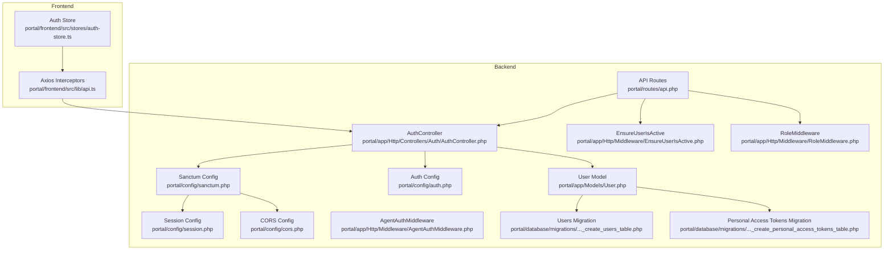
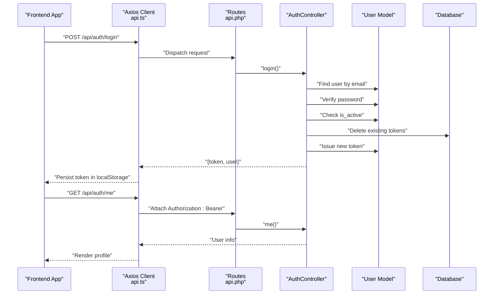
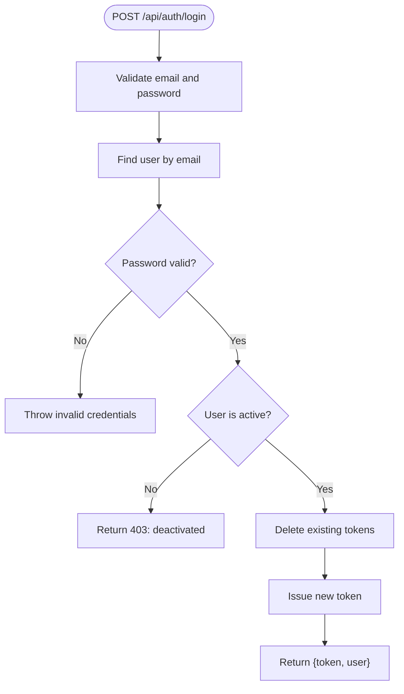
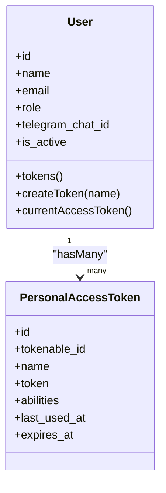
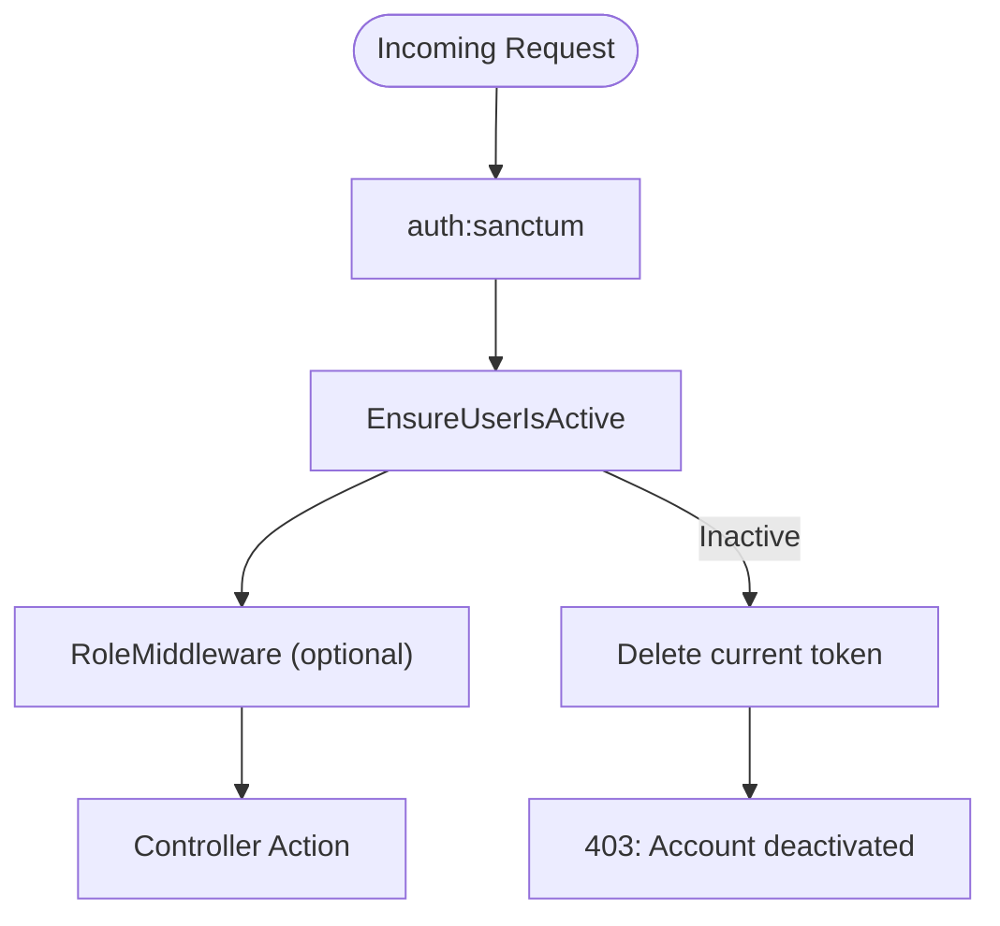
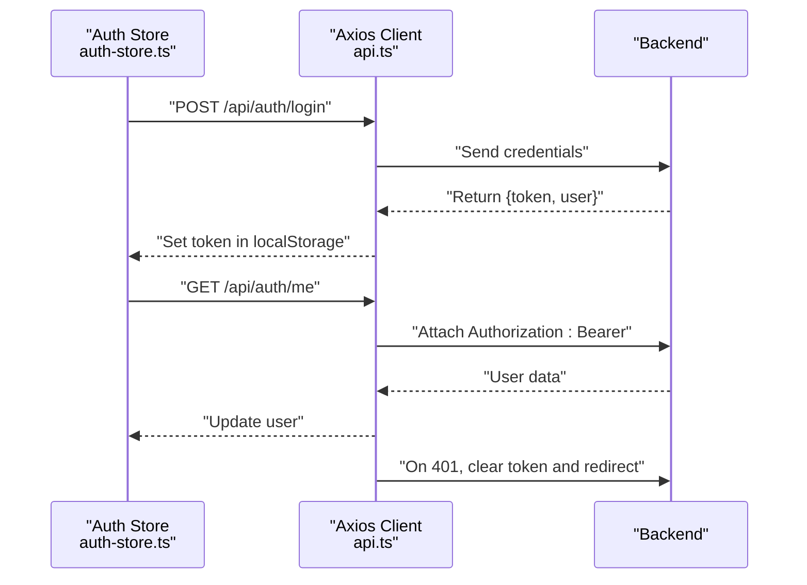
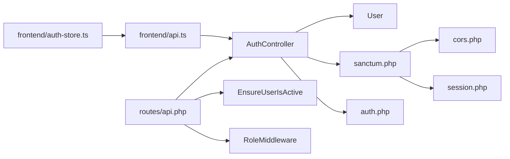

# Authentication & Session Management

<cite>
**Referenced Files in This Document**
- [sanctum.php](file://portal/config/sanctum.php)
- [auth.php](file://portal/config/auth.php)
- [session.php](file://portal/config/session.php)
- [cors.php](file://portal/config/cors.php)
- [EnsureUserIsActive.php](file://portal/app/Http/Middleware/EnsureUserIsActive.php)
- [RoleMiddleware.php](file://portal/app/Http/Middleware/RoleMiddleware.php)
- [AgentAuthMiddleware.php](file://portal/app/Http/Middleware/AgentAuthMiddleware.php)
- [AuthController.php](file://portal/app/Http/Controllers/Auth/AuthController.php)
- [User.php](file://portal/app/Models/User.php)
- [api.php](file://portal/routes/api.php)
- [web.php](file://portal/routes/web.php)
- [auth-store.ts](file://portal/frontend/src/stores/auth-store.ts)
- [api.ts](file://portal/frontend/src/lib/api.ts)
- [create_users_table.php](file://portal/database/migrations/0001_01_01_000000_create_users_table.php)
- [create_personal_access_tokens_table.php](file://portal/database/migrations/2026_05_15_061621_create_personal_access_tokens_table.php)
- [ApiResponse.php](file://portal/app/Traits/ApiResponse.php)
</cite>

## Table of Contents
1. [Introduction](#introduction)
2. [Project Structure](#project-structure)
3. [Core Components](#core-components)
4. [Architecture Overview](#architecture-overview)
5. [Detailed Component Analysis](#detailed-component-analysis)
6. [Dependency Analysis](#dependency-analysis)
7. [Performance Considerations](#performance-considerations)
8. [Security Measures](#security-measures)
9. [Troubleshooting Guide](#troubleshooting-guide)
10. [Conclusion](#conclusion)

## Introduction
This document explains the authentication and session management system built with Laravel Sanctum for API-first authentication. It covers token generation and validation, login/logout flows, session handling, user activation enforcement, middleware configuration, token expiration policies, and frontend integration with automatic token renewal. It also outlines CSRF protection, rate limiting, and brute force prevention strategies, along with practical examples of authentication flows and token usage in API requests.

## Project Structure
The authentication system spans backend configuration, controllers, middleware, models, routes, and frontend state management:
- Backend configuration: Sanctum, auth, session, CORS
- Controllers: API authentication endpoints
- Middleware: Active user enforcement, role-based access, agent authentication
- Models: User with Sanctum tokens and roles
- Routes: Protected API endpoints guarded by Sanctum and custom middleware
- Frontend: Zustand store and Axios interceptors for token persistence and renewal

**Diagram sources**
- [sanctum.php:1-88](file://portal/config/sanctum.php#L1-88)
- [auth.php:1-118](file://portal/config/auth.php#L1-118)
- [session.php:1-218](file://portal/config/session.php#L1-218)
- [cors.php:1-30](file://portal/config/cors.php#L1-30)
- [AuthController.php:1-135](file://portal/app/Http/Controllers/Auth/AuthController.php#L1-135)
- [EnsureUserIsActive.php:1-26](file://portal/app/Http/Middleware/EnsureUserIsActive.php#L1-26)
- [RoleMiddleware.php:1-37](file://portal/app/Http/Middleware/RoleMiddleware.php#L1-37)
- [AgentAuthMiddleware.php:1-57](file://portal/app/Http/Middleware/AgentAuthMiddleware.php#L1-57)
- [User.php:1-38](file://portal/app/Models/User.php#L1-38)
- [api.php:1-52](file://portal/routes/api.php#L1-52)
- [create_users_table.php:1-53](file://portal/database/migrations/0001_01_01_000000_create_users_table.php#L1-53)
- [create_personal_access_tokens_table.php:1-34](file://portal/database/migrations/2026_05_15_061621_create_personal_access_tokens_table.php#L1-34)
- [auth-store.ts:1-64](file://portal/frontend/src/stores/auth-store.ts#L1-64)
- [api.ts:1-37](file://portal/frontend/src/lib/api.ts#L1-37)

**Section sources**
- [sanctum.php:1-88](file://portal/config/sanctum.php#L1-88)
- [auth.php:1-118](file://portal/config/auth.php#L1-118)
- [session.php:1-218](file://portal/config/session.php#L1-218)
- [cors.php:1-30](file://portal/config/cors.php#L1-30)
- [AuthController.php:1-135](file://portal/app/Http/Controllers/Auth/AuthController.php#L1-135)
- [EnsureUserIsActive.php:1-26](file://portal/app/Http/Middleware/EnsureUserIsActive.php#L1-26)
- [RoleMiddleware.php:1-37](file://portal/app/Http/Middleware/RoleMiddleware.php#L1-37)
- [AgentAuthMiddleware.php:1-57](file://portal/app/Http/Middleware/AgentAuthMiddleware.php#L1-57)
- [User.php:1-38](file://portal/app/Models/User.php#L1-38)
- [api.php:1-52](file://portal/routes/api.php#L1-52)
- [create_users_table.php:1-53](file://portal/database/migrations/0001_01_01_000000_create_users_table.php#L1-53)
- [create_personal_access_tokens_table.php:1-34](file://portal/database/migrations/2026_05_15_061621_create_personal_access_tokens_table.php#L1-34)
- [auth-store.ts:1-64](file://portal/frontend/src/stores/auth-store.ts#L1-64)
- [api.ts:1-37](file://portal/frontend/src/lib/api.ts#L1-37)

## Core Components
- Sanctum configuration: Defines stateful domains, guards, expiration policy, token prefix, and middleware stack for session authentication.
- Authentication controller: Implements login, logout, profile update, and password change endpoints with token issuance and revocation.
- User model: Uses Sanctum’s HasApiTokens trait and integrates with roles and activity checks.
- Middleware:
  - EnsureUserIsActive: Revokes current token and blocks inactive users.
  - RoleMiddleware: Enforces role-based access control.
  - AgentAuthMiddleware: Authenticates agent requests via hashed API keys.
- Routes: Protects API endpoints using auth:sanctum and the active user middleware.
- Frontend integration: Persist tokens in localStorage, attach Authorization header, and redirect on 401.

**Section sources**
- [sanctum.php:1-88](file://portal/config/sanctum.php#L1-88)
- [AuthController.php:1-135](file://portal/app/Http/Controllers/Auth/AuthController.php#L1-135)
- [User.php:1-38](file://portal/app/Models/User.php#L1-38)
- [EnsureUserIsActive.php:1-26](file://portal/app/Http/Middleware/EnsureUserIsActive.php#L1-26)
- [RoleMiddleware.php:1-37](file://portal/app/Http/Middleware/RoleMiddleware.php#L1-37)
- [AgentAuthMiddleware.php:1-57](file://portal/app/Http/Middleware/AgentAuthMiddleware.php#L1-57)
- [api.php:1-52](file://portal/routes/api.php#L1-52)
- [auth-store.ts:1-64](file://portal/frontend/src/stores/auth-store.ts#L1-64)
- [api.ts:1-37](file://portal/frontend/src/lib/api.ts#L1-37)

## Architecture Overview
The system combines stateless token-based authentication for APIs with optional session support for stateful domains. Sanctum validates bearer tokens for API requests and can authenticate via session for trusted frontends. Token lifetimes and middleware policies enforce security and availability.

**Diagram sources**
- [api.ts:1-37](file://portal/frontend/src/lib/api.ts#L1-37)
- [api.php:1-52](file://portal/routes/api.php#L1-52)
- [AuthController.php:1-135](file://portal/app/Http/Controllers/Auth/AuthController.php#L1-135)
- [User.php:1-38](file://portal/app/Models/User.php#L1-38)

## Detailed Component Analysis

### Sanctum Configuration
- Stateful domains: Controls which origins receive stateful session cookies for SPA authentication.
- Guards: Sanctum checks configured guards (default web) to authenticate requests.
- Expiration: Token lifetime is configurable; null implies no global expiration.
- Token prefix: Optional prefix to reduce accidental token exposure.
- Middleware stack: Includes session authentication, cookie encryption, and CSRF validation.

**Section sources**
- [sanctum.php:1-88](file://portal/config/sanctum.php#L1-88)

### Authentication Controller
- Login:
  - Validates credentials and checks user activation.
  - Revokes existing tokens to prevent accumulation.
  - Issues a new personal access token with a descriptive name.
- Logout:
  - Deletes the current access token for the authenticated user.
- Profile and password updates:
  - Validate inputs and update user attributes accordingly.

**Diagram sources**
- [AuthController.php:1-135](file://portal/app/Http/Controllers/Auth/AuthController.php#L1-135)

**Section sources**
- [AuthController.php:1-135](file://portal/app/Http/Controllers/Auth/AuthController.php#L1-135)
- [ApiResponse.php:1-56](file://portal/app/Traits/ApiResponse.php#L1-56)

### User Model and Tokens
- The User model uses HasApiTokens to enable token issuance and management.
- Personal access tokens are stored in the personal_access_tokens table with abilities, last_used_at, and optional expiration.
- Users have an is_active flag enforced by EnsureUserIsActive middleware.

**Diagram sources**
- [User.php:1-38](file://portal/app/Models/User.php#L1-38)
- [create_personal_access_tokens_table.php:1-34](file://portal/database/migrations/2026_05_15_061621_create_personal_access_tokens_table.php#L1-34)

**Section sources**
- [User.php:1-38](file://portal/app/Models/User.php#L1-38)
- [create_personal_access_tokens_table.php:1-34](file://portal/database/migrations/2026_05_15_061621_create_personal_access_tokens_table.php#L1-34)
- [create_users_table.php:1-53](file://portal/database/migrations/0001_01_01_000000_create_users_table.php#L1-53)

### Middleware Stack
- EnsureUserIsActive:
  - Blocks inactive users by deleting their current token and returning 403.
- RoleMiddleware:
  - Enforces role-based access; returns 401 for unauthenticated or 403 for insufficient permissions.
- AgentAuthMiddleware:
  - Authenticates agent requests using a hashed API key against a site record.

**Diagram sources**
- [EnsureUserIsActive.php:1-26](file://portal/app/Http/Middleware/EnsureUserIsActive.php#L1-26)
- [RoleMiddleware.php:1-37](file://portal/app/Http/Middleware/RoleMiddleware.php#L1-37)
- [api.php:1-52](file://portal/routes/api.php#L1-52)

**Section sources**
- [EnsureUserIsActive.php:1-26](file://portal/app/Http/Middleware/EnsureUserIsActive.php#L1-26)
- [RoleMiddleware.php:1-37](file://portal/app/Http/Middleware/RoleMiddleware.php#L1-37)
- [AgentAuthMiddleware.php:1-57](file://portal/app/Http/Middleware/AgentAuthMiddleware.php#L1-57)
- [api.php:1-52](file://portal/routes/api.php#L1-52)

### Routes and Protection
- Public login route.
- Protected routes grouped under auth:sanctum and active middleware.
- Admin-only and admin/dev routes gated by RoleMiddleware.
- Logout, profile, and password endpoints require authentication.

**Section sources**
- [api.php:1-52](file://portal/routes/api.php#L1-52)

### Frontend Authentication State Management
- Auth store persists tokens in localStorage and hydrates on app load.
- Axios interceptors attach Authorization: Bearer headers and handle 401 by clearing token and redirecting to login.
- Automatic token renewal is implicit through the login flow; no separate refresh mechanism is implemented.

**Diagram sources**
- [auth-store.ts:1-64](file://portal/frontend/src/stores/auth-store.ts#L1-64)
- [api.ts:1-37](file://portal/frontend/src/lib/api.ts#L1-37)

**Section sources**
- [auth-store.ts:1-64](file://portal/frontend/src/stores/auth-store.ts#L1-64)
- [api.ts:1-37](file://portal/frontend/src/lib/api.ts#L1-37)

## Dependency Analysis
- Controllers depend on the User model for token operations and on ApiResponse for consistent JSON responses.
- Routes depend on middleware for authentication and authorization.
- Frontend depends on Axios interceptors to attach tokens and on the auth store for state.
- Configuration files define the behavior of Sanctum, sessions, and CORS.

**Diagram sources**
- [api.ts:1-37](file://portal/frontend/src/lib/api.ts#L1-37)
- [auth-store.ts:1-64](file://portal/frontend/src/stores/auth-store.ts#L1-64)
- [AuthController.php:1-135](file://portal/app/Http/Controllers/Auth/AuthController.php#L1-135)
- [User.php:1-38](file://portal/app/Models/User.php#L1-38)
- [sanctum.php:1-88](file://portal/config/sanctum.php#L1-88)
- [auth.php:1-118](file://portal/config/auth.php#L1-118)
- [session.php:1-218](file://portal/config/session.php#L1-218)
- [cors.php:1-30](file://portal/config/cors.php#L1-30)
- [api.php:1-52](file://portal/routes/api.php#L1-52)
- [EnsureUserIsActive.php:1-26](file://portal/app/Http/Middleware/EnsureUserIsActive.php#L1-26)
- [RoleMiddleware.php:1-37](file://portal/app/Http/Middleware/RoleMiddleware.php#L1-37)

**Section sources**
- [api.ts:1-37](file://portal/frontend/src/lib/api.ts#L1-37)
- [auth-store.ts:1-64](file://portal/frontend/src/stores/auth-store.ts#L1-64)
- [AuthController.php:1-135](file://portal/app/Http/Controllers/Auth/AuthController.php#L1-135)
- [User.php:1-38](file://portal/app/Models/User.php#L1-38)
- [sanctum.php:1-88](file://portal/config/sanctum.php#L1-88)
- [auth.php:1-118](file://portal/config/auth.php#L1-118)
- [session.php:1-218](file://portal/config/session.php#L1-218)
- [cors.php:1-30](file://portal/config/cors.php#L1-30)
- [api.php:1-52](file://portal/routes/api.php#L1-52)
- [EnsureUserIsActive.php:1-26](file://portal/app/Http/Middleware/EnsureUserIsActive.php#L1-26)
- [RoleMiddleware.php:1-37](file://portal/app/Http/Middleware/RoleMiddleware.php#L1-37)

## Performance Considerations
- Token storage: Personal access tokens are indexed by expires_at; consider pruning expired tokens periodically.
- Session lifetime: Sessions are database-backed with a configurable lifetime; tune SESSION_LIFETIME to balance security and UX.
- Middleware overhead: EnsureUserIsActive and RoleMiddleware add minimal overhead; ensure they are applied only where necessary.
- Frontend caching: Avoid unnecessary repeated calls to /auth/me by caching user data in the store.

[No sources needed since this section provides general guidance]

## Security Measures
- CSRF protection:
  - Sanctum middleware includes CSRF validation for stateful requests.
  - CORS configuration enables credentials and restricts origins to the frontend origin.
- Token lifecycle:
  - Tokens are revoked on login to prevent accumulation.
  - No global expiration is set; consider setting expiration in Sanctum configuration for stricter policies.
- Rate limiting and brute force:
  - No explicit rate limiting is configured in the provided files; implement application-level throttling or use Laravel’s rate limiter middleware for sensitive endpoints.
- Session security:
  - Session cookie SameSite policy is configurable; ensure appropriate SameSite and Secure flags for HTTPS environments.
- User activation:
  - EnsureUserIsActive middleware enforces account status and revokes tokens for deactivated users.

**Section sources**
- [sanctum.php:81-85](file://portal/config/sanctum.php#L81-85)
- [cors.php:11-27](file://portal/config/cors.php#L11-27)
- [session.php:202-202](file://portal/config/session.php#L202-202)
- [AuthController.php:37-41](file://portal/app/Http/Controllers/Auth/AuthController.php#L37-L41)
- [EnsureUserIsActive.php:13-21](file://portal/app/Http/Middleware/EnsureUserIsActive.php#L13-L21)

## Troubleshooting Guide
- 401 Unauthorized:
  - Occurs when the Authorization header is missing or invalid. The frontend clears the token and redirects to login.
- 403 Forbidden:
  - Returned when the user is deactivated; the current token is revoked automatically.
- 401/403 on protected routes:
  - Ensure auth:sanctum and active middleware are applied to protected routes and that the token is attached in the frontend.
- Session timeouts:
  - Adjust SESSION_LIFETIME and SESSION_SAME_SITE according to deployment requirements.

**Section sources**
- [api.ts:23-34](file://portal/frontend/src/lib/api.ts#L23-34)
- [EnsureUserIsActive.php:13-21](file://portal/app/Http/Middleware/EnsureUserIsActive.php#L13-L21)
- [api.php:13-13](file://portal/routes/api.php#L13-L13)

## Conclusion
The authentication system leverages Laravel Sanctum for robust API authentication with optional session support, strict middleware enforcement for active users and roles, and a clean frontend integration pattern using localStorage and Axios interceptors. While token expiration is not globally enforced, the system provides strong defaults for CSRF protection, CORS, and session security. For production deployments, consider adding rate limiting and explicit token expiration policies to further harden the system.