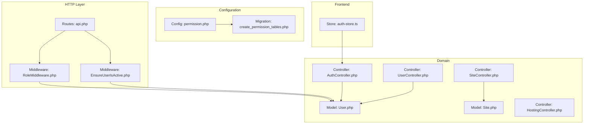
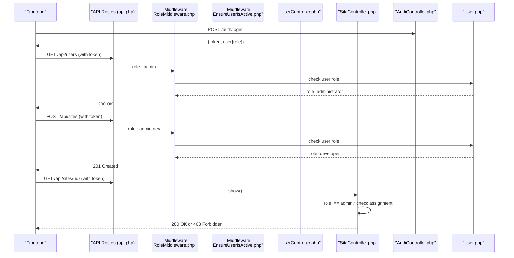
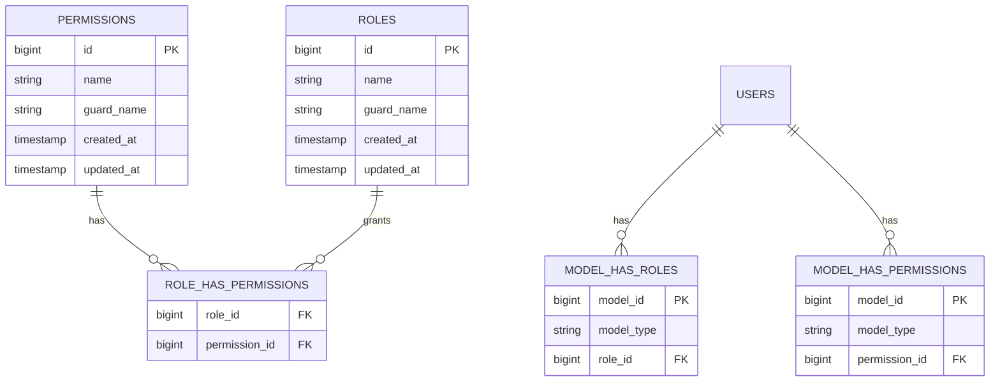
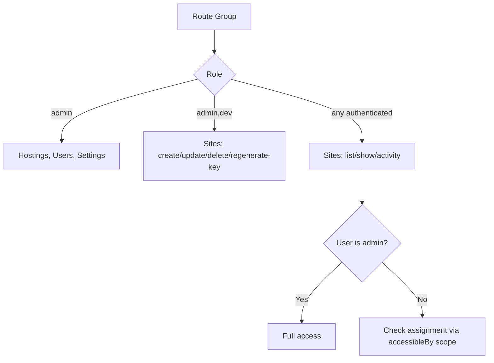
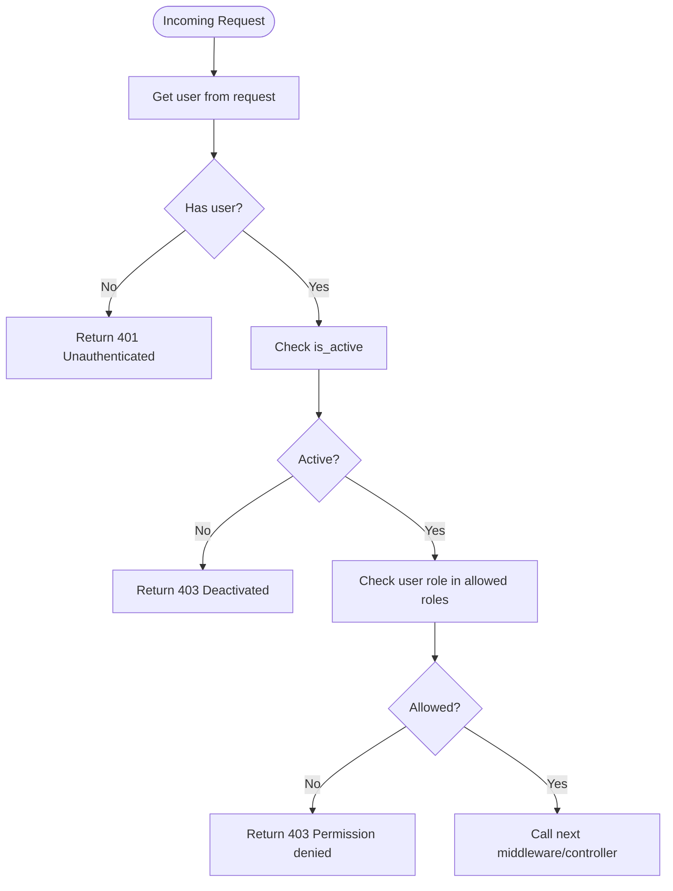
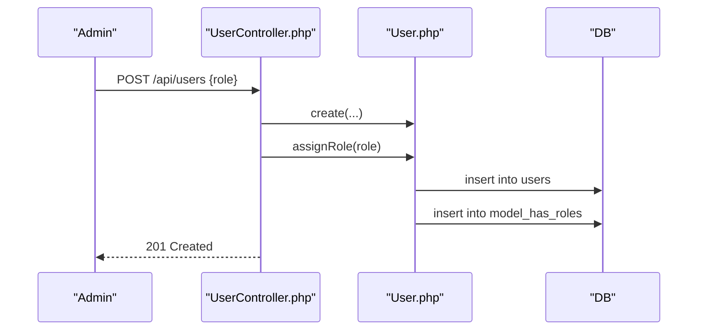
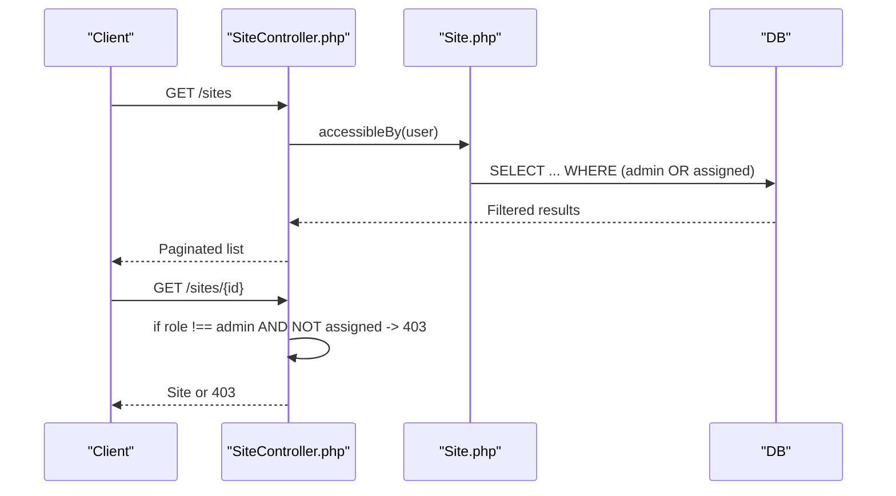
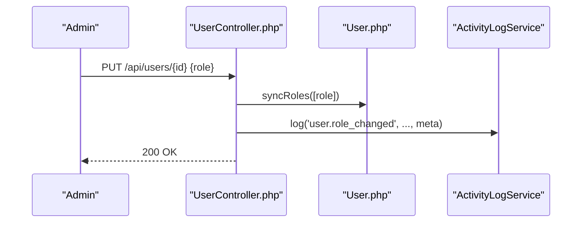
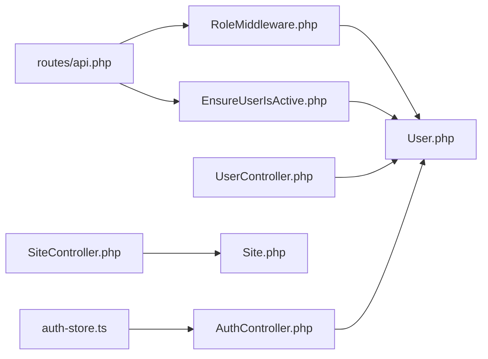

# Role-Based Access Control

<cite>
**Referenced Files in This Document**
- [permission.php](file://portal/config/permission.php)
- [2026_05_15_061634_create_permission_tables.php](file://portal/database/migrations/2026_05_15_061634_create_permission_tables.php)
- [RoleMiddleware.php](file://portal/app/Http/Middleware/RoleMiddleware.php)
- [EnsureUserIsActive.php](file://portal/app/Http/Middleware/EnsureUserIsActive.php)
- [User.php](file://portal/app/Models/User.php)
- [Site.php](file://portal/app/Models/Site.php)
- [api.php](file://portal/routes/api.php)
- [AuthController.php](file://portal/app/Http/Controllers/Auth/AuthController.php)
- [UserController.php](file://portal/app/Http/Controllers/Portal/UserController.php)
- [SiteController.php](file://portal/app/Http/Controllers/Portal/SiteController.php)
- [HostingController.php](file://portal/app/Http/Controllers/Portal/HostingController.php)
- [auth-store.ts](file://portal/frontend/src/stores/auth-store.ts)
- [ApiResponse.php](file://portal/app/Traits/ApiResponse.php)
</cite>

## Table of Contents
1. [Introduction](#introduction)
2. [Project Structure](#project-structure)
3. [Core Components](#core-components)
4. [Architecture Overview](#architecture-overview)
5. [Detailed Component Analysis](#detailed-component-analysis)
6. [Dependency Analysis](#dependency-analysis)
7. [Performance Considerations](#performance-considerations)
8. [Troubleshooting Guide](#troubleshooting-guide)
9. [Conclusion](#conclusion)
10. [Appendices](#appendices)

## Introduction
This document explains the role-based access control (RBAC) system used in the application. It covers the three main roles (administrator, developer, and marketing), how permissions and roles are integrated via the Spatie Permission package, and how access control is enforced across routes and controllers. It also documents role-based conditional rendering in the frontend, API response filtering, role change procedures, permission auditing, and security considerations.

## Project Structure
The RBAC implementation spans configuration, middleware, models, controllers, routes, and the frontend store. The Spatie Permission package is configured and its database schema is migrated. Routes are grouped by role, and controllers enforce both route-level and resource-level checks. The frontend store holds the authenticated user’s role for conditional UI rendering.

**Diagram sources**
- [permission.php:1-207](file://portal/config/permission.php#L1-L207)
- [2026_05_15_061634_create_permission_tables.php:1-135](file://portal/database/migrations/2026_05_15_061634_create_permission_tables.php#L1-L135)
- [RoleMiddleware.php:1-37](file://portal/app/Http/Middleware/RoleMiddleware.php#L1-L37)
- [EnsureUserIsActive.php:1-26](file://portal/app/Http/Middleware/EnsureUserIsActive.php#L1-L26)
- [api.php:1-48](file://portal/routes/api.php#L1-L48)
- [User.php:1-38](file://portal/app/Models/User.php#L1-L38)
- [Site.php:1-86](file://portal/app/Models/Site.php#L1-L86)
- [AuthController.php:1-135](file://portal/app/Http/Controllers/Auth/AuthController.php#L1-L135)
- [UserController.php:1-137](file://portal/app/Http/Controllers/Portal/UserController.php#L1-L137)
- [SiteController.php:1-204](file://portal/app/Http/Controllers/Portal/SiteController.php#L1-L204)
- [HostingController.php:1-83](file://portal/app/Http/Controllers/Portal/HostingController.php#L1-L83)
- [auth-store.ts:1-64](file://portal/frontend/src/stores/auth-store.ts#L1-L64)

**Section sources**
- [permission.php:1-207](file://portal/config/permission.php#L1-L207)
- [2026_05_15_061634_create_permission_tables.php:1-135](file://portal/database/migrations/2026_05_15_061634_create_permission_tables.php#L1-L135)
- [api.php:1-48](file://portal/routes/api.php#L1-L48)

## Core Components
- Spatie Permission configuration defines models, table names, cache, and guards.
- Migration creates the permission/role pivot tables and indices.
- Middleware enforces role-based route protection.
- User model integrates Spatie roles and includes a role column.
- Site model scopes accessible records per role.
- Controllers implement role-based authorization and resource-level checks.
- Frontend store persists the authenticated user and exposes role for UI decisions.

**Section sources**
- [permission.php:1-207](file://portal/config/permission.php#L1-L207)
- [2026_05_15_061634_create_permission_tables.php:1-135](file://portal/database/migrations/2026_05_15_061634_create_permission_tables.php#L1-L135)
- [RoleMiddleware.php:1-37](file://portal/app/Http/Middleware/RoleMiddleware.php#L1-L37)
- [User.php:1-38](file://portal/app/Models/User.php#L1-L38)
- [Site.php:72-85](file://portal/app/Models/Site.php#L72-L85)
- [api.php:17-47](file://portal/routes/api.php#L17-L47)

## Architecture Overview
The RBAC architecture combines declarative route-level role gating with imperative resource-level checks. Authentication is handled via Sanctum tokens; active status is enforced by middleware. Controllers apply both route-level and per-record authorizations.

**Diagram sources**
- [api.php:17-47](file://portal/routes/api.php#L17-L47)
- [RoleMiddleware.php:15-35](file://portal/app/Http/Middleware/RoleMiddleware.php#L15-L35)
- [EnsureUserIsActive.php:11-24](file://portal/app/Http/Middleware/EnsureUserIsActive.php#L11-L24)
- [UserController.php:33-65](file://portal/app/Http/Controllers/Portal/UserController.php#L33-L65)
- [SiteController.php:97-109](file://portal/app/Http/Controllers/Portal/SiteController.php#L97-L109)
- [AuthController.php:18-56](file://portal/app/Http/Controllers/Auth/AuthController.php#L18-L56)
- [User.php:19](file://portal/app/Models/User.php#L19)

## Detailed Component Analysis

### Spatie Permission Package Integration
- Configuration defines model classes, table names, cache TTL/key/store, and security-related toggles (e.g., displaying role/permission names in exceptions).
- Migration creates normalized tables for permissions, roles, and their relationships, including model-role and model-permission pivots. Indices optimize lookups.

**Diagram sources**
- [permission.php:9-76](file://portal/config/permission.php#L9-L76)
- [2026_05_15_061634_create_permission_tables.php:23-112](file://portal/database/migrations/2026_05_15_061634_create_permission_tables.php#L23-L112)

**Section sources**
- [permission.php:1-207](file://portal/config/permission.php#L1-L207)
- [2026_05_15_061634_create_permission_tables.php:1-135](file://portal/database/migrations/2026_05_15_061634_create_permission_tables.php#L1-L135)

### Roles and Permissions Matrix
- Roles: administrator, developer, marketing.
- Route-level role groups:
  - Administrator-only routes: hostings CRUD, users CRUD (except show), settings read/write, test telegram.
  - Administrator + Developer routes: sites create/update/delete/regenerate-key.
  - All authenticated users: sites list/show/activity (filtered by assignment for non-admins).
- Resource-level checks:
  - Non-admin users can only access sites they are assigned to.
  - Regenerating API keys is restricted to administrators.

**Diagram sources**
- [api.php:17-47](file://portal/routes/api.php#L17-L47)
- [SiteController.php:23-56](file://portal/app/Http/Controllers/Portal/SiteController.php#L23-L56)
- [Site.php:75-84](file://portal/app/Models/Site.php#L75-L84)

**Section sources**
- [api.php:17-47](file://portal/routes/api.php#L17-L47)
- [SiteController.php:23-56](file://portal/app/Http/Controllers/Portal/SiteController.php#L23-L56)
- [Site.php:75-84](file://portal/app/Models/Site.php#L75-L84)

### Middleware Implementation
- RoleMiddleware: Validates presence of authenticated user and checks if the user’s role matches any of the allowed roles declared in the route middleware. Returns JSON error with 401/403 as appropriate.
- EnsureUserIsActive: Ensures the user is active; deactivates current token and blocks requests if inactive.

**Diagram sources**
- [RoleMiddleware.php:15-35](file://portal/app/Http/Middleware/RoleMiddleware.php#L15-L35)
- [EnsureUserIsActive.php:11-24](file://portal/app/Http/Middleware/EnsureUserIsActive.php#L11-L24)

**Section sources**
- [RoleMiddleware.php:1-37](file://portal/app/Http/Middleware/RoleMiddleware.php#L1-L37)
- [EnsureUserIsActive.php:1-26](file://portal/app/Http/Middleware/EnsureUserIsActive.php#L1-L26)

### Role Assignment Mechanisms
- On user creation, the controller assigns the requested role to the user using the Spatie role assignment mechanism.
- On role updates, the controller syncs the user’s roles to reflect the change.
- The User model integrates Spatie’s role traits and includes a role column for quick checks.

**Diagram sources**
- [UserController.php:33-65](file://portal/app/Http/Controllers/Portal/UserController.php#L33-L65)
- [User.php:19](file://portal/app/Models/User.php#L19)

**Section sources**
- [UserController.php:44-45](file://portal/app/Http/Controllers/Portal/UserController.php#L44-L45)
- [UserController.php:82-84](file://portal/app/Http/Controllers/Portal/UserController.php#L82-L84)
- [User.php:19](file://portal/app/Models/User.php#L19)

### Access Control Enforcement
- Route-level: Routes are grouped by role middleware to restrict access to endpoints.
- Controller-level:
  - SiteController applies a scope to limit visible sites for non-admin users.
  - Additional checks ensure non-admin users cannot access unrelated sites or regenerate API keys.
  - AuthController enforces active status during login.

**Diagram sources**
- [SiteController.php:23-56](file://portal/app/Http/Controllers/Portal/SiteController.php#L23-L56)
- [Site.php:75-84](file://portal/app/Models/Site.php#L75-L84)

**Section sources**
- [SiteController.php:23-56](file://portal/app/Http/Controllers/Portal/SiteController.php#L23-L56)
- [Site.php:75-84](file://portal/app/Models/Site.php#L75-L84)
- [AuthController.php:33-35](file://portal/app/Http/Controllers/Auth/AuthController.php#L33-L35)

### Role Hierarchies and Permission Inheritance
- The current implementation uses a role column on the User model and role middleware checks against explicit roles. There is no wildcard or hierarchical inheritance configured in the Spatie Permission configuration.
- No role-to-role inheritance is defined in the codebase; access is granted per role group at the route level.

**Section sources**
- [permission.php:137-179](file://portal/config/permission.php#L137-L179)
- [RoleMiddleware.php:15-35](file://portal/app/Http/Middleware/RoleMiddleware.php#L15-L35)

### Role Change Process and Auditing
- Role change flow:
  - Admin updates a user’s role via the users endpoint.
  - The controller syncs roles and logs the change with metadata.
- Auditing:
  - Activity logs are recorded for user creation, updates, deletions, role changes, site operations, and hosting operations.

**Diagram sources**
- [UserController.php:70-112](file://portal/app/Http/Controllers/Portal/UserController.php#L70-L112)

**Section sources**
- [UserController.php:82-93](file://portal/app/Http/Controllers/Portal/UserController.php#L82-L93)

### Frontend Role-Based Conditional Rendering
- The frontend store holds the authenticated user object, including role, enabling conditional UI rendering.
- Typical patterns include:
  - Showing admin-only controls when role equals administrator.
  - Hiding sensitive actions (e.g., regenerate API key) for non-admin users.
  - Filtering lists client-side based on server-provided data and user role.

**Section sources**
- [auth-store.ts:17-63](file://portal/frontend/src/stores/auth-store.ts#L17-L63)

### API Response Filtering Examples
- Sites listing is filtered server-side by the accessibleBy scope for non-admin users.
- Sites show and activity endpoints enforce assignment checks to prevent unauthorized access.

**Section sources**
- [SiteController.php:23-56](file://portal/app/Http/Controllers/Portal/SiteController.php#L23-L56)
- [SiteController.php:97-109](file://portal/app/Http/Controllers/Portal/SiteController.php#L97-L109)
- [SiteController.php:187-202](file://portal/app/Http/Controllers/Portal/SiteController.php#L187-L202)

## Dependency Analysis
- Route dependencies:
  - Admin-only routes depend on RoleMiddleware with role:admin.
  - Admin+Dev routes depend on RoleMiddleware with role:admin,dev.
  - All authenticated routes depend on Sanctum auth and EnsureUserIsActive middleware.
- Controller dependencies:
  - SiteController depends on Site model’s accessibleBy scope and Spatie roles for role checks.
  - UserController depends on Spatie roles for assignment/sync.
  - AuthController depends on User model for active status and token creation.
- Frontend dependencies:
  - auth-store.ts depends on API endpoints and persists token and user.

**Diagram sources**
- [api.php:17-47](file://portal/routes/api.php#L17-L47)
- [RoleMiddleware.php:15-35](file://portal/app/Http/Middleware/RoleMiddleware.php#L15-L35)
- [EnsureUserIsActive.php:11-24](file://portal/app/Http/Middleware/EnsureUserIsActive.php#L11-L24)
- [UserController.php:44-45](file://portal/app/Http/Controllers/Portal/UserController.php#L44-L45)
- [SiteController.php:27](file://portal/app/Http/Controllers/Portal/SiteController.php#L27)
- [AuthController.php:25-35](file://portal/app/Http/Controllers/Auth/AuthController.php#L25-L35)
- [auth-store.ts:35-59](file://portal/frontend/src/stores/auth-store.ts#L35-L59)

**Section sources**
- [api.php:17-47](file://portal/routes/api.php#L17-L47)
- [UserController.php:44-45](file://portal/app/Http/Controllers/Portal/UserController.php#L44-L45)
- [SiteController.php:27](file://portal/app/Http/Controllers/Portal/SiteController.php#L27)
- [AuthController.php:25-35](file://portal/app/Http/Controllers/Auth/AuthController.php#L25-L35)
- [auth-store.ts:35-59](file://portal/frontend/src/stores/auth-store.ts#L35-L59)

## Performance Considerations
- Spatie Permission caches permissions for 24 hours by default; cache keys and stores are configurable. This reduces repeated database queries for permission checks.
- Ensure proper indexing on pivot tables and model morph keys to optimize joins and lookups.
- Prefer server-side filtering (e.g., accessibleBy scope) to avoid transferring unnecessary data to clients.

**Section sources**
- [permission.php:183-205](file://portal/config/permission.php#L183-L205)
- [2026_05_15_061634_create_permission_tables.php:55-94](file://portal/database/migrations/2026_05_15_061634_create_permission_tables.php#L55-L94)

## Troubleshooting Guide
- 401 Unauthorized on protected routes:
  - Ensure the request includes a valid Sanctum token.
  - Verify the token was created after login and not revoked.
- 403 Forbidden:
  - Confirm the user’s role matches the route’s allowed roles.
  - For sites endpoints, ensure the user is assigned to the target site if not an administrator.
- Account deactivated:
  - Ensure the user’s is_active flag is true; the EnsureUserIsActive middleware revokes tokens and denies access otherwise.
- Role changes not taking effect:
  - Verify the UserController synced roles and that the cache is refreshed if applicable.

**Section sources**
- [RoleMiddleware.php:19-32](file://portal/app/Http/Middleware/RoleMiddleware.php#L19-L32)
- [EnsureUserIsActive.php:13-21](file://portal/app/Http/Middleware/EnsureUserIsActive.php#L13-L21)
- [SiteController.php:97-104](file://portal/app/Http/Controllers/Portal/SiteController.php#L97-L104)
- [AuthController.php:33-35](file://portal/app/Http/Controllers/Auth/AuthController.php#L33-L35)

## Conclusion
The application employs a pragmatic RBAC approach combining Spatie Permission for role/permission persistence and middleware for route-level enforcement, with additional controller-level checks for resource access. Administrators have broad privileges, developers can manage sites, and marketing users can view assigned sites. Role changes are audited, and the frontend conditionally renders UI based on the authenticated user’s role.

## Appendices

### Permission Matrix (Summary)
- Administrator
  - Hostings: CRUD
  - Users: CRUD (excluding show)
  - Settings: read/write, test telegram
  - Sites: create/update/delete/regenerate-key
- Developer
  - Sites: create/update/delete/regenerate-key
  - Sites: list/view/activity
- Marketing
  - Sites: list/view/activity (filtered by assignment)

**Section sources**
- [api.php:17-47](file://portal/routes/api.php#L17-L47)
- [SiteController.php:23-56](file://portal/app/Http/Controllers/Portal/SiteController.php#L23-L56)