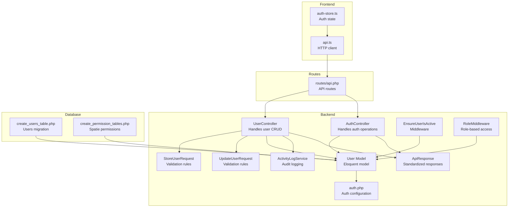
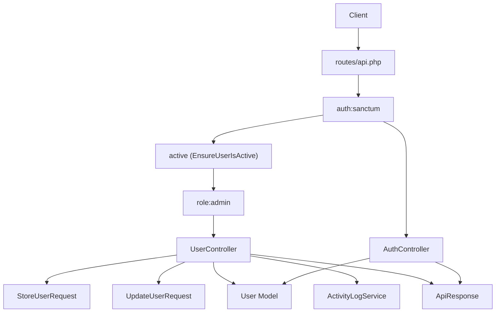
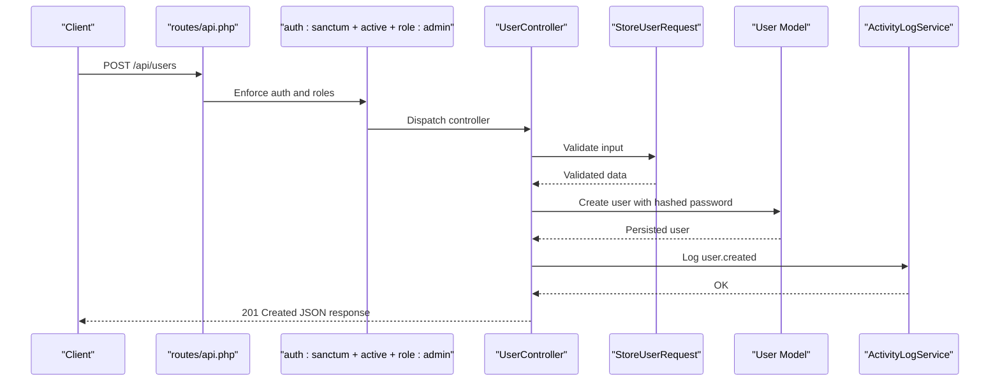
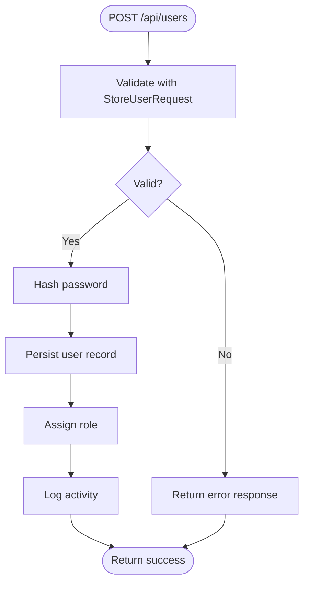
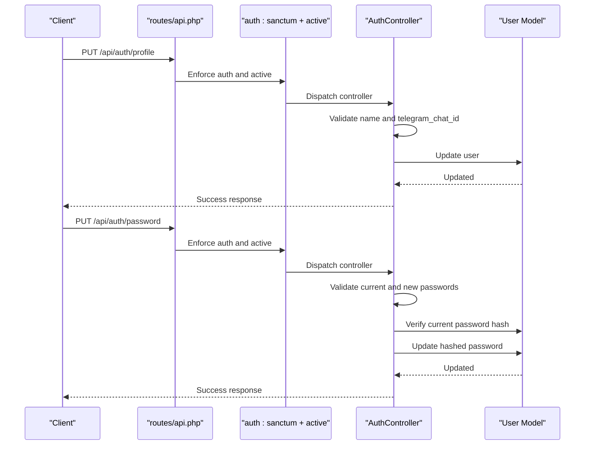
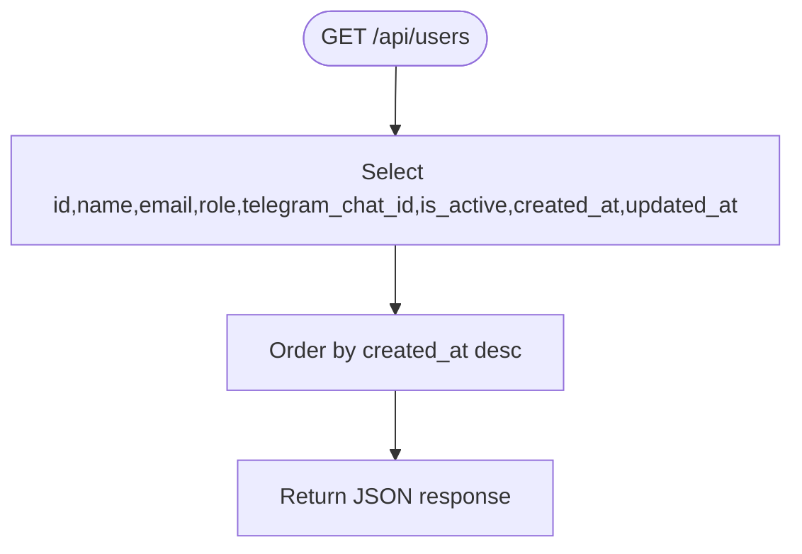
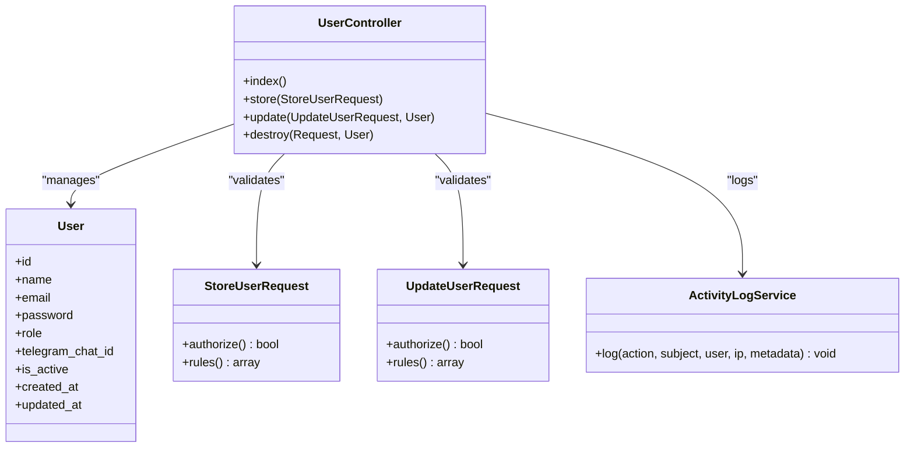
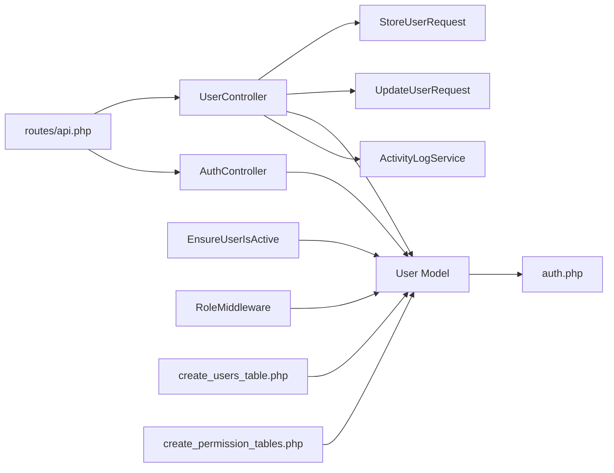

# User Administration

<cite>
**Referenced Files in This Document**
- [UserController.php](file://portal/app/Http/Controllers/Portal/UserController.php)
- [AuthController.php](file://portal/app/Http/Controllers/Auth/AuthController.php)
- [StoreUserRequest.php](file://portal/app/Http/Requests/User/StoreUserRequest.php)
- [UpdateUserRequest.php](file://portal/app/Http/Requests/User/UpdateUserRequest.php)
- [User.php](file://portal/app/Models/User.php)
- [ActivityLogService.php](file://portal/app/Services/ActivityLogService.php)
- [EnsureUserIsActive.php](file://portal/app/Http/Middleware/EnsureUserIsActive.php)
- [RoleMiddleware.php](file://portal/app/Http/Middleware/RoleMiddleware.php)
- [api.php](file://portal/routes/api.php)
- [create_users_table.php](file://portal/database/migrations/0001_01_01_000000_create_users_table.php)
- [create_permission_tables.php](file://portal/database/migrations/2026_05_15_061634_create_permission_tables.php)
- [auth.php](file://portal/config/auth.php)
- [ApiResponse.php](file://portal/app/Traits/ApiResponse.php)
- [auth-store.ts](file://portal/frontend/src/stores/auth-store.ts)
- [api.ts](file://portal/frontend/src/lib/api.ts)
</cite>

## Table of Contents
1. [Introduction](#introduction)
2. [Project Structure](#project-structure)
3. [Core Components](#core-components)
4. [Architecture Overview](#architecture-overview)
5. [Detailed Component Analysis](#detailed-component-analysis)
6. [Dependency Analysis](#dependency-analysis)
7. [Performance Considerations](#performance-considerations)
8. [Security Measures](#security-measures)
9. [Troubleshooting Guide](#troubleshooting-guide)
10. [Conclusion](#conclusion)
11. [Appendices](#appendices)

## Introduction
This document provides comprehensive documentation for the user administration functionality in the portal. It covers the complete CRUD operations for user management, including user creation, modification, and deletion. It also explains the user registration workflow, form validation rules, data sanitization processes, and the user profile management system for personal information updates and password changes. Filtering and sorting capabilities for user listing are documented, along with the user provisioning process and integration with external identity systems. Security measures such as password hashing, input validation, and protection against common attacks are explained, and examples of user management API endpoints and their usage patterns are included.

## Project Structure
The user administration feature spans backend controllers, requests, models, middleware, services, and frontend integration. The backend follows Laravel conventions with controllers handling HTTP requests, request classes validating input, models representing the data layer, and middleware enforcing authentication and authorization policies. The frontend integrates with the backend APIs using a dedicated store and API client.

**Diagram sources**
- [UserController.php:1-137](file://portal/app/Http/Controllers/Portal/UserController.php#L1-L137)
- [AuthController.php:1-135](file://portal/app/Http/Controllers/Auth/AuthController.php#L1-L135)
- [StoreUserRequest.php:1-26](file://portal/app/Http/Requests/User/StoreUserRequest.php#L1-L26)
- [UpdateUserRequest.php:1-27](file://portal/app/Http/Requests/User/UpdateUserRequest.php#L1-L27)
- [User.php:1-38](file://portal/app/Models/User.php#L1-L38)
- [ActivityLogService.php:1-50](file://portal/app/Services/ActivityLogService.php#L1-L50)
- [EnsureUserIsActive.php:1-26](file://portal/app/Http/Middleware/EnsureUserIsActive.php#L1-L26)
- [RoleMiddleware.php:1-37](file://portal/app/Http/Middleware/RoleMiddleware.php#L1-L37)
- [ApiResponse.php:1-56](file://portal/app/Traits/ApiResponse.php#L1-L56)
- [auth.php:1-118](file://portal/config/auth.php#L1-L118)
- [api.php:1-48](file://portal/routes/api.php#L1-L48)
- [create_users_table.php:1-53](file://portal/database/migrations/0001_01_01_000000_create_users_table.php#L1-L53)
- [create_permission_tables.php:1-135](file://portal/database/migrations/2026_05_15_061634_create_permission_tables.php#L1-L135)
- [api.ts](file://portal/frontend/src/lib/api.ts)
- [auth-store.ts:1-64](file://portal/frontend/src/stores/auth-store.ts#L1-L64)

**Section sources**
- [api.php:1-48](file://portal/routes/api.php#L1-L48)
- [UserController.php:1-137](file://portal/app/Http/Controllers/Portal/UserController.php#L1-L137)
- [AuthController.php:1-135](file://portal/app/Http/Controllers/Auth/AuthController.php#L1-L135)
- [User.php:1-38](file://portal/app/Models/User.php#L1-L38)
- [StoreUserRequest.php:1-26](file://portal/app/Http/Requests/User/StoreUserRequest.php#L1-L26)
- [UpdateUserRequest.php:1-27](file://portal/app/Http/Requests/User/UpdateUserRequest.php#L1-L27)
- [ActivityLogService.php:1-50](file://portal/app/Services/ActivityLogService.php#L1-L50)
- [EnsureUserIsActive.php:1-26](file://portal/app/Http/Middleware/EnsureUserIsActive.php#L1-L26)
- [RoleMiddleware.php:1-37](file://portal/app/Http/Middleware/RoleMiddleware.php#L1-L37)
- [ApiResponse.php:1-56](file://portal/app/Traits/ApiResponse.php#L1-L56)
- [auth.php:1-118](file://portal/config/auth.php#L1-L118)
- [create_users_table.php:1-53](file://portal/database/migrations/0001_01_01_000000_create_users_table.php#L1-L53)
- [create_permission_tables.php:1-135](file://portal/database/migrations/2026_05_15_061634_create_permission_tables.php#L1-L135)
- [auth-store.ts:1-64](file://portal/frontend/src/stores/auth-store.ts#L1-L64)
- [api.ts](file://portal/frontend/src/lib/api.ts)

## Core Components
- UserController: Implements user CRUD operations with request validation, password hashing, role assignment/sync, and audit logging.
- AuthController: Manages authentication lifecycle including login, logout, profile updates, and password changes.
- StoreUserRequest and UpdateUserRequest: Define strict validation rules for user creation and updates.
- User Model: Eloquent model with fillable attributes, hidden fields, and casting for secure data handling.
- ActivityLogService: Centralized service for recording user actions with fallback logging.
- Middleware: EnsureUserIsActive and RoleMiddleware enforce account activation and role-based access.
- ApiResponse Trait: Provides standardized JSON responses across controllers.
- Frontend Integration: Auth store and API client coordinate authentication and protected requests.

**Section sources**
- [UserController.php:18-135](file://portal/app/Http/Controllers/Portal/UserController.php#L18-L135)
- [AuthController.php:15-133](file://portal/app/Http/Controllers/Auth/AuthController.php#L15-L133)
- [StoreUserRequest.php:14-24](file://portal/app/Http/Requests/User/StoreUserRequest.php#L14-L24)
- [UpdateUserRequest.php:15-25](file://portal/app/Http/Requests/User/UpdateUserRequest.php#L15-L25)
- [User.php:15-36](file://portal/app/Models/User.php#L15-L36)
- [ActivityLogService.php:16-47](file://portal/app/Services/ActivityLogService.php#L16-L47)
- [EnsureUserIsActive.php:11-24](file://portal/app/Http/Middleware/EnsureUserIsActive.php#L11-L24)
- [RoleMiddleware.php:15-35](file://portal/app/Http/Middleware/RoleMiddleware.php#L15-L35)
- [ApiResponse.php:9-54](file://portal/app/Traits/ApiResponse.php#L9-L54)

## Architecture Overview
The user administration architecture follows a layered approach:
- Presentation Layer: Routes define protected endpoints guarded by Sanctum tokens and custom middleware.
- Application Layer: Controllers orchestrate business logic, delegate validation to request classes, and manage audit trails.
- Domain Layer: Eloquent model encapsulates persistence and data casting.
- Infrastructure Layer: Middleware enforces security policies; configuration files define guards and providers.

**Diagram sources**
- [api.php:10-27](file://portal/routes/api.php#L10-L27)
- [EnsureUserIsActive.php:11-24](file://portal/app/Http/Middleware/EnsureUserIsActive.php#L11-L24)
- [RoleMiddleware.php:15-35](file://portal/app/Http/Middleware/RoleMiddleware.php#L15-L35)
- [UserController.php:33-111](file://portal/app/Http/Controllers/Portal/UserController.php#L33-L111)
- [AuthController.php:18-133](file://portal/app/Http/Controllers/Auth/AuthController.php#L18-L133)
- [StoreUserRequest.php:14-24](file://portal/app/Http/Requests/User/StoreUserRequest.php#L14-L24)
- [UpdateUserRequest.php:15-25](file://portal/app/Http/Requests/User/UpdateUserRequest.php#L15-L25)
- [User.php:15-36](file://portal/app/Models/User.php#L15-L36)
- [ActivityLogService.php:16-47](file://portal/app/Services/ActivityLogService.php#L16-L47)
- [ApiResponse.php:9-54](file://portal/app/Traits/ApiResponse.php#L9-L54)

## Detailed Component Analysis

### User CRUD Operations
- Index: Retrieves a list of users ordered by creation date, returning selected fields.
- Store: Creates a new user with hashed password, assigns role, and logs activity.
- Update: Updates user attributes; conditionally hashes password; syncs roles if changed; logs activity.
- Destroy: Deletes a user with self-deletion prevention and logs activity.

**Diagram sources**
- [api.php:22](file://portal/routes/api.php#L22)
- [UserController.php:33-64](file://portal/app/Http/Controllers/Portal/UserController.php#L33-L64)
- [StoreUserRequest.php:14-24](file://portal/app/Http/Requests/User/StoreUserRequest.php#L14-L24)
- [User.php:15-36](file://portal/app/Models/User.php#L15-L36)
- [ActivityLogService.php:16-47](file://portal/app/Services/ActivityLogService.php#L16-L47)

**Section sources**
- [UserController.php:21-135](file://portal/app/Http/Controllers/Portal/UserController.php#L21-L135)
- [api.php:22](file://portal/routes/api.php#L22)

### User Registration Workflow and Validation
- Registration is performed via the store endpoint with validation rules ensuring:
  - Name: required, string, max length.
  - Email: required, valid email, unique.
  - Password: required, minimum length.
  - Role: required, restricted to predefined values.
  - Optional fields: is_active (boolean), telegram_chat_id (nullable string).
- On successful validation, the password is hashed before persistence.

**Diagram sources**
- [StoreUserRequest.php:14-24](file://portal/app/Http/Requests/User/StoreUserRequest.php#L14-L24)
- [UserController.php:35-45](file://portal/app/Http/Controllers/Portal/UserController.php#L35-L45)
- [ActivityLogService.php:16-47](file://portal/app/Services/ActivityLogService.php#L16-L47)

**Section sources**
- [StoreUserRequest.php:14-24](file://portal/app/Http/Requests/User/StoreUserRequest.php#L14-L24)
- [UserController.php:33-64](file://portal/app/Http/Controllers/Portal/UserController.php#L33-L64)

### User Profile Management
- Personal Information Updates: Accessible to all authenticated users via the profile endpoint.
- Password Changes: Requires current password verification and enforces minimum length and confirmation.
- Account Activation/Deactivation: Controlled by the is_active flag enforced by middleware.

**Diagram sources**
- [api.php:14-15](file://portal/routes/api.php#L14-L15)
- [AuthController.php:90-133](file://portal/app/Http/Controllers/Auth/AuthController.php#L90-L133)
- [User.php:24-36](file://portal/app/Models/User.php#L24-L36)

**Section sources**
- [AuthController.php:87-133](file://portal/app/Http/Controllers/Auth/AuthController.php#L87-L133)
- [EnsureUserIsActive.php:11-24](file://portal/app/Http/Middleware/EnsureUserIsActive.php#L11-L24)

### User Listing and Search Functionality
- Listing: The index endpoint retrieves users ordered by creation date, selecting essential fields.
- Filtering and Sorting: The current implementation sorts by creation date descending; no explicit filtering or advanced sorting is present in the index method.

**Diagram sources**
- [UserController.php:21-28](file://portal/app/Http/Controllers/Portal/UserController.php#L21-L28)

**Section sources**
- [UserController.php:21-28](file://portal/app/Http/Controllers/Portal/UserController.php#L21-L28)

### User Provisioning and Identity Integration
- Role Management: Uses Spatie permissions to assign and sync roles during creation and updates.
- Token-based Authentication: Sanctum tokens are issued upon login and revoked on logout; middleware ensures active accounts.
- External Identity Systems: No direct integration with external identity providers is implemented in the referenced files.

**Diagram sources**
- [User.php:11-36](file://portal/app/Models/User.php#L11-L36)
- [UserController.php:14-135](file://portal/app/Http/Controllers/Portal/UserController.php#L14-L135)
- [StoreUserRequest.php:7-24](file://portal/app/Http/Requests/User/StoreUserRequest.php#L7-L24)
- [UpdateUserRequest.php:8-25](file://portal/app/Http/Requests/User/UpdateUserRequest.php#L8-L25)
- [ActivityLogService.php:11-48](file://portal/app/Services/ActivityLogService.php#L11-L48)

**Section sources**
- [UserController.php:44-93](file://portal/app/Http/Controllers/Portal/UserController.php#L44-L93)
- [create_permission_tables.php:12-117](file://portal/database/migrations/2026_05_15_061634_create_permission_tables.php#L12-L117)

## Dependency Analysis
- Controllers depend on request classes for validation, on the User model for persistence, and on ActivityLogService for auditing.
- Middleware depends on the User model to check activation status and roles.
- Routes define the dependency chain from HTTP endpoints to controllers and middleware.
- Database migrations define the schema and relationships for users and permissions.

**Diagram sources**
- [api.php:10-27](file://portal/routes/api.php#L10-L27)
- [UserController.php:33-111](file://portal/app/Http/Controllers/Portal/UserController.php#L33-L111)
- [AuthController.php:18-133](file://portal/app/Http/Controllers/Auth/AuthController.php#L18-L133)
- [StoreUserRequest.php:14-24](file://portal/app/Http/Requests/User/StoreUserRequest.php#L14-L24)
- [UpdateUserRequest.php:15-25](file://portal/app/Http/Requests/User/UpdateUserRequest.php#L15-L25)
- [User.php:15-36](file://portal/app/Models/User.php#L15-L36)
- [ActivityLogService.php:16-47](file://portal/app/Services/ActivityLogService.php#L16-L47)
- [EnsureUserIsActive.php:11-24](file://portal/app/Http/Middleware/EnsureUserIsActive.php#L11-L24)
- [RoleMiddleware.php:15-35](file://portal/app/Http/Middleware/RoleMiddleware.php#L15-L35)
- [auth.php:64-74](file://portal/config/auth.php#L64-L74)
- [create_users_table.php:14-25](file://portal/database/migrations/0001_01_01_000000_create_users_table.php#L14-L25)
- [create_permission_tables.php:12-117](file://portal/database/migrations/2026_05_15_061634_create_permission_tables.php#L12-L117)

**Section sources**
- [api.php:10-27](file://portal/routes/api.php#L10-L27)
- [User.php:15-36](file://portal/app/Models/User.php#L15-L36)
- [auth.php:64-74](file://portal/config/auth.php#L64-L74)
- [create_users_table.php:14-25](file://portal/database/migrations/0001_01_01_000000_create_users_table.php#L14-L25)
- [create_permission_tables.php:12-117](file://portal/database/migrations/2026_05_15_061634_create_permission_tables.php#L12-L117)

## Performance Considerations
- Prefer selective field retrieval in listing operations to reduce payload size.
- Use pagination for large datasets when extending the index endpoint.
- Minimize repeated role assignments; sync roles only when the role value changes.
- Ensure database indexes exist on frequently queried columns (e.g., email uniqueness).
- Cache role and permission lookups where appropriate to reduce overhead.

## Security Measures
- Password Hashing: Passwords are hashed using a secure hashing mechanism before persistence.
- Input Validation: Strict validation rules prevent malformed or malicious inputs.
- Token-based Authentication: Sanctum tokens are used; tokens are revoked on logout and when accounts are deactivated.
- Role-based Access Control: Admin-only endpoints are protected by role middleware.
- Account Activation Enforcement: Middleware checks the is_active flag and revokes tokens for deactivated accounts.
- Audit Logging: All user-related actions are logged with metadata for traceability.

**Section sources**
- [User.php:24-36](file://portal/app/Models/User.php#L24-L36)
- [StoreUserRequest.php:14-24](file://portal/app/Http/Requests/User/StoreUserRequest.php#L14-L24)
- [UpdateUserRequest.php:15-25](file://portal/app/Http/Requests/User/UpdateUserRequest.php#L15-L25)
- [AuthController.php:37-41](file://portal/app/Http/Controllers/Auth/AuthController.php#L37-L41)
- [EnsureUserIsActive.php:13-20](file://portal/app/Http/Middleware/EnsureUserIsActive.php#L13-L20)
- [RoleMiddleware.php:19-32](file://portal/app/Http/Middleware/RoleMiddleware.php#L19-L32)
- [ActivityLogService.php:16-47](file://portal/app/Services/ActivityLogService.php#L16-L47)

## Troubleshooting Guide
- Login Failures: Incorrect credentials trigger validation exceptions; deactivated accounts receive a forbidden response.
- Deactivated Accounts: Middleware revokes tokens and blocks access with a 403 response.
- Role Access Denied: Non-admin users attempting admin-only endpoints receive a 403 response.
- Self-Deletion Prevention: Attempting to delete one’s own account results in a 400 error.
- Validation Errors: Request classes return structured validation messages for invalid inputs.

**Section sources**
- [AuthController.php:27-35](file://portal/app/Http/Controllers/Auth/AuthController.php#L27-L35)
- [EnsureUserIsActive.php:13-20](file://portal/app/Http/Middleware/EnsureUserIsActive.php#L13-L20)
- [RoleMiddleware.php:19-32](file://portal/app/Http/Middleware/RoleMiddleware.php#L19-L32)
- [UserController.php:120-122](file://portal/app/Http/Controllers/Portal/UserController.php#L120-L122)
- [StoreUserRequest.php:14-24](file://portal/app/Http/Requests/User/StoreUserRequest.php#L14-L24)
- [UpdateUserRequest.php:15-25](file://portal/app/Http/Requests/User/UpdateUserRequest.php#L15-L25)

## Conclusion
The user administration functionality is built around secure, validated, and audited operations. It leverages Laravel’s request validation, Sanctum tokens, and Spatie permissions to provide robust user management. The design emphasizes clear separation of concerns, standardized responses, and comprehensive logging for accountability. Extending the system with advanced filtering, sorting, and external identity integration would further enhance its capabilities while maintaining the established security and validation patterns.

## Appendices

### API Endpoints Overview
- Authentication
  - POST /api/auth/login: Authenticate and issue token.
  - POST /api/auth/logout: Revoke current token.
  - GET /api/auth/me: Retrieve authenticated user profile.
  - PUT /api/auth/profile: Update profile (name, telegram_chat_id).
  - PUT /api/auth/password: Change password with current password verification.
- User Management (Admin only)
  - GET /api/users: List users (selected fields, sorted by created_at desc).
  - POST /api/users: Create user (requires role, email uniqueness, password policy).
  - PUT /api/users/{user}: Update user (optional password, role sync).
  - DELETE /api/users/{user}: Delete user (self-protection enforced).

**Section sources**
- [api.php:10-27](file://portal/routes/api.php#L10-L27)
- [AuthController.php:18-133](file://portal/app/Http/Controllers/Auth/AuthController.php#L18-L133)
- [UserController.php:21-135](file://portal/app/Http/Controllers/Portal/UserController.php#L21-L135)

### Frontend Integration Notes
- The frontend uses a Zustand store to manage authentication state and persists tokens locally.
- API calls are made through a centralized client configured with base URLs and headers.
- Protected routes are accessed after successful login; the store hydrates user data on startup.

**Section sources**
- [auth-store.ts:17-63](file://portal/frontend/src/stores/auth-store.ts#L17-L63)
- [api.ts](file://portal/frontend/src/lib/api.ts)