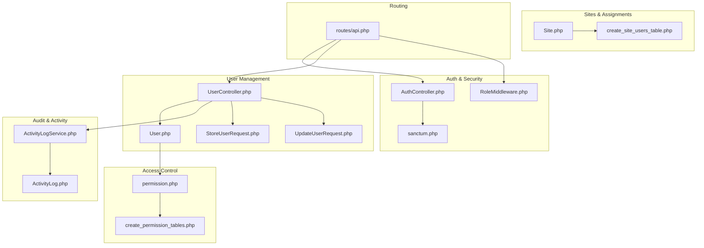
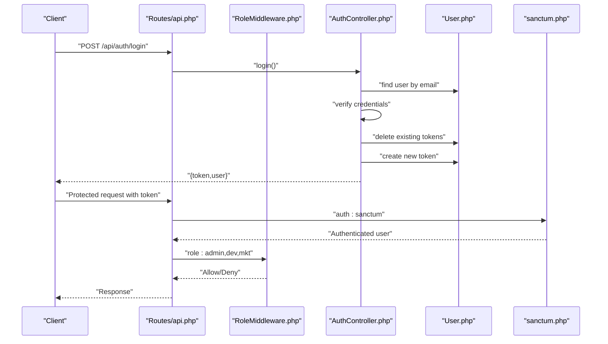
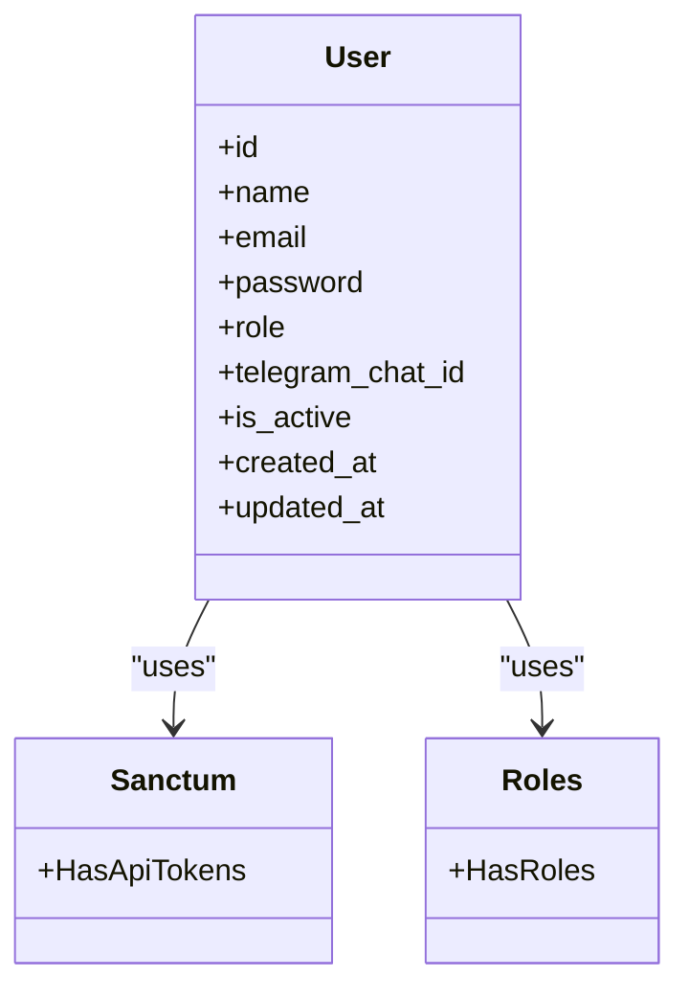
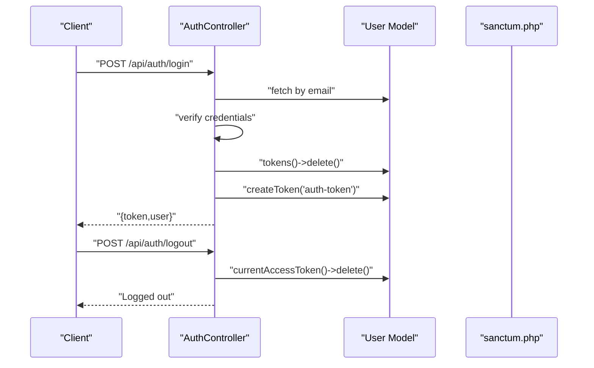
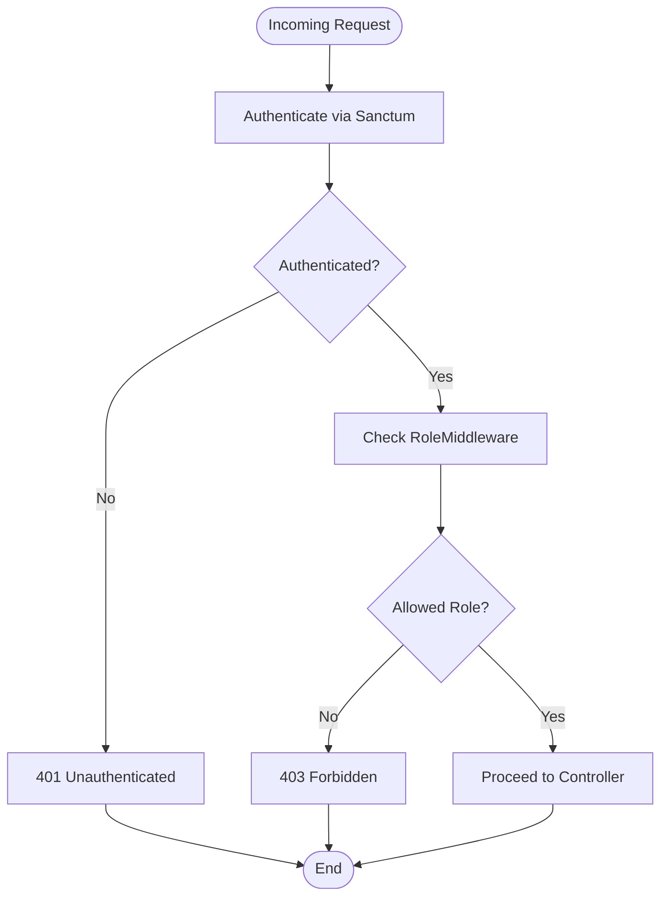
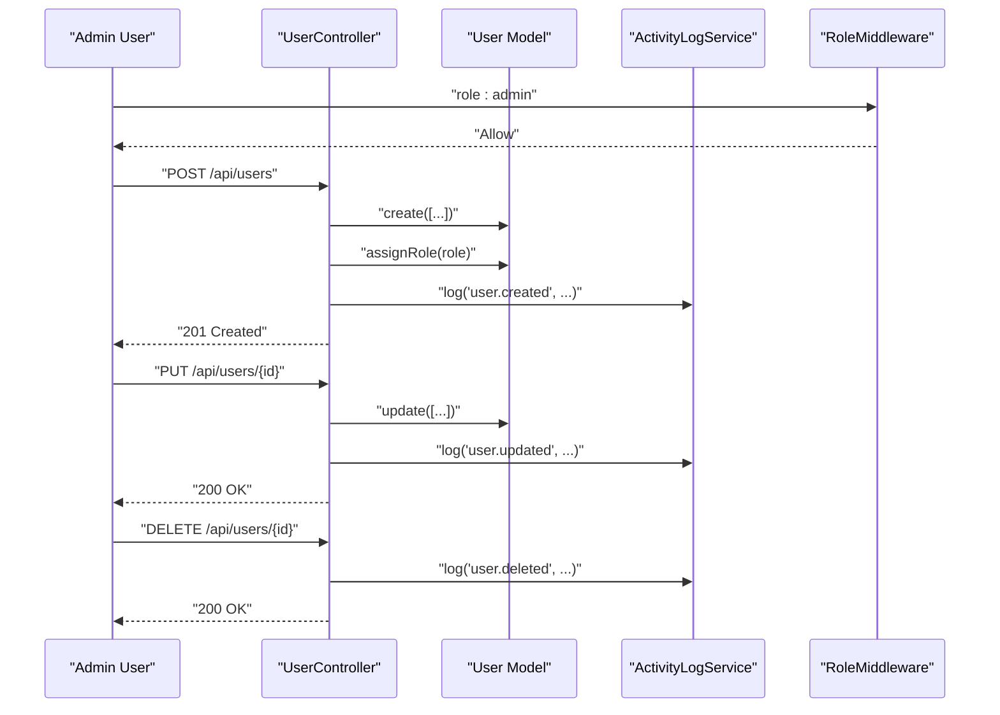
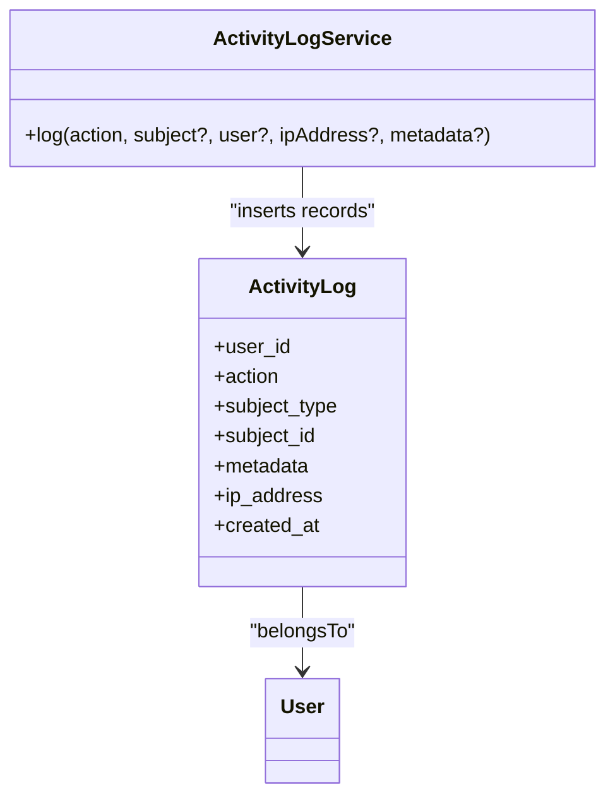
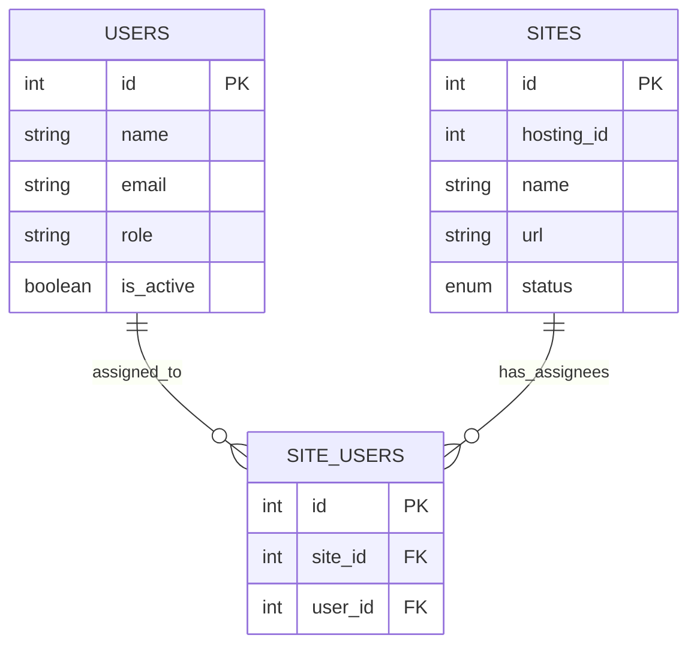
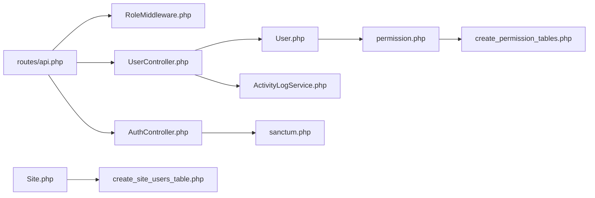

# User Management

<cite>
**Referenced Files in This Document**
- [User.php](file://portal/app/Models/User.php)
- [UserController.php](file://portal/app/Http/Controllers/Portal/UserController.php)
- [permission.php](file://portal/config/permission.php)
- [sanctum.php](file://portal/config/sanctum.php)
- [RoleMiddleware.php](file://portal/app/Http/Middleware/RoleMiddleware.php)
- [create_users_table.php](file://portal/database/migrations/0001_01_01_000000_create_users_table.php)
- [create_permission_tables.php](file://portal/database/migrations/2026_05_15_061634_create_permission_tables.php)
- [create_site_users_table.php](file://portal/database/migrations/2026_05_15_070003_create_site_users_table.php)
- [ActivityLogService.php](file://portal/app/Services/ActivityLogService.php)
- [ActivityLog.php](file://portal/app/Models/ActivityLog.php)
- [AuthController.php](file://portal/app/Http/Controllers/Auth/AuthController.php)
- [StoreUserRequest.php](file://portal/app/Http/Requests/User/StoreUserRequest.php)
- [UpdateUserRequest.php](file://portal/app/Http/Requests/User/UpdateUserRequest.php)
- [Site.php](file://portal/app/Models/Site.php)
- [api.php](file://portal/routes/api.php)
</cite>

## Table of Contents
1. [Introduction](#introduction)
2. [Project Structure](#project-structure)
3. [Core Components](#core-components)
4. [Architecture Overview](#architecture-overview)
5. [Detailed Component Analysis](#detailed-component-analysis)
6. [Dependency Analysis](#dependency-analysis)
7. [Performance Considerations](#performance-considerations)
8. [Troubleshooting Guide](#troubleshooting-guide)
9. [Conclusion](#conclusion)
10. [Appendices](#appendices)

## Introduction
This document describes the user management system, focusing on user administration, role-based access control (RBAC), authentication and session management with Laravel Sanctum, user provisioning and external identity integration, activity tracking and audit, onboarding and security policies, and the relationship between users and sites across multiple WordPress hosting environments. It synthesizes the backend implementation in the Laravel application and highlights how frontend and middleware enforce access control.

## Project Structure
The user management system spans models, controllers, middleware, requests, migrations, configuration, and routes. The following diagram maps the primary components involved in user administration and RBAC.

**Diagram sources**
- [AuthController.php:1-135](file://portal/app/Http/Controllers/Auth/AuthController.php#L1-L135)
- [sanctum.php:1-88](file://portal/config/sanctum.php#L1-L88)
- [RoleMiddleware.php:1-37](file://portal/app/Http/Middleware/RoleMiddleware.php#L1-L37)
- [UserController.php:1-137](file://portal/app/Http/Controllers/Portal/UserController.php#L1-L137)
- [User.php:1-38](file://portal/app/Models/User.php#L1-L38)
- [StoreUserRequest.php:1-26](file://portal/app/Http/Requests/User/StoreUserRequest.php#L1-L26)
- [UpdateUserRequest.php:1-27](file://portal/app/Http/Requests/User/UpdateUserRequest.php#L1-L27)
- [permission.php:1-207](file://portal/config/permission.php#L1-L207)
- [create_permission_tables.php:1-135](file://portal/database/migrations/2026_05_15_061634_create_permission_tables.php#L1-L135)
- [ActivityLogService.php:1-50](file://portal/app/Services/ActivityLogService.php#L1-L50)
- [ActivityLog.php:1-37](file://portal/app/Models/ActivityLog.php#L1-L37)
- [Site.php:1-76](file://portal/app/Models/Site.php#L1-L76)
- [create_site_users_table.php:1-25](file://portal/database/migrations/2026_05_15_070003_create_site_users_table.php#L1-L25)
- [api.php:1-48](file://portal/routes/api.php#L1-L48)

**Section sources**
- [api.php:1-48](file://portal/routes/api.php#L1-L48)
- [User.php:1-38](file://portal/app/Models/User.php#L1-L38)
- [UserController.php:1-137](file://portal/app/Http/Controllers/Portal/UserController.php#L1-L137)
- [AuthController.php:1-135](file://portal/app/Http/Controllers/Auth/AuthController.php#L1-L135)
- [permission.php:1-207](file://portal/config/permission.php#L1-L207)
- [create_permission_tables.php:1-135](file://portal/database/migrations/2026_05_15_061634_create_permission_tables.php#L1-L135)
- [create_users_table.php:1-53](file://portal/database/migrations/0001_01_01_000000_create_users_table.php#L1-L53)
- [create_site_users_table.php:1-25](file://portal/database/migrations/2026_05_15_070003_create_site_users_table.php#L1-L25)
- [ActivityLogService.php:1-50](file://portal/app/Services/ActivityLogService.php#L1-L50)
- [ActivityLog.php:1-37](file://portal/app/Models/ActivityLog.php#L1-L37)
- [RoleMiddleware.php:1-37](file://portal/app/Http/Middleware/RoleMiddleware.php#L1-L37)
- [StoreUserRequest.php:1-26](file://portal/app/Http/Requests/User/StoreUserRequest.php#L1-L26)
- [UpdateUserRequest.php:1-27](file://portal/app/Http/Requests/User/UpdateUserRequest.php#L1-L27)
- [sanctum.php:1-88](file://portal/config/sanctum.php#L1-L88)
- [Site.php:1-76](file://portal/app/Models/Site.php#L1-L76)

## Core Components
- User model with Sanctum API tokens, Spatie roles, and sensitive field casting.
- Authentication controller implementing login, logout, profile update, and password change with token lifecycle management.
- User controller for listing, creating, updating, and deleting users, with activity logging and role synchronization.
- Role-based middleware enforcing role gates per route.
- Spatie permission/role configuration and migrations supporting RBAC.
- Activity logging service and model capturing actions, subjects, and metadata.
- Site model with user assignments and scoping for role-based visibility.
- Request validators for user creation and updates.

**Section sources**
- [User.php:1-38](file://portal/app/Models/User.php#L1-L38)
- [AuthController.php:1-135](file://portal/app/Http/Controllers/Auth/AuthController.php#L1-L135)
- [UserController.php:1-137](file://portal/app/Http/Controllers/Portal/UserController.php#L1-L137)
- [RoleMiddleware.php:1-37](file://portal/app/Http/Middleware/RoleMiddleware.php#L1-L37)
- [permission.php:1-207](file://portal/config/permission.php#L1-L207)
- [create_permission_tables.php:1-135](file://portal/database/migrations/2026_05_15_061634_create_permission_tables.php#L1-L135)
- [ActivityLogService.php:1-50](file://portal/app/Services/ActivityLogService.php#L1-L50)
- [ActivityLog.php:1-37](file://portal/app/Models/ActivityLog.php#L1-L37)
- [Site.php:1-76](file://portal/app/Models/Site.php#L1-L76)
- [StoreUserRequest.php:1-26](file://portal/app/Http/Requests/User/StoreUserRequest.php#L1-L26)
- [UpdateUserRequest.php:1-27](file://portal/app/Http/Requests/User/UpdateUserRequest.php#L1-L27)

## Architecture Overview
The system enforces authentication via Laravel Sanctum and authorization via a hybrid approach:
- Sanctum manages session and token-based authentication for the SPA/API.
- A lightweight role column on the User model is enforced by RoleMiddleware for coarse-grained access control.
- Spatie permissions/roles are configured for fine-grained permission checks elsewhere in the system, complementing the role column.

**Diagram sources**
- [api.php:1-48](file://portal/routes/api.php#L1-L48)
- [RoleMiddleware.php:1-37](file://portal/app/Http/Middleware/RoleMiddleware.php#L1-L37)
- [AuthController.php:1-135](file://portal/app/Http/Controllers/Auth/AuthController.php#L1-L135)
- [User.php:1-38](file://portal/app/Models/User.php#L1-L38)
- [sanctum.php:1-88](file://portal/config/sanctum.php#L1-L88)

## Detailed Component Analysis

### User Model and Authentication Tokens
- The User model integrates Sanctum tokens, factory, notifications, and Spatie roles.
- Fillable attributes include name, email, password, role, telegram_chat_id, and is_active.
- Hidden attributes exclude password and remember tokens.
- Casts ensure password hashing and boolean normalization.

**Diagram sources**
- [User.php:1-38](file://portal/app/Models/User.php#L1-L38)

**Section sources**
- [User.php:1-38](file://portal/app/Models/User.php#L1-L38)

### Authentication and Session Management (Sanctum)
- Login validates credentials, deactivates inactive accounts, revokes previous tokens, and issues a new plain-text token.
- Logout deletes the current access token.
- Profile update and password change endpoints enforce validation and credential checks.
- Sanctum configuration defines stateful domains, guard, expiration, token prefix, and middleware stack.

**Diagram sources**
- [AuthController.php:1-135](file://portal/app/Http/Controllers/Auth/AuthController.php#L1-L135)
- [sanctum.php:1-88](file://portal/config/sanctum.php#L1-L88)

**Section sources**
- [AuthController.php:1-135](file://portal/app/Http/Controllers/Auth/AuthController.php#L1-L135)
- [sanctum.php:1-88](file://portal/config/sanctum.php#L1-L88)

### Role-Based Access Control (RBAC)
- Roles are defined as enum values on the User model and enforced by RoleMiddleware.
- Routes group endpoints by roles: admin-only, admin+dev, and read-only access for all authenticated users.
- Spatie permission/role configuration and migrations support advanced permission sets and caching.

**Diagram sources**
- [RoleMiddleware.php:1-37](file://portal/app/Http/Middleware/RoleMiddleware.php#L1-L37)
- [api.php:1-48](file://portal/routes/api.php#L1-L48)

**Section sources**
- [RoleMiddleware.php:1-37](file://portal/app/Http/Middleware/RoleMiddleware.php#L1-L37)
- [api.php:1-48](file://portal/routes/api.php#L1-L48)
- [permission.php:1-207](file://portal/config/permission.php#L1-L207)
- [create_permission_tables.php:1-135](file://portal/database/migrations/2026_05_15_061634_create_permission_tables.php#L1-L135)

### User Administration (CRUD)
- Listing users with selected fields and descending creation date.
- Creating users with hashed passwords, role assignment via Spatie, and activity logging.
- Updating users, conditionally hashing new passwords, role synchronization, and activity logging.
- Deleting users with protection against self-deletion and audit logging.

**Diagram sources**
- [UserController.php:1-137](file://portal/app/Http/Controllers/Portal/UserController.php#L1-L137)
- [ActivityLogService.php:1-50](file://portal/app/Services/ActivityLogService.php#L1-L50)
- [User.php:1-38](file://portal/app/Models/User.php#L1-L38)

**Section sources**
- [UserController.php:1-137](file://portal/app/Http/Controllers/Portal/UserController.php#L1-L137)
- [StoreUserRequest.php:1-26](file://portal/app/Http/Requests/User/StoreUserRequest.php#L1-L26)
- [UpdateUserRequest.php:1-27](file://portal/app/Http/Requests/User/UpdateUserRequest.php#L1-L27)
- [ActivityLogService.php:1-50](file://portal/app/Services/ActivityLogService.php#L1-L50)

### User Provisioning and External Identity Integration
- Provisioning workflow: create user with validated inputs, assign role, log creation, and notify via optional channels.
- External identity integration: the system does not implement an external identity provider connector in the reviewed files; authentication relies on local credentials and Sanctum tokens.

[No sources needed since this section provides general guidance]

### User Activity Tracking and Audit
- ActivityLogService writes structured entries with action, user_id, IP address, subject type/id, and metadata.
- When the activity_logs table exists, entries are inserted; otherwise, logs are written to the default logger.
- ActivityLog model supports polymorphic subject relations and belongs to the user who performed the action.

**Diagram sources**
- [ActivityLogService.php:1-50](file://portal/app/Services/ActivityLogService.php#L1-L50)
- [ActivityLog.php:1-37](file://portal/app/Models/ActivityLog.php#L1-L37)
- [User.php:1-38](file://portal/app/Models/User.php#L1-L38)

**Section sources**
- [ActivityLogService.php:1-50](file://portal/app/Services/ActivityLogService.php#L1-L50)
- [ActivityLog.php:1-37](file://portal/app/Models/ActivityLog.php#L1-L37)

### User Onboarding, Password Policies, and Security Measures
- Onboarding: new users are created with a minimum password length and role assignment; activity logs capture creation.
- Password policies: password change enforces minimum length and confirmation; login validates credentials and blocks deactivated accounts.
- Security measures: password hashing, token revocation on login, CSRF and cookie encryption middleware for Sanctum, and strict request validation.

**Section sources**
- [StoreUserRequest.php:1-26](file://portal/app/Http/Requests/User/StoreUserRequest.php#L1-L26)
- [UpdateUserRequest.php:1-27](file://portal/app/Http/Requests/User/UpdateUserRequest.php#L1-L27)
- [AuthController.php:1-135](file://portal/app/Http/Controllers/Auth/AuthController.php#L1-L135)
- [sanctum.php:1-88](file://portal/config/sanctum.php#L1-L88)

### Relationship Between Users and Sites
- Users are assigned to sites via a many-to-many relationship tracked by the site_users pivot table.
- Site model scopes queries to show all sites for admins and only assigned sites for dev/mkt users.
- This enables role-based visibility and delegated access across multiple WordPress sites and hosting environments.

**Diagram sources**
- [create_site_users_table.php:1-25](file://portal/database/migrations/2026_05_15_070003_create_site_users_table.php#L1-L25)
- [Site.php:1-76](file://portal/app/Models/Site.php#L1-L76)
- [create_users_table.php:1-53](file://portal/database/migrations/0001_01_01_000000_create_users_table.php#L1-L53)

**Section sources**
- [Site.php:1-76](file://portal/app/Models/Site.php#L1-L76)
- [create_site_users_table.php:1-25](file://portal/database/migrations/2026_05_15_070003_create_site_users_table.php#L1-L25)
- [create_users_table.php:1-53](file://portal/database/migrations/0001_01_01_000000_create_users_table.php#L1-L53)

## Dependency Analysis
- Controllers depend on models, requests, services, and middleware.
- User model depends on Sanctum and Spatie traits.
- Routes define layered middleware: auth:sanctum, active, role.
- Activity logging is decoupled via a service that persists to database or falls back to logs.

**Diagram sources**
- [api.php:1-48](file://portal/routes/api.php#L1-L48)
- [RoleMiddleware.php:1-37](file://portal/app/Http/Middleware/RoleMiddleware.php#L1-L37)
- [AuthController.php:1-135](file://portal/app/Http/Controllers/Auth/AuthController.php#L1-L135)
- [UserController.php:1-137](file://portal/app/Http/Controllers/Portal/UserController.php#L1-L137)
- [User.php:1-38](file://portal/app/Models/User.php#L1-L38)
- [ActivityLogService.php:1-50](file://portal/app/Services/ActivityLogService.php#L1-L50)
- [sanctum.php:1-88](file://portal/config/sanctum.php#L1-L88)
- [permission.php:1-207](file://portal/config/permission.php#L1-L207)
- [create_permission_tables.php:1-135](file://portal/database/migrations/2026_05_15_061634_create_permission_tables.php#L1-L135)
- [Site.php:1-76](file://portal/app/Models/Site.php#L1-L76)
- [create_site_users_table.php:1-25](file://portal/database/migrations/2026_05_15_070003_create_site_users_table.php#L1-L25)

**Section sources**
- [api.php:1-48](file://portal/routes/api.php#L1-L48)
- [User.php:1-38](file://portal/app/Models/User.php#L1-L38)
- [UserController.php:1-137](file://portal/app/Http/Controllers/Portal/UserController.php#L1-L137)
- [AuthController.php:1-135](file://portal/app/Http/Controllers/Auth/AuthController.php#L1-L135)
- [permission.php:1-207](file://portal/config/permission.php#L1-L207)
- [create_permission_tables.php:1-135](file://portal/database/migrations/2026_05_15_061634_create_permission_tables.php#L1-L135)
- [create_site_users_table.php:1-25](file://portal/database/migrations/2026_05_15_070003_create_site_users_table.php#L1-L25)
- [ActivityLogService.php:1-50](file://portal/app/Services/ActivityLogService.php#L1-L50)
- [RoleMiddleware.php:1-37](file://portal/app/Http/Middleware/RoleMiddleware.php#L1-L37)
- [sanctum.php:1-88](file://portal/config/sanctum.php#L1-L88)
- [Site.php:1-76](file://portal/app/Models/Site.php#L1-L76)

## Performance Considerations
- Sanctum token caching and middleware overhead are minimal for SPA-first flows.
- Spatie permission caching is configured with a 24-hour expiration; ensure cache invalidation on role/permission changes.
- Activity logging writes are synchronous; consider asynchronous jobs for high-volume audit trails.
- Database indexing on pivot tables and foreign keys supports efficient joins for user-site assignments.

[No sources needed since this section provides general guidance]

## Troubleshooting Guide
- Authentication failures: verify Sanctum stateful domains and token issuance; confirm user is active and credentials are correct.
- Authorization failures: ensure RoleMiddleware roles match the requested endpoint and user role column.
- Activity logging missing: confirm activity_logs table exists or fallback logging is enabled.
- Role synchronization: after role updates, ensure Spatie role sync occurs and caches are refreshed.

**Section sources**
- [AuthController.php:1-135](file://portal/app/Http/Controllers/Auth/AuthController.php#L1-L135)
- [RoleMiddleware.php:1-37](file://portal/app/Http/Middleware/RoleMiddleware.php#L1-L37)
- [ActivityLogService.php:1-50](file://portal/app/Services/ActivityLogService.php#L1-L50)
- [permission.php:1-207](file://portal/config/permission.php#L1-L207)

## Conclusion
The user management system combines Sanctum-based authentication, a simple role column with middleware enforcement, and Spatie permissions/roles for granular control. It provides robust user administration, activity auditing, and user-site assignment scoping across multiple WordPress environments. Extending external identity integration and asynchronous audit logging would further strengthen the platform.

## Appendices
- Roles and permissions: admin, dev, mkt; route-level enforcement via role middleware; Spatie permission/role configuration available for advanced use cases.
- User fields: name, email, role, telegram_chat_id, is_active; password stored securely with hashing.
- Site assignment: many-to-many via site_users pivot; visibility scoped by role.

[No sources needed since this section provides general guidance]