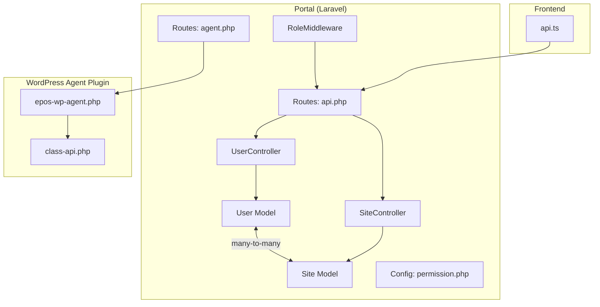
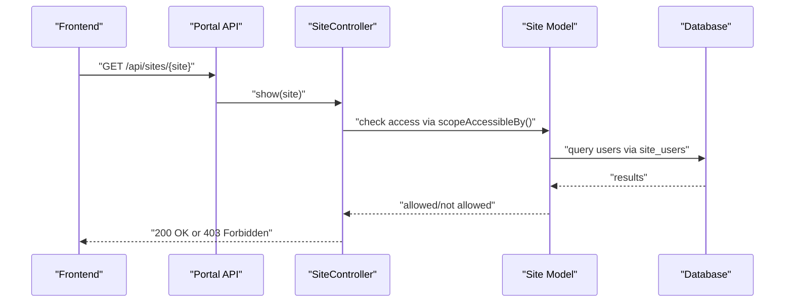
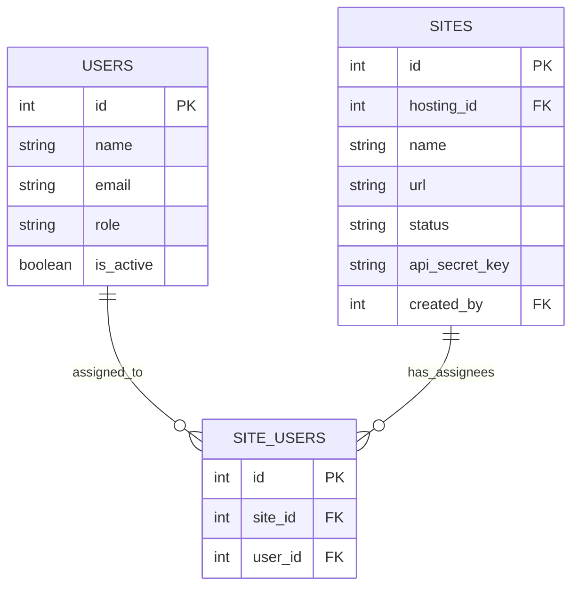
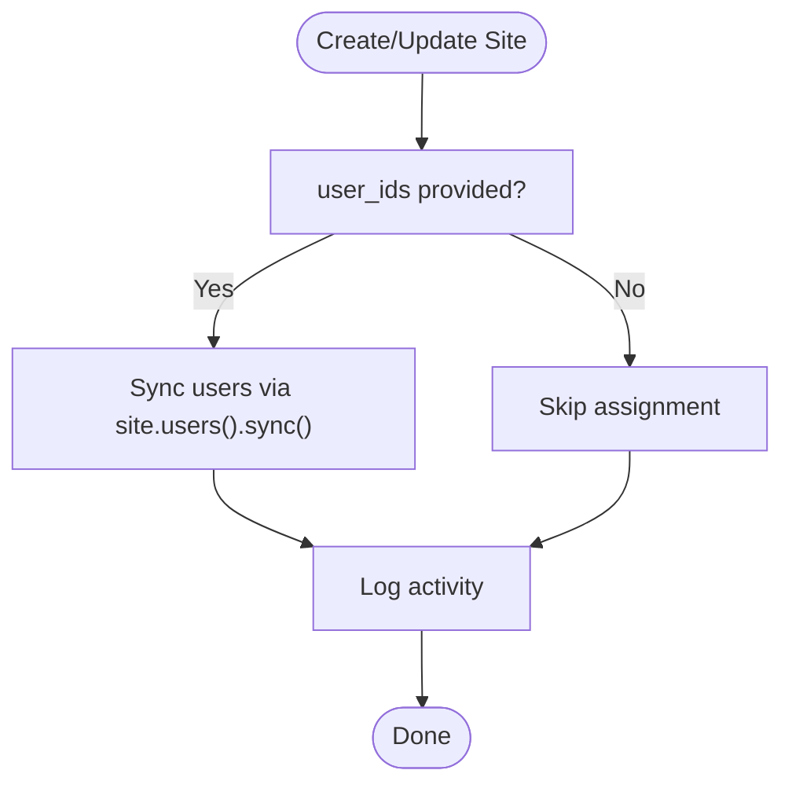
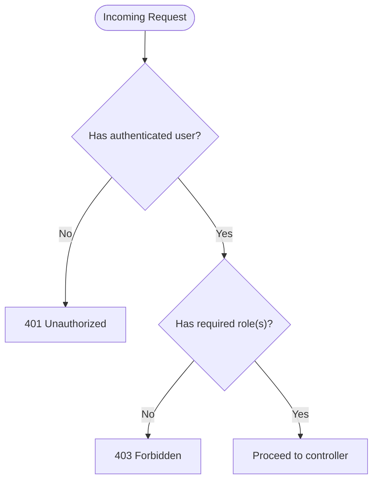
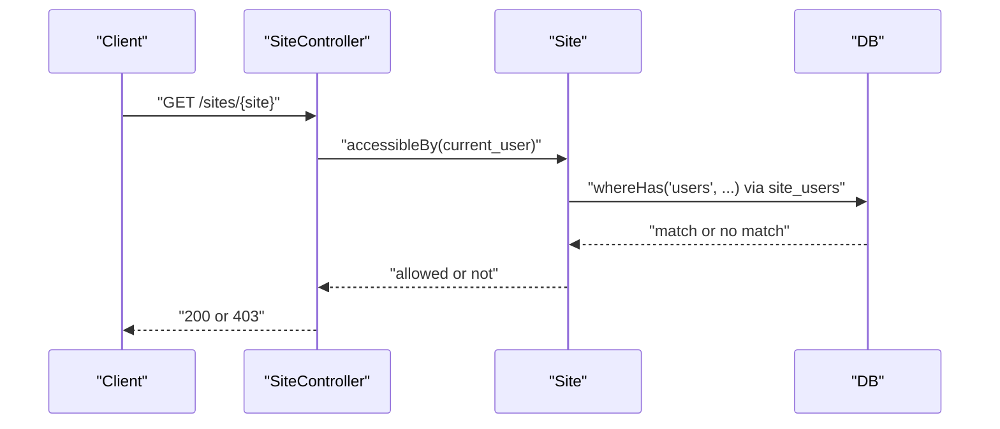
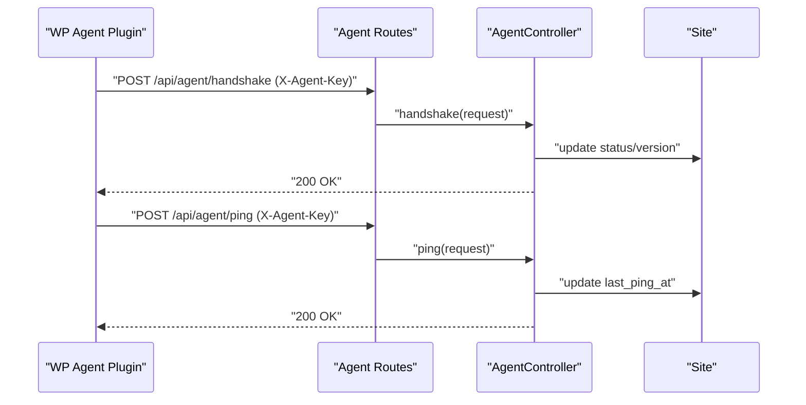
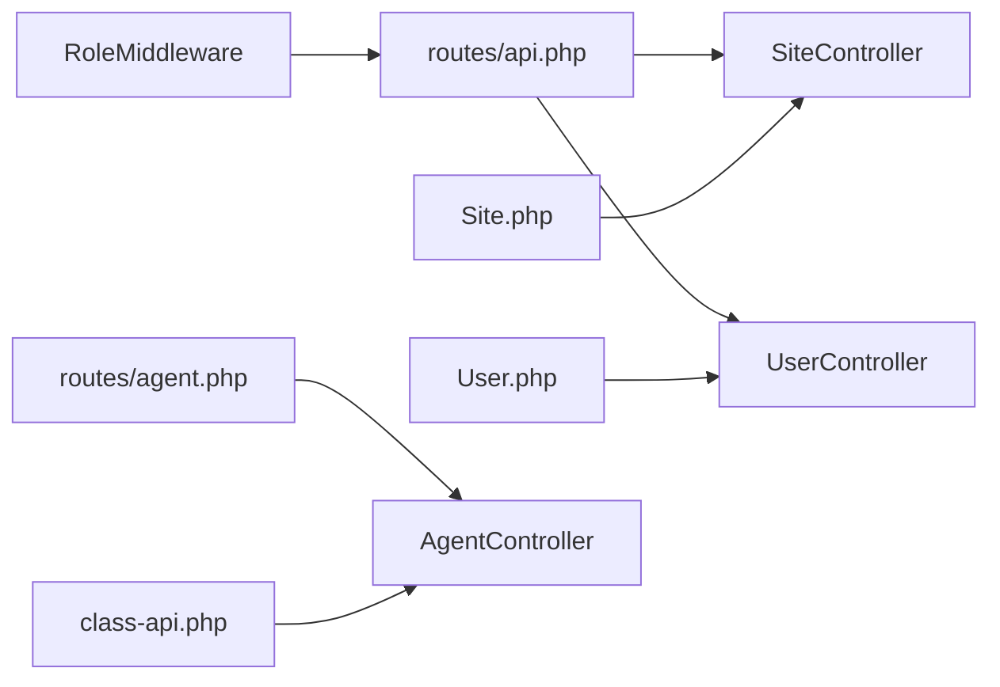

# User-Sites Permissions

<cite>
**Referenced Files in This Document**
- [2026_05_15_070003_create_site_users_table.php](file://portal/database/migrations/2026_05_15_070003_create_site_users_table.php)
- [2026_05_15_061634_create_permission_tables.php](file://portal/database/migrations/2026_05_15_061634_create_permission_tables.php)
- [User.php](file://portal/app/Models/User.php)
- [Site.php](file://portal/app/Models/Site.php)
- [Hosting.php](file://portal/app/Models/Hosting.php)
- [UserController.php](file://portal/app/Http/Controllers/Portal/UserController.php)
- [SiteController.php](file://portal/app/Http/Controllers/Portal/SiteController.php)
- [AgentController.php](file://portal/app/Http/Controllers/Agent/AgentController.php)
- [RoleMiddleware.php](file://portal/app/Http/Middleware/RoleMiddleware.php)
- [permission.php](file://portal/config/permission.php)
- [api.php](file://portal/routes/api.php)
- [agent.php](file://portal/routes/agent.php)
- [epos-wp-agent.php](file://agent/epos-wp-agent/epos-wp-agent.php)
- [class-api.php](file://agent/epos-wp-agent/includes/class-api.php)
- [api.ts](file://portal/frontend/src/lib/api.ts)
</cite>

## Table of Contents
1. [Introduction](#introduction)
2. [Project Structure](#project-structure)
3. [Core Components](#core-components)
4. [Architecture Overview](#architecture-overview)
5. [Detailed Component Analysis](#detailed-component-analysis)
6. [Dependency Analysis](#dependency-analysis)
7. [Performance Considerations](#performance-considerations)
8. [Troubleshooting Guide](#troubleshooting-guide)
9. [Conclusion](#conclusion)

## Introduction
This document explains the user-sites permission management and assignment system. It covers:
- The many-to-many relationship between users and sites via the site_users pivot table
- User assignment workflow for granting access to specific WordPress sites
- Hierarchical permission structure where administrators have elevated privileges
- Site access control mechanisms and how user roles interact with site-level permissions
- The user-site mapping system and its impact on API access and data visibility
- Examples of user assignment scenarios, permission inheritance patterns, and access revocation processes
- Integration with the WordPress agent plugin for site-specific operations and how user permissions translate to agent actions

## Project Structure
The permission system spans three main areas:
- Backend Laravel application (Portal) with Eloquent models, controllers, middleware, and routes
- WordPress plugin (Agent) that communicates with the Portal using an agent key
- Frontend Next.js application that authenticates via Bearer tokens and consumes the Portal APIs

**Diagram sources**
- [User.php:11-38](file://portal/app/Models/User.php#L11-L38)
- [Site.php:12-86](file://portal/app/Models/Site.php#L12-L86)
- [SiteController.php:14-204](file://portal/app/Http/Controllers/Portal/SiteController.php#L14-L204)
- [UserController.php:14-137](file://portal/app/Http/Controllers/Portal/UserController.php#L14-L137)
- [RoleMiddleware.php:9-37](file://portal/app/Http/Middleware/RoleMiddleware.php#L9-L37)
- [api.php:1-58](file://portal/routes/api.php#L1-L58)
- [agent.php:1-20](file://portal/routes/agent.php#L1-L20)
- [epos-wp-agent.php:1-61](file://agent/epos-wp-agent/epos-wp-agent.php#L1-L61)
- [class-api.php:1-110](file://agent/epos-wp-agent/includes/class-api.php#L1-L110)
- [api.ts:1-37](file://portal/frontend/src/lib/api.ts#L1-L37)

**Section sources**
- [api.php:1-58](file://portal/routes/api.php#L1-L58)
- [agent.php:1-20](file://portal/routes/agent.php#L1-L20)
- [User.php:11-38](file://portal/app/Models/User.php#L11-L38)
- [Site.php:12-86](file://portal/app/Models/Site.php#L12-L86)

## Core Components
- User model with roles and API tokens
- Site model with creator, hosting, and user assignments
- SiteController for listing, viewing, updating, and regenerating API keys
- RoleMiddleware for enforcing role-based access
- Permission configuration for Spatie roles and permissions
- Agent routes and controller for WordPress agent communication
- WordPress Agent plugin endpoints secured by agent key verification

**Section sources**
- [User.php:11-38](file://portal/app/Models/User.php#L11-L38)
- [Site.php:12-86](file://portal/app/Models/Site.php#L12-L86)
- [SiteController.php:14-204](file://portal/app/Http/Controllers/Portal/SiteController.php#L14-L204)
- [RoleMiddleware.php:9-37](file://portal/app/Http/Middleware/RoleMiddleware.php#L9-L37)
- [permission.php:1-207](file://portal/config/permission.php#L1-L207)
- [AgentController.php:10-99](file://portal/app/Http/Controllers/Agent/AgentController.php#L10-L99)
- [epos-wp-agent.php:1-61](file://agent/epos-wp-agent/epos-wp-agent.php#L1-L61)
- [class-api.php:1-110](file://agent/epos-wp-agent/includes/class-api.php#L1-L110)

## Architecture Overview
The system enforces two layers of access control:
- Application-level roles and permissions for administrative actions
- Site-level assignment for read/write access to specific WordPress sites

**Diagram sources**
- [SiteController.php:97-109](file://portal/app/Http/Controllers/Portal/SiteController.php#L97-L109)
- [Site.php:75-84](file://portal/app/Models/Site.php#L75-L84)
- [api.php:54-56](file://portal/routes/api.php#L54-L56)

**Section sources**
- [SiteController.php:97-109](file://portal/app/Http/Controllers/Portal/SiteController.php#L97-L109)
- [Site.php:75-84](file://portal/app/Models/Site.php#L75-L84)
- [api.php:54-56](file://portal/routes/api.php#L54-L56)

## Detailed Component Analysis

### Many-to-Many Relationship: Users and Sites
- Pivot table site_users links users to sites with cascading deletes
- Site model defines a belongsToMany relationship with timestamps
- Assignment is managed via sync during site creation/update

**Diagram sources**
- [2026_05_15_070003_create_site_users_table.php:11-17](file://portal/database/migrations/2026_05_15_070003_create_site_users_table.php#L11-L17)
- [Site.php:51-54](file://portal/app/Models/Site.php#L51-L54)
- [SiteController.php:76-78](file://portal/app/Http/Controllers/Portal/SiteController.php#L76-L78)

**Section sources**
- [2026_05_15_070003_create_site_users_table.php:11-17](file://portal/database/migrations/2026_05_15_070003_create_site_users_table.php#L11-L17)
- [Site.php:51-54](file://portal/app/Models/Site.php#L51-L54)
- [SiteController.php:76-78](file://portal/app/Http/Controllers/Portal/SiteController.php#L76-L78)

### User Assignment Workflow
- On site creation, user_ids can be provided to assign users immediately
- On site update, user_ids replace existing assignments (sync)
- Access checks for non-admin users rely on the site_users pivot

**Diagram sources**
- [SiteController.php:76-78](file://portal/app/Http/Controllers/Portal/SiteController.php#L76-L78)
- [SiteController.php:119-121](file://portal/app/Http/Controllers/Portal/SiteController.php#L119-L121)

**Section sources**
- [SiteController.php:76-78](file://portal/app/Http/Controllers/Portal/SiteController.php#L76-L78)
- [SiteController.php:119-121](file://portal/app/Http/Controllers/Portal/SiteController.php#L119-L121)

### Hierarchical Permission Structure
- RoleMiddleware enforces role-based access for routes
- Admin users bypass site assignment checks
- Non-admin users are restricted to sites where they are assigned

**Diagram sources**
- [RoleMiddleware.php:15-35](file://portal/app/Http/Middleware/RoleMiddleware.php#L15-L35)
- [api.php:20-48](file://portal/routes/api.php#L20-L48)

**Section sources**
- [RoleMiddleware.php:15-35](file://portal/app/Http/Middleware/RoleMiddleware.php#L15-L35)
- [api.php:20-48](file://portal/routes/api.php#L20-L48)

### Site Access Control Mechanisms
- Site::scopeAccessibleBy filters sites for non-admin users based on site_users
- SiteController::show and SiteController::activity enforce per-site access
- Admin users can bypass per-site checks

**Diagram sources**
- [Site.php:75-84](file://portal/app/Models/Site.php#L75-L84)
- [SiteController.php:99-104](file://portal/app/Http/Controllers/Portal/SiteController.php#L99-L104)

**Section sources**
- [Site.php:75-84](file://portal/app/Models/Site.php#L75-L84)
- [SiteController.php:99-104](file://portal/app/Http/Controllers/Portal/SiteController.php#L99-L104)

### User Roles and Site-Level Permissions Interaction
- Application roles (admin/dev/mkt) are separate from site assignments
- Application roles govern which routes/actions are accessible
- Site assignments govern which specific sites/resources are visible/usable
- Admins can manage users and sites regardless of personal assignments

**Section sources**
- [RoleMiddleware.php:15-35](file://portal/app/Http/Middleware/RoleMiddleware.php#L15-L35)
- [Site.php:75-84](file://portal/app/Models/Site.php#L75-L84)
- [SiteController.php:99-104](file://portal/app/Http/Controllers/Portal/SiteController.php#L99-L104)

### User-Site Mapping Impact on API Access and Data Visibility
- Frontend authenticates with Bearer tokens and calls Portal APIs
- Routes are grouped by role (admin, dev) and read-only for general users
- Site listings are filtered by assignment for non-admin users
- Per-site endpoints enforce assignment-based access checks

**Section sources**
- [api.ts:12-20](file://portal/frontend/src/lib/api.ts#L12-L20)
- [api.php:13-57](file://portal/routes/api.php#L13-L57)
- [Site.php:75-84](file://portal/app/Models/Site.php#L75-L84)

### Examples of User Assignment Scenarios
- Scenario A: Assign multiple users to a newly created site
  - Provide user_ids during site creation; the controller syncs assignments
- Scenario B: Reassign users after onboarding
  - Update site with new user_ids; previous assignments are replaced
- Scenario C: Remove access for a user
  - Update site with a subset of user_ids or none; removed user loses access

**Section sources**
- [SiteController.php:76-78](file://portal/app/Http/Controllers/Portal/SiteController.php#L76-L78)
- [SiteController.php:119-121](file://portal/app/Http/Controllers/Portal/SiteController.php#L119-L121)

### Permission Inheritance Patterns
- No inheritance across roles and permissions is enforced by the Spatie configuration
- Access is determined by explicit role checks and site assignments
- Admin role overrides site assignment checks

**Section sources**
- [permission.php:1-207](file://portal/config/permission.php#L1-L207)
- [RoleMiddleware.php:27-32](file://portal/app/Http/Middleware/RoleMiddleware.php#L27-L32)
- [Site.php:77-79](file://portal/app/Models/Site.php#L77-L79)

### Access Revocation Processes
- Remove a user from a site by updating the site’s user_ids
- The user will no longer appear in site listings and cannot access per-site endpoints
- Admins can revoke access even if the user is not assigned to the site

**Section sources**
- [SiteController.php:119-121](file://portal/app/Http/Controllers/Portal/SiteController.php#L119-L121)
- [Site.php:75-84](file://portal/app/Models/Site.php#L75-L84)

### Integration with WordPress Agent Plugin
- Agent routes are protected by AgentAuthMiddleware and verified via X-Agent-Key
- WordPress plugin registers REST endpoints under epos-agent/v1
- Portal’s AgentController handles handshake and periodic ping from agents

**Diagram sources**
- [agent.php:16-19](file://portal/routes/agent.php#L16-L19)
- [AgentController.php:16-99](file://portal/app/Http/Controllers/Agent/AgentController.php#L16-L99)
- [epos-wp-agent.php:43-53](file://agent/epos-wp-agent/epos-wp-agent.php#L43-L53)
- [class-api.php:15-45](file://agent/epos-wp-agent/includes/class-api.php#L15-L45)

**Section sources**
- [agent.php:16-19](file://portal/routes/agent.php#L16-L19)
- [AgentController.php:16-99](file://portal/app/Http/Controllers/Agent/AgentController.php#L16-L99)
- [epos-wp-agent.php:43-53](file://agent/epos-wp-agent/epos-wp-agent.php#L43-L53)
- [class-api.php:50-71](file://agent/epos-wp-agent/includes/class-api.php#L50-L71)

### How User Permissions Translate to Agent Actions
- Application roles determine who can configure agents (e.g., regenerate keys)
- Site assignment determines which agents can receive commands (via site visibility)
- Agent endpoints are secured independently by the agent key, not by user roles

**Section sources**
- [SiteController.php:156-182](file://portal/app/Http/Controllers/Portal/SiteController.php#L156-L182)
- [class-api.php:50-71](file://agent/epos-wp-agent/includes/class-api.php#L50-L71)

## Dependency Analysis
- Controllers depend on models and middleware for access control
- Routes define which controllers handle requests and apply middleware
- Models encapsulate relationships and scopes for access filtering
- Agent routes are isolated from user authentication and rely on agent key verification

**Diagram sources**
- [api.php:1-58](file://portal/routes/api.php#L1-L58)
- [SiteController.php:14-204](file://portal/app/Http/Controllers/Portal/SiteController.php#L14-L204)
- [UserController.php:14-137](file://portal/app/Http/Controllers/Portal/UserController.php#L14-L137)
- [Site.php:12-86](file://portal/app/Models/Site.php#L12-L86)
- [User.php:11-38](file://portal/app/Models/User.php#L11-L38)
- [RoleMiddleware.php:9-37](file://portal/app/Http/Middleware/RoleMiddleware.php#L9-L37)
- [agent.php:1-20](file://portal/routes/agent.php#L1-L20)
- [AgentController.php:10-99](file://portal/app/Http/Controllers/Agent/AgentController.php#L10-L99)
- [class-api.php:1-110](file://agent/epos-wp-agent/includes/class-api.php#L1-L110)

**Section sources**
- [api.php:1-58](file://portal/routes/api.php#L1-L58)
- [agent.php:1-20](file://portal/routes/agent.php#L1-L20)

## Performance Considerations
- Use eager loading (with and withCount) to minimize N+1 queries when listing sites
- Keep site_users index optimal for frequent access checks
- Cache roles and permissions appropriately to reduce lookup overhead

## Troubleshooting Guide
- 403 Forbidden when accessing a site
  - Ensure the user is assigned to the site via site_users
  - Confirm the user’s role allows access to the endpoint
- 401 Unauthorized on API calls
  - Verify the Bearer token is present and valid
  - Check frontend interceptor attaching Authorization header
- Agent endpoint failures
  - Confirm X-Agent-Key matches the stored hashed key
  - Verify agent routes are reachable and middleware is applied

**Section sources**
- [SiteController.php:99-104](file://portal/app/Http/Controllers/Portal/SiteController.php#L99-L104)
- [api.ts:23-34](file://portal/frontend/src/lib/api.ts#L23-L34)
- [class-api.php:50-71](file://agent/epos-wp-agent/includes/class-api.php#L50-L71)

## Conclusion
The user-sites permission system combines application-level roles with site-level assignments to provide granular access control. Administrators have broad privileges, while non-admin users are restricted to sites where they are explicitly assigned. The WordPress agent integrates seamlessly via agent keys, enabling secure, site-specific operations without relying on user roles.