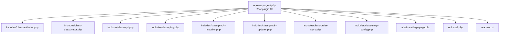
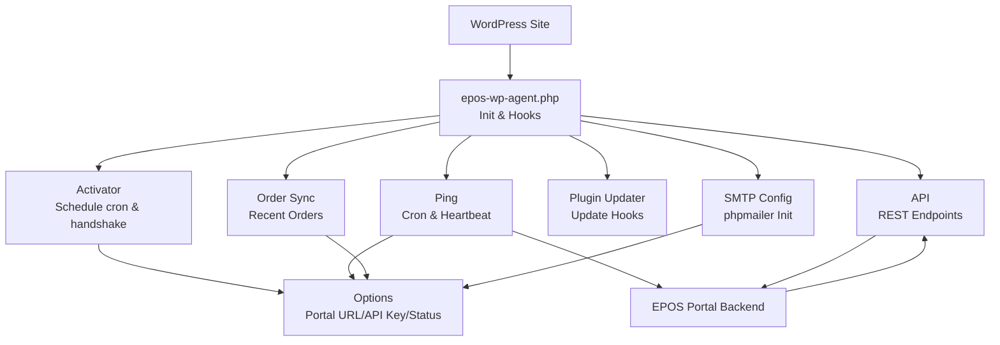
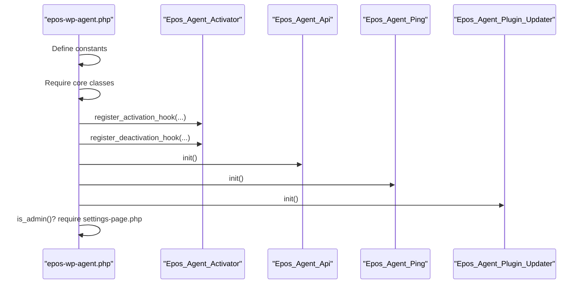
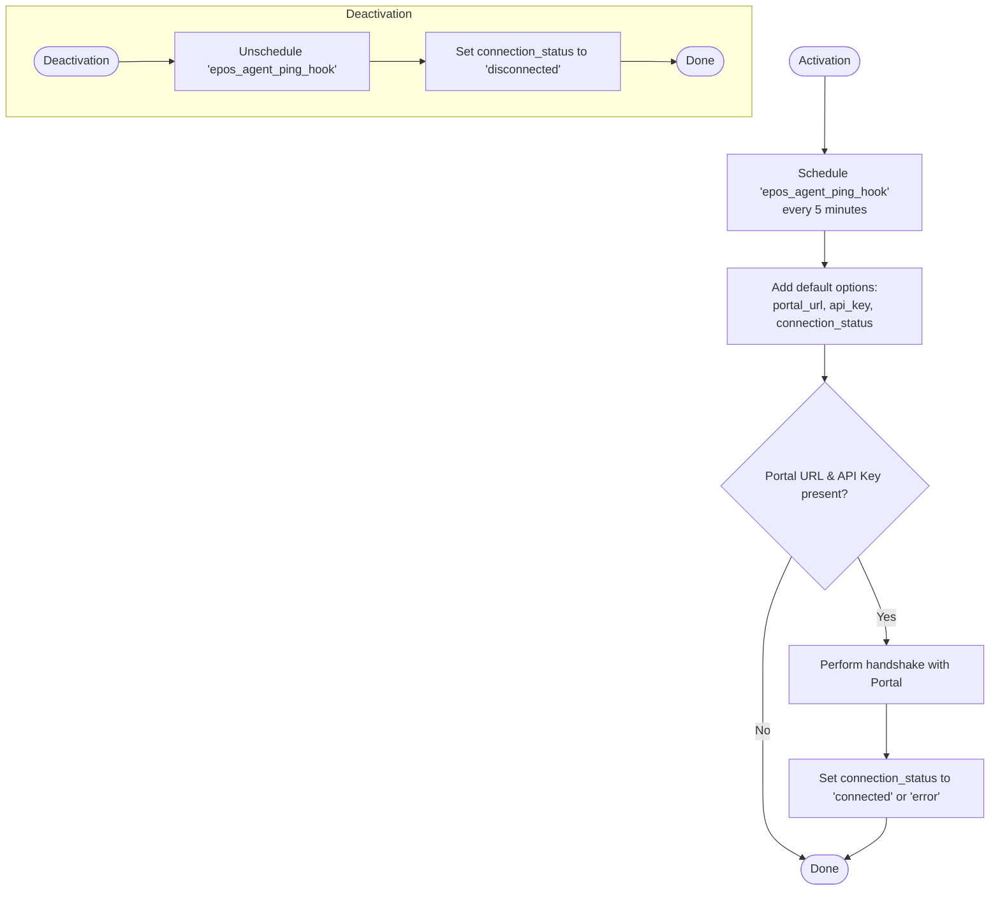
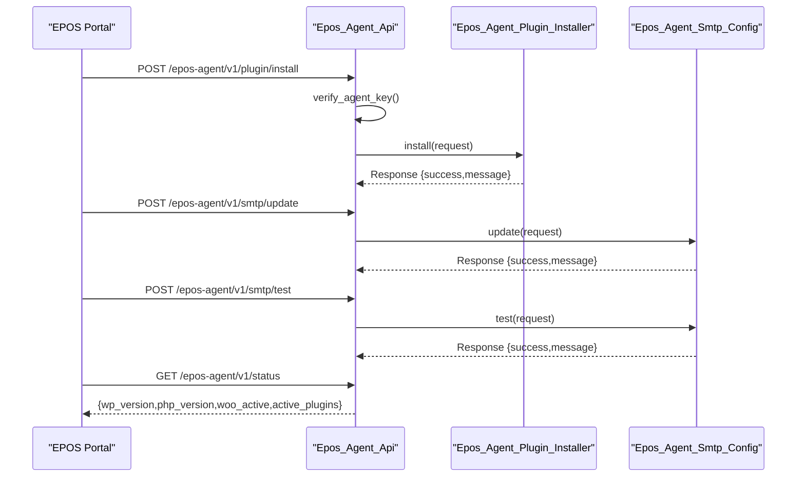
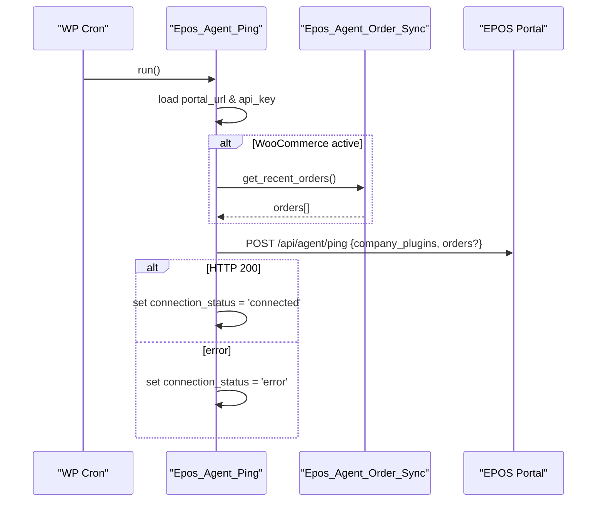
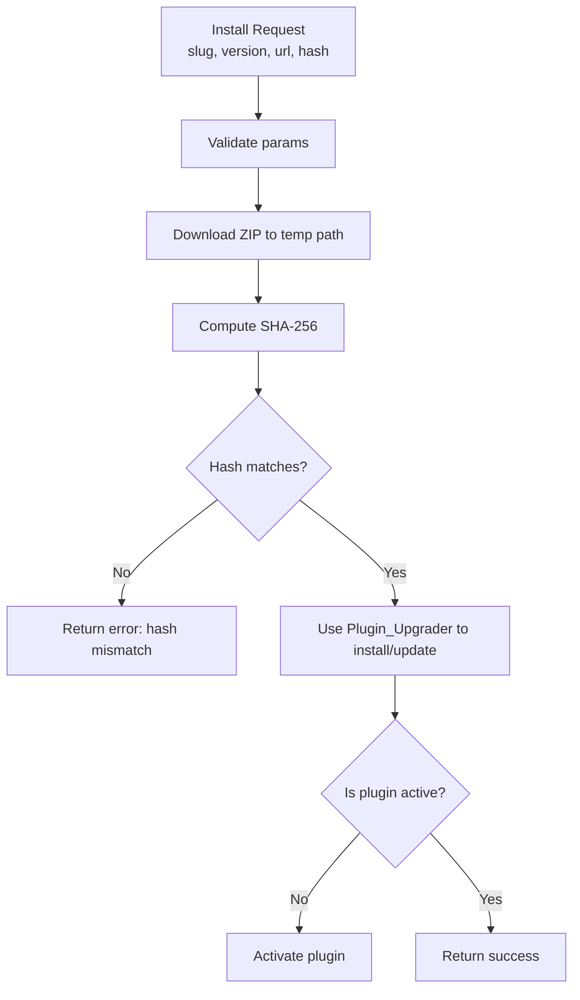
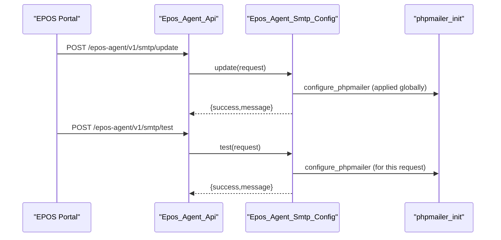
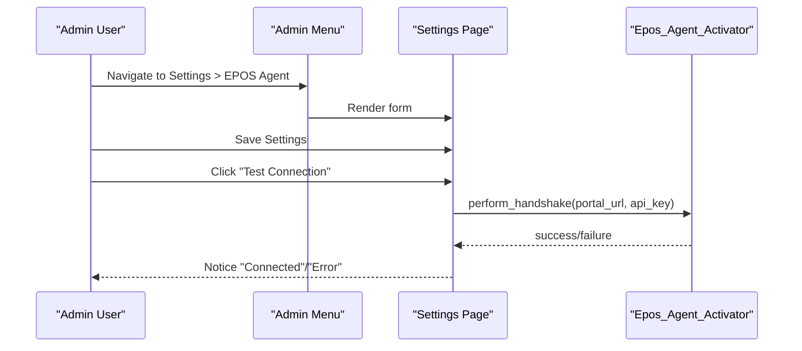
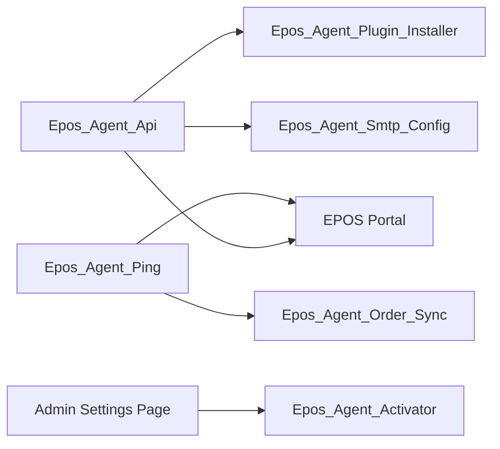

# Agent Plugin Architecture

<cite>
**Referenced Files in This Document**
- [epos-wp-agent.php](file://agent/epos-wp-agent/epos-wp-agent.php)
- [class-activator.php](file://agent/epos-wp-agent/includes/class-activator.php)
- [class-deactivator.php](file://agent/epos-wp-agent/includes/class-deactivator.php)
- [uninstall.php](file://agent/epos-wp-agent/uninstall.php)
- [class-api.php](file://agent/epos-wp-agent/includes/class-api.php)
- [class-ping.php](file://agent/epos-wp-agent/includes/class-ping.php)
- [class-plugin-installer.php](file://agent/epos-wp-agent/includes/class-plugin-installer.php)
- [class-plugin-updater.php](file://agent/epos-wp-agent/includes/class-plugin-updater.php)
- [class-order-sync.php](file://agent/epos-wp-agent/includes/class-order-sync.php)
- [class-smtp-config.php](file://agent/epos-wp-agent/includes/class-smtp-config.php)
- [settings-page.php](file://agent/epos-wp-agent/admin/settings-page.php)
- [readme.txt](file://agent/epos-wp-agent/readme.txt)
- [composer.json](file://portal/composer.json)
</cite>

## Table of Contents
1. [Introduction](#introduction)
2. [Project Structure](#project-structure)
3. [Core Components](#core-components)
4. [Architecture Overview](#architecture-overview)
5. [Detailed Component Analysis](#detailed-component-analysis)
6. [Dependency Analysis](#dependency-analysis)
7. [Performance Considerations](#performance-considerations)
8. [Troubleshooting Guide](#troubleshooting-guide)
9. [Conclusion](#conclusion)
10. [Appendices](#appendices)

## Introduction
This document describes the WordPress Agent plugin architecture that bridges a WordPress site with the EPOS Central Control Portal. It explains plugin initialization, core class structure, activation and deactivation lifecycles, directory layout, constants, autoloading, hooks registration, admin integration, and dependency management. It also details the relationship with the EPOS Portal backend, installation requirements, compatibility checks, upgrade procedures, and lifecycle cleanup.

## Project Structure
The plugin resides under agent/epos-wp-agent and follows a conventional WordPress plugin layout:
- Root plugin file initializes constants, includes core classes, registers activation/deactivation hooks, and loads admin components conditionally.
- Includes directory holds feature-specific classes for API endpoints, ping, plugin installer/updater, order synchronization, and SMTP configuration.
- Admin directory contains the settings page integration.
- Uninstall script cleans plugin options and scheduled events.
- Readme provides installation and changelog information.

**Diagram sources**
- [epos-wp-agent.php:1-61](file://agent/epos-wp-agent/epos-wp-agent.php#L1-L61)
- [class-activator.php:1-105](file://agent/epos-wp-agent/includes/class-activator.php#L1-L105)
- [class-deactivator.php:1-22](file://agent/epos-wp-agent/includes/class-deactivator.php#L1-L22)
- [class-api.php:1-110](file://agent/epos-wp-agent/includes/class-api.php#L1-L110)
- [class-ping.php:1-83](file://agent/epos-wp-agent/includes/class-ping.php#L1-L83)
- [class-plugin-installer.php:1-94](file://agent/epos-wp-agent/includes/class-plugin-installer.php#L1-L94)
- [class-plugin-updater.php:1-66](file://agent/epos-wp-agent/includes/class-plugin-updater.php#L1-L66)
- [class-order-sync.php:1-49](file://agent/epos-wp-agent/includes/class-order-sync.php#L1-L49)
- [class-smtp-config.php:1-105](file://agent/epos-wp-agent/includes/class-smtp-config.php#L1-L105)
- [settings-page.php:1-118](file://agent/epos-wp-agent/admin/settings-page.php#L1-L118)
- [uninstall.php:1-31](file://agent/epos-wp-agent/uninstall.php#L1-L31)
- [readme.txt:1-39](file://agent/epos-wp-agent/readme.txt#L1-L39)

**Section sources**
- [epos-wp-agent.php:1-61](file://agent/epos-wp-agent/epos-wp-agent.php#L1-L61)
- [readme.txt:1-39](file://agent/epos-wp-agent/readme.txt#L1-L39)

## Core Components
- Constants and bootstrap: Defines plugin version, directory, URL, and basename; includes core classes; registers activation/deactivation hooks; initializes plugin features on WordPress init; loads admin settings page when applicable.
- Activator: Schedules the 5-minute ping, sets default options, and performs an initial handshake with the Portal if credentials are present.
- Deactivator: Unschedules the ping event and marks connection status as disconnected.
- API: Registers REST endpoints under epos-agent/v1 for plugin install/update, SMTP update/test, and status retrieval; verifies agent key via header.
- Ping: Adds a custom cron schedule, triggers periodic pings to the Portal, collects plugin and optionally order data, and updates connection status.
- Plugin Installer: Installs or updates EPOS plugins from a provided download URL, validates SHA-256 hash, and activates the plugin.
- Plugin Updater: Hooks into WordPress update mechanism to support EPOS plugin updates via the Portal (placeholder implementation).
- Order Sync: Collects recent WooCommerce orders since the last sync for transmission to the Portal.
- SMTP Config: Applies SMTP settings globally via phpmailer, supports sending test emails, and stores credentials securely.
- Admin Settings Page: Provides a settings screen to configure Portal URL and API key, test connection, and view basic plugin info.
- Uninstall: Removes all plugin options and clears scheduled events.

**Section sources**
- [epos-wp-agent.php:21-61](file://agent/epos-wp-agent/epos-wp-agent.php#L21-L61)
- [class-activator.php:12-103](file://agent/epos-wp-agent/includes/class-activator.php#L12-L103)
- [class-deactivator.php:11-20](file://agent/epos-wp-agent/includes/class-deactivator.php#L11-L20)
- [class-api.php:8-108](file://agent/epos-wp-agent/includes/class-api.php#L8-L108)
- [class-ping.php:7-81](file://agent/epos-wp-agent/includes/class-ping.php#L7-L81)
- [class-plugin-installer.php:13-92](file://agent/epos-wp-agent/includes/class-plugin-installer.php#L13-L92)
- [class-plugin-updater.php:8-64](file://agent/epos-wp-agent/includes/class-plugin-updater.php#L8-L64)
- [class-order-sync.php:13-47](file://agent/epos-wp-agent/includes/class-order-sync.php#L13-L47)
- [class-smtp-config.php:13-103](file://agent/epos-wp-agent/includes/class-smtp-config.php#L13-L103)
- [settings-page.php:10-117](file://agent/epos-wp-agent/admin/settings-page.php#L10-L117)
- [uninstall.php:12-30](file://agent/epos-wp-agent/uninstall.php#L12-L30)

## Architecture Overview
The plugin orchestrates bidirectional communication with the EPOS Portal:
- Outbound: Periodic pings with site and plugin metadata; optional order data when WooCommerce is active.
- Inbound: REST endpoints for remote commands from the Portal (plugin install/update, SMTP configuration, status).
- Local state: Options store Portal URL, API key, connection status, last order sync, and SMTP settings.
- Lifecycle: Activation schedules cron and handshake; deactivation unschedules cron and updates status; uninstall removes all data.

**Diagram sources**
- [epos-wp-agent.php:36-53](file://agent/epos-wp-agent/epos-wp-agent.php#L36-L53)
- [class-activator.php:12-30](file://agent/epos-wp-agent/includes/class-activator.php#L12-L30)
- [class-api.php:8-45](file://agent/epos-wp-agent/includes/class-api.php#L8-L45)
- [class-ping.php:7-13](file://agent/epos-wp-agent/includes/class-ping.php#L7-L13)
- [class-plugin-updater.php:8-11](file://agent/epos-wp-agent/includes/class-plugin-updater.php#L8-L11)
- [class-order-sync.php:13-18](file://agent/epos-wp-agent/includes/class-order-sync.php#L13-L18)
- [class-smtp-config.php:13-41](file://agent/epos-wp-agent/includes/class-smtp-config.php#L13-L41)

## Detailed Component Analysis

### Initialization and Bootstrap
- Defines constants for version, directory, URL, and basename.
- Includes core classes for activator, deactivator, API, ping, plugin installer, plugin updater, order sync, and SMTP configuration.
- Registers activation and deactivation hooks.
- Initializes plugin features on WordPress init by registering REST endpoints, cron ping, and plugin updater.
- Loads admin settings page when in admin context.

**Diagram sources**
- [epos-wp-agent.php:21-61](file://agent/epos-wp-agent/epos-wp-agent.php#L21-L61)

**Section sources**
- [epos-wp-agent.php:21-61](file://agent/epos-wp-agent/epos-wp-agent.php#L21-L61)

### Activation and Deactivation Lifecycle
- Activation:
  - Schedules a custom 5-minute cron event named epos_agent_ping_hook if not already scheduled.
  - Adds default options for Portal URL, API key, and connection status.
  - Attempts a handshake with the Portal if both settings are present.
- Deactivation:
  - Unschedules the ping cron event if scheduled.
  - Updates connection status to disconnected.

**Diagram sources**
- [class-activator.php:12-30](file://agent/epos-wp-agent/includes/class-activator.php#L12-L30)
- [class-activator.php:35-76](file://agent/epos-wp-agent/includes/class-activator.php#L35-L76)
- [class-deactivator.php:11-20](file://agent/epos-wp-agent/includes/class-deactivator.php#L11-L20)

**Section sources**
- [class-activator.php:12-103](file://agent/epos-wp-agent/includes/class-activator.php#L12-L103)
- [class-deactivator.php:11-20](file://agent/epos-wp-agent/includes/class-deactivator.php#L11-L20)

### REST API Endpoints and Authorization
- Namespace: epos-agent/v1
- Routes:
  - POST /plugin/install: Installs or updates a plugin from a download URL, validates SHA-256 hash, and activates it.
  - POST /smtp/update: Applies SMTP settings globally via phpmailer.
  - POST /smtp/test: Sends a test email using configured SMTP settings.
  - GET /status: Returns WordPress and plugin status information.
- Authorization: Verifies X-Agent-Key header against stored API key using constant-time comparison.

**Diagram sources**
- [class-api.php:15-45](file://agent/epos-wp-agent/includes/class-api.php#L15-L45)
- [class-api.php:50-71](file://agent/epos-wp-agent/includes/class-api.php#L50-L71)
- [class-plugin-installer.php:13-92](file://agent/epos-wp-agent/includes/class-plugin-installer.php#L13-L92)
- [class-smtp-config.php:13-78](file://agent/epos-wp-agent/includes/class-smtp-config.php#L13-L78)

**Section sources**
- [class-api.php:8-108](file://agent/epos-wp-agent/includes/class-api.php#L8-L108)
- [class-plugin-installer.php:13-92](file://agent/epos-wp-agent/includes/class-plugin-installer.php#L13-L92)
- [class-smtp-config.php:13-78](file://agent/epos-wp-agent/includes/class-smtp-config.php#L13-L78)

### Ping and Heartbeat Mechanism
- Adds a custom cron schedule “Every 5 Minutes”.
- Triggers epos_agent_ping_hook to:
  - Retrieve Portal URL and API key.
  - Build payload with installed EPOS plugins.
  - Optionally include recent orders via Order Sync if WooCommerce is active.
  - POST to /api/agent/ping on the Portal.
  - Update connection status based on response.

**Diagram sources**
- [class-ping.php:18-24](file://agent/epos-wp-agent/includes/class-ping.php#L18-L24)
- [class-ping.php:29-81](file://agent/epos-wp-agent/includes/class-ping.php#L29-L81)
- [class-order-sync.php:13-47](file://agent/epos-wp-agent/includes/class-order-sync.php#L13-L47)

**Section sources**
- [class-ping.php:7-81](file://agent/epos-wp-agent/includes/class-ping.php#L7-L81)
- [class-order-sync.php:13-47](file://agent/epos-wp-agent/includes/class-order-sync.php#L13-L47)

### Plugin Installer and Updater
- Installer:
  - Validates presence of plugin_slug, version, download_url, file_hash.
  - Downloads ZIP, computes SHA-256, compares hashes.
  - Uses WordPress Plugin API to install/update; activates if inactive.
  - Returns structured success/error responses.
- Updater:
  - Hooks into pre_set_site_transient_update_plugins and plugins_api filters.
  - Currently a placeholder; intended to query the Portal for EPOS plugin updates and info.

**Diagram sources**
- [class-plugin-installer.php:13-92](file://agent/epos-wp-agent/includes/class-plugin-installer.php#L13-L92)
- [class-plugin-updater.php:16-44](file://agent/epos-wp-agent/includes/class-plugin-updater.php#L16-L44)

**Section sources**
- [class-plugin-installer.php:13-92](file://agent/epos-wp-agent/includes/class-plugin-installer.php#L13-L92)
- [class-plugin-updater.php:8-64](file://agent/epos-wp-agent/includes/class-plugin-updater.php#L8-L64)

### SMTP Configuration Management
- Applies SMTP settings globally by configuring phpmailer via a filter.
- Supports updating settings and sending test emails.
- Stores credentials in WordPress options; encryption setting controls TLS/SSL behavior.

**Diagram sources**
- [class-api.php:84-95](file://agent/epos-wp-agent/includes/class-api.php#L84-L95)
- [class-smtp-config.php:13-78](file://agent/epos-wp-agent/includes/class-smtp-config.php#L13-L78)
- [settings-page.php:116-117](file://agent/epos-wp-agent/admin/settings-page.php#L116-L117)

**Section sources**
- [class-smtp-config.php:13-103](file://agent/epos-wp-agent/includes/class-smtp-config.php#L13-L103)
- [settings-page.php:116-117](file://agent/epos-wp-agent/admin/settings-page.php#L116-L117)

### Admin Settings Integration
- Registers an options page under Settings.
- Provides fields for Portal URL and API key with sanitization.
- Offers a “Test Connection” action that triggers a handshake with the Portal and displays a status notice.
- Displays current plugin and environment information.

**Diagram sources**
- [settings-page.php:10-45](file://agent/epos-wp-agent/admin/settings-page.php#L10-L45)
- [class-activator.php:35-76](file://agent/epos-wp-agent/includes/class-activator.php#L35-L76)

**Section sources**
- [settings-page.php:10-117](file://agent/epos-wp-agent/admin/settings-page.php#L10-L117)

### Uninstall and Cleanup
- Removes all plugin-specific options including Portal URL, API key, connection status, last order sync, and SMTP settings.
- Unschedules the ping cron event if scheduled.

**Section sources**
- [uninstall.php:12-30](file://agent/epos-wp-agent/uninstall.php#L12-L30)

## Dependency Analysis
- WordPress core dependencies:
  - Activation/deactivation hooks, cron scheduling, REST API, options API, plugin administration screens, and phpmailer integration.
- External dependency:
  - EPOS Portal backend exposes endpoints consumed by the plugin (handshake, ping, plugin install/update, SMTP test/status).
- Internal dependencies:
  - API depends on Plugin Installer and SMTP Config.
  - Ping optionally depends on Order Sync when WooCommerce is active.
  - Settings page integrates with Activator for connection testing.

**Diagram sources**
- [class-api.php:76-95](file://agent/epos-wp-agent/includes/class-api.php#L76-L95)
- [class-ping.php:46-48](file://agent/epos-wp-agent/includes/class-ping.php#L46-L48)
- [settings-page.php:36](file://agent/epos-wp-agent/admin/settings-page.php#L36)

**Section sources**
- [class-api.php:76-95](file://agent/epos-wp-agent/includes/class-api.php#L76-L95)
- [class-ping.php:46-48](file://agent/epos-wp-agent/includes/class-ping.php#L46-L48)
- [settings-page.php:36](file://agent/epos-wp-agent/admin/settings-page.php#L36)

## Performance Considerations
- Cron intervals: The 5-minute schedule balances responsiveness with minimal overhead. Avoid reducing interval further without careful consideration of network and server load.
- Remote requests: All outbound HTTP calls specify timeouts and enable SSL verification. Consider retry/backoff strategies for transient failures.
- Hash verification: SHA-256 verification ensures integrity but adds CPU cost; ensure adequate server resources for plugin updates.
- Order sync: Limiting to recent orders minimizes payload size; adjust limits based on order volume.
- SMTP configuration: Applying phpmailer settings globally affects all outgoing emails; ensure credentials are stored securely and encryption settings match provider requirements.

## Troubleshooting Guide
- Connection status:
  - Pending: No credentials saved or handshake not attempted yet.
  - Connected: Portal responded with HTTP 200 to handshake or ping.
  - Disconnected: Occurs on deactivation.
  - Error: Handshake/ping failed or returned non-200; check Portal URL, API key, and network connectivity.
- API key verification:
  - Unauthorized responses indicate missing or invalid X-Agent-Key; confirm settings and Portal-generated key.
- Plugin install failures:
  - Missing parameters or hash mismatch will return errors; verify download URL and file hash.
  - Installation errors often relate to server permissions; check write permissions for WP_PLUGIN_DIR.
- SMTP test failures:
  - Ensure host, port, username, password, and encryption are correct; verify phpmailer configuration applied globally.
- Cron not firing:
  - Confirm cron is scheduled and WP-Cron is reachable; check for conflicting plugins or server restrictions.

**Section sources**
- [class-activator.php:60-76](file://agent/epos-wp-agent/includes/class-activator.php#L60-L76)
- [class-ping.php:64-81](file://agent/epos-wp-agent/includes/class-ping.php#L64-L81)
- [class-api.php:50-71](file://agent/epos-wp-agent/includes/class-api.php#L50-L71)
- [class-plugin-installer.php:29-44](file://agent/epos-wp-agent/includes/class-plugin-installer.php#L29-L44)
- [class-smtp-config.php:49-78](file://agent/epos-wp-agent/includes/class-smtp-config.php#L49-L78)

## Conclusion
The EPOS WP Agent plugin establishes a secure, automated bridge between a WordPress site and the EPOS Portal. It leverages WordPress hooks, REST APIs, cron scheduling, and option storage to manage plugin deployments, SMTP configuration, order synchronization, and continuous health monitoring. The architecture is modular, extensible, and designed for reliable operation in production environments.

## Appendices

### Installation Requirements and Compatibility
- WordPress: Requires at least version 5.8.
- PHP: Requires at least version 7.4.
- Installation steps:
  - Upload the plugin folder to the WordPress plugins directory.
  - Activate the plugin.
  - Navigate to Settings > EPOS Agent.
  - Enter Portal URL and API key.
  - Test connection to verify.

**Section sources**
- [epos-wp-agent.php:12-13](file://agent/epos-wp-agent/epos-wp-agent.php#L12-L13)
- [readme.txt:22-28](file://agent/epos-wp-agent/readme.txt#L22-L28)

### Upgrade Procedures
- Plugin Installer:
  - Supports installing new versions or updating existing EPOS plugins from a provided download URL.
  - Validates file integrity via SHA-256 before installation.
  - Activates the plugin if not already active.
- Plugin Updater:
  - Hooks into WordPress update mechanism; placeholder implementation intended to query the Portal for updates and plugin info in future phases.

**Section sources**
- [class-plugin-installer.php:13-92](file://agent/epos-wp-agent/includes/class-plugin-installer.php#L13-L92)
- [class-plugin-updater.php:16-64](file://agent/epos-wp-agent/includes/class-plugin-updater.php#L16-L64)

### Relationship with EPOS Portal Backend
- Outbound communications:
  - Handshake: Initial registration with Portal including WordPress and PHP versions, and installed EPOS plugins.
  - Ping: Periodic heartbeat with plugin inventory and optional order data.
- Inbound commands:
  - Plugin install/update: Remote deployment of EPOS plugins with integrity verification.
  - SMTP update/test: Centralized SMTP configuration and validation.
  - Status: Endpoint returns current site status for monitoring.

**Section sources**
- [class-activator.php:35-76](file://agent/epos-wp-agent/includes/class-activator.php#L35-L76)
- [class-ping.php:29-81](file://agent/epos-wp-agent/includes/class-ping.php#L29-L81)
- [class-api.php:15-45](file://agent/epos-wp-agent/includes/class-api.php#L15-L45)