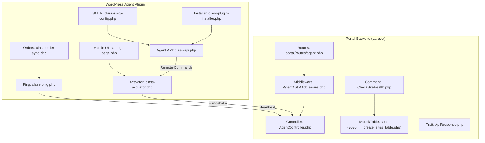
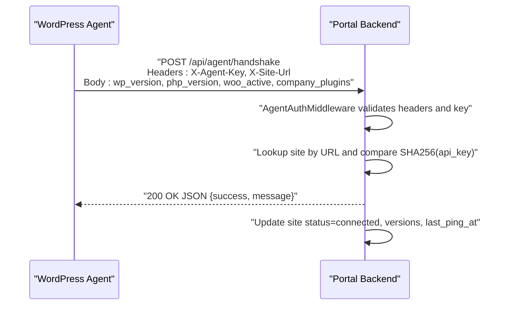
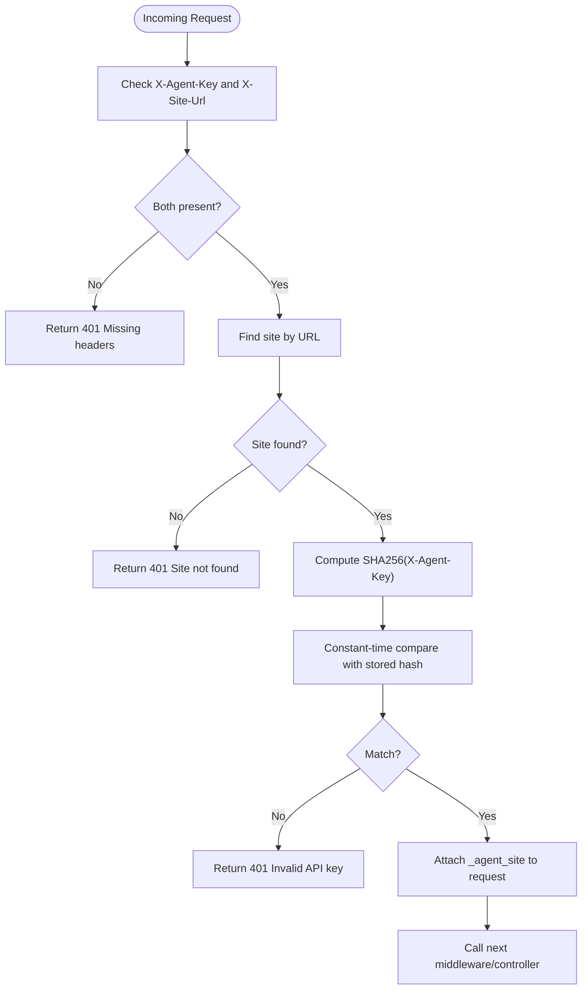
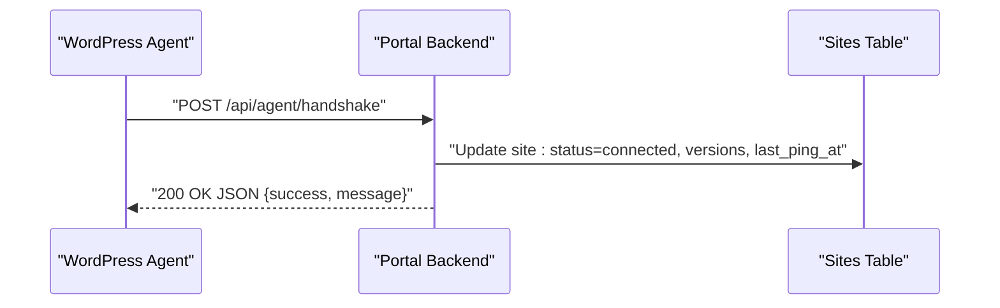
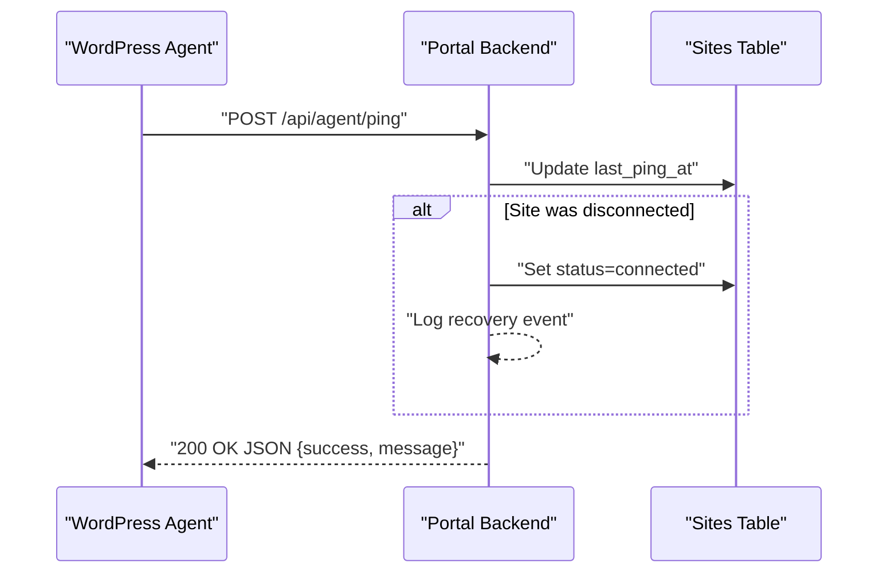
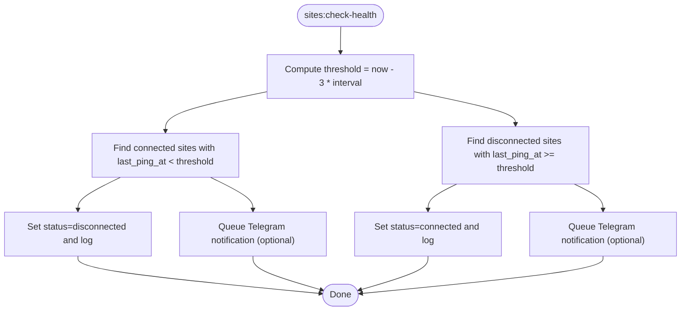
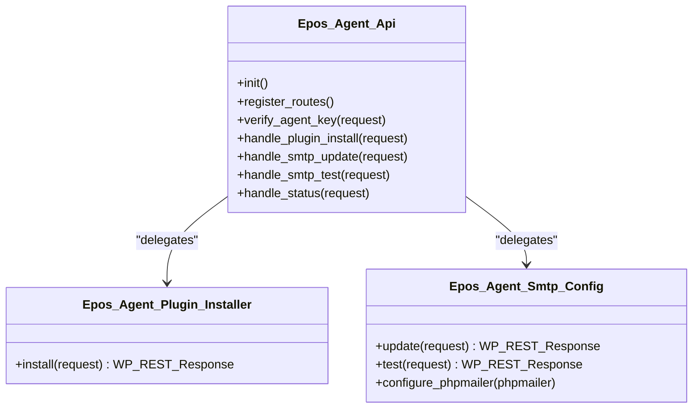
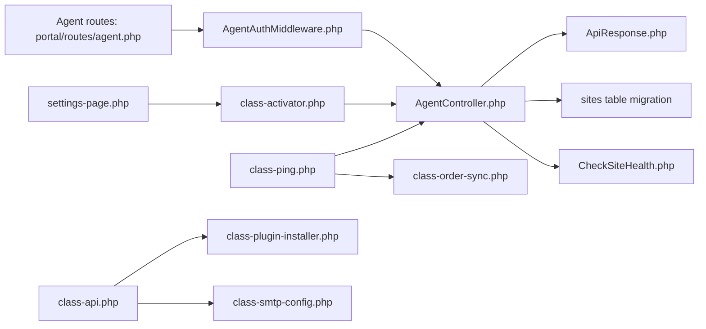

# Communication Protocol

<cite>
**Referenced Files in This Document**
- [agent.php](file://portal/routes/agent.php)
- [api.php](file://portal/routes/api.php)
- [AgentAuthMiddleware.php](file://portal/app/Http/Middleware/AgentAuthMiddleware.php)
- [AgentController.php](file://portal/app/Http/Controllers/Agent/AgentController.php)
- [CheckSiteHealth.php](file://portal/app/Console/Commands/CheckSiteHealth.php)
- [2026_05_15_070002_create_sites_table.php](file://portal/database/migrations/2026_05_15_070002_create_sites_table.php)
- [ApiResponse.php](file://portal/app/Traits/ApiResponse.php)
- [class-api.php](file://agent/epos-wp-agent/includes/class-api.php)
- [class-ping.php](file://agent/epos-wp-agent/includes/class-ping.php)
- [class-activator.php](file://agent/epos-wp-agent/includes/class-activator.php)
- [class-order-sync.php](file://agent/epos-wp-agent/includes/class-order-sync.php)
- [class-plugin-installer.php](file://agent/epos-wp-agent/includes/class-plugin-installer.php)
- [class-smtp-config.php](file://agent/epos-wp-agent/includes/class-smtp-config.php)
- [settings-page.php](file://agent/epos-wp-agent/admin/settings-page.php)
- [cors.php](file://portal/config/cors.php)
</cite>

## Table of Contents
1. [Introduction](#introduction)
2. [Project Structure](#project-structure)
3. [Core Components](#core-components)
4. [Architecture Overview](#architecture-overview)
5. [Detailed Component Analysis](#detailed-component-analysis)
6. [Dependency Analysis](#dependency-analysis)
7. [Performance Considerations](#performance-considerations)
8. [Troubleshooting Guide](#troubleshooting-guide)
9. [Conclusion](#conclusion)
10. [Appendices](#appendices)

## Introduction
This document describes the REST API communication protocol between WordPress agents and the EPOS Portal backend. It covers endpoint structure, request/response formats, authentication, heartbeat and health checks, data serialization, error handling, and security considerations. It also provides examples of successful flows and common failure scenarios with actionable troubleshooting steps.

## Project Structure
The communication protocol spans two parts:
- Portal backend (Laravel): exposes agent-facing endpoints, enforces agent authentication, and maintains site state and health.
- WordPress Agent plugin (PHP): initiates handshake, sends periodic heartbeat pings, and exposes agent-only endpoints for remote commands.

**Diagram sources**
- [agent.php:16-19](file://portal/routes/agent.php#L16-L19)
- [AgentAuthMiddleware.php:20-55](file://portal/app/Http/Middleware/AgentAuthMiddleware.php#L20-L55)
- [AgentController.php:16-97](file://portal/app/Http/Controllers/Agent/AgentController.php#L16-L97)
- [CheckSiteHealth.php:16-72](file://portal/app/Console/Commands/CheckSiteHealth.php#L16-L72)
- [2026_05_15_070002_create_sites_table.php:11-27](file://portal/database/migrations/2026_05_15_070002_create_sites_table.php#L11-L27)
- [class-activator.php:35-76](file://agent/epos-wp-agent/includes/class-activator.php#L35-L76)
- [class-ping.php:29-81](file://agent/epos-wp-agent/includes/class-ping.php#L29-L81)
- [class-api.php:15-45](file://agent/epos-wp-agent/includes/class-api.php#L15-L45)
- [class-order-sync.php:13-47](file://agent/epos-wp-agent/includes/class-order-sync.php#L13-L47)
- [class-plugin-installer.php:13-92](file://agent/epos-wp-agent/includes/class-plugin-installer.php#L13-L92)
- [class-smtp-config.php:13-78](file://agent/epos-wp-agent/includes/class-smtp-config.php#L13-L78)
- [settings-page.php:29-114](file://agent/epos-wp-agent/admin/settings-page.php#L29-L114)

**Section sources**
- [agent.php:16-19](file://portal/routes/agent.php#L16-L19)
- [class-activator.php:12-30](file://agent/epos-wp-agent/includes/class-activator.php#L12-L30)
- [class-ping.php:7-24](file://agent/epos-wp-agent/includes/class-ping.php#L7-L24)

## Core Components
- Agent routes: Two agent endpoints are exposed under a dedicated route group with agent authentication middleware.
- Authentication: Custom middleware validates agent identity using two headers and a hashed key stored in the database.
- Heartbeat: WordPress agent schedules periodic pings; Portal marks sites as connected/disconnected based on last ping timestamps.
- Remote commands: Agent plugin exposes endpoints for plugin install/update, SMTP configuration, SMTP test, and status retrieval.
- Data model: Sites table stores site metadata, API key hash, status, versions, and last ping time.

**Section sources**
- [agent.php:16-19](file://portal/routes/agent.php#L16-L19)
- [AgentAuthMiddleware.php:20-55](file://portal/app/Http/Middleware/AgentAuthMiddleware.php#L20-L55)
- [AgentController.php:16-97](file://portal/app/Http/Controllers/Agent/AgentController.php#L16-L97)
- [class-ping.php:29-81](file://agent/epos-wp-agent/includes/class-ping.php#L29-L81)
- [class-api.php:15-45](file://agent/epos-wp-agent/includes/class-api.php#L15-L45)
- [2026_05_15_070002_create_sites_table.php:11-27](file://portal/database/migrations/2026_05_15_070002_create_sites_table.php#L11-L27)

## Architecture Overview
The protocol consists of two primary flows: handshake and heartbeat. Both rely on shared authentication headers and a hashed key comparison.

**Diagram sources**
- [class-activator.php:35-76](file://agent/epos-wp-agent/includes/class-activator.php#L35-L76)
- [AgentAuthMiddleware.php:20-55](file://portal/app/Http/Middleware/AgentAuthMiddleware.php#L20-L55)
- [AgentController.php:16-55](file://portal/app/Http/Controllers/Agent/AgentController.php#L16-L55)

## Detailed Component Analysis

### Authentication Mechanism
- Required headers:
  - X-Agent-Key: Plain text API key provided by the Portal during site registration.
  - X-Site-Url: The WordPress site’s URL.
- Validation logic:
  - Middleware requires both headers.
  - Looks up the site by normalized URL.
  - Compares the provided key against the stored SHA256 hash using constant-time comparison.
  - Attaches the resolved site to the request for downstream controllers.

**Diagram sources**
- [AgentAuthMiddleware.php:20-55](file://portal/app/Http/Middleware/AgentAuthMiddleware.php#L20-L55)

**Section sources**
- [AgentAuthMiddleware.php:20-55](file://portal/app/Http/Middleware/AgentAuthMiddleware.php#L20-L55)

### Handshake Endpoint
- Endpoint: POST /api/agent/handshake
- Purpose: Establish connection on agent activation.
- Request headers: X-Agent-Key, X-Site-Url.
- Request body:
  - wp_version: string
  - php_version: string
  - woo_active: boolean
  - company_plugins: array of objects with slug, version, active
- Response: JSON with success flag and message.
- Side effects:
  - Updates site status to connected.
  - Records versions and last_ping_at.
  - Logs activity.

**Diagram sources**
- [class-activator.php:35-76](file://agent/epos-wp-agent/includes/class-activator.php#L35-L76)
- [AgentController.php:16-55](file://portal/app/Http/Controllers/Agent/AgentController.php#L16-L55)
- [2026_05_15_070002_create_sites_table.php:18-22](file://portal/database/migrations/2026_05_15_070002_create_sites_table.php#L18-L22)

**Section sources**
- [agent.php:17](file://portal/routes/agent.php#L17)
- [AgentController.php:16-55](file://portal/app/Http/Controllers/Agent/AgentController.php#L16-L55)
- [class-activator.php:35-76](file://agent/epos-wp-agent/includes/class-activator.php#L35-L76)

### Heartbeat Endpoint
- Endpoint: POST /api/agent/ping
- Frequency: Every 5 minutes via WordPress cron.
- Request headers: X-Agent-Key, X-Site-Url.
- Request body:
  - company_plugins: array of plugin info
  - orders: array (when WooCommerce is active)
- Response: JSON with success flag and message.
- Behavior:
  - Updates last_ping_at.
  - If previously disconnected, sets status to connected and logs recovery.

**Diagram sources**
- [class-ping.php:29-81](file://agent/epos-wp-agent/includes/class-ping.php#L29-L81)
- [AgentController.php:61-97](file://portal/app/Http/Controllers/Agent/AgentController.php#L61-L97)

**Section sources**
- [agent.php:18](file://portal/routes/agent.php#L18)
- [AgentController.php:61-97](file://portal/app/Http/Controllers/Agent/AgentController.php#L61-L97)
- [class-ping.php:29-81](file://agent/epos-wp-agent/includes/class-ping.php#L29-L81)

### Health Monitoring and Disconnection Logic
- A scheduled command periodically evaluates site health:
  - Threshold: last_ping_at older than 3 × configured ping interval.
  - Marks connected sites as disconnected and logs events.
  - Marks disconnected sites as connected if they recently pinged again.
- Notifications: Optional Telegram notifications dispatched on state changes.

**Diagram sources**
- [CheckSiteHealth.php:16-72](file://portal/app/Console/Commands/CheckSiteHealth.php#L16-L72)

**Section sources**
- [CheckSiteHealth.php:16-72](file://portal/app/Console/Commands/CheckSiteHealth.php#L16-L72)

### Agent-Initiated Remote Commands (Agent Plugin Endpoints)
The WordPress agent exposes endpoints under a dedicated namespace for remote control by the Portal. All endpoints require agent authentication via the same middleware.

- Namespace: epos-agent/v1
- Endpoints:
  - POST /plugin/install: Installs or updates a plugin using a download URL and file hash.
  - POST /smtp/update: Applies SMTP settings to WordPress.
  - POST /smtp/test: Sends a test email using configured SMTP.
  - GET /status: Returns site status (versions, plugin presence).
- Authentication: Permission callback verifies X-Agent-Key against stored key.

**Diagram sources**
- [class-api.php:6-109](file://agent/epos-wp-agent/includes/class-api.php#L6-L109)
- [class-plugin-installer.php:5-93](file://agent/epos-wp-agent/includes/class-plugin-installer.php#L5-L93)
- [class-smtp-config.php:5-104](file://agent/epos-wp-agent/includes/class-smtp-config.php#L5-L104)

**Section sources**
- [class-api.php:15-45](file://agent/epos-wp-agent/includes/class-api.php#L15-L45)
- [class-plugin-installer.php:13-92](file://agent/epos-wp-agent/includes/class-plugin-installer.php#L13-L92)
- [class-smtp-config.php:13-78](file://agent/epos-wp-agent/includes/class-smtp-config.php#L13-L78)

### Data Serialization Formats
- Content-Type: application/json for all agent-to-portal requests.
- Body fields:
  - Handshake: wp_version, php_version, woo_active, company_plugins.
  - Ping: company_plugins, orders (optional).
  - Plugin install: plugin_slug, version, download_url, file_hash.
  - SMTP update: host, port, username, password, encryption, from_email, from_name.
  - SMTP test: to_email.
  - Status: returns platform versions and plugin inventory.
- Responses: JSON with top-level success flag and optional message; some controllers support additional data and meta.

**Section sources**
- [class-activator.php:39-44](file://agent/epos-wp-agent/includes/class-activator.php#L39-L44)
- [class-ping.php:40-48](file://agent/epos-wp-agent/includes/class-ping.php#L40-L48)
- [class-plugin-installer.php:14-17](file://agent/epos-wp-agent/includes/class-plugin-installer.php#L14-L17)
- [class-smtp-config.php:14-22](file://agent/epos-wp-agent/includes/class-smtp-config.php#L14-L22)
- [class-api.php:100-108](file://agent/epos-wp-agent/includes/class-api.php#L100-L108)
- [ApiResponse.php:9-40](file://portal/app/Traits/ApiResponse.php#L9-L40)

### Error Handling Strategies
- Authentication failures: 401 with message indicating missing headers, site not found, or invalid key.
- Validation errors: 422/400 with structured messages for malformed requests.
- Operational errors:
  - Plugin install: 500 on download or installation failures; 400 on hash mismatch.
  - SMTP test: 500 if sending fails; 400 if required parameters are missing.
  - Heartbeat/handshake: 200 on success; otherwise error responses are logged and connection status updated on the agent side.

**Section sources**
- [AgentAuthMiddleware.php:25-49](file://portal/app/Http/Middleware/AgentAuthMiddleware.php#L25-L49)
- [class-plugin-installer.php:19-44](file://agent/epos-wp-agent/includes/class-plugin-installer.php#L19-L44)
- [class-smtp-config.php:52-77](file://agent/epos-wp-agent/includes/class-smtp-config.php#L52-L77)
- [class-ping.php:64-80](file://agent/epos-wp-agent/includes/class-ping.php#L64-L80)

### Retry Logic
- Agent-side retries:
  - No explicit retry loop is implemented in the heartbeat or handshake flows.
  - The plugin records connection status (connected/error/pending) based on HTTP response codes and logs errors when debug mode is enabled.
- Recommendations:
  - Implement exponential backoff for transient network errors.
  - Limit max retries per day and surface retry state to the admin UI.

**Section sources**
- [class-ping.php:64-80](file://agent/epos-wp-agent/includes/class-ping.php#L64-L80)
- [class-activator.php:60-75](file://agent/epos-wp-agent/includes/class-activator.php#L60-L75)

### Security Considerations
- API key validation:
  - Portal compares a SHA256 hash of the provided key against the stored hash, preventing plaintext exposure.
  - Constant-time comparison mitigates timing attacks.
- Request signing:
  - Not implemented. Consider adding signature verification (e.g., HMAC) for stronger integrity guarantees.
- Transport security:
  - WordPress agent enforces SSL verification for outbound requests.
  - Ensure Portal endpoints are served over HTTPS in production.
- Data encryption:
  - No encryption of request bodies is implemented. Sensitive fields (e.g., SMTP password) are transmitted as provided; consider encrypting at rest and in transit.
- CORS:
  - Frontend origins are configurable; ensure only trusted origins are permitted.

**Section sources**
- [AgentAuthMiddleware.php:43-49](file://portal/app/Http/Middleware/AgentAuthMiddleware.php#L43-L49)
- [class-ping.php:60](file://agent/epos-wp-agent/includes/class-ping.php#L60)
- [cors.php:11-29](file://portal/config/cors.php#L11-L29)

## Dependency Analysis

**Diagram sources**
- [agent.php:16-19](file://portal/routes/agent.php#L16-L19)
- [AgentAuthMiddleware.php:20-55](file://portal/app/Http/Middleware/AgentAuthMiddleware.php#L20-L55)
- [AgentController.php:16-97](file://portal/app/Http/Controllers/Agent/AgentController.php#L16-L97)
- [ApiResponse.php:9-40](file://portal/app/Traits/ApiResponse.php#L9-L40)
- [2026_05_15_070002_create_sites_table.php:11-27](file://portal/database/migrations/2026_05_15_070002_create_sites_table.php#L11-L27)
- [CheckSiteHealth.php:16-72](file://portal/app/Console/Commands/CheckSiteHealth.php#L16-L72)
- [class-activator.php:35-76](file://agent/epos-wp-agent/includes/class-activator.php#L35-L76)
- [class-ping.php:29-81](file://agent/epos-wp-agent/includes/class-ping.php#L29-L81)
- [class-order-sync.php:13-47](file://agent/epos-wp-agent/includes/class-order-sync.php#L13-L47)
- [class-api.php:15-45](file://agent/epos-wp-agent/includes/class-api.php#L15-L45)
- [class-plugin-installer.php:13-92](file://agent/epos-wp-agent/includes/class-plugin-installer.php#L13-L92)
- [class-smtp-config.php:13-78](file://agent/epos-wp-agent/includes/class-smtp-config.php#L13-L78)
- [settings-page.php:29-114](file://agent/epos-wp-agent/admin/settings-page.php#L29-L114)

**Section sources**
- [agent.php:16-19](file://portal/routes/agent.php#L16-L19)
- [class-api.php:15-45](file://agent/epos-wp-agent/includes/class-api.php#L15-L45)

## Performance Considerations
- Heartbeat cadence: Every 5 minutes balances reliability with load; adjust ping interval via configuration and health check thresholds accordingly.
- Payload size: Limit plugin lists and order batches; avoid sending unnecessary fields.
- Network timeouts: Respect agent-side timeout values and avoid blocking UI threads.
- Logging: Keep error logs concise; avoid excessive writes in production.

## Troubleshooting Guide
- Authentication failures:
  - Missing headers: Ensure both X-Agent-Key and X-Site-Url are set.
  - Invalid key: Confirm the key matches the stored SHA256 hash.
  - Site not found: Verify the normalized site URL matches the registered URL.
- Connection status:
  - Agent records connection status (connected/error/pending). Check logs when status is error.
- Plugin install failures:
  - Hash mismatch: Verify file_hash matches the downloaded plugin’s SHA256.
  - Download failures: Check network connectivity and download URL validity.
  - Installation failures: Review server permissions and disk space.
- SMTP test failures:
  - Missing to_email: Provide a valid recipient.
  - Misconfiguration: Validate host, port, username, password, encryption, and sender details.
- Heartbeat gaps:
  - Health check may mark sites disconnected after 3 × ping interval without a ping.
  - Investigate network outages, firewall restrictions, or cron scheduling issues.

**Section sources**
- [AgentAuthMiddleware.php:25-49](file://portal/app/Http/Middleware/AgentAuthMiddleware.php#L25-L49)
- [class-ping.php:64-80](file://agent/epos-wp-agent/includes/class-ping.php#L64-L80)
- [class-plugin-installer.php:19-44](file://agent/epos-wp-agent/includes/class-plugin-installer.php#L19-L44)
- [class-smtp-config.php:52-77](file://agent/epos-wp-agent/includes/class-smtp-config.php#L52-L77)
- [CheckSiteHealth.php:18-25](file://portal/app/Console/Commands/CheckSiteHealth.php#L18-L25)

## Conclusion
The EPOS Portal and WordPress Agent communicate securely over HTTPS using a simple, robust protocol. Authentication relies on a hashed key and two required headers. Heartbeat pings enable reliable health monitoring, while agent-initiated endpoints allow remote management. Strengthening transport security, implementing request signing, and adding retry/backoff would further improve resilience and trust.

## Appendices

### Endpoint Reference
- Agent routes (protected by AgentAuthMiddleware):
  - POST /api/agent/handshake
  - POST /api/agent/ping
- Agent plugin endpoints (protected by agent key verification):
  - POST epos-agent/v1/plugin/install
  - POST epos-agent/v1/smtp/update
  - POST epos-agent/v1/smtp/test
  - GET epos-agent/v1/status

**Section sources**
- [agent.php:17-18](file://portal/routes/agent.php#L17-L18)
- [class-api.php:19-44](file://agent/epos-wp-agent/includes/class-api.php#L19-L44)

### Data Model Snapshot
- sites table fields used by the protocol:
  - url, api_secret_key, status, wp_version, php_version, woo_active, last_ping_at

**Section sources**
- [2026_05_15_070002_create_sites_table.php:14-22](file://portal/database/migrations/2026_05_15_070002_create_sites_table.php#L14-L22)