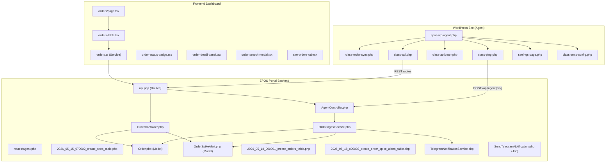
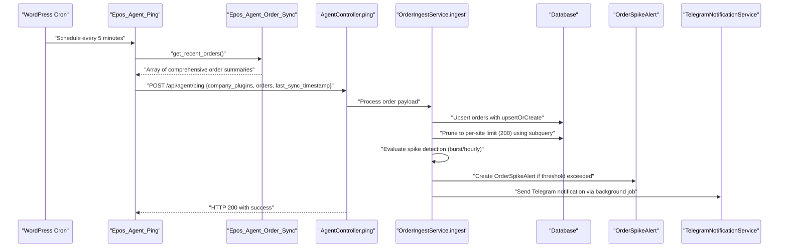
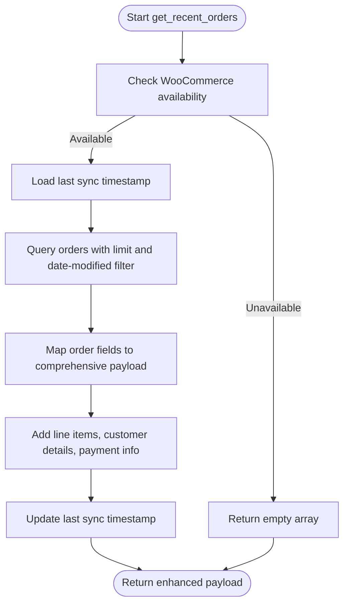
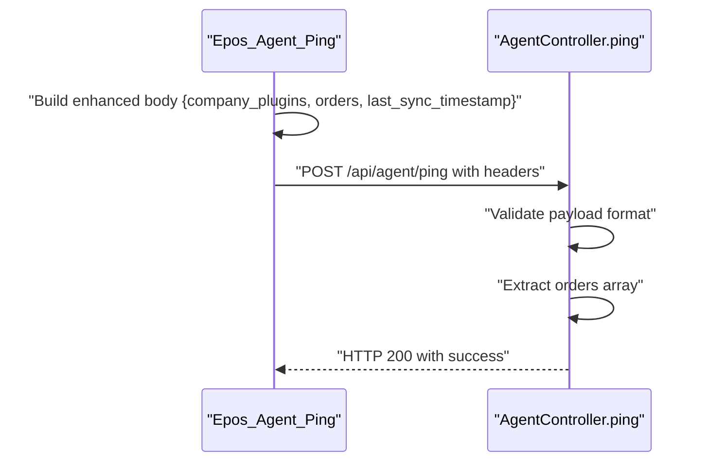
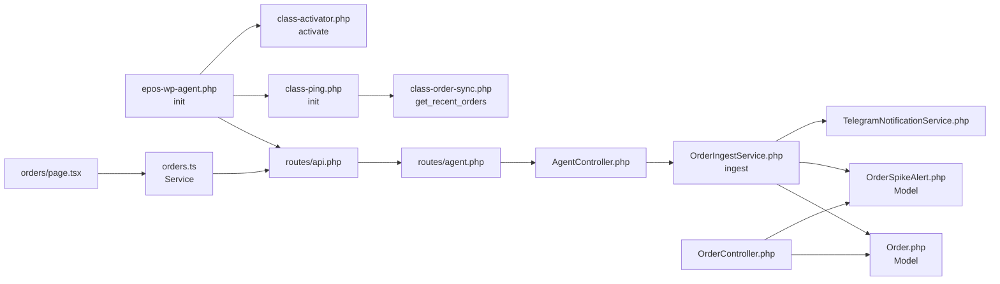

# Order Synchronization

<cite>
**Referenced Files in This Document**
- [epos-wp-agent.php](file://agent/epos-wp-agent/epos-wp-agent.php)
- [class-order-sync.php](file://agent/epos-wp-agent/includes/class-order-sync.php)
- [class-ping.php](file://agent/epos-wp-agent/includes/class-ping.php)
- [class-activator.php](file://agent/epos-wp-agent/includes/class-activator.php)
- [class-api.php](file://agent/epos-wp-agent/includes/class-api.php)
- [settings-page.php](file://agent/epos-wp-agent/admin/settings-page.php)
- [class-smtp-config.php](file://agent/epos-wp-agent/includes/class-smtp-config.php)
- [AgentController.php](file://portal/app/Http/Controllers/Agent/AgentController.php)
- [OrderController.php](file://portal/app/Http/Controllers/Portal/OrderController.php)
- [OrderIngestService.php](file://portal/app/Services/OrderIngestService.php)
- [Order.php](file://portal/app/Models/Order.php)
- [OrderSpikeAlert.php](file://portal/app/Models/OrderSpikeAlert.php)
- [TelegramNotificationService.php](file://portal/app/Services/TelegramNotificationService.php)
- [SendTelegramNotification.php](file://portal/app/Jobs/SendTelegramNotification.php)
- [agent.php](file://portal/routes/agent.php)
- [api.php](file://portal/routes/api.php)
- [2026_05_15_070002_create_sites_table.php](file://portal/database/migrations/2026_05_15_070002_create_sites_table.php)
- [2026_05_18_000001_create_orders_table.php](file://portal/database/migrations/2026_05_18_000001_create_orders_table.php)
- [2026_05_18_000002_create_order_spike_alerts_table.php](file://portal/database/migrations/2026_05_18_000002_create_order_spike_alerts_table.php)
- [page.tsx](file://portal/frontend/src/app/(dashboard)/orders/page.tsx)
- [orders-table.tsx](file://portal/frontend/src/components/orders/orders-table.tsx)
- [orders.ts](file://portal/frontend/src/lib/services/orders.ts)
- [order-status-badge.tsx](file://portal/frontend/src/components/orders/order-status-badge.tsx)
- [DatabaseSeeder.php](file://portal/database/seeders/DatabaseSeeder.php)
</cite>

## Update Summary
**Changes Made**
- Enhanced OrderController with comprehensive CRUD API for order management
- Implemented OrderIngestService with advanced order spike detection and alerting system
- Added Order model with 200-order limit per site and comprehensive metadata preservation
- Introduced OrderSpikeAlert model with 60-minute cooldown system for alert prevention
- Integrated Telegram notification service with background job processing and retry mechanism
- Developed complete frontend orders dashboard with real-time monitoring and filtering capabilities
- Enhanced synchronization with per-site order limits, pruning mechanisms, and dual-threshold spike detection

## Table of Contents
1. [Introduction](#introduction)
2. [Project Structure](#project-structure)
3. [Core Components](#core-components)
4. [Architecture Overview](#architecture-overview)
5. [Detailed Component Analysis](#detailed-component-analysis)
6. [Order Tracking and Alerting System](#order-tracking-and-alerting-system)
7. [Frontend Orders Dashboard](#frontend-orders-dashboard)
8. [Dependency Analysis](#dependency-analysis)
9. [Performance Considerations](#performance-considerations)
10. [Troubleshooting Guide](#troubleshooting-guide)
11. [Conclusion](#conclusion)

## Introduction
This document explains the comprehensive WooCommerce order synchronization system between a WordPress site (the Agent) and the EPOS Portal. The system has evolved from basic order summaries to a full-featured order management platform with real-time tracking, intelligent spike detection, automated alerting, and a complete frontend dashboard. It covers order data collection, transformation, persistence, transmission protocols, real-time monitoring, conflict resolution strategies, data consistency mechanisms, order status mapping, custom field handling, metadata preservation, configuration options, filtering criteria, error handling, and performance considerations for large order volumes.

## Project Structure
The order synchronization system now spans three major components:
- WordPress plugin (Agent) that runs on the site and periodically pings the Portal with order summaries
- Laravel backend (Portal) that receives pings, persists orders, detects spikes, and manages the frontend dashboard
- React frontend that provides real-time order monitoring and management capabilities

**Diagram sources**
- [epos-wp-agent.php:43-53](file://agent/epos-wp-agent/epos-wp-agent.php#L43-L53)
- [class-order-sync.php:13-47](file://agent/epos-wp-agent/includes/class-order-sync.php#L13-L47)
- [class-ping.php:29-81](file://agent/epos-wp-agent/includes/class-ping.php#L29-L81)
- [class-activator.php:12-30](file://agent/epos-wp-agent/includes/class-activator.php#L12-L30)
- [class-api.php:8-45](file://agent/epos-wp-agent/includes/class-api.php#L8-L45)
- [settings-page.php:10-27](file://agent/epos-wp-agent/admin/settings-page.php#L10-L27)
- [class-smtp-config.php:13-41](file://agent/epos-wp-agent/includes/class-smtp-config.php#L13-L41)
- [AgentController.php:86-163](file://portal/app/Http/Controllers/Agent/AgentController.php#L86-L163)
- [agent.php:16-19](file://portal/routes/agent.php#L16-L19)
- [2026_05_15_070002_create_sites_table.php:11-27](file://portal/database/migrations/2026_05_15_070002_create_sites_table.php#L11-L27)
- [Order.php:1-46](file://portal/app/Models/Order.php#L1-L46)
- [OrderSpikeAlert.php:1-30](file://portal/app/Models/OrderSpikeAlert.php#L1-L30)
- [OrderIngestService.php:1-232](file://portal/app/Services/OrderIngestService.php#L1-L232)
- [OrderController.php:1-329](file://portal/app/Http/Controllers/Portal/OrderController.php#L1-L329)
- [2026_05_18_000001_create_orders_table.php:1-59](file://portal/database/migrations/2026_05_18_000001_create_orders_table.php#L1-L59)
- [2026_05_18_000002_create_order_spike_alerts_table.php:1-37](file://portal/database/migrations/2026_05_18_000002_create_order_spike_alerts_table.php#L1-L37)
- [api.php:151-158](file://portal/routes/api.php#L151-L158)
- [TelegramNotificationService.php:1-128](file://portal/app/Services/TelegramNotificationService.php#L1-L128)
- [SendTelegramNotification.php:1-76](file://portal/app/Jobs/SendTelegramNotification.php#L1-L76)
- [page.tsx:1-211](file://portal/frontend/src/app/(dashboard)/orders/page.tsx#L1-L211)
- [orders-table.tsx:1-148](file://portal/frontend/src/components/orders/orders-table.tsx#L1-L148)
- [orders.ts:1-39](file://portal/frontend/src/lib/services/orders.ts#L1-L39)
- [order-status-badge.tsx:1-39](file://portal/frontend/src/components/orders/order-status-badge.tsx#L1-L39)

## Core Components
- **Order Collection**: Collects recent WooCommerce orders modified since the last sync with comprehensive metadata enrichment
- **Transformation**: Builds a comprehensive payload with essential order attributes including line items and customer details
- **Transmission**: Periodic ping to the Portal's /api/agent/ping endpoint with enhanced payload structure
- **Persistence**: Full order storage with per-site limits and pruning mechanisms
- **Spike Detection**: Real-time order volume monitoring with burst and hourly thresholds using dual-tier detection system
- **Alerting**: Telegram notifications with 60-minute cooldown system and background job processing
- **Frontend Dashboard**: Real-time order monitoring with filtering, searching, and status visualization
- **Validation**: Comprehensive validation of incoming data with error handling
- **Configuration**: Extensive settings for order limits, spike thresholds, and notification preferences

Key enhancements:
- **Synchronization frequency**: Every five minutes via WordPress cron
- **Order persistence**: Up to 200 most recent orders per site with automatic pruning using subquery-based deletion
- **Spike detection**: Two-tier system with burst (15-minute) and hourly thresholds with priority-based evaluation
- **Real-time monitoring**: Frontend dashboard with live order updates and status badges
- **Telegram integration**: Automated alerts for order spikes with cooldown enforcement and retry mechanism
- **Comprehensive API**: Full CRUD operations with filtering, pagination, and site-scoped access control

**Section sources**
- [class-order-sync.php:13-47](file://agent/epos-wp-agent/includes/class-order-sync.php#L13-L47)
- [class-ping.php:18-24](file://agent/epos-wp-agent/includes/class-ping.php#L18-L24)
- [class-ping.php:44-48](file://agent/epos-wp-agent/includes/class-ping.php#L44-L48)
- [AgentController.php:150-155](file://portal/app/Http/Controllers/Agent/AgentController.php#L150-L155)
- [OrderIngestService.php:24-28](file://portal/app/Services/OrderIngestService.php#L24-L28)
- [OrderIngestService.php:133-150](file://portal/app/Services/OrderIngestService.php#L133-L150)
- [OrderIngestService.php:156-183](file://portal/app/Services/OrderIngestService.php#L156-L183)
- [TelegramNotificationService.php:16-44](file://portal/app/Services/TelegramNotificationService.php#L16-L44)

## Architecture Overview
The enhanced system now provides bidirectional order management with real-time monitoring capabilities. The Agent periodically pings the Portal with comprehensive order data, which is persisted and analyzed for spike detection. The Portal exposes a complete API for order management and provides a rich frontend dashboard for real-time monitoring.

**Diagram sources**
- [class-ping.php:18-24](file://agent/epos-wp-agent/includes/class-ping.php#L18-L24)
- [class-ping.php:29-81](file://agent/epos-wp-agent/includes/class-ping.php#L29-L81)
- [class-order-sync.php:13-47](file://agent/epos-wp-agent/includes/class-order-sync.php#L13-L47)
- [AgentController.php:86-163](file://portal/app/Http/Controllers/Agent/AgentController.php#L86-L163)
- [OrderIngestService.php:39-74](file://portal/app/Services/OrderIngestService.php#L39-L74)
- [OrderIngestService.php:133-150](file://portal/app/Services/OrderIngestService.php#L133-L150)
- [OrderIngestService.php:156-183](file://portal/app/Services/OrderIngestService.php#L156-L183)

## Detailed Component Analysis

### Enhanced Order Collection and Transformation
The order collection system has been significantly enhanced to provide comprehensive order data:

- **Collection criteria**:
  - Uses WooCommerce wc_get_orders function with limit and date-modified filter
  - Enhanced payload includes line items, customer details, payment information, and order metadata
  - Last sync timestamp stored in WordPress options for incremental synchronization
- **Output shape**:
  - Comprehensive order fields including identifiers, totals, currency, customer contact, item count, timestamps
  - Rich order details: line_items as JSON, billing_address, payment_method, payment_method_title
  - Enhanced metadata: items_count, latest_note, order_date, synced_at
- **Update behavior**:
  - After collecting, the last sync timestamp is updated to the current time
  - Supports both legacy flat arrays and new wrapped envelope format

**Diagram sources**
- [class-order-sync.php:13-47](file://agent/epos-wp-agent/includes/class-order-sync.php#L13-L47)

**Section sources**
- [class-order-sync.php:13-47](file://agent/epos-wp-agent/includes/class-order-sync.php#L13-L47)

### Transmission Protocol and Enhanced Authentication
The transmission protocol now supports enhanced authentication and comprehensive payload structure:

- **Endpoint**: POST /api/agent/ping
- **Headers**:
  - Content-Type: application/json
  - X-Agent-Key: Provided by the Portal during registration
  - X-Site-Url: WordPress site URL
- **Body**:
  - company_plugins: List of EPOS plugins with slug, version, and active flag
  - orders: Array of comprehensive order summaries with enhanced metadata
  - last_sync_timestamp: Timestamp for incremental synchronization
- **Authentication**:
  - Verified by AgentAuthMiddleware on the Portal side using the X-Agent-Key header
  - Enhanced validation for both legacy and new payload formats

**Diagram sources**
- [class-ping.php:50-62](file://agent/epos-wp-agent/includes/class-ping.php#L50-L62)
- [AgentController.php:86-163](file://portal/app/Http/Controllers/Agent/AgentController.php#L86-L163)
- [agent.php:16-19](file://portal/routes/agent.php#L16-L19)

**Section sources**
- [class-ping.php:50-62](file://agent/epos-wp-agent/includes/class-ping.php#L50-L62)
- [AgentController.php:86-163](file://portal/app/Http/Controllers/Agent/AgentController.php#L86-L163)
- [agent.php:16-19](file://portal/routes/agent.php#L16-L19)

### Status Mapping and Enhanced Metadata Preservation
The system now provides comprehensive status mapping and metadata preservation:

- **Status mapping**:
  - Site status transitions to connected upon successful ping
  - Recovery: If a site was previously disconnected, it is marked connected upon successful ping
  - Enhanced order status badges with color-coded styling for better visualization
- **Metadata preserved**:
  - WordPress and PHP versions
  - WooCommerce presence flag
  - EPOS plugin inventory (slug, version, active)
  - Comprehensive order metadata including line items, customer details, and payment information
- **Order metadata**:
  - Rich order details: line_items as JSON, billing_address, payment_method, payment_method_title
  - Enhanced order tracking: items_count, latest_note, order_date, synced_at

**Section sources**
- [class-activator.php:35-76](file://agent/epos-wp-agent/includes/class-activator.php#L35-L76)
- [AgentController.php:30-37](file://portal/app/Http/Controllers/Agent/AgentController.php#L30-L37)
- [AgentController.php:114-124](file://portal/app/Http/Controllers/Agent/AgentController.php#L114-L124)
- [class-order-sync.php:29-40](file://agent/epos-wp-agent/includes/class-order-sync.php#L29-L40)
- [Order.php:13-44](file://portal/app/Models/Order.php#L13-L44)
- [order-status-badge.tsx:8-28](file://portal/frontend/src/components/orders/order-status-badge.tsx#L8-L28)

### Configuration Options and Enhanced Filtering Criteria
The system now provides extensive configuration options and filtering capabilities:

- **Admin settings**:
  - Portal URL and API key are stored as sanitized options
  - Connection test triggers a handshake with the Portal
  - Order management settings: orders_per_site_limit (default 200), order_spike_enabled (default true)
  - Spike detection thresholds: order_spike_threshold_hourly (default 50), order_spike_threshold_burst (default 20)
  - Telegram integration settings: bot token, chat ID, topic ID
- **Filtering criteria**:
  - Limit: Configurable per-site limit (default 200 orders)
  - Sort: By order_date descending for chronological ordering
  - Filter: Multiple dimensions including site_id, status, payment_method, date ranges
  - Enhanced search: Order number and WooCommerce order ID lookup
- **Authentication keys**:
  - X-Agent-Key header is required for all Agent routes
  - Enhanced API authentication with role-based access control

**Section sources**
- [settings-page.php:20-27](file://agent/epos-wp-agent/admin/settings-page.php#L20-L27)
- [settings-page.php:30-45](file://agent/epos-wp-agent/admin/settings-page.php#L30-L45)
- [class-order-sync.php:20-25](file://agent/epos-wp-agent/includes/class-order-sync.php#L20-L25)
- [class-order-sync.php:21-22](file://agent/epos-wp-agent/includes/class-order-sync.php#L21-L22)
- [class-order-sync.php:24](file://agent/epos-wp-agent/includes/class-order-sync.php#L24)
- [agent.php:16-19](file://portal/routes/agent.php#L16-L19)
- [DatabaseSeeder.php:55-60](file://portal/database/seeders/DatabaseSeeder.php#L55-L60)

### Error Handling and Enhanced Connection Status
The system provides comprehensive error handling and connection status tracking:

- **Connection status tracking**:
  - Stored as an option and updated based on HTTP response codes
  - Values include pending, connected, disconnected, and error
  - Enhanced logging for order ingestion failures and spike detection errors
- **Error logging**:
  - WordPress errors are logged when ping fails
  - HTTP non-200 responses are recorded as errors
  - Database transaction rollbacks for order persistence failures
  - Telegram notification failures are logged separately
- **SMTP configuration**:
  - Portal can update SMTP settings via REST endpoints
  - Test emails can be sent using configured settings
  - Enhanced error handling for Telegram API failures

**Section sources**
- [class-ping.php:64-80](file://agent/epos-wp-agent/includes/class-ping.php#L64-L80)
- [settings-page.php:51-56](file://agent/epos-wp-agent/admin/settings-page.php#L51-L56)
- [class-smtp-config.php:13-41](file://agent/epos-wp-agent/includes/class-smtp-config.php#L13-L41)
- [class-smtp-config.php:49-78](file://agent/epos-wp-agent/includes/class-smtp-config.php#L49-L78)
- [OrderIngestService.php:205-211](file://portal/app/Services/OrderIngestService.php#L205-L211)

## Order Tracking and Alerting System

### Order Persistence Layer
The system now provides comprehensive order persistence with sophisticated data management:

- **Order Model**: Complete order entity with rich metadata including line items, customer details, and payment information
- **Database Schema**: Optimized for order retrieval and filtering with appropriate indexes
- **Per-site Limits**: Automatic pruning to maintain manageable dataset sizes using subquery-based deletion
- **Upsert Operations**: Idempotent order creation/updating based on site_id + woo_order_id composite key

**Section sources**
- [Order.php:1-46](file://portal/app/Models/Order.php#L1-L46)
- [2026_05_18_000001_create_orders_table.php:1-59](file://portal/database/migrations/2026_05_18_000001_create_orders_table.php#L1-L59)

### Spike Detection and Alerting
The system implements sophisticated order spike detection with multiple thresholds and cooldown mechanisms:

- **Detection Rules**:
  - Burst detection: Orders exceeding threshold within 15 minutes with priority evaluation
  - Hourly detection: Orders exceeding threshold within 60 minutes
  - Priority: Burst detection takes precedence over hourly detection
- **Cooldown System**: 60-minute cooldown prevents alert flooding during sustained traffic
- **Telegram Integration**: Automated notifications with contextual links to order details
- **Audit Trail**: Persistent record of all triggered alerts with delivery status
- **Background Processing**: Telegram notifications processed via queued jobs with retry mechanism

**Section sources**
- [OrderIngestService.php:156-183](file://portal/app/Services/OrderIngestService.php#L156-L183)
- [OrderIngestService.php:185-191](file://portal/app/Services/OrderIngestService.php#L185-L191)
- [OrderIngestService.php:193-212](file://portal/app/Services/OrderIngestService.php#L193-L212)
- [OrderSpikeAlert.php:1-30](file://portal/app/Models/OrderSpikeAlert.php#L1-L30)
- [2026_05_18_000002_create_order_spike_alerts_table.php:1-37](file://portal/database/migrations/2026_05_18_000002_create_order_spike_alerts_table.php#L1-L37)

### Order Management API
The system provides a comprehensive REST API for order management:

- **Global Endpoints**: 
  - GET /api/orders - Paginated order listing with filters and most active sites
  - GET /api/orders/search - Order search by number or ID with fallback URLs
  - GET /api/orders/filter-options - Dynamic filter dropdown options
  - GET /api/orders/most-active - Top sites by order volume
- **Per-site Endpoints**:
  - GET /api/sites/{site}/orders - Site-specific order listing with stats
  - GET /api/sites/{site}/orders/stats - Site order statistics
  - GET /api/orders/{id} - Individual order detail
- **Authorization**: Role-based access control with site scoping and comprehensive filtering

**Section sources**
- [OrderController.php:28-62](file://portal/app/Http/Controllers/Portal/OrderController.php#L28-L62)
- [OrderController.php:67-117](file://portal/app/Http/Controllers/Portal/OrderController.php#L67-L117)
- [OrderController.php:178-188](file://portal/app/Http/Controllers/Portal/OrderController.php#L178-L188)
- [OrderController.php:194-216](file://portal/app/Http/Controllers/Portal/OrderController.php#L194-L216)
- [OrderController.php:233-283](file://portal/app/Http/Controllers/Portal/OrderController.php#L233-L283)
- [api.php:151-158](file://portal/routes/api.php#L151-L158)

## Frontend Orders Dashboard

### Real-time Monitoring Interface
The frontend provides a comprehensive orders dashboard with real-time monitoring capabilities:

- **Global Orders View**: 
  - Filterable order table with status badges and customer information
  - Most active sites display showing today's order volume
  - Pagination with configurable page sizes (max 50 per page)
- **Advanced Filtering**:
  - Site selection dropdown with dynamic options
  - Status filtering with comprehensive status options
  - Payment method filtering with dynamic dropdowns
  - Date range selection (24h, 7d, 30d, All cached)
- **Order Details**:
  - Inline expandable detail panels for order information
  - Direct links to WordPress admin order editing
  - Real-time status updates and last synced indicators

**Section sources**
- [page.tsx:32-211](file://portal/frontend/src/app/(dashboard)/orders/page.tsx#L32-L211)
- [orders-table.tsx:29-148](file://portal/frontend/src/components/orders/orders-table.tsx#L29-L148)
- [orders.ts:13-38](file://portal/frontend/src/lib/services/orders.ts#L13-L38)

### Interactive Components
The dashboard consists of several interactive components working together:

- **OrdersTable**: Reusable table component supporting both global and per-site views
- **OrderStatusBadge**: Color-coded status indicators with proper styling for light/dark themes
- **OrderDetailPanel**: Expandable panels showing comprehensive order details
- **OrderSearchModal**: Modal interface for quick order search across all sites
- **SiteOrdersTab**: Specialized view for individual site order history

**Section sources**
- [orders-table.tsx:1-148](file://portal/frontend/src/components/orders/orders-table.tsx#L1-L148)
- [order-status-badge.tsx:1-39](file://portal/frontend/src/components/orders/order-status-badge.tsx#L1-L39)
- [orders.ts:13-38](file://portal/frontend/src/lib/services/orders.ts#L13-L38)

## Dependency Analysis
The enhanced system introduces new dependencies and relationships:

- **WordPress plugin initialization**: Registers REST routes, cron schedules, updater hooks, and order synchronization
- **OrderIngestService**: Central orchestrator for order processing, spike detection, and alerting
- **OrderController**: API gateway for order management with comprehensive filtering and authorization
- **Frontend integration**: React components communicating with REST API through service layer
- **Telegram integration**: Notification service for order spike alerts with caching, background jobs, and retry mechanism

**Diagram sources**
- [epos-wp-agent.php:43-53](file://agent/epos-wp-agent/epos-wp-agent.php#L43-L53)
- [class-api.php:8-45](file://agent/epos-wp-agent/includes/class-api.php#L8-L45)
- [class-ping.php:7-13](file://agent/epos-wp-agent/includes/class-ping.php#L7-L13)
- [class-activator.php:12-30](file://agent/epos-wp-agent/includes/class-activator.php#L12-L30)
- [agent.php:16-19](file://portal/routes/agent.php#L16-L19)
- [AgentController.php:86-163](file://portal/app/Http/Controllers/Agent/AgentController.php#L86-L163)
- [OrderIngestService.php:1-232](file://portal/app/Services/OrderIngestService.php#L1-L232)
- [OrderController.php:1-329](file://portal/app/Http/Controllers/Portal/OrderController.php#L1-L329)
- [page.tsx:1-211](file://portal/frontend/src/app/(dashboard)/orders/page.tsx#L1-L211)
- [orders.ts:1-39](file://portal/frontend/src/lib/services/orders.ts#L1-L39)

**Section sources**
- [epos-wp-agent.php:43-53](file://agent/epos-wp-agent/epos-wp-agent.php#L43-L53)
- [class-ping.php:7-13](file://agent/epos-wp-agent/includes/class-ping.php#L7-L13)
- [class-api.php:8-45](file://agent/epos-wp-agent/includes/class-api.php#L8-L45)
- [agent.php:16-19](file://portal/routes/agent.php#L16-L19)
- [OrderIngestService.php:1-232](file://portal/app/Services/OrderIngestService.php#L1-L232)
- [OrderController.php:1-329](file://portal/app/Http/Controllers/Portal/OrderController.php#L1-L329)

## Performance Considerations
The enhanced system addresses performance considerations for large order volumes:

- **Synchronization cadence**:
  - Every five minutes via cron reduces server load while maintaining near real-time data
  - Enhanced batch processing with configurable per-site limits (default 200 orders)
- **Database optimization**:
  - Composite unique index on (site_id, woo_order_id) for fast upsert operations
  - Strategic indexes on order_date, status, and site_id for efficient querying
  - Subquery-based deletion for efficient pruning operations
- **Incremental synchronization**:
  - Using last-sync timestamp with enhanced payload format
  - Support for both legacy flat arrays and new wrapped envelope format
- **Frontend optimization**:
  - Client-side pagination with configurable page sizes (max 50)
  - Lazy loading of order detail panels
  - Efficient filtering with debounced API calls
- **Scalability recommendations**:
  - Monitor order ingestion rates and adjust per-site limits accordingly
  - Consider database connection pooling for high-volume environments
  - Implement Redis caching for frequently accessed filter options
  - Add background job processing for heavy order analysis tasks
- **Memory management**:
  - Subquery-based deletion prevents memory issues with large datasets
  - Transaction boundaries ensure data consistency during bulk operations

**Section sources**
- [OrderIngestService.php:133-150](file://portal/app/Services/OrderIngestService.php#L133-L150)
- [Order.php:47-51](file://portal/app/Models/Order.php#L47-L51)
- [page.tsx:48-81](file://portal/frontend/src/app/(dashboard)/orders/page.tsx#L48-L81)
- [orders.ts:14-25](file://portal/frontend/src/lib/services/orders.ts#L14-L25)

## Troubleshooting Guide
Enhanced troubleshooting guidance for the comprehensive order system:

- **Connection failures**:
  - Verify Portal URL and API key in settings
  - Check that the X-Agent-Key header matches the stored key
  - Review WordPress error logs for ping failures
  - Validate database connectivity for order persistence
- **Order data issues**:
  - Confirm WooCommerce is active and orders exist
  - Ensure the last sync timestamp is being updated after each ping
  - Check order ingestion logs for database transaction failures
  - Verify per-site order limits are appropriate for business volume
- **Spike detection problems**:
  - Confirm order_spike_enabled setting is true
  - Adjust threshold values based on historical order volume
  - Check Telegram integration settings if alerts are not firing
  - Verify cooldown period is not preventing alert delivery
  - Monitor Telegram notification job queue for processing failures
- **Frontend dashboard issues**:
  - Clear browser cache if order data appears stale
  - Check API response codes in browser developer tools
  - Verify user permissions for accessing orders across sites
  - Ensure proper timezone configuration for order date filtering
- **Telegram notification failures**:
  - Test Telegram connection using settings page
  - Verify bot token, chat ID, and topic ID configurations
  - Check Telegram API rate limits and service availability
  - Review notification logs for detailed error information
  - Monitor background job queue for failed Telegram notifications
- **Performance issues**:
  - Monitor database query performance for order pruning operations
  - Check queue worker status for Telegram notification processing
  - Verify proper indexing on order_date and site_id columns
  - Consider increasing database connection pool size for high-volume environments

**Section sources**
- [settings-page.php:30-45](file://agent/epos-wp-agent/admin/settings-page.php#L30-L45)
- [class-ping.php:64-80](file://agent/epos-wp-agent/includes/class-ping.php#L64-L80)
- [class-smtp-config.php:49-78](file://agent/epos-wp-agent/includes/class-smtp-config.php#L49-L78)
- [OrderIngestService.php:205-211](file://portal/app/Services/OrderIngestService.php#L205-L211)
- [TelegramNotificationService.php:16-44](file://portal/app/Services/TelegramNotificationService.php#L16-L44)

## Conclusion
The enhanced order synchronization system provides a comprehensive solution for WooCommerce order management with real-time monitoring, intelligent spike detection, and robust alerting capabilities. The system now supports full order lifecycle management with persistent storage, sophisticated filtering, and a rich frontend dashboard. The addition of order spike detection with 60-minute cooldown system and Telegram integration provides proactive monitoring capabilities for order volume anomalies. The modular architecture allows for easy extension and customization while maintaining performance and reliability for large-scale order volumes. The comprehensive API, background job processing, and sophisticated data management make this system suitable for enterprise-level order tracking and analysis.