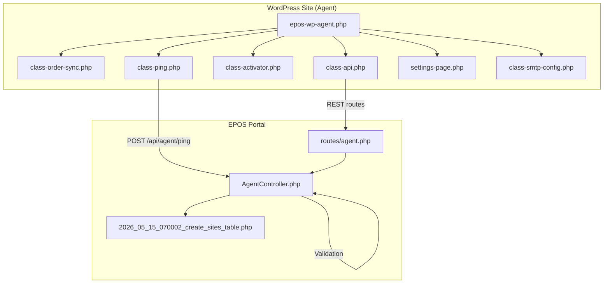
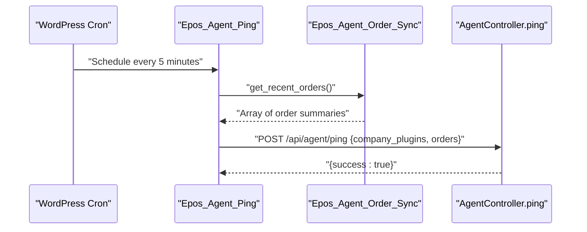
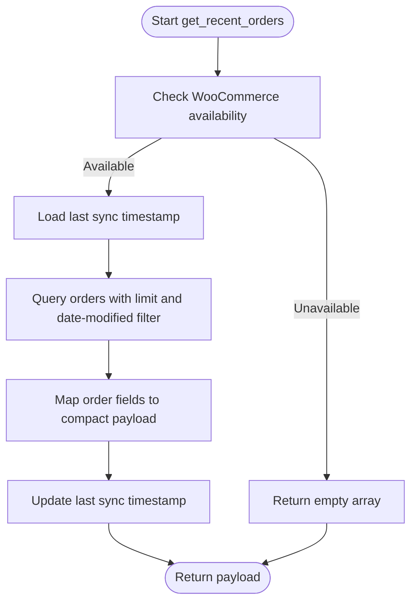
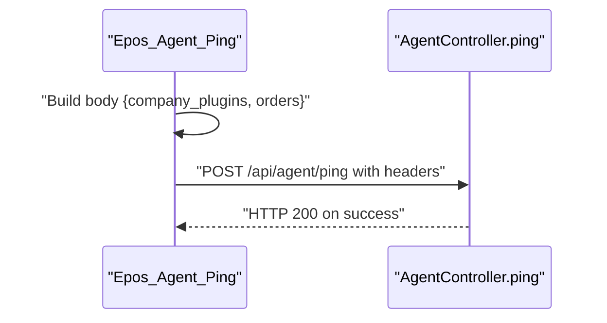
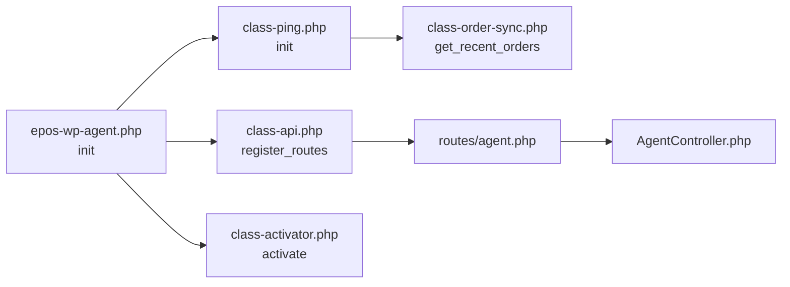

# Order Synchronization

<cite>
**Referenced Files in This Document**
- [epos-wp-agent.php](file://agent/epos-wp-agent/epos-wp-agent.php)
- [class-order-sync.php](file://agent/epos-wp-agent/includes/class-order-sync.php)
- [class-ping.php](file://agent/epos-wp-agent/includes/class-ping.php)
- [class-activator.php](file://agent/epos-wp-agent/includes/class-activator.php)
- [class-api.php](file://agent/epos-wp-agent/includes/class-api.php)
- [settings-page.php](file://agent/epos-wp-agent/admin/settings-page.php)
- [class-smtp-config.php](file://agent/epos-wp-agent/includes/class-smtp-config.php)
- [AgentController.php](file://portal/app/Http/Controllers/Agent/AgentController.php)
- [agent.php](file://portal/routes/agent.php)
- [2026_05_15_070002_create_sites_table.php](file://portal/database/migrations/2026_05_15_070002_create_sites_table.php)
</cite>

## Table of Contents
1. [Introduction](#introduction)
2. [Project Structure](#project-structure)
3. [Core Components](#core-components)
4. [Architecture Overview](#architecture-overview)
5. [Detailed Component Analysis](#detailed-component-analysis)
6. [Dependency Analysis](#dependency-analysis)
7. [Performance Considerations](#performance-considerations)
8. [Troubleshooting Guide](#troubleshooting-guide)
9. [Conclusion](#conclusion)

## Introduction
This document explains the WooCommerce order synchronization system between a WordPress site (the Agent) and the EPOS Portal. It covers how order data is collected, transformed, and transmitted to the Portal, along with synchronization cadence, conflict resolution strategies, data consistency mechanisms, status mapping, custom field handling, metadata preservation, configuration options, filtering criteria, error handling, and performance considerations for large order volumes.

## Project Structure
The order synchronization spans two parts:
- WordPress plugin (Agent) that runs on the site and periodically pings the Portal with order summaries.
- Laravel backend (Portal) that receives the pings and currently validates incoming data while deferring persistence to future phases.

**Diagram sources**
- [epos-wp-agent.php:43-53](file://agent/epos-wp-agent/epos-wp-agent.php#L43-L53)
- [class-order-sync.php:13-47](file://agent/epos-wp-agent/includes/class-order-sync.php#L13-L47)
- [class-ping.php:29-81](file://agent/epos-wp-agent/includes/class-ping.php#L29-L81)
- [class-activator.php:12-30](file://agent/epos-wp-agent/includes/class-activator.php#L12-L30)
- [class-api.php:8-45](file://agent/epos-wp-agent/includes/class-api.php#L8-L45)
- [settings-page.php:10-27](file://agent/epos-wp-agent/admin/settings-page.php#L10-L27)
- [class-smtp-config.php:13-41](file://agent/epos-wp-agent/includes/class-smtp-config.php#L13-L41)
- [AgentController.php:61-97](file://portal/app/Http/Controllers/Agent/AgentController.php#L61-L97)
- [agent.php:16-19](file://portal/routes/agent.php#L16-L19)
- [2026_05_15_070002_create_sites_table.php:11-27](file://portal/database/migrations/2026_05_15_070002_create_sites_table.php#L11-L27)

**Section sources**
- [epos-wp-agent.php:43-53](file://agent/epos-wp-agent/epos-wp-agent.php#L43-L53)
- [class-ping.php:29-81](file://agent/epos-wp-agent/includes/class-ping.php#L29-L81)
- [AgentController.php:61-97](file://portal/app/Http/Controllers/Agent/AgentController.php#L61-L97)

## Core Components
- Order Collection: Collects recent WooCommerce orders modified since the last sync.
- Transformation: Builds a compact payload with essential order attributes.
- Transmission: Periodic ping to the Portal’s /api/agent/ping endpoint.
- Validation: Portal-side validation of incoming data.
- Persistence: Planned for future phases; current implementation defers persistence.

Key behaviors:
- Synchronization frequency is every five minutes via WordPress cron.
- Orders are limited to a small batch and filtered by modification time.
- Connection status is tracked and updated based on HTTP responses.

**Section sources**
- [class-order-sync.php:13-47](file://agent/epos-wp-agent/includes/class-order-sync.php#L13-L47)
- [class-ping.php:18-24](file://agent/epos-wp-agent/includes/class-ping.php#L18-L24)
- [class-ping.php:44-48](file://agent/epos-wp-agent/includes/class-ping.php#L44-L48)
- [AgentController.php:65-71](file://portal/app/Http/Controllers/Agent/AgentController.php#L65-L71)

## Architecture Overview
The Agent periodically pings the Portal with a JSON payload containing site metadata and a summary of recent orders. The Portal validates the payload and updates site status accordingly. Future phases will persist orders and plugins.

**Diagram sources**
- [class-ping.php:18-24](file://agent/epos-wp-agent/includes/class-ping.php#L18-L24)
- [class-ping.php:29-81](file://agent/epos-wp-agent/includes/class-ping.php#L29-L81)
- [class-order-sync.php:13-47](file://agent/epos-wp-agent/includes/class-order-sync.php#L13-L47)
- [AgentController.php:61-97](file://portal/app/Http/Controllers/Agent/AgentController.php#L61-L97)

## Detailed Component Analysis

### Order Collection and Transformation
- Collection criteria:
  - Uses the WooCommerce wc_get_orders function with a limit and date-modified filter.
  - The date filter is derived from the last successful sync timestamp stored in WordPress options.
- Output shape:
  - Includes identifiers, totals, currency, customer contact, item count, and timestamps.
  - Does not include line items, tax breakdowns, coupons, shipping details, or custom fields.
- Update behavior:
  - After collecting, the last sync timestamp is updated to the current time.

**Diagram sources**
- [class-order-sync.php:13-47](file://agent/epos-wp-agent/includes/class-order-sync.php#L13-L47)

**Section sources**
- [class-order-sync.php:13-47](file://agent/epos-wp-agent/includes/class-order-sync.php#L13-L47)

### Transmission Protocol and Authentication
- Endpoint: POST /api/agent/ping
- Headers:
  - Content-Type: application/json
  - X-Agent-Key: Provided by the Portal during registration
  - X-Site-Url: WordPress site URL
- Body:
  - company_plugins: List of EPOS plugins with slug, version, and active flag.
  - orders: Array of order summaries produced by the sync component.
- Authentication:
  - Verified by AgentAuthMiddleware on the Portal side using the X-Agent-Key header.

**Diagram sources**
- [class-ping.php:50-62](file://agent/epos-wp-agent/includes/class-ping.php#L50-L62)
- [AgentController.php:61-97](file://portal/app/Http/Controllers/Agent/AgentController.php#L61-L97)
- [agent.php:16-19](file://portal/routes/agent.php#L16-L19)

**Section sources**
- [class-ping.php:50-62](file://agent/epos-wp-agent/includes/class-ping.php#L50-L62)
- [AgentController.php:61-97](file://portal/app/Http/Controllers/Agent/AgentController.php#L61-L97)
- [agent.php:16-19](file://portal/routes/agent.php#L16-L19)

### Status Mapping and Metadata Preservation
- Status mapping:
  - Site status transitions to connected upon successful ping.
  - Recovery: If a site was previously disconnected, it is marked connected upon a successful ping.
- Metadata preserved:
  - WordPress and PHP versions.
  - WooCommerce presence flag.
  - EPOS plugin inventory (slug, version, active).
- Order metadata:
  - Only selected fields are included; deeper order details are not transmitted in the current phase.

**Section sources**
- [class-activator.php:35-76](file://agent/epos-wp-agent/includes/class-activator.php#L35-L76)
- [AgentController.php:30-37](file://portal/app/Http/Controllers/Agent/AgentController.php#L30-L37)
- [AgentController.php:76-88](file://portal/app/Http/Controllers/Agent/AgentController.php#L76-L88)
- [class-order-sync.php:29-40](file://agent/epos-wp-agent/includes/class-order-sync.php#L29-L40)

### Configuration Options and Filtering Criteria
- Admin settings:
  - Portal URL and API key are stored as sanitized options.
  - A connection test triggers a handshake with the Portal.
- Filtering criteria:
  - Limit: 20 orders per batch.
  - Sort: By date descending.
  - Filter: Modified after last sync timestamp.
- Authentication keys:
  - X-Agent-Key header is required for all Agent routes.

**Section sources**
- [settings-page.php:20-27](file://agent/epos-wp-agent/admin/settings-page.php#L20-L27)
- [settings-page.php:30-45](file://agent/epos-wp-agent/admin/settings-page.php#L30-L45)
- [class-order-sync.php:20-25](file://agent/epos-wp-agent/includes/class-order-sync.php#L20-L25)
- [class-order-sync.php:21-22](file://agent/epos-wp-agent/includes/class-order-sync.php#L21-L22)
- [class-order-sync.php:24](file://agent/epos-wp-agent/includes/class-order-sync.php#L24)
- [agent.php:16-19](file://portal/routes/agent.php#L16-L19)

### Error Handling and Connection Status
- Connection status tracking:
  - Stored as an option and updated based on HTTP response codes.
  - Values include pending, connected, disconnected, and error.
- Error logging:
  - WordPress errors are logged when ping fails.
  - HTTP non-200 responses are recorded as errors.
- SMTP configuration:
  - Portal can update SMTP settings via REST endpoints.
  - Test emails can be sent using configured settings.

**Section sources**
- [class-ping.php:64-80](file://agent/epos-wp-agent/includes/class-ping.php#L64-L80)
- [settings-page.php:51-56](file://agent/epos-wp-agent/admin/settings-page.php#L51-L56)
- [class-smtp-config.php:13-41](file://agent/epos-wp-agent/includes/class-smtp-config.php#L13-L41)
- [class-smtp-config.php:49-78](file://agent/epos-wp-agent/includes/class-smtp-config.php#L49-L78)

### Data Consistency and Conflict Resolution
- Current behavior:
  - The Portal validates incoming payloads but does not persist orders in the current implementation.
  - The Agent updates the last sync timestamp after each batch, ensuring incremental progress.
- Recommended strategies for future phases:
  - Deduplicate by combining identifiers (e.g., platform order ID + site identifier).
  - Use a last-updated timestamp to reconcile newer records.
  - Implement idempotent writes keyed by a unique sync token or composite key.
  - Maintain a local queue of failed transmissions with retry/backoff.

[No sources needed since this section provides general guidance]

## Dependency Analysis
- WordPress plugin initialization registers REST routes, cron schedules, and updater hooks.
- Ping component depends on order sync when WooCommerce is active.
- Portal routes depend on middleware for authentication and Agent controller for validation.

**Diagram sources**
- [epos-wp-agent.php:43-53](file://agent/epos-wp-agent/epos-wp-agent.php#L43-L53)
- [class-api.php:8-45](file://agent/epos-wp-agent/includes/class-api.php#L8-L45)
- [class-ping.php:7-13](file://agent/epos-wp-agent/includes/class-ping.php#L7-L13)
- [class-activator.php:12-30](file://agent/epos-wp-agent/includes/class-activator.php#L12-L30)
- [agent.php:16-19](file://portal/routes/agent.php#L16-L19)
- [AgentController.php:61-97](file://portal/app/Http/Controllers/Agent/AgentController.php#L61-L97)

**Section sources**
- [epos-wp-agent.php:43-53](file://agent/epos-wp-agent/epos-wp-agent.php#L43-L53)
- [class-ping.php:7-13](file://agent/epos-wp-agent/includes/class-ping.php#L7-L13)
- [class-api.php:8-45](file://agent/epos-wp-agent/includes/class-api.php#L8-L45)
- [agent.php:16-19](file://portal/routes/agent.php#L16-L19)

## Performance Considerations
- Synchronization cadence:
  - Every five minutes via cron reduces server load while keeping data near real-time.
- Batch sizing:
  - Limiting to 20 orders per batch minimizes memory and network overhead.
- Incremental synchronization:
  - Using a last-sync timestamp avoids reprocessing unchanged orders.
- Recommendations for large order volumes:
  - Increase batch size gradually after monitoring resource usage.
  - Consider background jobs and queues on the Portal side for heavy processing.
  - Add pagination or cursor-based continuation tokens if batches grow larger.
  - Monitor HTTP timeouts and adjust the Portal’s processing pipeline to handle bursts.

[No sources needed since this section provides general guidance]

## Troubleshooting Guide
- Connection failures:
  - Verify Portal URL and API key in settings.
  - Check that the X-Agent-Key header matches the stored key.
  - Review WordPress error logs for ping failures.
- Order data not appearing:
  - Confirm WooCommerce is active and orders exist.
  - Ensure the last sync timestamp is being updated after each ping.
- SMTP configuration issues:
  - Use the SMTP test endpoint to validate credentials.
  - Confirm PHPMailer is configured with stored SMTP settings.

**Section sources**
- [settings-page.php:30-45](file://agent/epos-wp-agent/admin/settings-page.php#L30-L45)
- [class-ping.php:64-80](file://agent/epos-wp-agent/includes/class-ping.php#L64-L80)
- [class-smtp-config.php:49-78](file://agent/epos-wp-agent/includes/class-smtp-config.php#L49-L78)

## Conclusion
The current order synchronization system provides a robust foundation for periodic order summaries, secure authentication, and status tracking. While order persistence is deferred to future phases, the existing design supports incremental synchronization, configurable limits, and clear extension points for advanced conflict resolution and performance tuning.