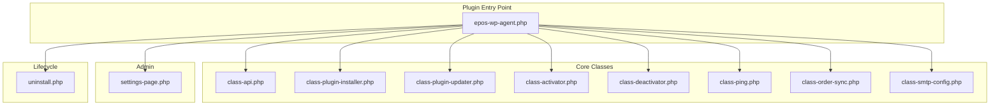
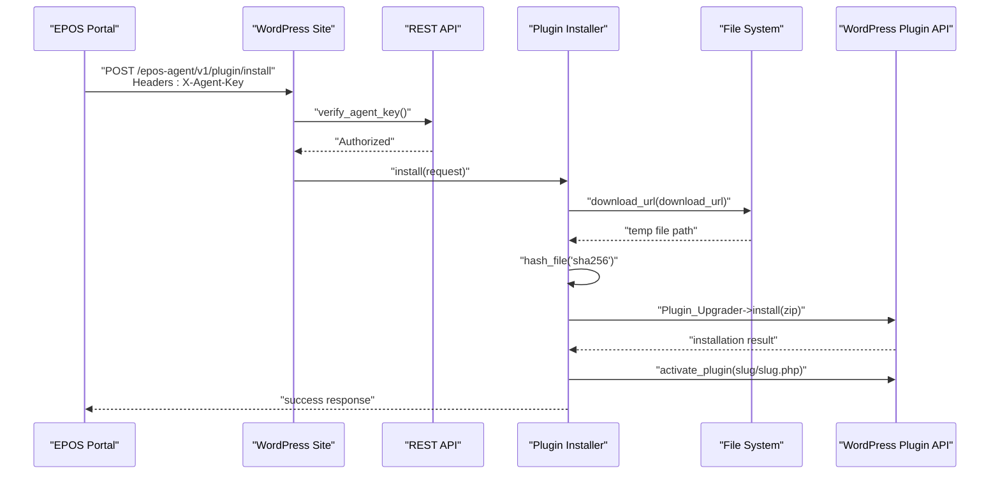
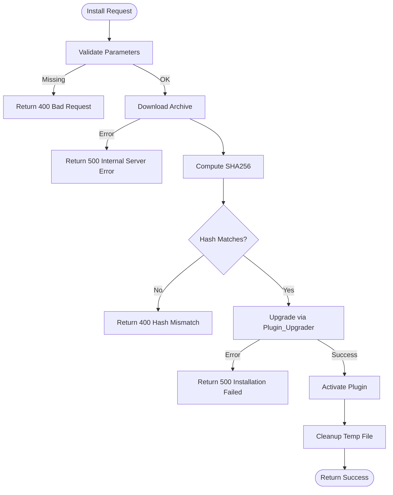
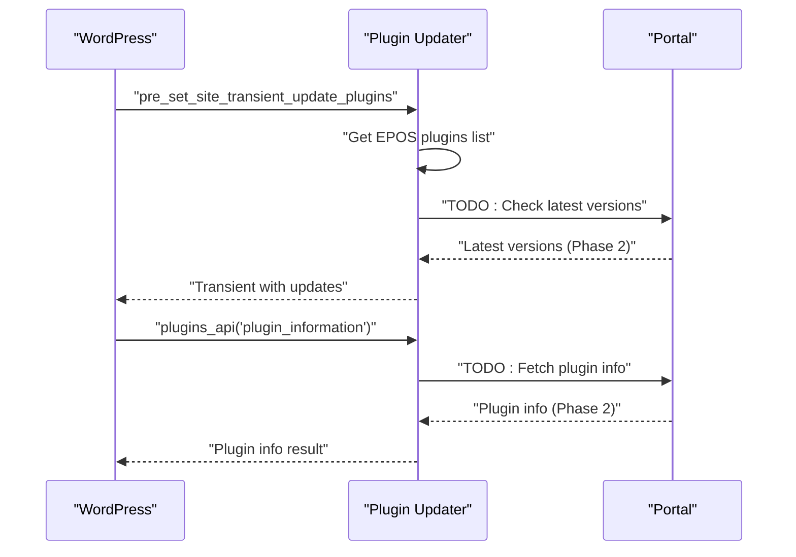
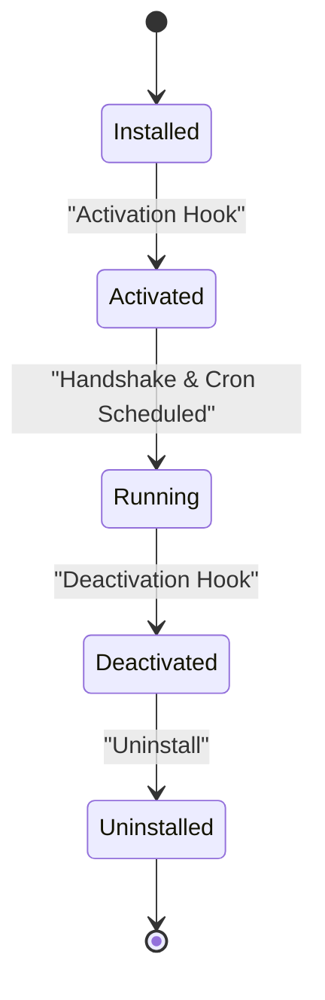
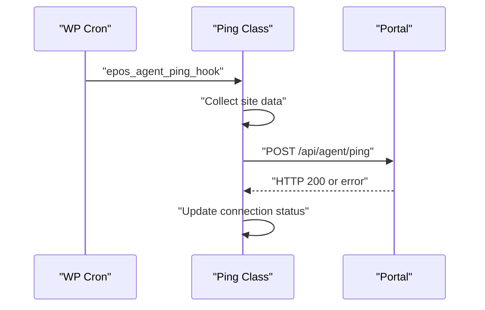
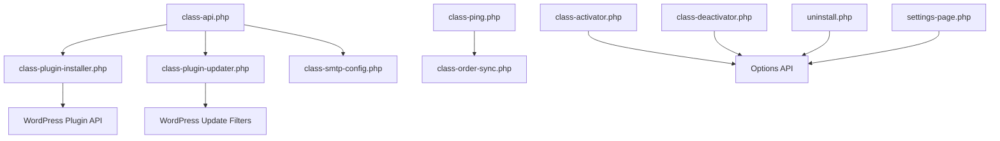

# Plugin Management System

<cite>
**Referenced Files in This Document**
- [epos-wp-agent.php](file://agent/epos-wp-agent/epos-wp-agent.php)
- [class-api.php](file://agent/epos-wp-agent/includes/class-api.php)
- [class-plugin-installer.php](file://agent/epos-wp-agent/includes/class-plugin-installer.php)
- [class-plugin-updater.php](file://agent/epos-wp-agent/includes/class-plugin-updater.php)
- [class-activator.php](file://agent/epos-wp-agent/includes/class-activator.php)
- [class-deactivator.php](file://agent/epos-wp-agent/includes/class-deactivator.php)
- [class-ping.php](file://agent/epos-wp-agent/includes/class-ping.php)
- [class-order-sync.php](file://agent/epos-wp-agent/includes/class-order-sync.php)
- [class-smtp-config.php](file://agent/epos-wp-agent/includes/class-smtp-config.php)
- [settings-page.php](file://agent/epos-wp-agent/admin/settings-page.php)
- [uninstall.php](file://agent/epos-wp-agent/uninstall.php)
- [readme.txt](file://agent/epos-wp-agent/readme.txt)
</cite>

## Table of Contents
1. [Introduction](#introduction)
2. [Project Structure](#project-structure)
3. [Core Components](#core-components)
4. [Architecture Overview](#architecture-overview)
5. [Detailed Component Analysis](#detailed-component-analysis)
6. [Dependency Analysis](#dependency-analysis)
7. [Performance Considerations](#performance-considerations)
8. [Troubleshooting Guide](#troubleshooting-guide)
9. [Conclusion](#conclusion)

## Introduction
This document describes the WordPress agent plugin management system that enables centralized plugin deployment and updates from the EPOS Central Control Portal. It covers the automatic plugin installation process, dependency resolution, compatibility checking, update workflows, repository integration, authentication, secure transfers, configuration options, scheduling preferences, and manual override capabilities. It also addresses common issues such as failed installations, version conflicts, and network connectivity problems.

## Project Structure
The plugin is organized into core components that handle REST API registration, plugin installation, plugin update integration, activation/deactivation hooks, periodic pings, order synchronization, SMTP configuration, and administrative settings.

**Diagram sources**
- [epos-wp-agent.php:26-34](file://agent/epos-wp-agent/epos-wp-agent.php#L26-L34)
- [class-api.php:6-10](file://agent/epos-wp-agent/includes/class-api.php#L6-L10)
- [class-plugin-installer.php:5-6](file://agent/epos-wp-agent/includes/class-plugin-installer.php#L5-L6)
- [class-plugin-updater.php:6-11](file://agent/epos-wp-agent/includes/class-plugin-updater.php#L6-L11)
- [class-activator.php:5-30](file://agent/epos-wp-agent/includes/class-activator.php#L5-L30)
- [class-deactivator.php:5-20](file://agent/epos-wp-agent/includes/class-deactivator.php#L5-L20)
- [class-ping.php:5-13](file://agent/epos-wp-agent/includes/class-ping.php#L5-L13)
- [class-order-sync.php:5-12](file://agent/epos-wp-agent/includes/class-order-sync.php#L5-L12)
- [class-smtp-config.php:5-12](file://agent/epos-wp-agent/includes/class-smtp-config.php#L5-L12)
- [settings-page.php:7-27](file://agent/epos-wp-agent/admin/settings-page.php#L7-L27)
- [uninstall.php:7-10](file://agent/epos-wp-agent/uninstall.php#L7-L10)

**Section sources**
- [epos-wp-agent.php:26-53](file://agent/epos-wp-agent/epos-wp-agent.php#L26-L53)
- [readme.txt:11-20](file://agent/epos-wp-agent/readme.txt#L11-L20)

## Core Components
- REST API Registration: Routes are registered under the namespace epos-agent/v1 with endpoints for plugin installation, SMTP updates/tests, and status reporting.
- Plugin Installer: Handles plugin installation and updates from the Portal, including download, verification, and activation.
- Plugin Updater: Integrates with WordPress update mechanisms for EPOS plugins and defers to the Portal for update information.
- Activation/Deactivation: Schedules periodic pings, performs handshake with the Portal, and manages connection status.
- Order Sync: Collects recent WooCommerce orders for periodic sync to the Portal.
- SMTP Config: Applies SMTP settings and supports test emails.
- Admin Settings: Provides configuration UI for Portal URL and API key, plus connection status display.

**Section sources**
- [class-api.php:15-45](file://agent/epos-wp-agent/includes/class-api.php#L15-L45)
- [class-plugin-installer.php:13-92](file://agent/epos-wp-agent/includes/class-plugin-installer.php#L13-L92)
- [class-plugin-updater.php:8-64](file://agent/epos-wp-agent/includes/class-plugin-updater.php#L8-L64)
- [class-activator.php:12-76](file://agent/epos-wp-agent/includes/class-activator.php#L12-L76)
- [class-ping.php:29-81](file://agent/epos-wp-agent/includes/class-ping.php#L29-L81)
- [class-order-sync.php:13-47](file://agent/epos-wp-agent/includes/class-order-sync.php#L13-L47)
- [class-smtp-config.php:13-103](file://agent/epos-wp-agent/includes/class-smtp-config.php#L13-L103)
- [settings-page.php:20-96](file://agent/epos-wp-agent/admin/settings-page.php#L20-L96)

## Architecture Overview
The plugin exposes REST endpoints that the Portal calls to issue commands. Authentication is enforced via a shared API key. The installer downloads plugin archives, verifies integrity, and installs/updates via WordPress APIs. The updater integrates with WordPress update mechanisms for EPOS plugins and defers to the Portal for update metadata. Periodic pings report site status and optionally order data.

**Diagram sources**
- [class-api.php:18-23](file://agent/epos-wp-agent/includes/class-api.php#L18-L23)
- [class-api.php:50-71](file://agent/epos-wp-agent/includes/class-api.php#L50-L71)
- [class-api.php:76-78](file://agent/epos-wp-agent/includes/class-api.php#L76-L78)
- [class-plugin-installer.php:26-64](file://agent/epos-wp-agent/includes/class-plugin-installer.php#L26-L64)
- [class-plugin-installer.php:82-86](file://agent/epos-wp-agent/includes/class-plugin-installer.php#L82-L86)

## Detailed Component Analysis

### REST API Layer
- Endpoint registration: The API registers routes for plugin install, SMTP update/test, and status.
- Authentication: The verify_agent_key method checks the X-Agent-Key header against the stored API key using constant-time comparison.
- Handler delegation: The plugin install handler delegates to the installer class.

**Diagram sources**
- [class-api.php:18-23](file://agent/epos-wp-agent/includes/class-api.php#L18-L23)
- [class-api.php:50-71](file://agent/epos-wp-agent/includes/class-api.php#L50-L71)
- [class-api.php:76-78](file://agent/epos-wp-agent/includes/class-api.php#L76-L78)

**Section sources**
- [class-api.php:15-45](file://agent/epos-wp-agent/includes/class-api.php#L15-L45)
- [class-api.php:50-71](file://agent/epos-wp-agent/includes/class-api.php#L50-L71)

### Plugin Installation Workflow
- Parameter validation: Ensures plugin_slug, version, download_url, and file_hash are present.
- Download: Uses WordPress download_url with a timeout to fetch the plugin archive.
- Integrity verification: Computes SHA256 hash of the downloaded file and compares with the provided hash.
- Installation: Uses WordPress Plugin_Upgrader with a silent skin to install or update the plugin.
- Activation: Activates the plugin if not already active.
- Cleanup: Removes temporary files after installation.

**Diagram sources**
- [class-plugin-installer.php:19-24](file://agent/epos-wp-agent/includes/class-plugin-installer.php#L19-L24)
- [class-plugin-installer.php:27-34](file://agent/epos-wp-agent/includes/class-plugin-installer.php#L27-L34)
- [class-plugin-installer.php:37-44](file://agent/epos-wp-agent/includes/class-plugin-installer.php#L37-L44)
- [class-plugin-installer.php:56-64](file://agent/epos-wp-agent/includes/class-plugin-installer.php#L56-L64)
- [class-plugin-installer.php:68-80](file://agent/epos-wp-agent/includes/class-plugin-installer.php#L68-L80)
- [class-plugin-installer.php:82-86](file://agent/epos-wp-agent/includes/class-plugin-installer.php#L82-L86)
- [class-plugin-installer.php:66-66](file://agent/epos-wp-agent/includes/class-plugin-installer.php#L66-L66)

**Section sources**
- [class-plugin-installer.php:13-92](file://agent/epos-wp-agent/includes/class-plugin-installer.php#L13-L92)

### Plugin Update Integration
- Update checks: Hooks into pre_set_site_transient_update_plugins to check for updates.
- Plugin info: Hooks into plugins_api for plugin information requests.
- Portal integration: Retrieves Portal URL and API key from options; stubbed for future implementation.
- EPOS plugin filtering: Only handles plugins with slugs prefixed with "epos-".

**Diagram sources**
- [class-plugin-updater.php:8-11](file://agent/epos-wp-agent/includes/class-plugin-updater.php#L8-L11)
- [class-plugin-updater.php:16-44](file://agent/epos-wp-agent/includes/class-plugin-updater.php#L16-L44)
- [class-plugin-updater.php:50-64](file://agent/epos-wp-agent/includes/class-plugin-updater.php#L50-L64)

**Section sources**
- [class-plugin-updater.php:8-64](file://agent/epos-wp-agent/includes/class-plugin-updater.php#L8-L64)

### Activation, Deactivation, and Lifecycle
- Activation: Schedules a 5-minute cron event, sets default options, and attempts a handshake with the Portal.
- Deactivation: Clears the scheduled cron event and updates connection status.
- Uninstall: Removes all plugin options and clears scheduled events.

**Diagram sources**
- [class-activator.php:12-30](file://agent/epos-wp-agent/includes/class-activator.php#L12-L30)
- [class-deactivator.php:11-20](file://agent/epos-wp-agent/includes/class-deactivator.php#L11-L20)
- [uninstall.php:12-30](file://agent/epos-wp-agent/uninstall.php#L12-L30)

**Section sources**
- [class-activator.php:12-76](file://agent/epos-wp-agent/includes/class-activator.php#L12-L76)
- [class-deactivator.php:11-20](file://agent/epos-wp-agent/includes/class-deactivator.php#L11-L20)
- [uninstall.php:12-30](file://agent/epos-wp-agent/uninstall.php#L12-L30)

### Periodic Pings and Connection Monitoring
- Cron schedule: Adds a custom "Every 5 Minutes" interval.
- Ping execution: Sends site information and optionally recent orders to the Portal.
- Connection status: Updates connection status based on HTTP response codes.

**Diagram sources**
- [class-ping.php:18-24](file://agent/epos-wp-agent/includes/class-ping.php#L18-L24)
- [class-ping.php:29-81](file://agent/epos-wp-agent/includes/class-ping.php#L29-L81)

**Section sources**
- [class-ping.php:7-81](file://agent/epos-wp-agent/includes/class-ping.php#L7-L81)

### Order Synchronization
- Recent orders: Retrieves last 20 orders modified since the last sync.
- Data collection: Builds a standardized payload with order details.
- Timestamp: Updates the last sync timestamp after each collection.

**Section sources**
- [class-order-sync.php:13-47](file://agent/epos-wp-agent/includes/class-order-sync.php#L13-L47)

### SMTP Configuration Management
- Settings update: Stores SMTP settings in WordPress options and enables SMTP globally.
- Test email: Sends a test email using configured settings and returns success/failure.
- PHPMailer configuration: Applies SMTP settings via a phpmailer_init hook.

**Section sources**
- [class-smtp-config.php:13-41](file://agent/epos-wp-agent/includes/class-smtp-config.php#L13-L41)
- [class-smtp-config.php:49-78](file://agent/epos-wp-agent/includes/class-smtp-config.php#L49-L78)
- [class-smtp-config.php:83-103](file://agent/epos-wp-agent/includes/class-smtp-config.php#L83-L103)

### Administrative Settings
- Settings page: Provides fields for Portal URL and API key with sanitization.
- Connection test: Performs a handshake with the Portal and displays status.
- Plugin information: Shows plugin version, WordPress version, PHP version, and WooCommerce status.

**Section sources**
- [settings-page.php:20-96](file://agent/epos-wp-agent/admin/settings-page.php#L20-L96)
- [settings-page.php:105-111](file://agent/epos-wp-agent/admin/settings-page.php#L105-L111)

## Dependency Analysis
The plugin depends on WordPress core APIs for file handling, plugin installation/upgrades, cron scheduling, HTTP requests, and option management. The installer relies on WordPress upgrade classes, while the updater integrates with WordPress update filters. The API layer depends on WordPress REST API infrastructure and option storage.

**Diagram sources**
- [class-api.php:76-78](file://agent/epos-wp-agent/includes/class-api.php#L76-L78)
- [class-plugin-installer.php:47-54](file://agent/epos-wp-agent/includes/class-plugin-installer.php#L47-L54)
- [class-plugin-updater.php:9-10](file://agent/epos-wp-agent/includes/class-plugin-updater.php#L9-L10)
- [class-ping.php:46-47](file://agent/epos-wp-agent/includes/class-ping.php#L46-L47)
- [class-activator.php:19-21](file://agent/epos-wp-agent/includes/class-activator.php#L19-L21)
- [class-deactivator.php:12-16](file://agent/epos-wp-agent/includes/class-deactivator.php#L12-L16)
- [uninstall.php:13-24](file://agent/epos-wp-agent/uninstall.php#L13-L24)
- [settings-page.php:21-26](file://agent/epos-wp-agent/admin/settings-page.php#L21-L26)

**Section sources**
- [epos-wp-agent.php:26-34](file://agent/epos-wp-agent/epos-wp-agent.php#L26-L34)
- [class-api.php:15-45](file://agent/epos-wp-agent/includes/class-api.php#L15-L45)

## Performance Considerations
- Network timeouts: The installer uses a 300-second timeout for downloads; adjust based on network conditions.
- Hash verification: SHA256 verification ensures integrity but adds CPU overhead; consider caching verified hashes if repeated.
- Cron intervals: The 5-minute ping interval balances responsiveness with resource usage; monitor server load.
- Memory usage: Large plugin archives increase memory consumption during extraction; ensure sufficient memory limits.
- SSL verification: Enabled by default for secure transfers; disable only in controlled environments.

[No sources needed since this section provides general guidance]

## Troubleshooting Guide
- Authentication failures: Verify the X-Agent-Key header matches the stored API key. Check for typos or expired keys.
- Download errors: Confirm the download URL is accessible and the file exists. Check network connectivity and firewall settings.
- Hash mismatches: Ensure the provided file_hash matches the computed SHA256 of the downloaded archive.
- Installation failures: Check WordPress file permissions and available disk space. Review error messages for specific failure reasons.
- Update integration: The update mechanism is currently a stub; ensure the Portal endpoint is implemented before expecting updates.
- Connection status: Monitor the connection status option and review debug logs for error details.
- SMTP issues: Validate SMTP credentials and test connectivity; use the test email endpoint to confirm configuration.

**Section sources**
- [class-api.php:50-71](file://agent/epos-wp-agent/includes/class-api.php#L50-L71)
- [class-plugin-installer.php:27-34](file://agent/epos-wp-agent/includes/class-plugin-installer.php#L27-L34)
- [class-plugin-installer.php:37-44](file://agent/epos-wp-agent/includes/class-plugin-installer.php#L37-L44)
- [class-plugin-installer.php:68-80](file://agent/epos-wp-agent/includes/class-plugin-installer.php#L68-L80)
- [class-activator.php:60-75](file://agent/epos-wp-agent/includes/class-activator.php#L60-L75)
- [class-ping.php:64-80](file://agent/epos-wp-agent/includes/class-ping.php#L64-L80)
- [class-smtp-config.php:49-78](file://agent/epos-wp-agent/includes/class-smtp-config.php#L49-L78)

## Conclusion
The plugin management system provides a robust foundation for centralized plugin deployment and updates. It includes secure authentication, integrity verification, and WordPress-native installation/upgrades. While the update workflow is currently stubbed for future implementation, the installer and API layer are production-ready. Administrators can configure Portal integration, monitor connections, and manage SMTP settings through the admin interface. Proper attention to authentication, network reliability, and file permissions will ensure smooth operation.