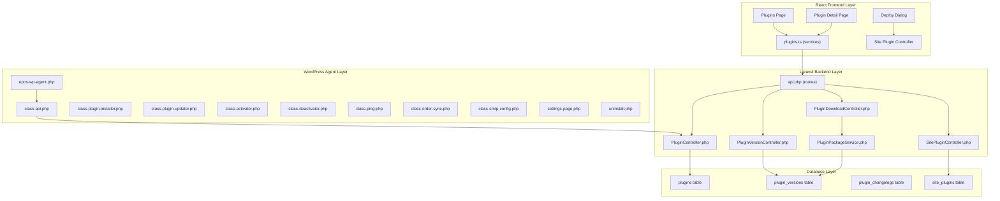
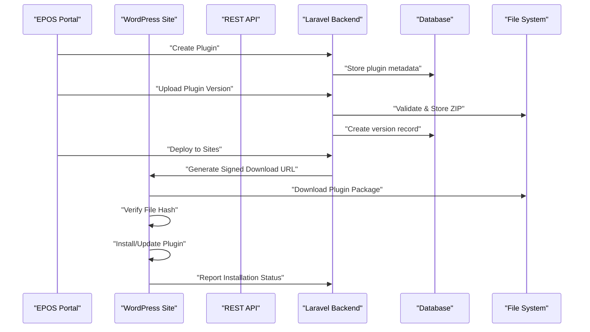
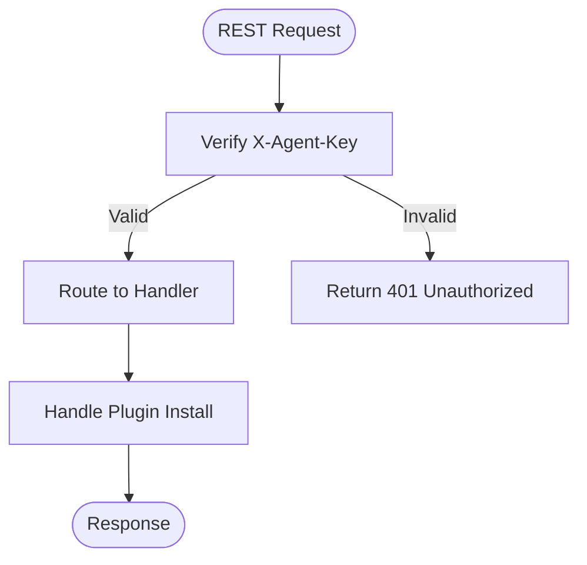
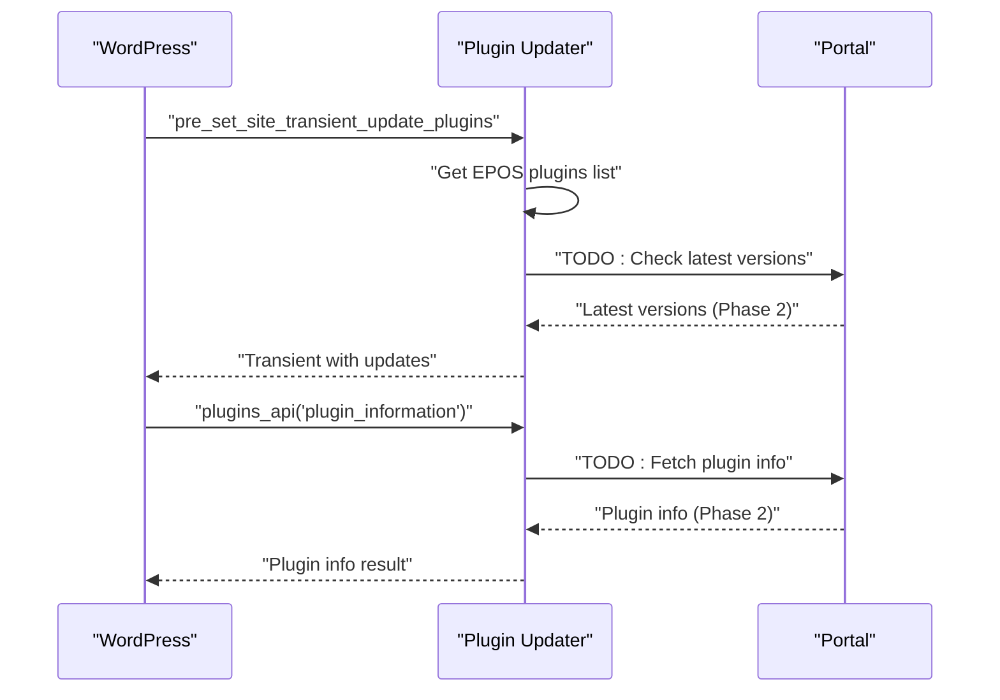
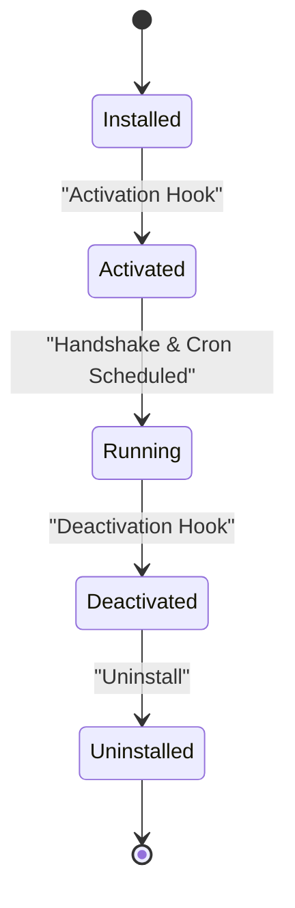
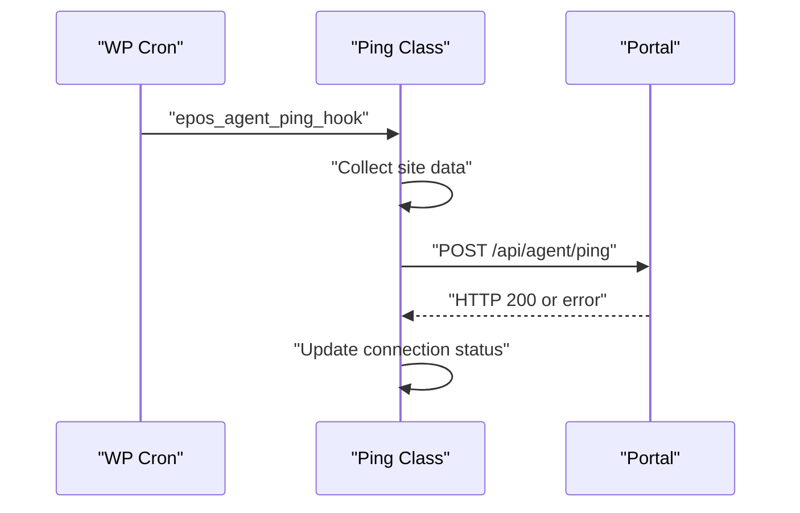
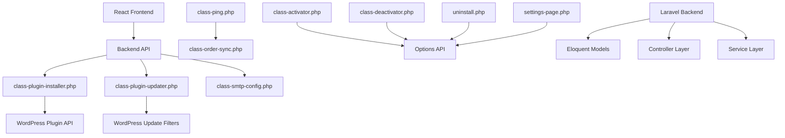

# Plugin Management System

<cite>
**Referenced Files in This Document**
- [epos-wp-agent.php](file://agent/epos-wp-agent/epos-wp-agent.php)
- [class-api.php](file://agent/epos-wp-agent/includes/class-api.php)
- [class-plugin-installer.php](file://agent/epos-wp-agent/includes/class-plugin-installer.php)
- [class-plugin-updater.php](file://agent/epos-wp-agent/includes/class-plugin-updater.php)
- [class-activator.php](file://agent/epos-wp-agent/includes/class-activator.php)
- [class-deactivator.php](file://agent/epos-wp-agent/includes/class-deactivator.php)
- [class-ping.php](file://agent/epos-wp-agent/includes/class-ping.php)
- [class-order-sync.php](file://agent/epos-wp-agent/includes/class-order-sync.php)
- [class-smtp-config.php](file://agent/epos-wp-agent/includes/class-smtp-config.php)
- [settings-page.php](file://agent/epos-wp-agent/admin/settings-page.php)
- [uninstall.php](file://agent/epos-wp-agent/uninstall.php)
- [readme.txt](file://agent/epos-wp-agent/readme.txt)
- [PluginController.php](file://portal/app/Http/Controllers/Portal/PluginController.php)
- [PluginVersionController.php](file://portal/app/Http/Controllers/Portal/PluginVersionController.php)
- [PluginDownloadController.php](file://portal/app/Http/Controllers/Portal/PluginDownloadController.php)
- [PluginPackageService.php](file://portal/app/Services/PluginPackageService.php)
- [Plugin.php](file://portal/app/Models/Plugin.php)
- [PluginVersion.php](file://portal/app/Models/PluginVersion.php)
- [PluginChangelog.php](file://portal/app/Models/PluginChangelog.php)
- [SitePluginController.php](file://portal/app/Http/Controllers/Portal/SitePluginController.php)
- [api.php](file://portal/routes/api.php)
- [plugins.ts](file://portal/frontend/src/lib/services/plugins.ts)
- [page.tsx](file://portal/frontend/src/app/(dashboard)/plugins/page.tsx)
- [page.tsx](file://portal/frontend/src/app/(dashboard)/plugins/[id]/page.tsx)
- [deploy-dialog.tsx](file://portal/frontend/src/components/plugins/deploy-dialog.tsx)
- [2026_05_15_080001_create_plugins_table.php](file://portal/database/migrations/2026_05_15_080001_create_plugins_table.php)
- [2026_05_15_080002_create_plugin_versions_table.php](file://portal/database/migrations/2026_05_15_080002_create_plugin_versions_table.php)
- [2026_05_15_080003_create_plugin_changelogs_table.php](file://portal/database/migrations/2026_05_15_080003_create_plugin_changelogs_table.php)
</cite>

## Update Summary
**Changes Made**
- Added comprehensive backend plugin management controllers (PluginController, PluginVersionController)
- Implemented plugin package validation service with WordPress plugin structure verification
- Enhanced frontend interfaces with CRUD operations, version management, and deployment orchestration
- Added complete database schema for plugin repository management
- Integrated secure download system with signed URLs for plugin distribution
- Implemented changelog tracking and version categorization
- Added deployment orchestration with bulk site targeting capabilities

## Table of Contents
1. [Introduction](#introduction)
2. [Project Structure](#project-structure)
3. [Core Components](#core-components)
4. [Architecture Overview](#architecture-overview)
5. [Detailed Component Analysis](#detailed-component-analysis)
6. [Backend Plugin Management System](#backend-plugin-management-system)
7. [Frontend Plugin Management Interface](#frontend-plugin-management-interface)
8. [Database Schema and Relationships](#database-schema-and-relationships)
9. [Security and Authentication](#security-and-authentication)
10. [Deployment Orchestration](#deployment-orchestration)
11. [Dependency Analysis](#dependency-analysis)
12. [Performance Considerations](#performance-considerations)
13. [Troubleshooting Guide](#troubleshooting-guide)
14. [Conclusion](#conclusion)

## Introduction
This document describes the comprehensive WordPress agent plugin management system that enables centralized plugin deployment and updates from the EPOS Central Control Portal. The system has evolved from a basic installation mechanism to a full-featured plugin repository management platform with CRUD operations, version management, changelog tracking, and deployment orchestration. It covers the automatic plugin installation process, dependency resolution, compatibility checking, update workflows, repository integration, authentication, secure transfers, configuration options, scheduling preferences, and manual override capabilities. It also addresses common issues such as failed installations, version conflicts, and network connectivity problems.

**Updated** The system now includes a complete backend API with Laravel controllers, comprehensive frontend interfaces with React components, secure plugin distribution through signed URLs, and advanced deployment orchestration capabilities.

## Project Structure
The plugin management system is organized into three main layers: WordPress agent components for site-side operations, Laravel backend controllers for central management, and React frontend interfaces for administration. The system includes REST API registration, plugin installation, plugin update integration, activation/deactivation hooks, periodic pings, order synchronization, SMTP configuration, and administrative settings.

**Diagram sources**
- [epos-wp-agent.php:26-34](file://agent/epos-wp-agent/epos-wp-agent.php#L26-L34)
- [PluginController.php:14-109](file://portal/app/Http/Controllers/Portal/PluginController.php#L14-L109)
- [PluginVersionController.php:17-174](file://portal/app/Http/Controllers/Portal/PluginVersionController.php#L17-L174)
- [PluginDownloadController.php:10-45](file://portal/app/Http/Controllers/Portal/PluginDownloadController.php#L10-L45)
- [PluginPackageService.php:8-65](file://portal/app/Services/PluginPackageService.php#L8-L65)
- [SitePluginController.php:9-32](file://portal/app/Http/Controllers/Portal/SitePluginController.php#L9-L32)
- [api.php:58-77](file://portal/routes/api.php#L58-L77)

**Section sources**
- [epos-wp-agent.php:26-53](file://agent/epos-wp-agent/epos-wp-agent.php#L26-L53)
- [readme.txt:11-20](file://agent/epos-wp-agent/readme.txt#L11-L20)

## Core Components
- **REST API Registration**: Routes are registered under the namespace epos-agent/v1 with endpoints for plugin installation, SMTP updates/tests, and status reporting.
- **Plugin Installer**: Handles plugin installation and updates from the Portal, including download, verification, and activation.
- **Plugin Updater**: Integrates with WordPress update mechanisms for EPOS plugins and defers to the Portal for update information.
- **Activation/Deactivation**: Schedules periodic pings, performs handshake with the Portal, and manages connection status.
- **Order Sync**: Collects recent WooCommerce orders for periodic sync to the Portal.
- **SMTP Config**: Applies SMTP settings and supports test emails.
- **Admin Settings**: Provides configuration UI for Portal URL and API key, plus connection status display.
- **Backend Plugin Management**: Comprehensive CRUD operations for plugins, version management, changelog tracking, and deployment orchestration.
- **Frontend Interfaces**: React-based management interfaces for plugin creation, version upload, and deployment control.
- **Secure Distribution**: Signed URL system for secure plugin file delivery to WordPress agents.

**Updated** Added backend plugin management controllers, package validation service, frontend management interfaces, and secure distribution system.

**Section sources**
- [class-api.php:15-45](file://agent/epos-wp-agent/includes/class-api.php#L15-L45)
- [class-plugin-installer.php:13-92](file://agent/epos-wp-agent/includes/class-plugin-installer.php#L13-L92)
- [class-plugin-updater.php:8-64](file://agent/epos-wp-agent/includes/class-plugin-updater.php#L8-L64)
- [class-activator.php:12-76](file://agent/epos-wp-agent/includes/class-activator.php#L12-L76)
- [class-ping.php:29-81](file://agent/epos-wp-agent/includes/class-ping.php#L29-L81)
- [class-order-sync.php:13-47](file://agent/epos-wp-agent/includes/class-order-sync.php#L13-L47)
- [class-smtp-config.php:13-103](file://agent/epos-wp-agent/includes/class-smtp-config.php#L13-L103)
- [settings-page.php:20-96](file://agent/epos-wp-agent/admin/settings-page.php#L20-L96)
- [PluginController.php:14-109](file://portal/app/Http/Controllers/Portal/PluginController.php#L14-L109)
- [PluginVersionController.php:17-174](file://portal/app/Http/Controllers/Portal/PluginVersionController.php#L17-L174)
- [PluginDownloadController.php:10-45](file://portal/app/Http/Controllers/Portal/PluginDownloadController.php#L10-L45)
- [PluginPackageService.php:8-65](file://portal/app/Services/PluginPackageService.php#L8-L65)

## Architecture Overview
The plugin management system consists of three integrated layers working together to provide comprehensive plugin lifecycle management. The WordPress agent layer handles site-side operations including plugin installation, updates, and status reporting. The Laravel backend layer manages the central plugin repository with full CRUD operations, version control, and deployment orchestration. The React frontend provides intuitive management interfaces for administrators. The system uses secure authentication, signed URLs for file distribution, and comprehensive logging for audit trails.

**Diagram sources**
- [PluginController.php:50-74](file://portal/app/Http/Controllers/Portal/PluginController.php#L50-L74)
- [PluginVersionController.php:39-127](file://portal/app/Http/Controllers/Portal/PluginVersionController.php#L39-L127)
- [PluginDownloadController.php:16-43](file://portal/app/Http/Controllers/Portal/PluginDownloadController.php#L16-L43)
- [class-plugin-installer.php:26-86](file://agent/epos-wp-agent/includes/class-plugin-installer.php#L26-L86)

## Detailed Component Analysis

### REST API Layer
- **Endpoint registration**: The API registers routes for plugin install, SMTP update/test, and status.
- **Authentication**: The verify_agent_key method checks the X-Agent-Key header against the stored API key using constant-time comparison.
- **Handler delegation**: The plugin install handler delegates to the installer class.

**Diagram sources**
- [class-api.php:18-23](file://agent/epos-wp-agent/includes/class-api.php#L18-L23)
- [class-api.php:50-71](file://agent/epos-wp-agent/includes/class-api.php#L50-L71)
- [class-api.php:76-78](file://agent/epos-wp-agent/includes/class-api.php#L76-L78)

**Section sources**
- [class-api.php:15-45](file://agent/epos-wp-agent/includes/class-api.php#L15-L45)
- [class-api.php:50-71](file://agent/epos-wp-agent/includes/class-api.php#L50-L71)

### Plugin Installation Workflow
- **Parameter validation**: Ensures plugin_slug, version, download_url, and file_hash are present.
- **Download**: Uses WordPress download_url with a timeout to fetch the plugin archive.
- **Integrity verification**: Computes SHA256 hash of the downloaded file and compares with the provided hash.
- **Installation**: Uses WordPress Plugin_Upgrader with a silent skin to install or update the plugin.
- **Activation**: Activates the plugin if not already active.
- **Cleanup**: Removes temporary files after installation.

**Diagram sources**
- [class-plugin-installer.php:19-24](file://agent/epos-wp-agent/includes/class-plugin-installer.php#L19-L24)
- [class-plugin-installer.php:27-34](file://agent/epos-wp-agent/includes/class-plugin-installer.php#L27-L34)
- [class-plugin-installer.php:37-44](file://agent/epos-wp-agent/includes/class-plugin-installer.php#L37-L44)
- [class-plugin-installer.php:56-64](file://agent/epos-wp-agent/includes/class-plugin-installer.php#L56-L64)
- [class-plugin-installer.php:68-80](file://agent/epos-wp-agent/includes/class-plugin-installer.php#L68-L80)
- [class-plugin-installer.php:82-86](file://agent/epos-wp-agent/includes/class-plugin-installer.php#L82-L86)

**Section sources**
- [class-plugin-installer.php:13-92](file://agent/epos-wp-agent/includes/class-plugin-installer.php#L13-L92)

### Plugin Update Integration
- **Update checks**: Hooks into pre_set_site_transient_update_plugins to check for updates.
- **Plugin info**: Hooks into plugins_api for plugin information requests.
- **Portal integration**: Retrieves Portal URL and API key from options; stubbed for future implementation.
- **EPOS plugin filtering**: Only handles plugins with slugs prefixed with "epos-".

**Diagram sources**
- [class-plugin-updater.php:8-11](file://agent/epos-wp-agent/includes/class-plugin-updater.php#L8-L11)
- [class-plugin-updater.php:16-44](file://agent/epos-wp-agent/includes/class-plugin-updater.php#L16-L44)
- [class-plugin-updater.php:50-64](file://agent/epos-wp-agent/includes/class-plugin-updater.php#L50-L64)

**Section sources**
- [class-plugin-updater.php:8-64](file://agent/epos-wp-agent/includes/class-plugin-updater.php#L8-L64)

### Activation, Deactivation, and Lifecycle
- **Activation**: Schedules a 5-minute cron event, sets default options, and attempts a handshake with the Portal.
- **Deactivation**: Clears the scheduled cron event and updates connection status.
- **Uninstall**: Removes all plugin options and clears scheduled events.

**Diagram sources**
- [class-activator.php:12-30](file://agent/epos-wp-agent/includes/class-activator.php#L12-L30)
- [class-deactivator.php:11-20](file://agent/epos-wp-agent/includes/class-deactivator.php#L11-L20)
- [uninstall.php:12-30](file://agent/epos-wp-agent/uninstall.php#L12-L30)

**Section sources**
- [class-activator.php:12-76](file://agent/epos-wp-agent/includes/class-activator.php#L12-L76)
- [class-deactivator.php:11-20](file://agent/epos-wp-agent/includes/class-deactivator.php#L11-L20)
- [uninstall.php:12-30](file://agent/epos-wp-agent/uninstall.php#L12-L30)

### Periodic Pings and Connection Monitoring
- **Cron schedule**: Adds a custom "Every 5 Minutes" interval.
- **Ping execution**: Sends site information and optionally recent orders to the Portal.
- **Connection status**: Updates connection status based on HTTP response codes.

**Diagram sources**
- [class-ping.php:18-24](file://agent/epos-wp-agent/includes/class-ping.php#L18-L24)
- [class-ping.php:29-81](file://agent/epos-wp-agent/includes/class-ping.php#L29-L81)

**Section sources**
- [class-ping.php:7-81](file://agent/epos-wp-agent/includes/class-ping.php#L7-L81)

### Order Synchronization
- **Recent orders**: Retrieves last 20 orders modified since the last sync.
- **Data collection**: Builds a standardized payload with order details.
- **Timestamp**: Updates the last sync timestamp after each collection.

**Section sources**
- [class-order-sync.php:13-47](file://agent/epos-wp-agent/includes/class-order-sync.php#L13-L47)

### SMTP Configuration Management
- **Settings update**: Stores SMTP settings in WordPress options and enables SMTP globally.
- **Test email**: Sends a test email using configured settings and returns success/failure.
- **PHPMailer configuration**: Applies SMTP settings via a phpmailer_init hook.

**Section sources**
- [class-smtp-config.php:13-41](file://agent/epos-wp-agent/includes/class-smtp-config.php#L13-L41)
- [class-smtp-config.php:49-78](file://agent/epos-wp-agent/includes/class-smtp-config.php#L49-L78)
- [class-smtp-config.php:83-103](file://agent/epos-wp-agent/includes/class-smtp-config.php#L83-L103)

### Administrative Settings
- **Settings page**: Provides fields for Portal URL and API key with sanitization.
- **Connection test**: Performs a handshake with the Portal and displays status.
- **Plugin information**: Shows plugin version, WordPress version, PHP version, and WooCommerce status.

**Section sources**
- [settings-page.php:20-96](file://agent/epos-wp-agent/admin/settings-page.php#L20-L96)
- [settings-page.php:105-111](file://agent/epos-wp-agent/admin/settings-page.php#L105-L111)

## Backend Plugin Management System

### Plugin Controller
The Plugin Controller provides comprehensive CRUD operations for plugin management with search, filtering, and pagination capabilities. It handles plugin creation with automatic slug generation, maintains activity logs, and provides detailed plugin information including latest version and installation statistics.

**Section sources**
- [PluginController.php:14-109](file://portal/app/Http/Controllers/Portal/PluginController.php#L14-L109)

### Plugin Version Controller
The Plugin Version Controller manages plugin version lifecycle with comprehensive validation, storage, and distribution capabilities. It validates WordPress plugin structure, enforces version constraints, generates changelogs, and creates signed download URLs for secure distribution.

**Section sources**
- [PluginVersionController.php:17-174](file://portal/app/Http/Controllers/Portal/PluginVersionController.php#L17-L174)

### Plugin Package Service
The Plugin Package Service validates uploaded plugin packages to ensure they meet WordPress standards. It examines ZIP archives for proper plugin headers, extracts plugin metadata, and provides validation feedback for version mismatches and structural issues.

**Section sources**
- [PluginPackageService.php:8-65](file://portal/app/Services/PluginPackageService.php#L8-L65)

### Plugin Download Controller
The Plugin Download Controller serves plugin files through a secure signed URL system. It validates download tokens, ensures file availability, and provides integrity verification through file hash headers.

**Section sources**
- [PluginDownloadController.php:10-45](file://portal/app/Http/Controllers/Portal/PluginDownloadController.php#L10-L45)

## Frontend Plugin Management Interface

### Plugin Management Services
The frontend provides comprehensive plugin management through TypeScript services that interact with the Laravel backend API. These services support listing, creating, updating plugins, managing versions, uploading new releases, and generating download URLs.

**Section sources**
- [plugins.ts:1-28](file://portal/frontend/src/lib/services/plugins.ts#L1-L28)

### Plugins Dashboard
The main plugins dashboard offers a searchable, filterable interface for plugin management with real-time statistics including latest versions and installation counts across sites.

**Section sources**
- [page.tsx](file://portal/frontend/src/app/(dashboard)/plugins/page.tsx#L1-L250)

### Plugin Detail Management
The plugin detail page provides comprehensive version management with upload capabilities, changelog viewing, and deployment orchestration through an interactive dialog interface.

**Section sources**
- [page.tsx](file://portal/frontend/src/app/(dashboard)/plugins/[id]/page.tsx#L1-L613)

### Deployment Orchestration Interface
The deployment dialog enables administrators to push plugin versions to multiple sites with selective targeting, bulk deployment, and progress tracking capabilities.

**Section sources**
- [deploy-dialog.tsx:1-280](file://portal/frontend/src/components/plugins/deploy-dialog.tsx#L1-L280)

## Database Schema and Relationships

### Plugin Repository Schema
The database schema supports a comprehensive plugin management system with separate tables for plugins, versions, changelogs, and site associations. The design ensures data integrity, efficient querying, and proper relationship management.

**Section sources**
- [2026_05_15_080001_create_plugins_table.php:1-28](file://portal/database/migrations/2026_05_15_080001_create_plugins_table.php#L1-L28)
- [2026_05_15_080002_create_plugin_versions_table.php:1-31](file://portal/database/migrations/2026_05_15_080002_create_plugin_versions_table.php#L1-L31)
- [2026_05_15_080003_create_plugin_changelogs_table.php:1-25](file://portal/database/migrations/2026_05_15_080003_create_plugin_changelogs_table.php#L1-L25)

### Model Relationships
The Eloquent models define comprehensive relationships between plugins, versions, changelogs, and users. These relationships enable efficient querying and data manipulation across the plugin management system.

**Section sources**
- [Plugin.php:9-35](file://portal/app/Models/Plugin.php#L9-L35)
- [PluginVersion.php:9-39](file://portal/app/Models/PluginVersion.php#L9-L39)
- [PluginChangelog.php:8-21](file://portal/app/Models/PluginChangelog.php#L8-L21)

## Security and Authentication

### API Security
The system implements robust authentication and authorization mechanisms including Sanctum-based authentication, role-based access control, and secure API endpoints. The WordPress agent uses shared API keys for agent-to-portal communication.

**Section sources**
- [api.php:17-77](file://portal/routes/api.php#L17-L77)
- [class-api.php:18-23](file://agent/epos-wp-agent/includes/class-api.php#L18-L23)

### Secure File Distribution
Plugin files are distributed through a signed URL system that prevents direct access and ensures file integrity. The system validates tokens, checks file existence, and provides cryptographic verification through file hash headers.

**Section sources**
- [PluginDownloadController.php:16-43](file://portal/app/Http/Controllers/Portal/PluginDownloadController.php#L16-L43)

### Access Control
Role-based access control restricts sensitive operations like plugin version deletion to administrators only. The system maintains comprehensive audit trails through activity logging.

**Section sources**
- [PluginVersionController.php:147-151](file://portal/app/Http/Controllers/Portal/PluginVersionController.php#L147-L151)

## Deployment Orchestration

### Multi-Site Deployment
The deployment system enables pushing plugin versions to multiple WordPress sites simultaneously or selectively. It supports both bulk deployment to all connected sites and targeted deployment to specific sites with progress tracking.

**Section sources**
- [deploy-dialog.tsx:87-129](file://portal/frontend/src/components/plugins/deploy-dialog.tsx#L87-L129)
- [SitePluginController.php:13-31](file://portal/app/Http/Controllers/Portal/SitePluginController.php#L13-L31)

### Version Management
The system maintains comprehensive version history with changelog tracking, stability indicators, and release metadata. Each version includes detailed information about changes, release type, and distribution statistics.

**Section sources**
- [PluginVersionController.php:25-33](file://portal/app/Http/Controllers/Portal/PluginVersionController.php#L25-L33)
- [PluginChangelog.php:8-21](file://portal/app/Models/PluginChangelog.php#L8-L21)

## Dependency Analysis
The plugin management system depends on WordPress core APIs for file handling, plugin installation/upgrades, cron scheduling, HTTP requests, and option management. The installer relies on WordPress upgrade classes, while the updater integrates with WordPress update filters. The API layer depends on WordPress REST API infrastructure and option storage. The backend system leverages Laravel's Eloquent ORM, validation system, and middleware stack.

**Diagram sources**
- [class-api.php:76-78](file://agent/epos-wp-agent/includes/class-api.php#L76-L78)
- [class-plugin-installer.php:47-54](file://agent/epos-wp-agent/includes/class-plugin-installer.php#L47-L54)
- [class-plugin-updater.php:9-10](file://agent/epos-wp-agent/includes/class-plugin-updater.php#L9-L10)
- [class-ping.php:46-47](file://agent/epos-wp-agent/includes/class-ping.php#L46-L47)
- [class-activator.php:19-21](file://agent/epos-wp-agent/includes/class-activator.php#L19-L21)
- [class-deactivator.php:12-16](file://agent/epos-wp-agent/includes/class-deactivator.php#L12-L16)
- [uninstall.php:13-24](file://agent/epos-wp-agent/uninstall.php#L13-L24)
- [settings-page.php:21-26](file://agent/epos-wp-agent/admin/settings-page.php#L21-L26)

**Section sources**
- [epos-wp-agent.php:26-34](file://agent/epos-wp-agent/epos-wp-agent.php#L26-L34)
- [class-api.php:15-45](file://agent/epos-wp-agent/includes/class-api.php#L15-L45)

## Performance Considerations
- **Network timeouts**: The installer uses a 300-second timeout for downloads; adjust based on network conditions.
- **Hash verification**: SHA256 verification ensures integrity but adds CPU overhead; consider caching verified hashes if repeated.
- **Cron intervals**: The 5-minute ping interval balances responsiveness with resource usage; monitor server load.
- **Memory usage**: Large plugin archives increase memory consumption during extraction; ensure sufficient memory limits.
- **SSL verification**: Enabled by default for secure transfers; disable only in controlled environments.
- **File storage**: Plugin ZIP files are stored locally with size limits and validation to prevent abuse.
- **Database optimization**: Proper indexing on plugin versions and unique constraints ensure efficient querying.
- **Frontend performance**: React components use efficient state management and lazy loading for better user experience.

## Troubleshooting Guide
- **Authentication failures**: Verify the X-Agent-Key header matches the stored API key. Check for typos or expired keys.
- **Download errors**: Confirm the download URL is accessible and the file exists. Check network connectivity and firewall settings.
- **Hash mismatches**: Ensure the provided file_hash matches the computed SHA256 of the downloaded archive.
- **Installation failures**: Check WordPress file permissions and available disk space. Review error messages for specific failure reasons.
- **Update integration**: The update mechanism is currently a stub; ensure the Portal endpoint is implemented before expecting updates.
- **Connection status**: Monitor the connection status option and review debug logs for error details.
- **SMTP issues**: Validate SMTP credentials and test connectivity; use the test email endpoint to confirm configuration.
- **Plugin validation failures**: Check that uploaded ZIP files contain valid WordPress plugin headers and proper structure.
- **Version conflicts**: Ensure new plugin versions are greater than existing versions and follow semantic versioning.
- **Deployment failures**: Verify target sites are connected and accessible; check deployment job status and error logs.

**Section sources**
- [class-api.php:50-71](file://agent/epos-wp-agent/includes/class-api.php#L50-L71)
- [class-plugin-installer.php:27-34](file://agent/epos-wp-agent/includes/class-plugin-installer.php#L27-L34)
- [class-plugin-installer.php:37-44](file://agent/epos-wp-agent/includes/class-plugin-installer.php#L37-L44)
- [class-plugin-installer.php:68-80](file://agent/epos-wp-agent/includes/class-plugin-installer.php#L68-L80)
- [class-activator.php:60-75](file://agent/epos-wp-agent/includes/class-activator.php#L60-L75)
- [class-ping.php:64-80](file://agent/epos-wp-agent/includes/class-ping.php#L64-L80)
- [class-smtp-config.php:49-78](file://agent/epos-wp-agent/includes/class-smtp-config.php#L49-L78)
- [PluginPackageService.php:16-63](file://portal/app/Services/PluginPackageService.php#L16-L63)
- [PluginVersionController.php:55-59](file://portal/app/Http/Controllers/Portal/PluginVersionController.php#L55-L59)

## Conclusion
The comprehensive plugin management system provides a robust foundation for centralized plugin deployment and updates. It includes secure authentication, integrity verification, and WordPress-native installation/upgrades. The system has evolved from a basic installation mechanism to a full-featured plugin repository management platform with CRUD operations, version management, changelog tracking, and deployment orchestration. The Laravel backend provides comprehensive API endpoints for plugin lifecycle management, while the React frontend offers intuitive management interfaces. The secure distribution system with signed URLs ensures safe plugin delivery to WordPress agents. Proper attention to authentication, network reliability, file permissions, and database design will ensure smooth operation of this sophisticated plugin management ecosystem.