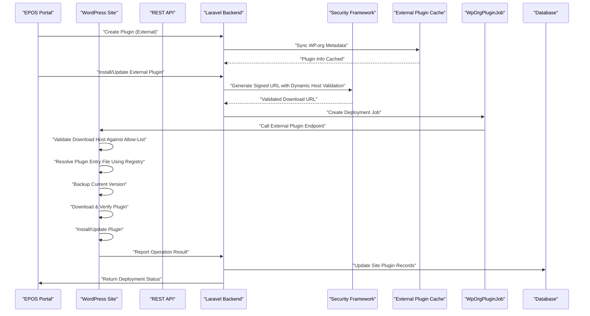
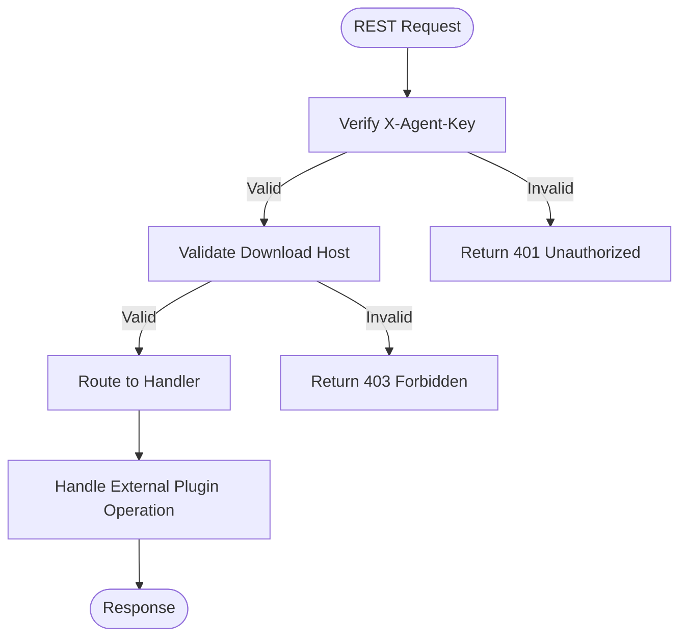
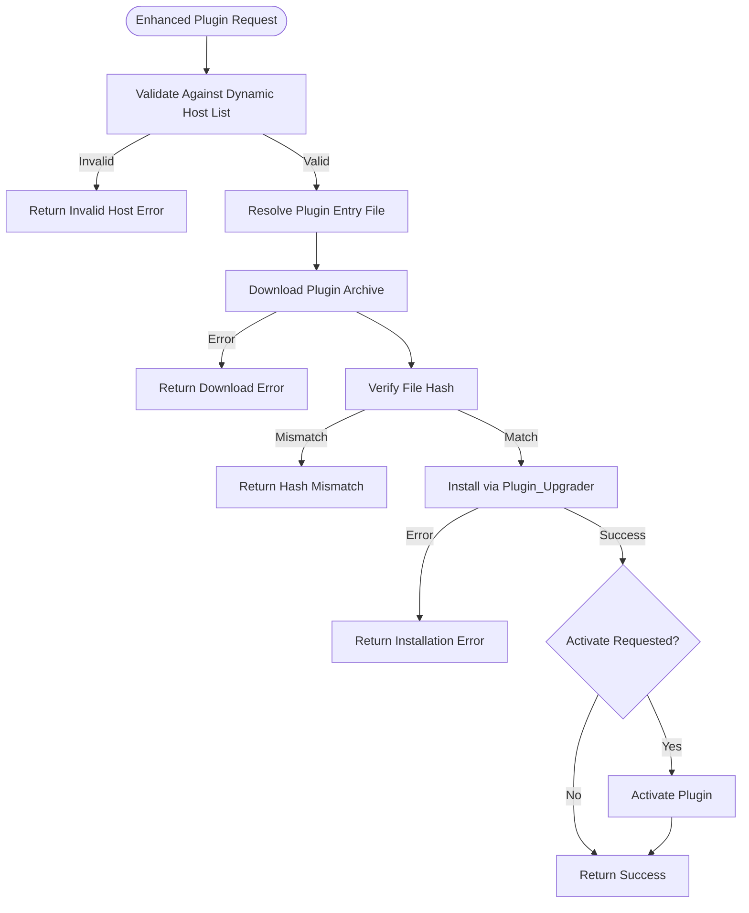
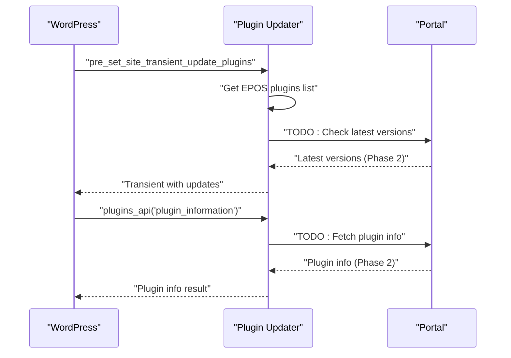
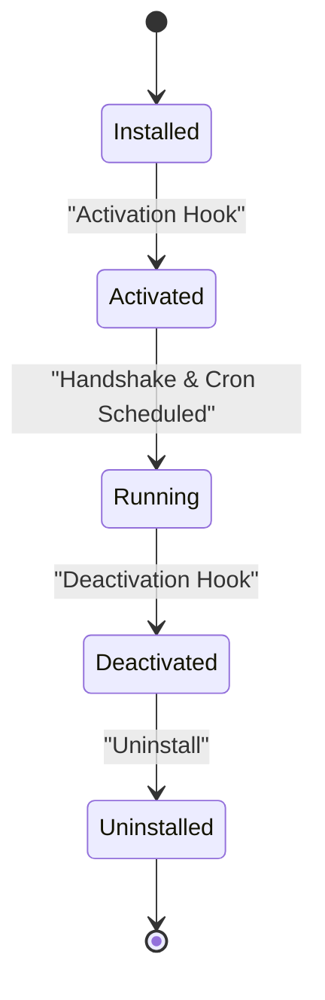
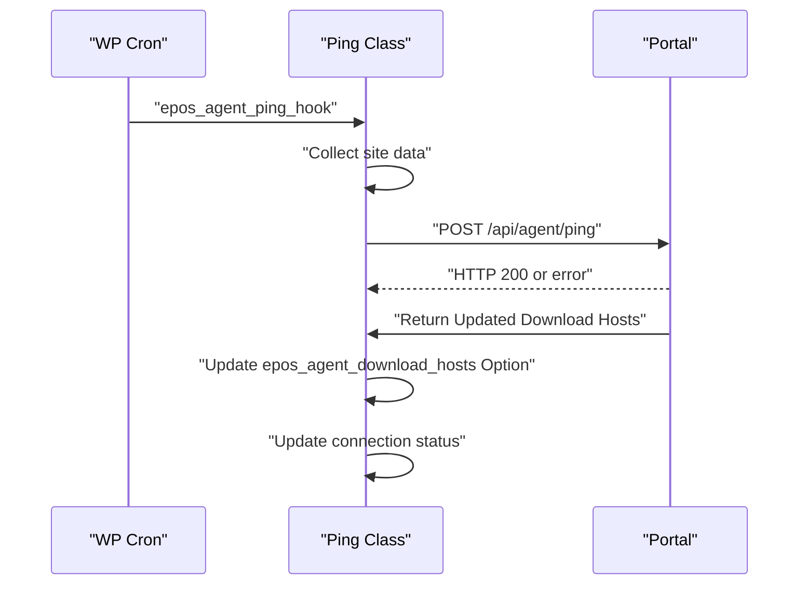

# Plugin Management System

<cite>
**Referenced Files in This Document**
- [class-api.php](file://agent/epos-wp-agent/includes/class-api.php)
- [class-external-plugin-manager.php](file://agent/epos-wp-agent/includes/class-external-plugin-manager.php)
- [class-rollback.php](file://agent/epos-wp-agent/includes/class-rollback.php)
- [class-plugin-installer.php](file://agent/epos-wp-agent/includes/class-plugin-installer.php)
- [class-plugin-updater.php](file://agent/epos-wp-agent/includes/class-plugin-updater.php)
- [AgentController.php](file://portal/app/Http/Controllers/Agent/AgentController.php)
- [ExternalPluginController.php](file://portal/app/Http/Controllers/Portal/ExternalPluginController.php)
- [SyncExternalPluginCache.php](file://portal/app/Console/Commands/SyncExternalPluginCache.php)
- [WpOrgPluginJob.php](file://portal/app/Jobs/WpOrgPluginJob.php)
- [SignedUrlService.php](file://portal/app/Services/SignedUrlService.php)
- [PluginDownloadController.php](file://portal/app/Http/Controllers/Portal/PluginDownloadController.php)
- [ExternalPluginCache.php](file://portal/app/Models/ExternalPluginCache.php)
- [epos-wp-agent.php](file://agent/epos-wp-agent/epos-wp-agent.php)
- [class-activator.php](file://agent/epos-wp-agent/includes/class-activator.php)
- [class-deactivator.php](file://agent/epos-wp-agent/includes/class-deactivator.php)
- [class-ping.php](file://agent/epos-wp-agent/includes/class-ping.php)
- [class-order-sync.php](file://agent/epos-wp-agent/includes/class-order-sync.php)
- [class-smtp-config.php](file://agent/epos-wp-agent/includes/class-smtp-config.php)
- [settings-page.php](file://agent/epos-wp-agent/admin/settings-page.php)
- [uninstall.php](file://agent/epos-wp-agent/uninstall.php)
- [readme.txt](file://agent/epos-wp-agent/readme.txt)
- [PluginController.php](file://portal/app/Http/Controllers/Portal/PluginController.php)
- [PluginVersionController.php](file://portal/app/Http/Controllers/Portal/PluginVersionController.php)
- [PluginPackageService.php](file://portal/app/Services/PluginPackageService.php)
- [Plugin.php](file://portal/app/Models/Plugin.php)
- [PluginVersion.php](file://portal/app/Models/PluginVersion.php)
- [PluginChangelog.php](file://portal/app/Models/PluginChangelog.php)
- [SitePluginController.php](file://portal/app/Http/Controllers/Portal/SitePluginController.php)
- [api.php](file://portal/routes/api.php)
- [external-plugins.ts](file://portal/frontend/src/lib/services/external-plugins.ts)
- [plugins.ts](file://portal/frontend/src/lib/services/plugins.ts)
- [page.tsx](file://portal/frontend/src/app/(dashboard)/plugins/page.tsx)
- [page.tsx](file://portal/frontend/src/app/(dashboard)/plugins/[id]/page.tsx)
- [deploy-dialog.tsx](file://portal/frontend/src/components/plugins/deploy-dialog.tsx)
- [2026_05_15_080001_create_plugins_table.php](file://portal/database/migrations/2026_05_15_080001_create_plugins_table.php)
- [2026_05_15_080002_create_plugin_versions_table.php](file://portal/database/migrations/2026_05_15_080002_create_plugin_versions_table.php)
- [2026_05_15_080003_create_plugin_changelogs_table.php](file://portal/database/migrations/2026_05_15_080003_create_plugin_changelogs_table.php)
- [2026_05_17_000001_add_rollback_and_schedule_fields.php](file://portal/database/migrations/2026_05_17_000001_add_rollback_and_schedule_fields.php)
- [2026_05_15_070005_create_portal_settings_table.php](file://portal/database/migrations/2026_05_15_070005_create_portal_settings_table.php)
- [PortalSetting.php](file://portal/app/Models/PortalSetting.php)
- [PushPluginToSite.php](file://portal/app/Jobs/PushPluginToSite.php)
</cite>

## Update Summary
**Changes Made**
- Enhanced plugin installation security with improved URL validation against portal URL and dynamic host lists
- Sophisticated plugin entry file resolution using WordPress plugin registry
- Automatic download-host allow-list refresh during heartbeat cycles
- Dynamic host validation system combining APP_URL and portal_base_url configurations
- Enhanced security for both internal and external plugin installations

## Table of Contents
1. [Introduction](#introduction)
2. [Project Structure](#project-structure)
3. [Core Components](#core-components)
4. [Architecture Overview](#architecture-overview)
5. [Detailed Component Analysis](#detailed-component-analysis)
6. [Enhanced Security Framework](#enhanced-security-framework)
7. [Dynamic Host Validation System](#dynamic-host-validation-system)
8. [Sophisticated Plugin Entry Resolution](#sophisticated-plugin-entry-resolution)
9. [Automatic Allow-List Refresh](#automatic-allow-list-refresh)
10. [External Plugin Management System](#external-plugin-management-system)
11. [WordPress.org Plugin Integration](#wordpressorg-plugin-integration)
12. [Automatic Backup and Rollback System](#automatic-backup-and-rollback-system)
13. [Deployment Orchestration](#deployment-orchestration)
14. [REST API Endpoints](#rest-api-endpoints)
15. [Frontend Integration](#frontend-integration)
16. [Database Schema and Relationships](#database-schema-and-relationships)
17. [Security and Authentication](#security-and-authentication)
18. [Performance Considerations](#performance-considerations)
19. [Troubleshooting Guide](#troubleshooting-guide)
20. [Conclusion](#conclusion)

## Introduction
This document describes the comprehensive WordPress agent plugin management system that enables centralized plugin deployment and updates from the EPOS Central Control Portal. The system has evolved from a basic installation mechanism to a full-featured plugin repository management platform with CRUD operations, version management, changelog tracking, deployment orchestration, and WordPress.org plugin support. It now includes a major enhancement with a complete external plugin management system featuring automatic backup capabilities, rollback functionality, comprehensive REST API endpoints, and sophisticated security measures including enhanced URL validation, dynamic host allow-list management, and advanced plugin entry file resolution.

The system supports both internal plugins (EPOS-managed) and external WordPress.org plugins, providing unified management through a single interface. It covers automatic plugin installation, dependency resolution, compatibility checking, update workflows, repository integration, authentication, secure transfers, configuration options, scheduling preferences, and manual override capabilities. It also addresses common issues such as failed installations, version conflicts, network connectivity problems, and rollback scenarios.

## Project Structure
The plugin management system is organized into three main layers: WordPress agent components for site-side operations, Laravel backend controllers for central management, and React frontend interfaces for administration. The system now includes comprehensive external plugin management with WordPress.org integration, automatic backup systems, rollback capabilities, job-based deployment orchestration, and enhanced security frameworks with dynamic host validation and sophisticated plugin resolution mechanisms.

```mermaid
graph TB
subgraph "WordPress Agent Layer"
A["epos-wp-agent.php"]
B["class-api.php"]
C["class-external-plugin-manager.php"]
D["class-rollback.php"]
E["class-plugin-installer.php"]
F["class-plugin-updater.php"]
G["class-activator.php"]
H["class-deactivator.php"]
I["class-ping.php"]
J["class-order-sync.php"]
K["class-smtp-config.php"]
L["settings-page.php"]
M["uninstall.php"]
end
subgraph "Laravel Backend Layer"
N["AgentController.php"]
O["ExternalPluginController.php"]
P["SyncExternalPluginCache.php"]
Q["WpOrgPluginJob.php"]
R["SignedUrlService.php"]
S["PluginDownloadController.php"]
T["PluginController.php"]
U["PluginVersionController.php"]
V["PluginPackageService.php"]
W["SitePluginController.php"]
X["api.php (routes)"]
end
subgraph "React Frontend Layer"
Y["external-plugins.ts (services)"]
Z["Plugins Page"]
AA["Plugin Detail Page"]
AB["Deploy Dialog"]
AC["Site Plugin Controller"]
end
subgraph "Security Infrastructure"
AD["Dynamic Host Validation"]
AE["Plugin Entry Resolution"]
AF["Allow-List Refresh"]
AG["Portal Settings"]
end
subgraph "Database Layer"
AH["portal_settings table"]
AI["external_plugins_cache table"]
AJ["deployment_jobs table"]
AK["deployment_job_sites table"]
AL["site_plugins table"]
AM["rollback tracking"]
end
A --> B
B --> C
B --> D
C --> AH
N --> AD
N --> AE
N --> AF
N --> AH
O --> AI
P --> AI
Q --> C
R --> S
T --> AL
U --> AL
V --> AL
W --> AL
X --> N
X --> O
X --> P
X --> Q
X --> R
X --> S
Y --> X
Z --> Y
AA --> Y
AB --> AC
```

**Diagram sources**
- [epos-wp-agent.php:26-34](file://agent/epos-wp-agent/epos-wp-agent.php#L26-L34)
- [class-api.php:15-45](file://agent/epos-wp-agent/includes/class-api.php#L15-L45)
- [class-external-plugin-manager.php:4-8](file://agent/epos-wp-agent/includes/class-external-plugin-manager.php#L4-L8)
- [class-rollback.php:9-53](file://agent/epos-wp-agent/includes/class-rollback.php#L9-L53)
- [AgentController.php:87-108](file://portal/app/Http/Controllers/Agent/AgentController.php#L87-L108)
- [ExternalPluginController.php:19-23](file://portal/app/Http/Controllers/Portal/ExternalPluginController.php#L19-L23)
- [SyncExternalPluginCache.php:11-14](file://portal/app/Console/Commands/SyncExternalPluginCache.php#L11-L14)
- [WpOrgPluginJob.php:17-34](file://portal/app/Jobs/WpOrgPluginJob.php#L17-L34)
- [SignedUrlService.php:18-47](file://portal/app/Services/SignedUrlService.php#L18-L47)
- [external-plugins.ts:11-56](file://portal/frontend/src/lib/services/external-plugins.ts#L11-L56)

**Section sources**
- [epos-wp-agent.php:26-53](file://agent/epos-wp-agent/epos-wp-agent.php#L26-L53)
- [readme.txt:11-20](file://agent/epos-wp-agent/readme.txt#L11-L20)

## Core Components
- **REST API Registration**: Routes are registered under the namespace epos-agent/v1 with endpoints for plugin installation, SMTP updates/tests, status reporting, and external plugin management.
- **Enhanced Security Framework**: Implements dynamic host validation, sophisticated plugin entry resolution, and automatic allow-list refresh during heartbeat cycles.
- **External Plugin Manager**: Handles WordPress.org plugin installation, updates, activation, deactivation, and uninstallation with automatic backup and rollback capabilities.
- **Plugin Installer**: Handles plugin installation and updates from the Portal with enhanced URL validation against dynamic host lists.
- **Plugin Updater**: Integrates with WordPress update mechanisms for EPOS plugins and defers to the Portal for update information.
- **Activation/Deactivation**: Schedules periodic pings, performs handshake with the Portal, and manages connection status with dynamic host allow-list updates.
- **Order Sync**: Collects recent WooCommerce orders for periodic sync to the Portal.
- **SMTP Config**: Applies SMTP settings and supports test emails.
- **Admin Settings**: Provides configuration UI for Portal URL and API key, plus connection status display.
- **Backend Plugin Management**: Comprehensive CRUD operations for plugins, version management, changelog tracking, and deployment orchestration.
- **Frontend Interfaces**: React-based management interfaces for plugin creation, version upload, and deployment control.
- **Secure Distribution**: Signed URL system for secure plugin file delivery to WordPress agents with dynamic host validation.
- **WordPress.org Integration**: Complete plugin discovery, metadata caching, and version management system with enhanced security.
- **Backup and Rollback**: Automatic backup system with rollback capabilities for plugin updates and Portal-initiated rollbacks.
- **Job-Based Deployment**: Asynchronous job processing for external plugin operations with retry logic and status tracking.

**Updated** Enhanced security framework with dynamic host validation, sophisticated plugin entry resolution, and automatic allow-list refresh capabilities.

**Section sources**
- [class-api.php:15-45](file://agent/epos-wp-agent/includes/class-api.php#L15-L45)
- [class-external-plugin-manager.php:4-65](file://agent/epos-wp-agent/includes/class-external-plugin-manager.php#L4-L65)
- [class-rollback.php:9-91](file://agent/epos-wp-agent/includes/class-rollback.php#L9-L91)
- [AgentController.php:87-108](file://portal/app/Http/Controllers/Agent/AgentController.php#L87-L108)
- [ExternalPluginController.php:19-482](file://portal/app/Http/Controllers/Portal/ExternalPluginController.php#L19-L482)
- [SyncExternalPluginCache.php:11-75](file://portal/app/Console/Commands/SyncExternalPluginCache.php#L11-L75)
- [WpOrgPluginJob.php:17-109](file://portal/app/Jobs/WpOrgPluginJob.php#L17-L109)

## Architecture Overview
The plugin management system consists of three integrated layers working together to provide comprehensive plugin lifecycle management with enhanced security. The WordPress agent layer handles site-side operations including plugin installation, updates, status reporting, and rollback operations with dynamic host validation and sophisticated plugin entry resolution. The Laravel backend layer manages the central plugin repository with full CRUD operations, WordPress.org integration, external plugin cache management, and deployment orchestration with secure signed URL distribution. The React frontend provides intuitive management interfaces for administrators. The system uses secure authentication, signed URLs for file distribution, comprehensive logging for audit trails, automatic backup systems for rollback capabilities, and dynamic host validation for enhanced security.

**Diagram sources**
- [ExternalPluginController.php:327-407](file://portal/app/Http/Controllers/Portal/ExternalPluginController.php#L327-L407)
- [WpOrgPluginJob.php:36-109](file://portal/app/Jobs/WpOrgPluginJob.php#L36-L109)
- [class-external-plugin-manager.php:13-65](file://agent/epos-wp-agent/includes/class-external-plugin-manager.php#L13-L65)
- [SyncExternalPluginCache.php:77-150](file://portal/app/Console/Commands/SyncExternalPluginCache.php#L77-L150)
- [AgentController.php:87-108](file://portal/app/Http/Controllers/Agent/AgentController.php#L87-L108)
- [class-plugin-installer.php:49-79](file://agent/epos-wp-agent/includes/class-plugin-installer.php#L49-L79)

## Detailed Component Analysis

### REST API Layer
- **Endpoint registration**: The API registers routes for plugin install, SMTP update/test, status, and external plugin management.
- **Authentication**: The verify_agent_key method checks the X-Agent-Key header against the stored API key using constant-time comparison.
- **Handler delegation**: The plugin install handler delegates to the external plugin manager class.
- **Enhanced security**: All plugin installation endpoints now validate download URLs against dynamic host allow-lists.

**Diagram sources**
- [class-api.php:18-23](file://agent/epos-wp-agent/includes/class-api.php#L18-L23)
- [class-api.php:167-177](file://agent/epos-wp-agent/includes/class-api.php#L167-L177)
- [class-plugin-installer.php:49-79](file://agent/epos-wp-agent/includes/class-plugin-installer.php#L49-L79)

**Section sources**
- [class-api.php:15-45](file://agent/epos-wp-agent/includes/class-api.php#L15-L45)
- [class-api.php:167-236](file://agent/epos-wp-agent/includes/class-api.php#L167-L236)

### Enhanced Plugin Installation Workflow
- **Dynamic host validation**: Validates download URLs against combined APP_URL and portal_base_url configurations.
- **Download and verification**: Uses WordPress download_url with timeout and SHA256 hash verification.
- **Sophisticated entry resolution**: Resolves plugin entry files using WordPress plugin registry for accurate activation.
- **Installation**: Uses WordPress Plugin_Upgrader with silent skin for installation.
- **Activation**: Activates plugin if requested and handles activation errors gracefully.
- **Backup system**: Creates automatic backups before updates for rollback capabilities.

**Diagram sources**
- [class-plugin-installer.php:16-65](file://agent/epos-wp-agent/includes/class-plugin-installer.php#L16-L65)
- [class-plugin-installer.php:124-131](file://agent/epos-wp-agent/includes/class-plugin-installer.php#L124-L131)
- [class-plugin-installer.php:72-79](file://agent/epos-wp-agent/includes/class-plugin-installer.php#L72-L79)

**Section sources**
- [class-plugin-installer.php:13-243](file://agent/epos-wp-agent/includes/class-plugin-installer.php#L13-L243)

### Plugin Update Integration
- **Update checks**: Hooks into pre_set_site_transient_update_plugins to check for updates.
- **Plugin info**: Hooks into plugins_api for plugin information requests.
- **Portal integration**: Retrieves Portal URL and API key from options; stubbed for future implementation.
- **EPOS plugin filtering**: Only handles plugins with slugs prefixed with "epos-".
- **WordPress.org updates**: Supports batch updates for multiple external plugins.

**Diagram sources**
- [class-plugin-updater.php:8-11](file://agent/epos-wp-agent/includes/class-plugin-updater.php#L8-L11)
- [class-plugin-updater.php:16-44](file://agent/epos-wp-agent/includes/class-plugin-updater.php#L16-L44)
- [class-plugin-updater.php:50-64](file://agent/epos-wp-agent/includes/class-plugin-updater.php#L50-L64)

**Section sources**
- [class-plugin-updater.php:8-64](file://agent/epos-wp-agent/includes/class-plugin-updater.php#L8-L64)

### Activation, Deactivation, and Lifecycle
- **Activation**: Schedules a 5-minute cron event, sets default options, and attempts a handshake with the Portal.
- **Deactivation**: Clears the scheduled cron event and updates connection status.
- **Uninstall**: Removes all plugin options and clears scheduled events.

**Diagram sources**
- [class-activator.php:12-30](file://agent/epos-wp-agent/includes/class-activator.php#L12-L30)
- [class-deactivator.php:11-20](file://agent/epos-wp-agent/includes/class-deactivator.php#L11-L20)
- [uninstall.php:12-30](file://agent/epos-wp-agent/uninstall.php#L12-L30)

**Section sources**
- [class-activator.php:12-76](file://agent/epos-wp-agent/includes/class-activator.php#L12-L76)
- [class-deactivator.php:11-20](file://agent/epos-wp-agent/includes/class-deactivator.php#L11-L20)
- [uninstall.php:12-30](file://agent/epos-wp-agent/uninstall.php#L12-L30)

### Periodic Pings and Connection Monitoring
- **Cron schedule**: Adds a custom "Every 5 Minutes" interval.
- **Ping execution**: Sends site information and optionally recent orders to the Portal.
- **Connection status**: Updates connection status based on HTTP response codes.
- **Dynamic host refresh**: Automatically refreshes download host allow-list during heartbeat cycles.

**Diagram sources**
- [class-ping.php:18-24](file://agent/epos-wp-agent/includes/class-ping.php#L18-L24)
- [class-ping.php:29-81](file://agent/epos-wp-agent/includes/class-ping.php#L29-L81)
- [AgentController.php:190-195](file://portal/app/Http/Controllers/Agent/AgentController.php#L190-L195)

**Section sources**
- [class-ping.php:7-81](file://agent/epos-wp-agent/includes/class-ping.php#L7-L81)

### Order Synchronization
- **Recent orders**: Retrieves last 20 orders modified since the last sync.
- **Data collection**: Builds a standardized payload with order details.
- **Timestamp**: Updates the last sync timestamp after each collection.

**Section sources**
- [class-order-sync.php:13-47](file://agent/epos-wp-agent/includes/class-order-sync.php#L13-L47)

### SMTP Configuration Management
- **Settings update**: Stores SMTP settings in WordPress options and enables SMTP globally.
- **Test email**: Sends a test email using configured settings and returns success/failure.
- **PHPMailer configuration**: Applies SMTP settings via a phpmailer_init hook.

**Section sources**
- [class-smtp-config.php:13-41](file://agent/epos-wp-agent/includes/class-smtp-config.php#L13-L41)
- [class-smtp-config.php:49-78](file://agent/epos-wp-agent/includes/class-smtp-config.php#L49-L78)
- [class-smtp-config.php:83-103](file://agent/epos-wp-agent/includes/class-smtp-config.php#L83-L103)

### Administrative Settings
- **Settings page**: Provides fields for Portal URL and API key with sanitization.
- **Connection test**: Performs a handshake with the Portal and displays status.
- **Plugin information**: Shows plugin version, WordPress version, PHP version, and WooCommerce status.

**Section sources**
- [settings-page.php:20-96](file://agent/epos-wp-agent/admin/settings-page.php#L20-L96)
- [settings-page.php:105-111](file://agent/epos-wp-agent/admin/settings-page.php#L105-L111)

## Enhanced Security Framework

### Dynamic Host Validation System
The system implements a sophisticated dynamic host validation mechanism that combines multiple configuration sources to determine trusted download hosts. This prevents malicious redirection attacks and ensures plugins are only downloaded from authorized sources.

**Section sources**
- [class-plugin-installer.php:49-79](file://agent/epos-wp-agent/includes/class-plugin-installer.php#L49-L79)
- [AgentController.php:87-108](file://portal/app/Http/Controllers/Agent/AgentController.php#L87-L108)

### Automatic Allow-List Refresh
During heartbeat cycles, the system automatically refreshes the download host allow-list to accommodate split frontend/backend deployments. This ensures agents can connect to both APP_URL and portal_base_url configurations without manual intervention.

**Section sources**
- [AgentController.php:190-195](file://portal/app/Http/Controllers/Agent/AgentController.php#L190-L195)

### Enhanced WordPress.org Security
WordPress.org plugin installations are restricted to downloads.wordpress.org only, with additional validation to prevent malicious plugin downloads. The system maintains strict security boundaries around external plugin sources.

**Section sources**
- [class-external-plugin-manager.php:16-19](file://agent/epos-wp-agent/includes/class-external-plugin-manager.php#L16-L19)

## Dynamic Host Validation System

### Trusted Host Generation
The system generates trusted download hosts by combining APP_URL configuration with portal_base_url settings from PortalSetting model. This approach accommodates split deployments where frontend and backend services operate on different hosts.

**Section sources**
- [AgentController.php:87-108](file://portal/app/Http/Controllers/Agent/AgentController.php#L87-L108)

### Host Validation Logic
The validation logic extracts hostnames from configuration URLs, normalizes them to lowercase, removes duplicates, and filters out empty values. This creates a comprehensive allow-list for download URL validation.

**Section sources**
- [AgentController.php:94-108](file://portal/app/Http/Controllers/Agent/AgentController.php#L94-L108)

### Download Host Propagation
Trusted hosts are propagated to agents during handshake and ping operations, ensuring agents maintain current allow-list information even when portal_base_url changes dynamically.

**Section sources**
- [AgentController.php:79-84](file://portal/app/Http/Controllers/Agent/AgentController.php#L79-L84)
- [AgentController.php:190-195](file://portal/app/Http/Controllers/Agent/AgentController.php#L190-L195)

## Sophisticated Plugin Entry Resolution

### Plugin Registry Integration
The system uses WordPress's get_plugins() function to resolve plugin entry files accurately. This approach handles edge cases where plugin directory names don't match entry file names, such as the agent itself (wp-portal-agent/epos-wp-agent.php).

**Section sources**
- [class-plugin-installer.php:230-241](file://agent/epos-wp-agent/includes/class-plugin-installer.php#L230-L241)

### Self-Update Protection
The resolution system includes self-update protection by detecting when a plugin is attempting to update itself. This prevents fatal errors during plugin replacement by avoiding activation of the new code within the same request.

**Section sources**
- [class-plugin-installer.php:134-139](file://agent/epos-wp-agent/includes/class-plugin-installer.php#L134-L139)
- [class-plugin-installer.php:170-189](file://agent/epos-wp-agent/includes/class-plugin-installer.php#L170-L189)

### Fallback Mechanism
When plugin registry resolution fails, the system falls back to the traditional directory/slug convention (slug/slug.php). This ensures backward compatibility while leveraging the more robust registry-based approach.

**Section sources**
- [class-plugin-installer.php:129-131](file://agent/epos-wp-agent/includes/class-plugin-installer.php#L129-L131)

## Automatic Allow-List Refresh

### Heartbeat Integration
The allow-list refresh is integrated into the heartbeat cycle, ensuring agents receive updated host configurations without requiring manual intervention. This is particularly important for split deployments where portal_base_url may change.

**Section sources**
- [AgentController.php:190-195](file://portal/app/Http/Controllers/Agent/AgentController.php#L190-L195)

### Configuration Persistence
The system stores download host configurations in WordPress options (epos_agent_download_hosts) for persistence across requests and server restarts.

**Section sources**
- [class-plugin-installer.php:52-53](file://agent/epos-wp-agent/includes/class-plugin-installer.php#L52-L53)

### Dynamic Configuration Updates
The allow-list system responds to configuration changes in real-time, updating trusted hosts whenever APP_URL or portal_base_url settings change in the portal.

**Section sources**
- [AgentController.php:87-108](file://portal/app/Http/Controllers/Agent/AgentController.php#L87-L108)

## External Plugin Management System

### External Plugin Controller
The External Plugin Controller provides comprehensive WordPress.org plugin management with search, caching, installation, and update capabilities. It handles plugin discovery through WordPress.org API, caches metadata for performance, and orchestrates deployment jobs for bulk operations across multiple sites.

**Section sources**
- [ExternalPluginController.php:19-539](file://portal/app/Http/Controllers/Portal/ExternalPluginController.php#L19-L539)

### External Plugin Cache System
The external plugin cache system synchronizes WordPress.org plugin metadata to reduce API calls and improve performance. It automatically detects abandoned plugins, reclassifies premium plugins that appear on WordPress.org, and maintains freshness with 24-hour cache expiration.

**Section sources**
- [SyncExternalPluginCache.php:11-248](file://portal/app/Console/Commands/SyncExternalPluginCache.php#L11-L248)
- [ExternalPluginCache.php:7-50](file://portal/app/Models/ExternalPluginCache.php#L7-L50)

### WordPress.org Plugin Job Processing
The WpOrgPluginJob handles asynchronous deployment of WordPress.org plugins to individual sites. It processes installation, update, and uninstall operations with retry logic, timeout handling, and comprehensive error reporting. Each job tracks individual site deployment status and updates completion metrics.

**Section sources**
- [WpOrgPluginJob.php:17-190](file://portal/app/Jobs/WpOrgPluginJob.php#L17-L190)

## WordPress.org Plugin Integration

### Plugin Discovery and Search
The system provides comprehensive WordPress.org plugin discovery through proxy search functionality. It validates search queries, paginates results, and enriches data with local site information for better decision-making.

**Section sources**
- [ExternalPluginController.php:135-215](file://portal/app/Http/Controllers/Portal/ExternalPluginController.php#L135-L215)

### Plugin Information and Metadata
The plugin information endpoint retrieves cached WordPress.org metadata or fetches fresh data when cache is stale. It provides comprehensive plugin details including ratings, installation counts, compatibility information, and abandonment status.

**Section sources**
- [ExternalPluginController.php:221-324](file://portal/app/Http/Controllers/Portal/ExternalPluginController.php#L221-L324)

### Installation and Update Workflows
The installation and update workflows for WordPress.org plugins include comprehensive validation, download URL resolution, file hash verification, and deployment job creation. They support both individual site operations and bulk deployments across multiple sites.

**Section sources**
- [ExternalPluginController.php:330-482](file://portal/app/Http/Controllers/Portal/ExternalPluginController.php#L330-L482)

## Automatic Backup and Rollback System

### Local Backup System
The automatic backup system creates comprehensive backups of plugin directories before updates. It stores backup information in WordPress options, maintains backup directories with .htaccess protection, and schedules cleanup operations for old backups.

**Section sources**
- [class-rollback.php:14-53](file://agent/epos-wp-agent/includes/class-rollback.php#L14-L53)

### Rollback Operations
The rollback system supports both local backup restoration and Portal-initiated rollback from specific versions. It handles plugin deactivation, directory restoration, and reactivation with proper error handling and logging.

**Section sources**
- [class-rollback.php:58-137](file://agent/epos-wp-agent/includes/class-rollback.php#L58-L137)

### Portal-Initiated Rollback
The Portal can initiate manual rollback operations by sending specific version information to the agent. The agent validates the rollback request, downloads the specified version, verifies file integrity, and performs the rollback operation.

**Section sources**
- [class-api.php:266-305](file://agent/epos-wp-agent/includes/class-api.php#L266-L305)

## Deployment Orchestration

### Job-Based Processing
The deployment system uses Laravel jobs for asynchronous processing of external plugin operations. Each job handles individual site operations with retry logic, timeout management, and comprehensive error handling. Jobs track completion status and update deployment metrics.

**Section sources**
- [WpOrgPluginJob.php:36-109](file://portal/app/Jobs/WpOrgPluginJob.php#L36-L109)

### Batch Operations
The system supports batch operations for installing and updating WordPress.org plugins across multiple sites simultaneously. It creates deployment jobs for each target site and coordinates completion tracking with success/failure metrics.

**Section sources**
- [ExternalPluginController.php:413-482](file://portal/app/Http/Controllers/Portal/ExternalPluginController.php#L413-L482)

### Status Tracking and Notifications
The deployment system provides comprehensive status tracking with individual site status updates, completion metrics, and Telegram notifications for deployment results. It handles partial failures and provides detailed error reporting.

**Section sources**
- [WpOrgPluginJob.php:140-176](file://portal/app/Jobs/WpOrgPluginJob.php#L140-L176)

## REST API Endpoints

### External Plugin Management Endpoints
The WordPress agent exposes comprehensive REST API endpoints for external plugin management including installation, updates, activation, deactivation, and uninstallation operations. All endpoints require proper authentication via X-Agent-Key header and implement enhanced security validation.

**Section sources**
- [class-api.php:167-236](file://agent/epos-wp-agent/includes/class-api.php#L167-L236)

### WordPress.org Integration Endpoints
The portal provides REST API endpoints for WordPress.org plugin management including search, information retrieval, installation, and update operations. These endpoints integrate with WordPress.org APIs and provide caching for improved performance.

**Section sources**
- [external-plugins.ts:11-56](file://portal/frontend/src/lib/services/external-plugins.ts#L11-L56)

### Secure Distribution Endpoints
The portal provides secure plugin distribution through signed URL endpoints that validate tokens, check file existence, and provide cryptographic verification through file hash headers. This ensures safe plugin delivery to WordPress agents.

**Section sources**
- [PluginDownloadController.php:16-43](file://portal/app/Http/Controllers/Portal/PluginDownloadController.php#L16-L43)

## Frontend Integration

### External Plugin Management Services
The frontend provides comprehensive external plugin management through TypeScript services that interact with the Laravel backend API. These services support WordPress.org plugin search, installation, updates, activation, deactivation, and uninstallation operations.

**Section sources**
- [external-plugins.ts:1-56](file://portal/frontend/src/lib/services/external-plugins.ts#L1-L56)

### Plugin Management Interfaces
The frontend offers intuitive management interfaces for external WordPress.org plugins including search functionality, plugin information display, installation dialogs, and deployment orchestration tools.

**Section sources**
- [page.tsx](file://portal/frontend/src/app/(dashboard)/plugins/install/page.tsx#L1-L47)

## Database Schema and Relationships

### Portal Settings Schema
The portal settings system uses a dedicated table to store configuration values including portal_base_url, agent ping intervals, and deployment parameters. This provides centralized configuration management for the entire plugin management system.

**Section sources**
- [PortalSetting.php:7-10](file://portal/app/Models/PortalSetting.php#L7-L10)
- [2026_05_15_070005_create_portal_settings_table.php:9-16](file://portal/database/migrations/2026_05_15_070005_create_portal_settings_table.php#L9-L16)

### External Plugin Cache Schema
The external plugin cache system uses a dedicated table to store WordPress.org plugin metadata including slug, name, author, version information, download URLs, rating data, and abandonment status. This reduces API calls and improves system performance.

**Section sources**
- [ExternalPluginCache.php:7-50](file://portal/app/Models/ExternalPluginCache.php#L7-L50)

### Deployment Tracking Schema
The deployment system tracks WordPress.org plugin operations with enhanced status tracking including rollback information, health check results, and completion metrics. The schema supports comprehensive audit trails and operational visibility.

**Section sources**
- [2026_05_17_000001_add_rollback_and_schedule_fields.php:10-31](file://portal/database/migrations/2026_05_17_000001_add_rollback_and_schedule_fields.php#L10-L31)

### Model Relationships
The Eloquent models define comprehensive relationships between external plugins, deployment jobs, site plugin records, and rollback tracking. These relationships enable efficient querying and data manipulation across the external plugin management system.

**Section sources**
- [ExternalPluginCache.php:26-30](file://portal/app/Models/ExternalPluginCache.php#L26-L30)

## Security and Authentication

### API Security
The system implements robust authentication and authorization mechanisms including Sanctum-based authentication, role-based access control, and secure API endpoints. The WordPress agent uses shared API keys for agent-to-portal communication with strict validation.

**Section sources**
- [api.php:17-77](file://portal/routes/api.php#L17-L77)
- [class-api.php:18-23](file://agent/epos-wp-agent/includes/class-api.php#L18-L23)

### Enhanced WordPress.org Security
External plugin operations are restricted to WordPress.org downloads only, preventing malicious plugin installations. The system validates download URLs and implements strict file integrity verification through SHA256 hashing.

**Section sources**
- [class-external-plugin-manager.php:16-19](file://agent/epos-wp-agent/includes/class-external-plugin-manager.php#L16-L19)
- [class-external-plugin-manager.php:33-39](file://agent/epos-wp-agent/includes/class-external-plugin-manager.php#L33-L39)

### Secure File Distribution
Plugin files are distributed through a signed URL system that prevents direct access and ensures file integrity. The system validates tokens, checks file existence, and provides cryptographic verification through file hash headers.

**Section sources**
- [PluginDownloadController.php:16-43](file://portal/app/Http/Controllers/Portal/PluginDownloadController.php#L16-L43)

### Dynamic Host Validation Security
The dynamic host validation system prevents malicious redirection attacks by validating download URLs against a generated allow-list of trusted hosts. This combines APP_URL and portal_base_url configurations to accommodate split deployments.

**Section sources**
- [class-plugin-installer.php:49-79](file://agent/epos-wp-agent/includes/class-plugin-installer.php#L49-L79)
- [AgentController.php:87-108](file://portal/app/Http/Controllers/Agent/AgentController.php#L87-L108)

### Access Control
Role-based access control restricts sensitive operations like plugin version deletion to administrators only. The system maintains comprehensive audit trails through activity logging and rollback tracking.

**Section sources**
- [PluginVersionController.php:147-151](file://portal/app/Http/Controllers/Portal/PluginVersionController.php#L147-L151)

## Performance Considerations
- **Network timeouts**: The installer uses a 300-second timeout for downloads; adjust based on network conditions.
- **Hash verification**: SHA256 verification ensures integrity but adds CPU overhead; consider caching verified hashes if repeated.
- **Cron intervals**: The 5-minute ping interval balances responsiveness with resource usage; monitor server load.
- **Memory usage**: Large plugin archives increase memory consumption during extraction; ensure sufficient memory limits.
- **SSL verification**: Enabled by default for secure transfers; disable only in controlled environments.
- **File storage**: Plugin ZIP files are stored locally with size limits and validation to prevent abuse.
- **Database optimization**: Proper indexing on plugin versions and unique constraints ensure efficient querying.
- **Frontend performance**: React components use efficient state management and lazy loading for better user experience.
- **WordPress.org API rate limiting**: The cache system implements 200ms delays to avoid rate limiting and improve reliability.
- **Job processing**: Asynchronous job processing prevents blocking operations and improves system responsiveness.
- **Backup storage**: Backup directories are protected with .htaccess files and scheduled cleanup to manage storage usage.
- **Dynamic host validation**: Host validation adds minimal overhead while providing significant security benefits.
- **Plugin entry resolution**: Registry-based resolution is more reliable than directory scanning but requires WordPress plugin initialization.

## Troubleshooting Guide
- **Authentication failures**: Verify the X-Agent-Key header matches the stored API key. Check for typos or expired keys.
- **Download errors**: Confirm the download URL is accessible and the file exists. Check network connectivity and firewall settings.
- **Hash mismatches**: Ensure the provided file_hash matches the computed SHA256 of the downloaded archive.
- **Installation failures**: Check WordPress file permissions and available disk space. Review error messages for specific failure reasons.
- **WordPress.org plugin issues**: Verify plugin slug exists on WordPress.org and download URL is valid. Check plugin metadata cache status.
- **Update integration**: The update mechanism is currently a stub; ensure the Portal endpoint is implemented before expecting updates.
- **Connection status**: Monitor the connection status option and review debug logs for error details.
- **SMTP issues**: Validate SMTP credentials and test connectivity; use the test email endpoint to confirm configuration.
- **Plugin validation failures**: Check that uploaded ZIP files contain valid WordPress plugin headers and proper structure.
- **Version conflicts**: Ensure new plugin versions are greater than existing versions and follow semantic versioning.
- **Deployment failures**: Verify target sites are connected and accessible; check deployment job status and error logs.
- **Backup failures**: Check backup directory permissions and available disk space for backup operations.
- **Rollback issues**: Verify backup exists and plugin files are accessible; check rollback logs for specific failure reasons.
- **Cache synchronization**: Monitor cache sync jobs and WordPress.org API responses for metadata updates.
- **Dynamic host validation failures**: Check that portal_base_url is properly configured and accessible from the agent environment.
- **Plugin entry resolution failures**: Verify plugin directory structure and WordPress plugin registry contains the expected entries.
- **Allow-list refresh issues**: Monitor heartbeat operations and ensure portal_base_url changes propagate correctly to agents.

**Section sources**
- [class-api.php:50-71](file://agent/epos-wp-agent/includes/class-api.php#L50-L71)
- [class-external-plugin-manager.php:28-30](file://agent/epos-wp-agent/includes/class-external-plugin-manager.php#L28-L30)
- [class-external-plugin-manager.php:34-39](file://agent/epos-wp-agent/includes/class-external-plugin-manager.php#L34-L39)
- [class-rollback.php:62-64](file://agent/epos-wp-agent/includes/class-rollback.php#L62-L64)
- [WpOrgPluginJob.php:96-106](file://portal/app/Jobs/WpOrgPluginJob.php#L96-L106)
- [SyncExternalPluginCache.php:49-52](file://portal/app/Console/Commands/SyncExternalPluginCache.php#L49-L52)
- [class-plugin-installer.php:49-79](file://agent/epos-wp-agent/includes/class-plugin-installer.php#L49-L79)

## Conclusion
The comprehensive plugin management system provides a robust foundation for centralized plugin deployment and updates with enhanced security measures. It includes secure authentication, integrity verification, WordPress-native installation/upgrades, comprehensive WordPress.org plugin support, and sophisticated security frameworks including dynamic host validation, automatic allow-list refresh, and advanced plugin entry resolution.

The major enhancement introduces a complete external plugin management system with WordPress.org integration, automatic backup and rollback capabilities, comprehensive REST API endpoints, job-based deployment orchestration, and enhanced security through dynamic host validation and sophisticated plugin resolution mechanisms. The Laravel backend provides comprehensive API endpoints for external plugin lifecycle management, while the React frontend offers intuitive management interfaces. The secure distribution system with signed URLs ensures safe plugin delivery to WordPress agents, and the automatic backup system provides reliable rollback capabilities for plugin updates.

The enhanced security framework protects against malicious redirection attacks by implementing dynamic host validation that combines APP_URL and portal_base_url configurations, automatically refreshing allow-lists during heartbeat cycles, and providing sophisticated plugin entry file resolution to prevent activation of malicious code. The system now provides enterprise-grade plugin management capabilities with comprehensive monitoring, auditing, recovery features, and robust security protections against evolving threats.

Proper attention to authentication, network reliability, file permissions, database design, backup storage, and dynamic host validation will ensure smooth operation of this sophisticated plugin management ecosystem with enhanced security guarantees.