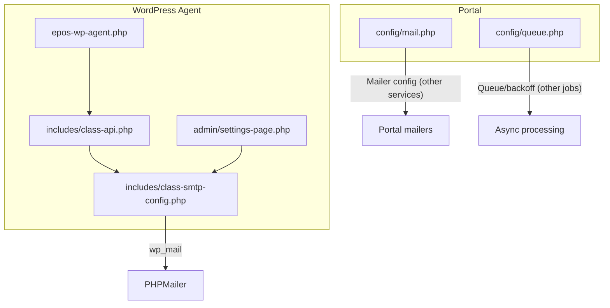
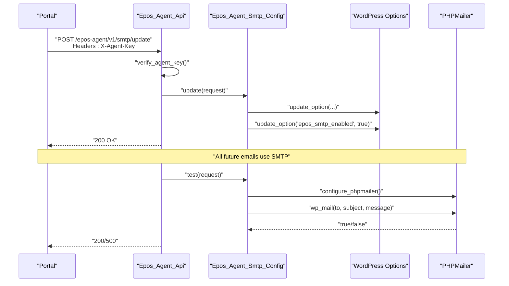
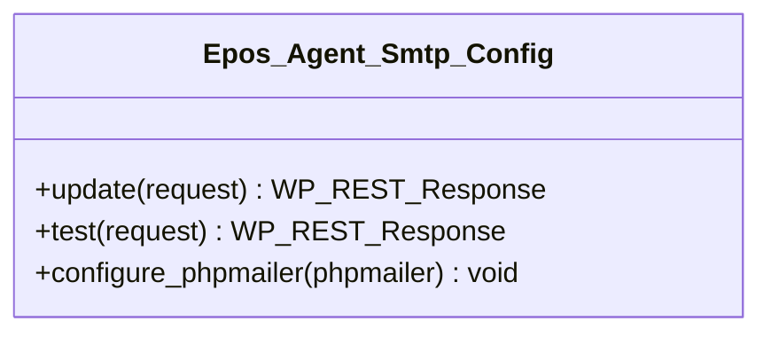
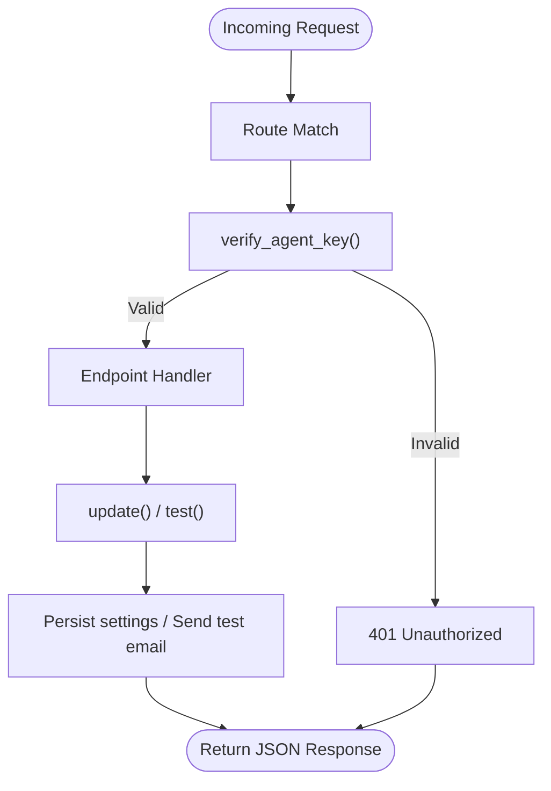
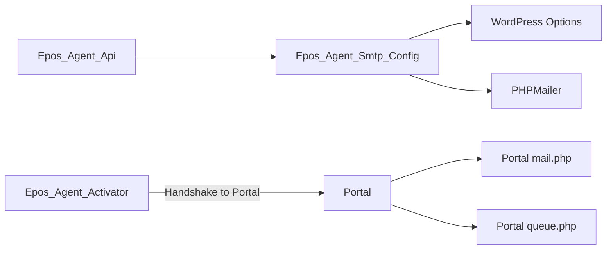

# SMTP Configuration

<cite>
**Referenced Files in This Document**
- [epos-wp-agent.php](file://agent/epos-wp-agent/epos-wp-agent.php)
- [class-api.php](file://agent/epos-wp-agent/includes/class-api.php)
- [class-smtp-config.php](file://agent/epos-wp-agent/includes/class-smtp-config.php)
- [settings-page.php](file://agent/epos-wp-agent/admin/settings-page.php)
- [class-activator.php](file://agent/epos-wp-agent/includes/class-activator.php)
- [mail.php](file://portal/config/mail.php)
- [queue.php](file://portal/config/queue.php)
</cite>

## Table of Contents
1. [Introduction](#introduction)
2. [Project Structure](#project-structure)
3. [Core Components](#core-components)
4. [Architecture Overview](#architecture-overview)
5. [Detailed Component Analysis](#detailed-component-analysis)
6. [Dependency Analysis](#dependency-analysis)
7. [Performance Considerations](#performance-considerations)
8. [Troubleshooting Guide](#troubleshooting-guide)
9. [Conclusion](#conclusion)

## Introduction
This document explains the SMTP configuration system within the WordPress agent. It covers how the Portal remotely configures the WordPress site’s SMTP transport, how the agent applies those settings to WordPress’s mailer, and how test emails are validated. It also documents supported connection parameters, encryption options, and security settings. Where applicable, it outlines delivery tracking and retry mechanisms present in the broader portal infrastructure.

## Project Structure
The SMTP configuration spans two parts:
- WordPress Agent (plugin): Receives SMTP settings from the Portal, persists them, and configures WordPress’s mailer to use them.
- Portal (Laravel application): Provides mailer configuration and queue infrastructure for asynchronous tasks.

**Diagram sources**
- [epos-wp-agent.php:26-34](file://agent/epos-wp-agent/epos-wp-agent.php#L26-L34)
- [class-api.php:8-45](file://agent/epos-wp-agent/includes/class-api.php#L8-L45)
- [class-smtp-config.php:13-41](file://agent/epos-wp-agent/includes/class-smtp-config.php#L13-L41)
- [settings-page.php:115-117](file://agent/epos-wp-agent/admin/settings-page.php#L115-L117)
- [mail.php:38-100](file://portal/config/mail.php#L38-L100)
- [queue.php:32-92](file://portal/config/queue.php#L32-L92)

**Section sources**
- [epos-wp-agent.php:26-34](file://agent/epos-wp-agent/epos-wp-agent.php#L26-L34)
- [class-api.php:8-45](file://agent/epos-wp-agent/includes/class-api.php#L8-L45)
- [class-smtp-config.php:13-41](file://agent/epos-wp-agent/includes/class-smtp-config.php#L13-L41)
- [settings-page.php:115-117](file://agent/epos-wp-agent/admin/settings-page.php#L115-L117)
- [mail.php:38-100](file://portal/config/mail.php#L38-L100)
- [queue.php:32-92](file://portal/config/queue.php#L32-L92)

## Core Components
- REST API endpoints for SMTP configuration and testing, secured by an agent key.
- SMTP configuration handler that persists settings and configures PHPMailer.
- WordPress admin settings page for general agent configuration (not SMTP-specific).
- Portal mailer configuration and queue configuration for asynchronous processing.

Key responsibilities:
- Receive and validate SMTP settings from the Portal.
- Persist settings to WordPress options.
- Apply SMTP settings to PHPMailer for all outgoing emails.
- Send a test email and report success/failure.

**Section sources**
- [class-api.php:25-37](file://agent/epos-wp-agent/includes/class-api.php#L25-L37)
- [class-smtp-config.php:13-41](file://agent/epos-wp-agent/includes/class-smtp-config.php#L13-L41)
- [class-smtp-config.php:49-78](file://agent/epos-wp-agent/includes/class-smtp-config.php#L49-L78)
- [class-smtp-config.php:83-103](file://agent/epos-wp-agent/includes/class-smtp-config.php#L83-L103)
- [settings-page.php:10-18](file://agent/epos-wp-agent/admin/settings-page.php#L10-L18)

## Architecture Overview
The Portal initiates SMTP configuration via REST API calls to the WordPress Agent. The Agent validates the request using an agent key, persists the settings, and configures PHPMailer to route all subsequent emails through the provided SMTP server. A dedicated test endpoint sends a verification email.

**Diagram sources**
- [class-api.php:25-37](file://agent/epos-wp-agent/includes/class-api.php#L25-L37)
- [class-api.php:50-71](file://agent/epos-wp-agent/includes/class-api.php#L50-L71)
- [class-api.php:84-94](file://agent/epos-wp-agent/includes/class-api.php#L84-L94)
- [class-smtp-config.php:13-41](file://agent/epos-wp-agent/includes/class-smtp-config.php#L13-L41)
- [class-smtp-config.php:49-78](file://agent/epos-wp-agent/includes/class-smtp-config.php#L49-L78)
- [class-smtp-config.php:83-103](file://agent/epos-wp-agent/includes/class-smtp-config.php#L83-L103)

## Detailed Component Analysis

### SMTP Configuration Handler
Responsibilities:
- Accept SMTP settings from the Portal.
- Sanitize and persist settings to WordPress options.
- Configure PHPMailer for all outgoing emails.
- Send a test email and return a structured response.

**Diagram sources**
- [class-smtp-config.php:5-103](file://agent/epos-wp-agent/includes/class-smtp-config.php#L5-L103)

**Section sources**
- [class-smtp-config.php:13-41](file://agent/epos-wp-agent/includes/class-smtp-config.php#L13-L41)
- [class-smtp-config.php:49-78](file://agent/epos-wp-agent/includes/class-smtp-config.php#L49-L78)
- [class-smtp-config.php:83-103](file://agent/epos-wp-agent/includes/class-smtp-config.php#L83-L103)

### REST API Endpoints for SMTP
Endpoints:
- POST /epos-agent/v1/smtp/update: Applies SMTP settings.
- POST /epos-agent/v1/smtp/test: Sends a test email using current settings.
- GET /epos-agent/v1/status: Returns site status (not SMTP-specific).

Security:
- Requires a valid agent key via the X-Agent-Key header.

**Diagram sources**
- [class-api.php:15-45](file://agent/epos-wp-agent/includes/class-api.php#L15-L45)
- [class-api.php:50-71](file://agent/epos-wp-agent/includes/class-api.php#L50-L71)
- [class-api.php:84-94](file://agent/epos-wp-agent/includes/class-api.php#L84-L94)

**Section sources**
- [class-api.php:25-37](file://agent/epos-wp-agent/includes/class-api.php#L25-L37)
- [class-api.php:32-37](file://agent/epos-wp-agent/includes/class-api.php#L32-L37)
- [class-api.php:50-71](file://agent/epos-wp-agent/includes/class-api.php#L50-L71)

### WordPress Admin Settings Page
Purpose:
- Provides a general settings UI for the agent (Portal URL and API key).
- Does not manage SMTP settings; SMTP configuration is controlled remotely by the Portal.

Integration:
- Hooks into phpmailer_init to apply SMTP settings for all outgoing emails.

**Section sources**
- [settings-page.php:10-18](file://agent/epos-wp-agent/admin/settings-page.php#L10-L18)
- [settings-page.php:115-117](file://agent/epos-wp-agent/admin/settings-page.php#L115-L117)

### Portal Mailer Configuration
The Portal defines multiple mailers and global sender settings. While the WordPress Agent does not use these mailers directly, understanding the Portal’s configuration helps explain how email delivery is managed in the broader system.

Supported mailers include smtp, ses, postmark, resend, sendmail, log, array, failover, and roundrobin.

Global “From” address can be configured for all emails.

**Section sources**
- [mail.php:38-100](file://portal/config/mail.php#L38-L100)
- [mail.php:113-116](file://portal/config/mail.php#L113-L116)

### Portal Queue Configuration
The Portal configures queue backends (database, beanstalkd, redis, etc.) and supports retry policies. While the WordPress Agent’s SMTP test uses WordPress’s wp_mail (synchronous), the Portal’s queue system demonstrates how asynchronous retries and backoff are implemented elsewhere in the platform.

**Section sources**
- [queue.php:32-92](file://portal/config/queue.php#L32-L92)

## Dependency Analysis
- WordPress Agent depends on WordPress hooks and options to persist and apply SMTP settings.
- PHPMailer is configured dynamically when phpmailer_init fires.
- REST API endpoints depend on the agent key stored in WordPress options.
- Portal mailer and queue configurations are separate from the WordPress Agent but inform the broader email delivery strategy.

**Diagram sources**
- [class-api.php:84-94](file://agent/epos-wp-agent/includes/class-api.php#L84-L94)
- [class-smtp-config.php:24-35](file://agent/epos-wp-agent/includes/class-smtp-config.php#L24-L35)
- [class-activator.php:35-76](file://agent/epos-wp-agent/includes/class-activator.php#L35-L76)
- [mail.php:38-100](file://portal/config/mail.php#L38-L100)
- [queue.php:32-92](file://portal/config/queue.php#L32-L92)

**Section sources**
- [class-api.php:84-94](file://agent/epos-wp-agent/includes/class-api.php#L84-L94)
- [class-smtp-config.php:24-35](file://agent/epos-wp-agent/includes/class-smtp-config.php#L24-L35)
- [class-activator.php:35-76](file://agent/epos-wp-agent/includes/class-activator.php#L35-L76)

## Performance Considerations
- SMTP test uses WordPress’s wp_mail, which is synchronous. For high-volume scenarios, consider offloading email sending to the Portal’s queue and triggering agent-side actions via webhook or scheduled tasks.
- PHPMailer configuration is applied on each email via the phpmailer_init hook. Keep settings minimal and avoid unnecessary reconfiguration.
- Network timeouts and TLS negotiation can impact latency; ensure the SMTP host and port align with provider recommendations.

[No sources needed since this section provides general guidance]

## Troubleshooting Guide

Common issues and resolutions:
- Authentication failures
  - Verify the username and password stored in WordPress options.
  - Confirm the agent key used by the Portal matches the stored key.
  - Ensure the SMTP server allows authentication with the provided credentials.
  - Reference: [class-smtp-config.php:27-28](file://agent/epos-wp-agent/includes/class-smtp-config.php#L27-L28), [class-api.php:50-71](file://agent/epos-wp-agent/includes/class-api.php#L50-L71)

- Connection timeouts
  - Validate host and port settings.
  - Check network connectivity from the WordPress server to the SMTP host.
  - Confirm firewall and outbound port allowances.
  - Reference: [class-smtp-config.php:92](file://agent/epos-wp-agent/includes/class-smtp-config.php#L92)

- SSL/TLS configuration problems
  - Choose encryption mode that matches the provider (e.g., tls or ssl).
  - If the provider requires no encryption, set encryption to none.
  - Reference: [class-smtp-config.php:99-102](file://agent/epos-wp-agent/includes/class-smtp-config.php#L99-L102)

- Test email delivery failures
  - Use the SMTP test endpoint to validate configuration.
  - Review the response payload for failure reasons.
  - Reference: [class-smtp-config.php:49-78](file://agent/epos-wp-agent/includes/class-smtp-config.php#L49-L78)

- Delivery tracking and retries
  - WordPress Agent’s SMTP test is synchronous; there is no built-in delivery confirmation in this module.
  - The Portal’s queue system supports retries and backoff for other asynchronous jobs; consider integrating email sending through the Portal for advanced retry and tracking.
  - Reference: [queue.php:32-92](file://portal/config/queue.php#L32-L92)

## Conclusion
The WordPress Agent’s SMTP configuration system provides a secure, remote-controlled mechanism to configure and validate SMTP settings. Settings are persisted and applied to PHPMailer for all outgoing emails, with a dedicated test endpoint to verify connectivity. While the Agent itself does not implement queue-based retries or delivery confirmations, the broader Portal offers robust queue and retry capabilities that can be leveraged for advanced email delivery workflows.