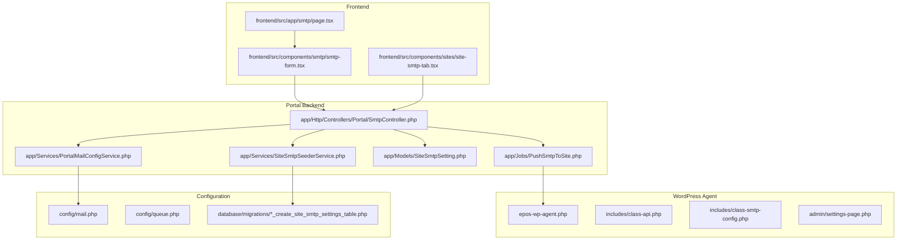
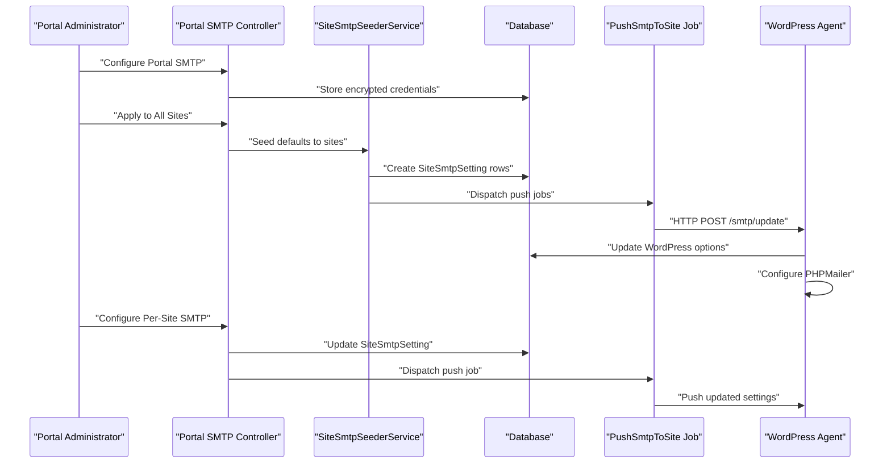
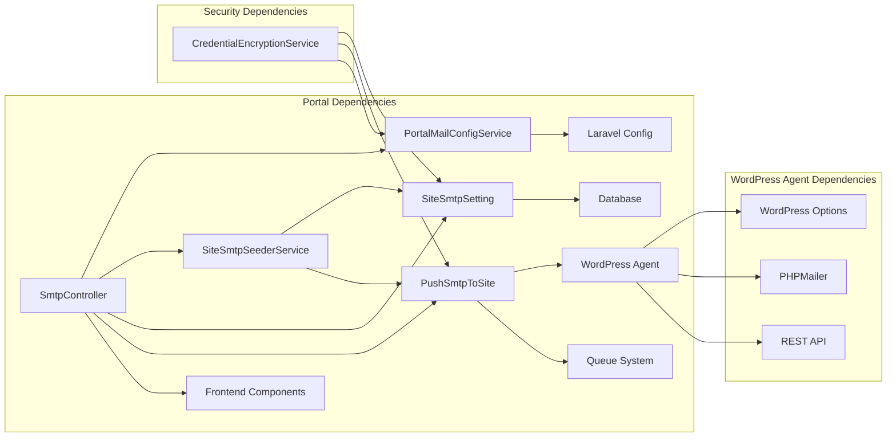

# SMTP Configuration

<cite>
**Referenced Files in This Document**
- [epos-wp-agent.php](file://agent/epos-wp-agent/epos-wp-agent.php)
- [class-api.php](file://agent/epos-wp-agent/includes/class-api.php)
- [class-smtp-config.php](file://agent/epos-wp-agent/includes/class-smtp-config.php)
- [settings-page.php](file://agent/epos-wp-agent/admin/settings-page.php)
- [class-activator.php](file://agent/epos-wp-agent/includes/class-activator.php)
- [mail.php](file://portal/config/mail.php)
- [queue.php](file://portal/config/queue.php)
- [SmtpController.php](file://portal/app/Http/Controllers/Portal/SmtpController.php)
- [PortalMailConfigService.php](file://portal/app/Services/PortalMailConfigService.php)
- [SiteSmtpSetting.php](file://portal/app/Models/SiteSmtpSetting.php)
- [PushSmtpToSite.php](file://portal/app/Jobs/PushSmtpToSite.php)
- [SiteSmtpSeederService.php](file://portal/app/Services/SiteSmtpSeederService.php)
- [smtp-form.tsx](file://portal/frontend/src/components/smtp/smtp-form.tsx)
- [site-smtp-tab.tsx](file://portal/frontend/src/components/sites/site-smtp-tab.tsx)
</cite>

## Update Summary
**Changes Made**
- Added comprehensive portal-side SMTP configuration system with new controller and services
- Integrated per-site SMTP settings with encrypted credential storage
- Implemented automated SMTP configuration push to WordPress agents
- Added frontend components for SMTP dashboard and configuration interfaces
- Enhanced security with encrypted password handling throughout the pipeline

## Table of Contents
1. [Introduction](#introduction)
2. [Project Structure](#project-structure)
3. [Core Components](#core-components)
4. [Architecture Overview](#architecture-overview)
5. [Detailed Component Analysis](#detailed-component-analysis)
6. [Dependency Analysis](#dependency-analysis)
7. [Performance Considerations](#performance-considerations)
8. [Troubleshooting Guide](#troubleshooting-guide)
9. [Conclusion](#conclusion)

## Introduction
This document explains the comprehensive SMTP configuration system within the WordPress agent and portal integration. The system now includes both portal-wide SMTP configuration and per-site SMTP settings with encrypted credential storage. It covers how the Portal remotely configures WordPress site SMTP transport, how encrypted credentials are securely handled, and how the agent applies those settings to WordPress's mailer. The system includes automated configuration push, real-time validation, and comprehensive frontend interfaces for both portal administrators and site owners.

## Project Structure
The SMTP configuration system spans three main components:
- WordPress Agent (plugin): Receives SMTP settings from the Portal, persists them, and configures WordPress's mailer
- Portal (Laravel application): Provides comprehensive SMTP configuration management with encrypted credential storage and automated push system
- Frontend (Next.js): Offers intuitive dashboards and configuration interfaces for both portal-wide and per-site SMTP management

**Diagram sources**
- [SmtpController.php:25-288](file://portal/app/Http/Controllers/Portal/SmtpController.php#L25-L288)
- [PortalMailConfigService.php:24-77](file://portal/app/Services/PortalMailConfigService.php#L24-L77)
- [SiteSmtpSeederService.php:23-134](file://portal/app/Services/SiteSmtpSeederService.php#L23-L134)
- [SiteSmtpSetting.php:8-44](file://portal/app/Models/SiteSmtpSetting.php#L8-L44)
- [PushSmtpToSite.php:23-89](file://portal/app/Jobs/PushSmtpToSite.php#L23-L89)
- [smtp-form.tsx:1-271](file://portal/frontend/src/components/smtp/smtp-form.tsx#L1-L271)
- [site-smtp-tab.tsx:21-104](file://portal/frontend/src/components/sites/site-smtp-tab.tsx#L21-L104)

**Section sources**
- [SmtpController.php:25-288](file://portal/app/Http/Controllers/Portal/SmtpController.php#L25-L288)
- [PortalMailConfigService.php:24-77](file://portal/app/Services/PortalMailConfigService.php#L24-L77)
- [SiteSmtpSetting.php:8-44](file://portal/app/Models/SiteSmtpSetting.php#L8-L44)
- [PushSmtpToSite.php:23-89](file://portal/app/Jobs/PushSmtpToSite.php#L23-L89)
- [SiteSmtpSeederService.php:23-134](file://portal/app/Services/SiteSmtpSeederService.php#L23-L134)

## Core Components
The system now includes comprehensive components for both portal-wide and per-site SMTP management:

### Portal-Side Components
- **SmtpController**: Main controller managing both portal-wide and per-site SMTP configuration endpoints
- **PortalMailConfigService**: Applies portal-wide SMTP settings to Laravel's mail configuration at runtime
- **SiteSmtpSetting**: Model for per-site SMTP configuration with encrypted password storage
- **PushSmtpToSite Job**: Handles automated pushing of SMTP settings to WordPress agents
- **SiteSmtpSeederService**: Manages bulk seeding of SMTP defaults to all sites

### Frontend Components
- **SmtpForm**: Reusable form component for SMTP configuration with validation and password masking
- **SiteSmtpTab**: Per-site SMTP configuration interface with real-time status indicators
- **Portal SMTP Dashboard**: Centralized interface for managing SMTP settings across all sites

### WordPress Agent Components (Legacy)
- REST API endpoints for SMTP configuration and testing, secured by an agent key
- SMTP configuration handler that persists settings and configures PHPMailer
- WordPress admin settings page for general agent configuration

**Section sources**
- [SmtpController.php:25-288](file://portal/app/Http/Controllers/Portal/SmtpController.php#L25-L288)
- [PortalMailConfigService.php:24-77](file://portal/app/Services/PortalMailConfigService.php#L24-L77)
- [SiteSmtpSetting.php:8-44](file://portal/app/Models/SiteSmtpSetting.php#L8-L44)
- [PushSmtpToSite.php:23-89](file://portal/app/Jobs/PushSmtpToSite.php#L23-L89)
- [SiteSmtpSeederService.php:23-134](file://portal/app/Services/SiteSmtpSeederService.php#L23-L134)

## Architecture Overview
The enhanced SMTP configuration system provides a comprehensive solution for managing SMTP settings across multiple WordPress sites. The architecture separates concerns between portal-wide configuration and per-site customization while ensuring secure credential handling.

**Diagram sources**
- [SmtpController.php:107-137](file://portal/app/Http/Controllers/Portal/SmtpController.php#L107-L137)
- [SiteSmtpSeederService.php:70-93](file://portal/app/Services/SiteSmtpSeederService.php#L70-L93)
- [PushSmtpToSite.php:35-87](file://portal/app/Jobs/PushSmtpToSite.php#L35-L87)

## Detailed Component Analysis

### Portal SMTP Controller
The SmtpController serves as the central management interface for both portal-wide and per-site SMTP configuration. It handles validation, persistence, and automated deployment of SMTP settings.

**Portal-Wide Configuration Features:**
- Complete SMTP configuration management with validation
- Encrypted password storage using CredentialEncryptionService
- Bulk application to all sites with overwrite options
- Real-time test email functionality
- Automatic portal mailer configuration application

**Per-Site Configuration Features:**
- Individual site SMTP customization
- Encrypted credential storage per site
- Direct agent testing via HTTP requests
- Push notification tracking with timestamps
- User audit trail for configuration changes

**Section sources**
- [SmtpController.php:25-288](file://portal/app/Http/Controllers/Portal/SmtpController.php#L25-L288)

### PortalMailConfigService
This service dynamically applies portal-wide SMTP settings to Laravel's mail configuration at runtime, allowing administrators to override environment-based settings without restarting the application.

**Key Features:**
- Runtime configuration application via Config facade
- Automatic decryption of stored passwords
- Support for TLS, SSL, and no-encryption modes
- Global sender identity configuration
- Graceful fallback when database is unavailable

**Section sources**
- [PortalMailConfigService.php:24-77](file://portal/app/Services/PortalMailConfigService.php#L24-L77)

### SiteSmtpSetting Model
The SiteSmtpSetting model provides encrypted storage for per-site SMTP credentials with comprehensive validation and relationship management.

**Security Features:**
- Encrypted password storage using Vault Master Key
- Hidden encrypted password field in API responses
- Automatic timestamp tracking for configuration changes
- User audit trail with updated_by foreign key
- Strict attribute casting for data integrity

**Section sources**
- [SiteSmtpSetting.php:8-44](file://portal/app/Models/SiteSmtpSetting.php#L8-L44)

### PushSmtpToSite Job
The PushSmtpToSite job handles the automated deployment of SMTP settings from the portal to individual WordPress agents, implementing robust error handling and retry logic.

**Job Characteristics:**
- Queue-based processing on 'deployments' queue
- Built-in retry mechanism (3 attempts) with timeout protection
- Secure credential decryption before transmission
- Comprehensive error logging and reporting
- Automatic last_pushed_at timestamp updates

**Section sources**
- [PushSmtpToSite.php:23-89](file://portal/app/Jobs/PushSmtpToSite.php#L23-L89)

### SiteSmtpSeederService
This service manages the bulk seeding of portal SMTP defaults to all sites, providing flexible overwrite options and comprehensive reporting.

**Bulk Operations:**
- Portal-wide SMTP default extraction
- Conditional site seeding based on existing configurations
- Overwrite control for existing site settings
- Detailed operation tally for administrative feedback
- API key validation to prevent failed pushes

**Section sources**
- [SiteSmtpSeederService.php:23-134](file://portal/app/Services/SiteSmtpSeederService.php#L23-L134)

### Frontend SMTP Components
The frontend provides intuitive interfaces for managing SMTP settings across different scopes.

**SmtpForm Component:**
- Comprehensive form validation with real-time feedback
- Password masking with show/hide toggle functionality
- Dynamic enable/disable state management
- Test email recipient validation
- Loading states and user feedback integration

**SiteSmtpTab Component:**
- Per-site configuration interface with agent status indicators
- Automated credential push notifications
- Last push timestamp display for verification
- Error handling with user-friendly messaging
- Integration with portal-wide SMTP defaults

**Section sources**
- [smtp-form.tsx:1-271](file://portal/frontend/src/components/smtp/smtp-form.tsx#L1-L271)
- [site-smtp-tab.tsx:21-104](file://portal/frontend/src/components/sites/site-smtp-tab.tsx#L21-L104)

## Dependency Analysis
The enhanced SMTP system introduces several new dependencies and relationships:

**Diagram sources**
- [SmtpController.php:6-16](file://portal/app/Http/Controllers/Portal/SmtpController.php#L6-L16)
- [SiteSmtpSeederService.php:5-8](file://portal/app/Services/SiteSmtpSeederService.php#L5-L8)
- [PushSmtpToSite.php:5-13](file://portal/app/Jobs/PushSmtpToSite.php#L5-L13)
- [PortalMailConfigService.php:5-6](file://portal/app/Services/PortalMailConfigService.php#L5-L6)

**Section sources**
- [SmtpController.php:6-16](file://portal/app/Http/Controllers/Portal/SmtpController.php#L6-L16)
- [SiteSmtpSeederService.php:5-8](file://portal/app/Services/SiteSmtpSeederService.php#L5-L8)
- [PushSmtpToSite.php:5-13](file://portal/app/Jobs/PushSmtpToSite.php#L5-L13)
- [PortalMailConfigService.php:5-6](file://portal/app/Services/PortalMailConfigService.php#L5-L6)

## Performance Considerations
The enhanced system introduces several performance optimizations and considerations:

**Queue-Based Processing:**
- PushSmtpToSite jobs utilize the 'deployments' queue for scalable processing
- Built-in retry mechanism prevents transient failures from blocking deployments
- Timeout protection (45-second limit) ensures responsive job processing
- Parallel processing capability for bulk site deployments

**Database Optimization:**
- Efficient batch operations for site seeding and bulk updates
- Minimal query overhead through optimized model relationships
- Encrypted field handling reduces unnecessary decryption cycles
- Audit trail tracking maintains performance while providing accountability

**Frontend Performance:**
- Client-side form validation reduces server requests
- Loading states and optimistic UI updates improve perceived performance
- Real-time status indicators eliminate polling overhead
- Password masking prevents unnecessary data transmission

**Security Considerations:**
- Encrypted credential storage prevents plaintext exposure
- Secure transmission via HTTPS and API key authentication
- Minimal credential exposure in logs and error messages
- Automatic cleanup of temporary decrypted values

## Troubleshooting Guide

### Portal-Side Issues

**Portal SMTP Configuration Failures**
- Verify portal SMTP is properly configured before applying to sites
- Check that portal SMTP host and from_email are set before bulk operations
- Ensure portal SMTP password is encrypted using CredentialEncryptionService
- Monitor PushSmtpToSite job queue for retry failures

**Per-Site SMTP Configuration Issues**
- Confirm site has agent API key configured in the portal
- Verify site is connected and accessible to the portal system
- Check SiteSmtpSetting model for proper encryption of credentials
- Review PushSmtpToSite job logs for detailed error information

**Bulk Application Problems**
- Use overwrite parameter judiciously to avoid unintentional configuration changes
- Monitor seedMany operation results for sites without API keys
- Verify database constraints for encrypted password fields
- Check queue worker availability for job processing

### Agent-Side Issues

**Authentication Failures**
- Verify username and password stored in SiteSmtpSetting are correct
- Confirm agent API key matches the WordPress site configuration
- Check SMTP server allows authentication with provided credentials
- Validate encryption/decryption process for stored passwords

**Connection Timeouts**
- Validate host and port settings match SMTP provider requirements
- Check network connectivity from portal server to WordPress site
- Confirm firewall allows outbound connections on specified ports
- Verify SSL/TLS configuration matches provider requirements

**SSL/TLS Configuration Problems**
- Choose encryption mode that matches SMTP provider specifications
- Use 'ssl' for SMTPS connections, 'tls' for STARTTLS, 'none' for unencrypted
- Ensure certificate validation is properly configured for SSL connections
- Test connection using provider-specific connection utilities

### Frontend Interface Issues

**Form Validation Errors**
- Ensure required fields are properly filled when SMTP is enabled
- Verify email addresses use valid formats in from_email and test fields
- Check password field behavior for 'keep existing' functionality
- Validate port numbers are within acceptable ranges (1-65535)

**Push Status Confusion**
- Monitor last_pushed_at timestamp for successful agent updates
- Check job queue status for pending or failed push operations
- Verify agent connectivity using test email functionality
- Review error messages for specific failure reasons

**Security and Privacy Concerns**
- Password fields are automatically cleared after successful saves
- Encrypted credentials are never transmitted in plaintext
- Audit trails provide visibility into configuration changes
- Secure credential storage prevents unauthorized access

**Section sources**
- [SmtpController.php:121-136](file://portal/app/Http/Controllers/Portal/SmtpController.php#L121-L136)
- [PushSmtpToSite.php:38-47](file://portal/app/Jobs/PushSmtpToSite.php#L38-L47)
- [SiteSmtpSeederService.php:116-132](file://portal/app/Services/SiteSmtpSeederService.php#L116-L132)

## Conclusion
The enhanced SMTP configuration system provides a comprehensive, secure, and scalable solution for managing email delivery across multiple WordPress sites. The integration of portal-wide configuration with per-site customization, combined with encrypted credential storage and automated deployment, creates a robust foundation for enterprise-grade email management.

Key improvements include:
- **Enhanced Security**: Encrypted credential storage throughout the entire pipeline
- **Automated Management**: Queue-based deployment eliminates manual configuration
- **Comprehensive Monitoring**: Real-time status tracking and detailed error reporting
- **Flexible Configuration**: Support for both global defaults and individual site overrides
- **User-Friendly Interfaces**: Intuitive frontend components for seamless administration

The system successfully bridges the gap between centralized portal management and distributed WordPress agent configuration, providing administrators with powerful tools to ensure reliable email delivery across their entire WordPress ecosystem.