# WordPress Agent Integration

<cite>
**Referenced Files in This Document**
- [epos-wp-agent.php](file://agent/epos-wp-agent/epos-wp-agent.php)
- [class-api.php](file://agent/epos-wp-agent/includes/class-api.php)
- [class-ping.php](file://agent/epos-wp-agent/includes/class-ping.php)
- [class-order-sync.php](file://agent/epos-wp-agent/includes/class-order-sync.php)
- [class-plugin-installer.php](file://agent/epos-wp-agent/includes/class-plugin-installer.php)
- [class-plugin-updater.php](file://agent/epos-wp-agent/includes/class-plugin-updater.php)
- [class-smtp-config.php](file://agent/epos-wp-agent/includes/class-smtp-config.php)
- [class-activator.php](file://agent/epos-wp-agent/includes/class-activator.php)
- [class-deactivator.php](file://agent/epos-wp-agent/includes/class-deactivator.php)
- [class-health-check.php](file://agent/epos-wp-agent/includes/class-health-check.php)
- [class-rollback.php](file://agent/epos-wp-agent/includes/class-rollback.php)
- [class-security-api.php](file://agent/epos-wp-agent/includes/class-security-api.php)
- [class-security-file-monitor.php](file://agent/epos-wp-agent/includes/class-security-file-monitor.php)
- [class-security-login-monitor.php](file://agent/epos-wp-agent/includes/class-security-login-monitor.php)
- [class-security-user-monitor.php](file://agent/epos-wp-agent/includes/class-security-user-monitor.php)
- [class-security-2fa-manager.php](file://agent/epos-wp-agent/includes/class-security-2fa-manager.php)
- [settings-page.php](file://agent/epos-wp-agent/admin/settings-page.php)
- [readme.txt](file://agent/epos-wp-agent/readme.txt)
- [agent.php](file://portal/routes/agent.php)
- [AgentAuthMiddleware.php](file://portal/app/Http/Middleware/AgentAuthMiddleware.php)
- [AgentController.php](file://portal/app/Http/Controllers/Agent/AgentController.php)
- [SecurityReportController.php](file://portal/app/Http/Controllers/Agent/SecurityReportController.php)
- [SignedUrlService.php](file://portal/app/Services/SignedUrlService.php)
- [PluginDownloadController.php](file://portal/app/Http/Controllers/Portal/PluginDownloadController.php)
- [mail.php](file://portal/config/mail.php)
- [FileIntegrityBaseline.php](file://portal/app/Models/FileIntegrityBaseline.php)
- [SecurityAlert.php](file://portal/app/Models/SecurityAlert.php)
- [SiteAdminUser.php](file://portal/app/Models/SiteAdminUser.php)
</cite>

## Update Summary
**Changes Made**
- Enhanced WordPress agent integration with comprehensive security monitoring capabilities
- Added new health check and rollback system for automated plugin deployment validation
- Integrated 2FA management system with automatic plugin installation and configuration
- Implemented bidirectional security communication between WordPress agent and Laravel portal
- Added new agent classes for security API endpoints, file monitoring, login tracking, user administration, and deployment health validation

## Table of Contents
1. [Introduction](#introduction)
2. [Project Structure](#project-structure)
3. [Core Components](#core-components)
4. [Architecture Overview](#architecture-overview)
5. [Detailed Component Analysis](#detailed-component-analysis)
6. [Enhanced Security Monitoring System](#enhanced-security-monitoring-system)
7. [Health Check and Rollback System](#health-check-and-rollback-system)
8. [2FA Management Integration](#2fa-management-integration)
9. [Bidirectional Plugin Synchronization](#bidirectional-plugin-synchronization)
10. [Enhanced Plugin Lifecycle Management](#enhanced-plugin-lifecycle-management)
11. [Dependency Analysis](#dependency-analysis)
12. [Performance Considerations](#performance-considerations)
13. [Security and Authentication](#security-and-authentication)
14. [Troubleshooting Guide](#troubleshooting-guide)
15. [Conclusion](#conclusion)

## Introduction
This document explains the WordPress Agent plugin integration system that connects WordPress sites to the EPOS Portal. The system now features comprehensive security monitoring capabilities including file integrity checking, login activity monitoring, user management, 2FA enforcement, automated health checks, and rollback functionality. It covers the agent plugin architecture, the REST API bridge between WordPress and the Laravel backend, the heartbeat mechanism for periodic status updates, plugin management (installation, updates, and compatibility), order synchronization for WooCommerce, SMTP configuration and email service integration, enhanced security monitoring, deployment validation, and troubleshooting guidance for common communication issues.

## Project Structure
The integration consists of two parts:
- WordPress plugin (agent): Provides REST endpoints, heartbeat, bidirectional plugin management, SMTP configuration, order synchronization, comprehensive security monitoring, health check validation, and rollback functionality.
- Laravel Portal backend: Validates agent requests, handles handshake and ping, manages plugin versions with signed URL generation, orchestrates bidirectional plugin synchronization, processes security reports, manages security alerts, and coordinates deployment health validation.

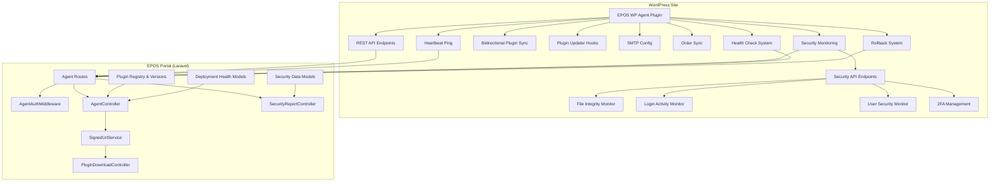

**Diagram sources**
- [epos-wp-agent.php:36-42](file://agent/epos-wp-agent/epos-wp-agent.php#L36-L42)
- [class-health-check.php:9-35](file://agent/epos-wp-agent/includes/class-health-check.php#L9-L35)
- [class-rollback.php:9-53](file://agent/epos-wp-agent/includes/class-rollback.php#L9-L53)
- [class-security-api.php:21-74](file://agent/epos-wp-agent/includes/class-security-api.php#L21-L74)
- [class-security-file-monitor.php:38-83](file://agent/epos-wp-agent/includes/class-security-file-monitor.php#L38-L83)
- [class-security-login-monitor.php:16-52](file://agent/epos-wp-agent/includes/class-security-login-monitor.php#L16-L52)
- [class-security-user-monitor.php:14-62](file://agent/epos-wp-agent/includes/class-security-user-monitor.php#L14-L62)
- [class-security-2fa-manager.php:21-84](file://agent/epos-wp-agent/includes/class-security-2fa-manager.php#L21-L84)
- [agent.php:26-33](file://portal/routes/agent.php#L26-L33)
- [SecurityReportController.php:24-103](file://portal/app/Http/Controllers/Agent/SecurityReportController.php#L24-L103)

**Section sources**
- [epos-wp-agent.php:26-53](file://agent/epos-wp-agent/epos-wp-agent.php#L26-L53)
- [agent.php:16-19](file://portal/routes/agent.php#L16-L19)

## Core Components
- REST API Bridge: Exposes endpoints under a dedicated namespace for plugin management, SMTP configuration, status reporting, and comprehensive security monitoring.
- Heartbeat Mechanism: Periodic pings to the Portal with site status, security events, plugin states, and 2FA configuration.
- Bidirectional Plugin Synchronization: Real-time plugin state synchronization with the Portal for both directions.
- Enhanced Plugin Management: Installs and updates EPOS company plugins with integrity verification, secure downloads, full lifecycle management, and automated health validation.
- Plugin Updates Endpoint: Generates signed URLs for secure plugin downloads with token-based access control.
- SMTP Configuration: Applies remote SMTP settings and sends test emails.
- Order Synchronization: Collects recent WooCommerce orders for sync to the Portal.
- Security Monitoring System: Comprehensive file integrity checking, login activity monitoring, user security tracking, and 2FA management.
- Health Check System: Automated post-deployment validation with configurable delay settings and rollback capability.
- Rollback System: Automatic backup and restoration for failed plugin deployments with manual override support.
- Authentication and Security: Uses a shared secret validated via a middleware on the Portal with enhanced security measures.

**Section sources**
- [class-api.php:15-45](file://agent/epos-wp-agent/includes/class-api.php#L15-L45)
- [class-ping.php:29-81](file://agent/epos-wp-agent/includes/class-ping.php#L29-L81)
- [class-plugin-installer.php:13-92](file://agent/epos-wp-agent/includes/class-plugin-installer.php#L13-L92)
- [class-plugin-updater.php:16-45](file://agent/epos-wp-agent/includes/class-plugin-updater.php#L16-L45)
- [class-smtp-config.php:13-78](file://agent/epos-wp-agent/includes/class-smtp-config.php#L13-L78)
- [class-order-sync.php:13-47](file://agent/epos-wp-agent/includes/class-order-sync.php#L13-L47)
- [class-security-api.php:14-74](file://agent/epos-wp-agent/includes/class-security-api.php#L14-L74)
- [class-health-check.php:14-35](file://agent/epos-wp-agent/includes/class-health-check.php#L14-L35)
- [class-rollback.php:14-53](file://agent/epos-wp-agent/includes/class-rollback.php#L14-L53)
- [AgentAuthMiddleware.php:20-55](file://portal/app/Http/Middleware/AgentAuthMiddleware.php#L20-L55)

## Architecture Overview
The agent plugin initializes and registers:
- REST API endpoints for the Portal to issue commands.
- A cron-based heartbeat that periodically pings the Portal.
- Plugin updater hooks for EPOS company plugins with bidirectional synchronization.
- Admin settings page for Portal URL and API key.
- Comprehensive security monitoring systems including file integrity, login tracking, user management, and 2FA enforcement.
- Health check system for automated post-deployment validation.
- Rollback system for automatic recovery from failed deployments.

The Portal validates each request using a custom middleware that verifies the X-Agent-Key against a hashed secret stored per site and attaches the site context to the request. The system now supports bidirectional plugin synchronization with secure signed URL generation for downloads, comprehensive security reporting, deployment health validation, and automated rollback functionality.

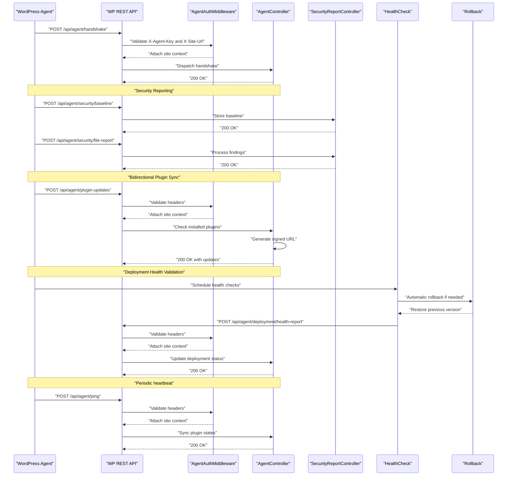

**Diagram sources**
- [epos-wp-agent.php:43-53](file://agent/epos-wp-agent/epos-wp-agent.php#L43-L53)
- [class-api.php:8-10](file://agent/epos-wp-agent/includes/class-api.php#L8-L10)
- [agent.php:16-19](file://portal/routes/agent.php#L16-L19)
- [AgentAuthMiddleware.php:20-55](file://portal/app/Http/Middleware/AgentAuthMiddleware.php#L20-L55)
- [AgentController.php:16-97](file://portal/app/Http/Controllers/Agent/AgentController.php#L16-L97)
- [SecurityReportController.php:24-103](file://portal/app/Http/Controllers/Agent/SecurityReportController.php#L24-L103)
- [class-health-check.php:22-35](file://agent/epos-wp-agent/includes/class-health-check.php#L22-L35)
- [class-rollback.php:58-91](file://agent/epos-wp-agent/includes/class-rollback.php#L58-L91)

## Detailed Component Analysis

### REST API Bridge
The plugin registers a namespace for agent-related endpoints and enforces agent key verification for each route. The endpoints include:
- Plugin install/update
- SMTP update
- SMTP test
- Status report
- **New security endpoints**: File integrity scanning, 2FA management, user monitoring, login event reporting, and deployment health validation

Verification relies on comparing the provided key with the stored key using a constant-time comparison.

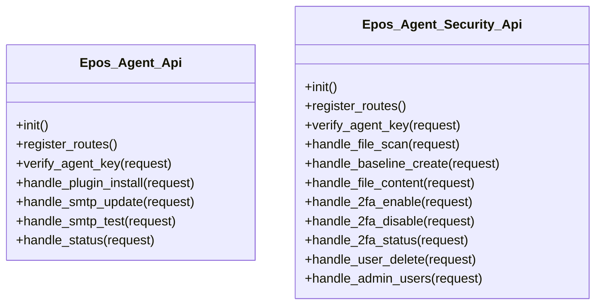

**Diagram sources**
- [class-api.php:6-109](file://agent/epos-wp-agent/includes/class-api.php#L6-L109)
- [class-security-api.php:9-205](file://agent/epos-wp-agent/includes/class-security-api.php#L9-L205)

**Section sources**
- [class-api.php:15-45](file://agent/epos-wp-agent/includes/class-api.php#L15-L45)
- [class-api.php:50-71](file://agent/epos-wp-agent/includes/class-api.php#L50-L71)
- [class-security-api.php:21-74](file://agent/epos-wp-agent/includes/class-security-api.php#L21-L74)

### Heartbeat Mechanism
The agent schedules a custom 5-minute interval and posts a payload containing:
- Installed EPOS company plugins
- Recent orders (if WooCommerce is active)
- **New security data**: Buffered login events, admin user counts, security status indicators, and 2FA configuration
- **New deployment data**: Health check status and rollback information

It sets connection status based on HTTP response codes and logs errors in debug mode.

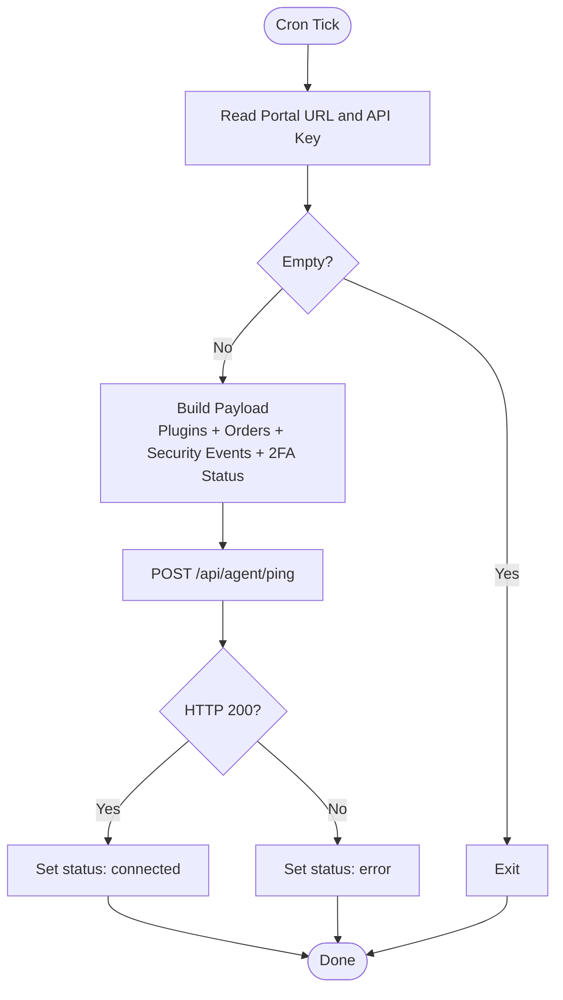

**Diagram sources**
- [class-ping.php:7-13](file://agent/epos-wp-agent/includes/class-ping.php#L7-L13)
- [class-ping.php:29-81](file://agent/epos-wp-agent/includes/class-ping.php#L29-L81)

**Section sources**
- [class-ping.php:18-24](file://agent/epos-wp-agent/includes/class-ping.php#L18-L24)
- [class-ping.php:29-81](file://agent/epos-wp-agent/includes/class-ping.php#L29-L81)

### Enhanced Plugin Management
The installer accepts parameters for slug, version, download URL, and file hash. It:
- Downloads the plugin archive
- Verifies SHA-256 integrity
- Uses the WordPress upgrader to install or update
- Activates the plugin if needed
- **New**: Creates automatic backups before upgrades for rollback capability
- **New**: Stores deployment context for health check scheduling

The updater now implements bidirectional synchronization with the Portal, checking for updates and providing plugin information for WordPress update system integration.

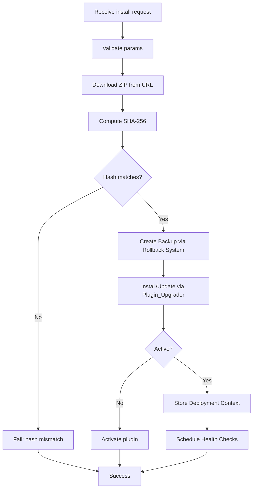

**Diagram sources**
- [class-plugin-installer.php:13-92](file://agent/epos-wp-agent/includes/class-plugin-installer.php#L13-L92)
- [class-rollback.php:14-53](file://agent/epos-wp-agent/includes/class-rollback.php#L14-L53)
- [class-health-check.php:22-35](file://agent/epos-wp-agent/includes/class-health-check.php#L22-L35)

**Section sources**
- [class-plugin-installer.php:13-92](file://agent/epos-wp-agent/includes/class-plugin-installer.php#L13-L92)
- [class-plugin-installer.php:101-105](file://agent/epos-wp-agent/includes/class-plugin-installer.php#L101-L105)
- [class-plugin-installer.php:148-161](file://agent/epos-wp-agent/includes/class-plugin-installer.php#L148-L161)
- [class-plugin-updater.php:16-45](file://agent/epos-wp-agent/includes/class-plugin-updater.php#L16-L45)

### SMTP Configuration and Email Service Integration
The SMTP module:
- Persists SMTP settings upon receiving a remote update
- Hooks into PHPMailer to apply settings for all outgoing emails
- Sends a test email and returns success/failure

The Portal's mail configuration supports multiple mailers and global "From" settings.

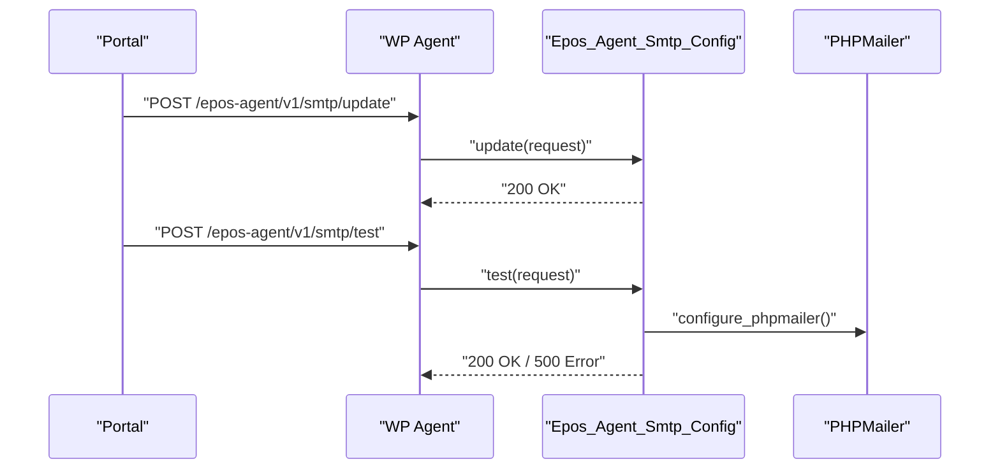

**Diagram sources**
- [class-smtp-config.php:13-41](file://agent/epos-wp-agent/includes/class-smtp-config.php#L13-L41)
- [class-smtp-config.php:49-78](file://agent/epos-wp-agent/includes/class-smtp-config.php#L49-L78)
- [class-smtp-config.php:83-103](file://agent/epos-wp-agent/includes/class-smtp-config.php#L83-L103)
- [mail.php:38-100](file://portal/config/mail.php#L38-L100)

**Section sources**
- [class-smtp-config.php:13-78](file://agent/epos-wp-agent/includes/class-smtp-config.php#L13-L78)
- [class-smtp-config.php:83-103](file://agent/epos-wp-agent/includes/class-smtp-config.php#L83-L103)
- [mail.php:38-100](file://portal/config/mail.php#L38-L100)

### Order Synchronization (WooCommerce)
The order sync collects the most recent orders modified since the last sync, up to a fixed limit, and updates the last sync timestamp. This data is included in the heartbeat payload when WooCommerce is active.

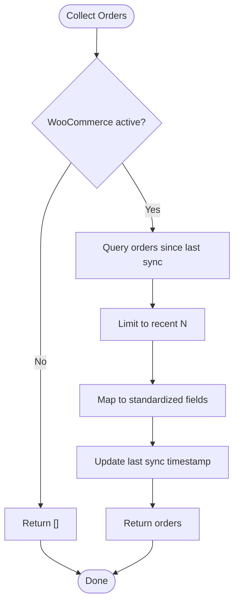

**Diagram sources**
- [class-order-sync.php:13-47](file://agent/epos-wp-agent/includes/class-order-sync.php#L13-L47)

**Section sources**
- [class-order-sync.php:13-47](file://agent/epos-wp-agent/includes/class-order-sync.php#L13-L47)

### Initialization and Admin Settings
On activation, the agent schedules the heartbeat, sets default options, and attempts a handshake with the Portal. The admin settings page allows configuring the Portal URL and API key, saving them securely, and testing connectivity.

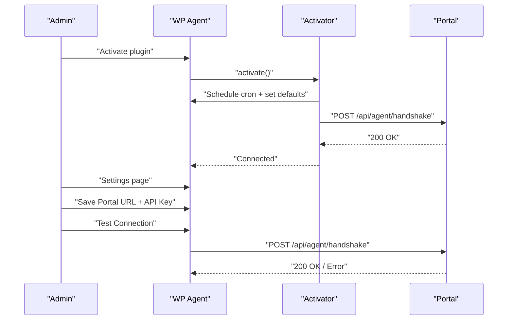

**Diagram sources**
- [class-activator.php:12-30](file://agent/epos-wp-agent/includes/class-activator.php#L12-L30)
- [class-activator.php:35-76](file://agent/epos-wp-agent/includes/class-activator.php#L35-L76)
- [settings-page.php:20-27](file://agent/epos-wp-agent/admin/settings-page.php#L20-L27)
- [settings-page.php:30-45](file://agent/epos-wp-agent/admin/settings-page.php#L30-L45)

**Section sources**
- [class-activator.php:12-30](file://agent/epos-wp-agent/includes/class-activator.php#L12-L30)
- [class-activator.php:35-76](file://agent/epos-wp-agent/includes/class-activator.php#L35-L76)
- [settings-page.php:20-27](file://agent/epos-wp-agent/admin/settings-page.php#L20-L27)
- [settings-page.php:30-45](file://agent/epos-wp-agent/admin/settings-page.php#L30-L45)

## Enhanced Security Monitoring System

### Comprehensive Security Infrastructure
The WordPress agent now includes a complete security monitoring system with seven major components:

1. **File Integrity Monitoring**: Scans WordPress core files and uploads for unauthorized changes
2. **Login Activity Monitoring**: Tracks successful and failed login attempts with IP geolocation
3. **User Security Monitoring**: Monitors admin user creation and role changes for immediate alerts
4. **2FA Management**: Automatically installs and configures 2FA plugins with policy enforcement
5. **Security Reporting**: Bidirectional communication of security events to the Portal
6. **Health Check System**: Automated post-deployment validation with configurable delays
7. **Rollback System**: Automatic backup and restoration for failed deployments

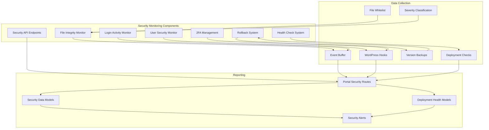

**Diagram sources**
- [class-security-file-monitor.php:38-83](file://agent/epos-wp-agent/includes/class-security-file-monitor.php#L38-L83)
- [class-security-login-monitor.php:16-52](file://agent/epos-wp-agent/includes/class-security-login-monitor.php#L16-L52)
- [class-security-user-monitor.php:14-62](file://agent/epos-wp-agent/includes/class-security-user-monitor.php#L14-L62)
- [class-security-2fa-manager.php:21-84](file://agent/epos-wp-agent/includes/class-security-2fa-manager.php#L21-L84)
- [class-security-api.php:21-74](file://agent/epos-wp-agent/includes/class-security-api.php#L21-L74)
- [class-health-check.php:14-35](file://agent/epos-wp-agent/includes/class-health-check.php#L14-L35)
- [class-rollback.php:14-53](file://agent/epos-wp-agent/includes/class-rollback.php#L14-L53)

### File Integrity Monitoring
The file integrity monitor performs comprehensive scanning of WordPress core files and uploads:

- **Baseline Creation**: Creates SHA-256 hash baselines for monitored files and directories
- **Change Detection**: Identifies modified, deleted, and newly added files
- **Severity Classification**: Ranks findings by criticality (CRITICAL, HIGH, MEDIUM, LOW)
- **Whitelist Management**: Exempts legitimate files like images and cached content
- **Automated Reporting**: Sends findings to the Portal with detailed metadata

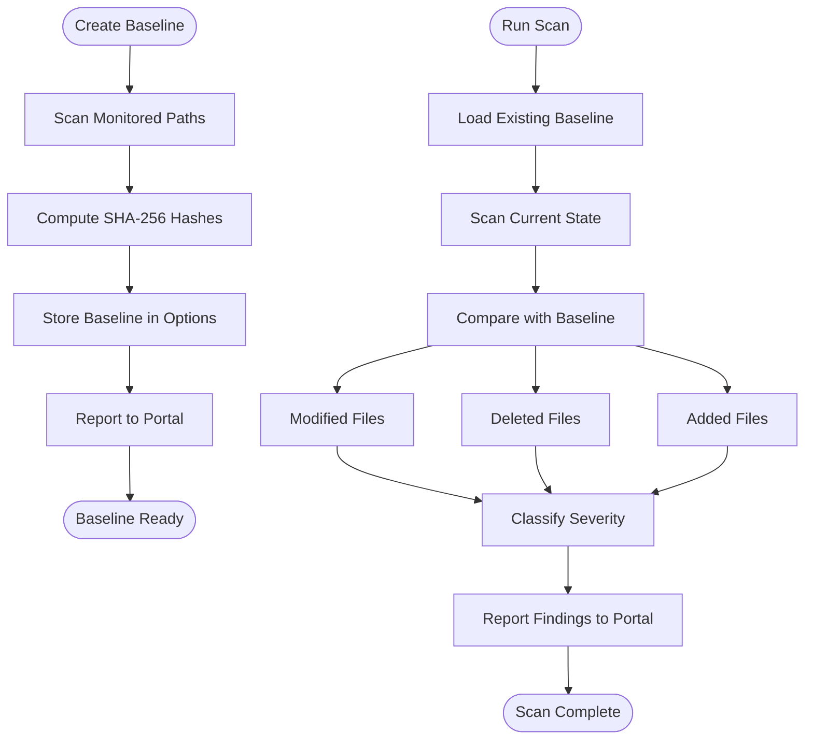

**Diagram sources**
- [class-security-file-monitor.php:38-83](file://agent/epos-wp-agent/includes/class-security-file-monitor.php#L38-L83)
- [class-security-file-monitor.php:90-174](file://agent/epos-wp-agent/includes/class-security-file-monitor.php#L90-L174)
- [class-security-file-monitor.php:255-295](file://agent/epos-wp-agent/includes/class-security-file-monitor.php#L255-L295)

**Section sources**
- [class-security-file-monitor.php:14-32](file://agent/epos-wp-agent/includes/class-security-file-monitor.php#L14-L32)
- [class-security-file-monitor.php:38-83](file://agent/epos-wp-agent/includes/class-security-file-monitor.php#L38-L83)
- [class-security-file-monitor.php:90-174](file://agent/epos-wp-agent/includes/class-security-file-monitor.php#L90-L174)
- [class-security-file-monitor.php:255-295](file://agent/epos-wp-agent/includes/class-security-file-monitor.php#L255-L295)

### Login Activity Monitoring
The login monitor captures and buffers authentication events for security analysis:

- **Event Capture**: Records failed and successful login attempts with user details
- **IP Tracking**: Captures client IP addresses with support for proxy headers
- **User Agent Logging**: Stores browser information for suspicious activity detection
- **Buffer Management**: Maintains up to 500 events to prevent memory issues
- **Batch Reporting**: Flushes buffered events during heartbeat pings

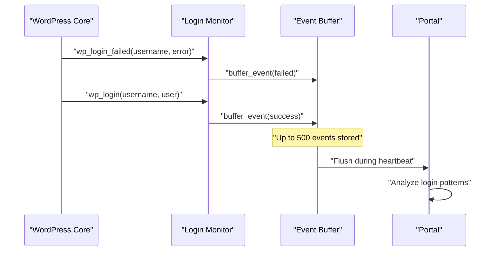

**Diagram sources**
- [class-security-login-monitor.php:27-52](file://agent/epos-wp-agent/includes/class-security-login-monitor.php#L27-L52)
- [class-security-login-monitor.php:59-92](file://agent/epos-wp-agent/includes/class-security-login-monitor.php#L59-L92)

**Section sources**
- [class-security-login-monitor.php:16-52](file://agent/epos-wp-agent/includes/class-security-login-monitor.php#L16-L52)
- [class-security-login-monitor.php:59-92](file://agent/epos-wp-agent/includes/class-security-login-monitor.php#L59-L92)

### User Security Monitoring
The user monitor tracks administrative privileges and user creation for immediate security alerts:

- **Admin Creation Detection**: Monitors new administrator accounts
- **Role Change Tracking**: Detects promotions to administrative roles
- **Immediate Alerting**: Sends critical security alerts to the Portal
- **Admin User Sync**: Provides comprehensive admin user listings for weekly sync
- **Safety Checks**: Prevents deletion of primary admin or sole administrator

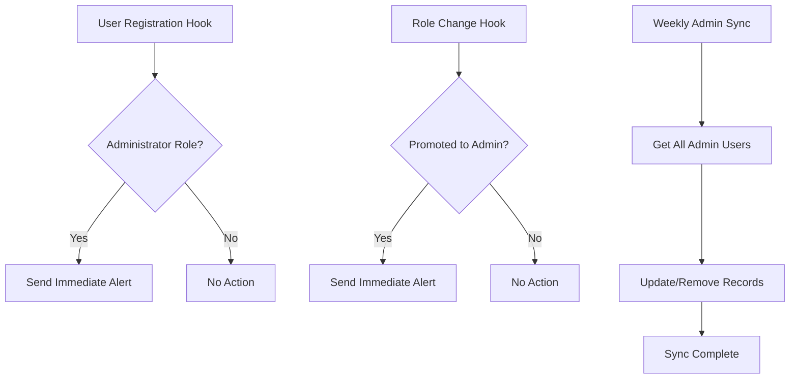

**Diagram sources**
- [class-security-user-monitor.php:24-62](file://agent/epos-wp-agent/includes/class-security-user-monitor.php#L24-L62)
- [class-security-user-monitor.php:69-84](file://agent/epos-wp-agent/includes/class-security-user-monitor.php#L69-L84)

**Section sources**
- [class-security-user-monitor.php:14-62](file://agent/epos-wp-agent/includes/class-security-user-monitor.php#L14-L62)
- [class-security-user-monitor.php:69-84](file://agent/epos-wp-agent/includes/class-security-user-monitor.php#L69-L84)

## Health Check and Rollback System

### Automated Deployment Validation
The health check system provides comprehensive post-deployment validation with configurable timing and automatic rollback capabilities:

- **Configurable Delays**: Customizable first and second check intervals (default 2 and 5 minutes)
- **Multi-Point Validation**: Tests site reachability, admin access, error-free operation, WooCommerce functionality, and plugin activation
- **Automatic Rollback**: Restores previous version if any check fails
- **Deployment Tracking**: Stores deployment context and health status for reporting
- **Cleanup Management**: Automatic cleanup of deployment tracking after successful validation

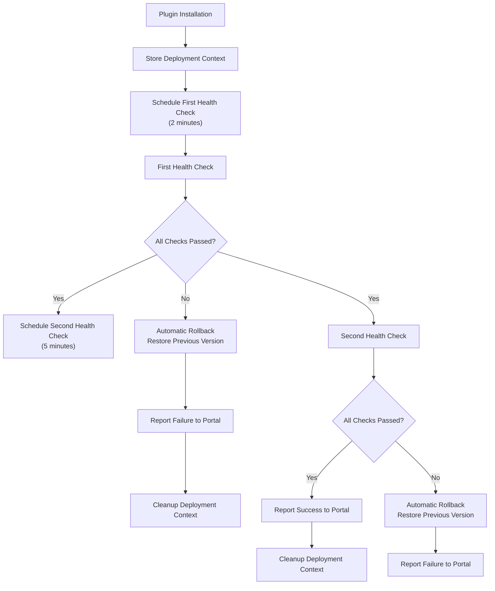

**Diagram sources**
- [class-health-check.php:22-35](file://agent/epos-wp-agent/includes/class-health-check.php#L22-L35)
- [class-health-check.php:40-113](file://agent/epos-wp-agent/includes/class-health-check.php#L40-L113)
- [class-rollback.php:58-91](file://agent/epos-wp-agent/includes/class-rollback.php#L58-L91)

### Health Check Validation Points
The system performs comprehensive validation across multiple domains:

- **Site Reachability**: Verifies homepage accessibility (HTTP 200-399 range)
- **Admin Access**: Confirms WordPress admin panel accessibility (direct or redirect to login)
- **Error Detection**: Scans debug.log for PHP fatal errors since installation
- **WooCommerce Testing**: Validates checkout page functionality (if active)
- **Plugin Activation**: Ensures target plugin remains active after deployment

**Section sources**
- [class-health-check.php:118-234](file://agent/epos-wp-agent/includes/class-health-check.php#L118-L234)
- [class-health-check.php:131-142](file://agent/epos-wp-agent/includes/class-health-check.php#L131-L142)
- [class-health-check.php:147-159](file://agent/epos-wp-agent/includes/class-health-check.php#L147-L159)
- [class-health-check.php:164-192](file://agent/epos-wp-agent/includes/class-health-check.php#L164-L192)
- [class-health-check.php:197-216](file://agent/epos-wp-agent/includes/class-health-check.php#L197-L216)
- [class-health-check.php:221-234](file://agent/epos-wp-agent/includes/class-health-check.php#L221-L234)

### Rollback System Implementation
The rollback system provides comprehensive backup and restoration capabilities:

- **Pre-Deployment Backup**: Creates complete backup of current plugin version before upgrades
- **Automatic Restoration**: Restores previous version if health checks fail
- **Manual Override**: Supports portal-initiated manual rollbacks with specific version downloads
- **Backup Management**: Automatic cleanup of backups after 24 hours (extended to 7 days after rollback)
- **Activation Preservation**: Maintains plugin activation state during rollback process

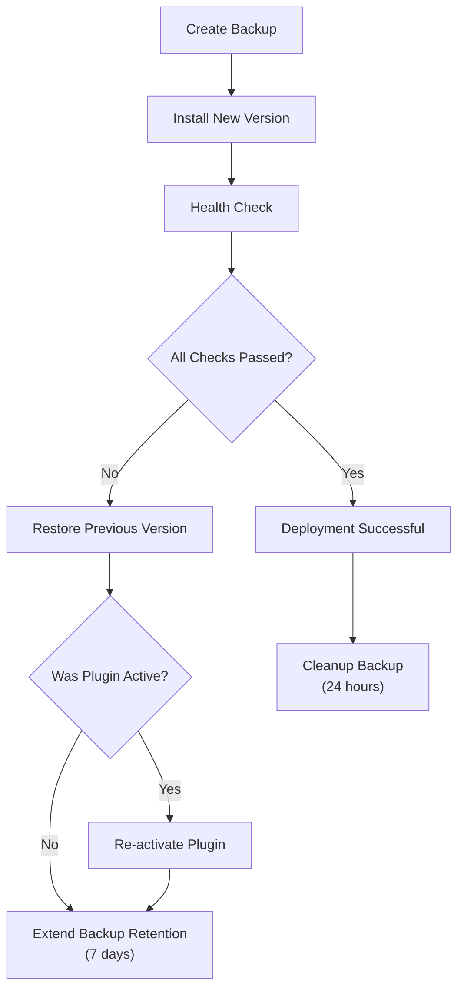

**Diagram sources**
- [class-rollback.php:14-53](file://agent/epos-wp-agent/includes/class-rollback.php#L14-L53)
- [class-rollback.php:58-91](file://agent/epos-wp-agent/includes/class-rollback.php#L58-L91)
- [class-rollback.php:97-137](file://agent/epos-wp-agent/includes/class-rollback.php#L97-L137)

**Section sources**
- [class-rollback.php:14-53](file://agent/epos-wp-agent/includes/class-rollback.php#L14-L53)
- [class-rollback.php:58-91](file://agent/epos-wp-agent/includes/class-rollback.php#L58-L91)
- [class-rollback.php:97-137](file://agent/epos-wp-agent/includes/class-rollback.php#L97-L137)

## 2FA Management Integration

### Automated 2FA Plugin Management
The agent includes comprehensive 2FA management capabilities that automatically handle plugin installation, configuration, and status reporting:

- **Plugin Installation**: Automatically installs the preferred 2FA plugin from WordPress.org
- **Configuration Management**: Sets up authentication methods and enforcement policies
- **Status Reporting**: Provides detailed 2FA status including individual admin user configurations
- **Policy Enforcement**: Configures plugin policies for administrator role enforcement

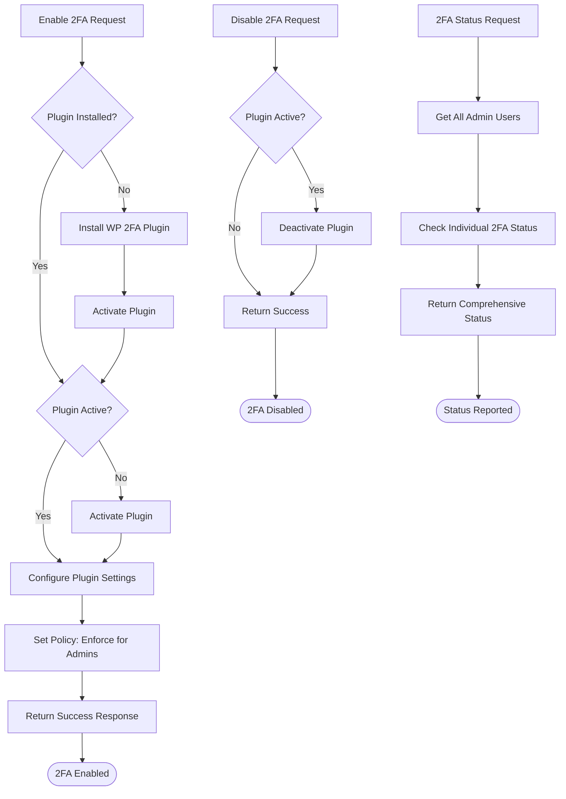

**Diagram sources**
- [class-security-2fa-manager.php:21-84](file://agent/epos-wp-agent/includes/class-security-2fa-manager.php#L21-L84)
- [class-security-2fa-manager.php:105-129](file://agent/epos-wp-agent/includes/class-security-2fa-manager.php#L105-L129)

### 2FA Configuration and Enforcement
The 2FA manager implements sophisticated configuration management:

- **Authentication Methods**: Supports TOTP (Time-based One-Time Password) and email-based authentication
- **Enforcement Policies**: Can enforce 2FA for specific user roles including administrators
- **Individual User Tracking**: Monitors 2FA status for each administrator user
- **Plugin Integration**: Works with the preferred WP 2FA plugin for seamless operation

**Section sources**
- [class-security-2fa-manager.php:11-131](file://agent/epos-wp-agent/includes/class-security-2fa-manager.php#L11-L131)

## Bidirectional Plugin Synchronization

### Enhanced Plugin Updates Flow
The system now supports bidirectional plugin synchronization through a comprehensive updates endpoint that generates secure signed URLs for plugin downloads. This enables both directions of communication:

1. **Portal-to-Agent Updates**: Portal checks installed plugins and sends update information
2. **Agent-to-Portal State Reporting**: Agent reports plugin states back to Portal
3. **Secure Download Process**: Signed URLs ensure secure plugin distribution
4. **Deployment Health Validation**: Post-installation health checks with automatic rollback

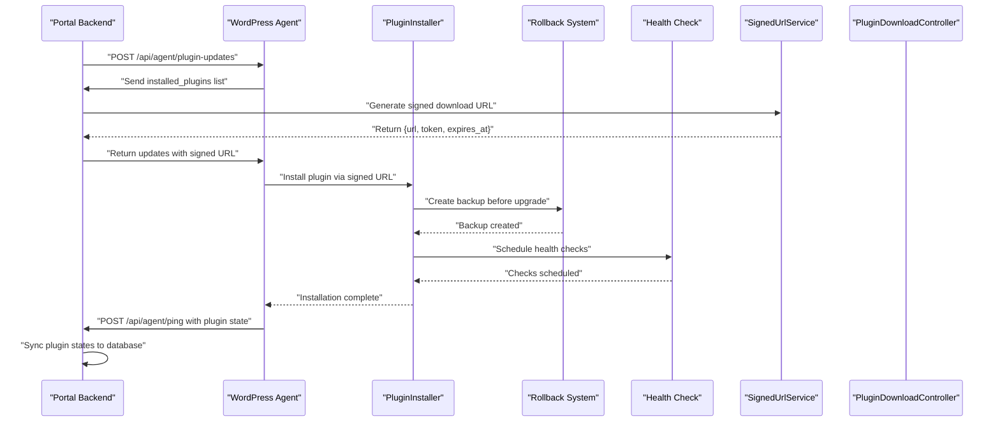

**Diagram sources**
- [AgentController.php:178-241](file://portal/app/Http/Controllers/Agent/AgentController.php#L178-L241)
- [SignedUrlService.php:17-36](file://portal/app/Services/SignedUrlService.php#L17-L36)
- [PluginDownloadController.php:16-43](file://portal/app/Http/Controllers/Portal/PluginDownloadController.php#L16-L43)
- [class-plugin-updater.php:30-113](file://agent/epos-wp-agent/includes/class-plugin-updater.php#L30-L113)
- [class-plugin-installer.php:101-105](file://agent/epos-wp-agent/includes/class-plugin-installer.php#L101-L105)
- [class-health-check.php:22-35](file://agent/epos-wp-agent/includes/class-health-check.php#L22-L35)

### Plugin State Synchronization
The AgentController now includes comprehensive plugin state synchronization that:
- Syncs company plugin installations to the site_plugins table
- Calculates latest stable versions for each plugin
- Handles plugin activation/deactivation states
- Removes orphaned records when plugins are uninstalled
- **New**: Processes deployment health reports with rollback notifications

**Section sources**
- [AgentController.php:107-152](file://portal/app/Http/Controllers/Agent/AgentController.php#L107-L152)
- [class-plugin-updater.php:30-113](file://agent/epos-wp-agent/includes/class-plugin-updater.php#L30-L113)
- [AgentController.php:348-414](file://portal/app/Http/Controllers/Agent/AgentController.php#L348-L414)

## Enhanced Plugin Lifecycle Management

### Secure Plugin Download System
The system implements a secure plugin download process using signed URLs:

1. **Token Generation**: Unique tokens with 10-minute expiration
2. **Cache Storage**: Temporary storage of file metadata in cache
3. **Single-Use Validation**: Token validation with automatic cleanup
4. **Integrity Verification**: SHA-256 hash verification during installation
5. **Backup Creation**: Automatic backup of current version before upgrades

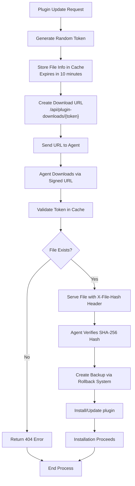

**Diagram sources**
- [SignedUrlService.php:17-36](file://portal/app/Services/SignedUrlService.php#L17-L36)
- [PluginDownloadController.php:16-43](file://portal/app/Http/Controllers/Portal/PluginDownloadController.php#L16-L43)
- [class-plugin-installer.php:47-57](file://agent/epos-wp-agent/includes/class-plugin-installer.php#L47-L57)
- [class-rollback.php:14-53](file://agent/epos-wp-agent/includes/class-rollback.php#L14-L53)

### Improved Installer Logic
The enhanced installer now includes:
- Comprehensive parameter validation
- Secure file hash verification
- Overwrite handling for updates
- Automatic activation logic
- Detailed error reporting
- **New**: Backup creation before upgrades
- **New**: Deployment context storage for health checks

**Section sources**
- [class-plugin-installer.php:19-110](file://agent/epos-wp-agent/includes/class-plugin-installer.php#L19-L110)
- [class-plugin-installer.php:101-105](file://agent/epos-wp-agent/includes/class-plugin-installer.php#L101-L105)
- [class-plugin-installer.php:148-161](file://agent/epos-wp-agent/includes/class-plugin-installer.php#L148-L161)
- [SignedUrlService.php:17-36](file://portal/app/Services/SignedUrlService.php#L17-L36)
- [PluginDownloadController.php:16-43](file://portal/app/Http/Controllers/Portal/PluginDownloadController.php#L16-L43)

## Dependency Analysis
The agent plugin depends on WordPress core APIs for REST, cron, HTTP requests, plugin management, security hooks, and deployment validation. The Portal validates requests and orchestrates actions based on the authenticated site context, with enhanced plugin management capabilities, comprehensive security reporting, deployment health validation, and automated rollback functionality.

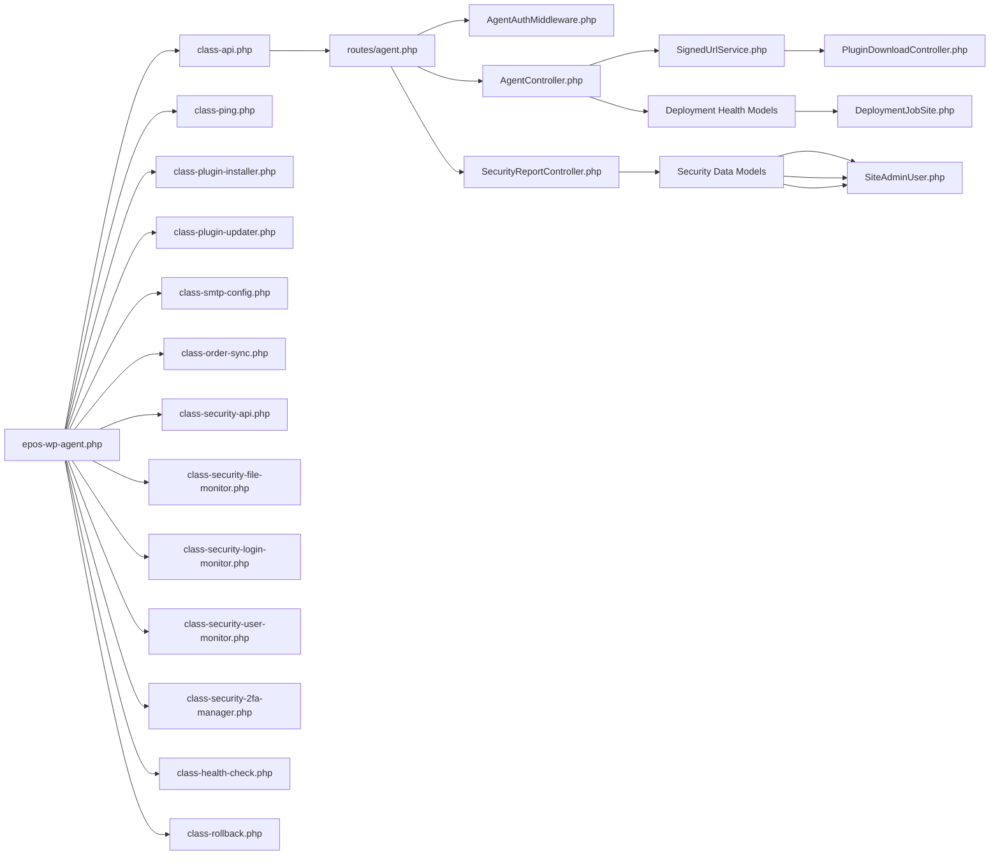

**Diagram sources**
- [epos-wp-agent.php:26-34](file://agent/epos-wp-agent/epos-wp-agent.php#L26-L34)
- [class-api.php:8-10](file://agent/epos-wp-agent/includes/class-api.php#L8-L10)
- [agent.php:16-19](file://portal/routes/agent.php#L16-L19)
- [AgentAuthMiddleware.php:20-55](file://portal/app/Http/Middleware/AgentAuthMiddleware.php#L20-L55)
- [AgentController.php:16-97](file://portal/app/Http/Controllers/Agent/AgentController.php#L16-L97)
- [SecurityReportController.php:18-331](file://portal/app/Http/Controllers/Agent/SecurityReportController.php#L18-L331)
- [SignedUrlService.php:17-36](file://portal/app/Services/SignedUrlService.php#L17-L36)
- [PluginDownloadController.php:16-43](file://portal/app/Http/Controllers/Portal/PluginDownloadController.php#L16-L43)
- [FileIntegrityBaseline.php:8-31](file://portal/app/Models/FileIntegrityBaseline.php#L8-L31)
- [SecurityAlert.php:9-62](file://portal/app/Models/SecurityAlert.php#L9-L62)
- [SiteAdminUser.php:9-58](file://portal/app/Models/SiteAdminUser.php#L9-L58)
- [DeploymentJobSite.php:9-58](file://portal/app/Models/DeploymentJobSite.php#L9-L58)

**Section sources**
- [epos-wp-agent.php:26-34](file://agent/epos-wp-agent/epos-wp-agent.php#L26-L34)
- [agent.php:16-19](file://portal/routes/agent.php#L16-L19)

## Performance Considerations
- Heartbeat frequency: The 5-minute interval balances visibility and overhead. Adjustments should consider server load and network bandwidth.
- Order sync limits: The recent order collection is capped to reduce payload size and processing time.
- Plugin downloads: Large plugin archives increase memory and disk usage; ensure sufficient resources and timeouts.
- Signed URL caching: Cache-based token storage minimizes database load while maintaining security.
- Bidirectional sync: Plugin state synchronization reduces redundant data transfer and improves accuracy.
- SMTP operations: Email sending adds latency; batch operations or async processing can help if needed.
- **Security monitoring overhead**: File scans and login buffering add computational overhead; optimize scan intervals and buffer sizes.
- **Database writes**: Security event logging increases database load; implement appropriate indexing and cleanup policies.
- **Memory management**: Event buffers are capped at 500 events to prevent memory exhaustion.
- **Health check performance**: Multi-point validation adds processing time; configure delays appropriately for environment constraints.
- **Rollback operations**: Backup and restoration processes require disk space and processing power; monitor resource usage during deployments.

## Security and Authentication
- Shared secret validation: The Portal hashes the provided key and compares it securely. The agent verifies keys using a constant-time comparison.
- Headers: Both sides rely on X-Agent-Key and X-Site-Url for identification and authorization.
- HTTPS: Outbound requests enable SSL verification to protect data in transit.
- Integrity: Plugin installation validates file integrity via SHA-256 before upgrading.
- Signed URL Security: Token-based download URLs with 10-minute expiration prevent unauthorized access.
- Cache Security: Temporary cache storage with automatic cleanup prevents token reuse.
- Bidirectional Authentication: Both directions require proper key validation and site authorization.
- **Security Event Protection**: Login events are sanitized and IP addresses are validated to prevent injection attacks.
- **File Path Validation**: All file content requests undergo rigorous path validation to prevent directory traversal attacks.
- **Rate Limiting**: Security endpoints implement rate limiting to prevent abuse and denial-of-service attacks.
- **Health Check Security**: Deployment health checks validate multiple system aspects to prevent silent failures.
- **Rollback Security**: Automatic rollback ensures system stability and prevents prolonged exposure to broken deployments.

Best practices:
- Rotate API keys periodically and re-test connections after changes.
- Restrict Portal URL and API key exposure; avoid logging sensitive values.
- Monitor connection status and investigate persistent errors promptly.
- Regularly review plugin update logs and security events.
- Implement proper cache configuration for production environments.
- **Regular security audits**: Schedule periodic security scans and review security event logs.
- **2FA enforcement**: Ensure 2FA is enabled for all administrator accounts.
- **File integrity monitoring**: Maintain up-to-date baselines and respond quickly to security findings.
- **Deployment validation**: Monitor health check results and investigate failed deployments immediately.
- **Backup management**: Ensure adequate disk space for rollback backups and monitor cleanup processes.

**Section sources**
- [AgentAuthMiddleware.php:20-55](file://portal/app/Http/Middleware/AgentAuthMiddleware.php#L20-L55)
- [class-api.php:50-71](file://agent/epos-wp-agent/includes/class-api.php#L50-L71)
- [class-ping.php:50-62](file://agent/epos-wp-agent/includes/class-ping.php#L50-L62)
- [class-plugin-installer.php:36-44](file://agent/epos-wp-agent/includes/class-plugin-installer.php#L36-L44)
- [SignedUrlService.php:17-36](file://portal/app/Services/SignedUrlService.php#L17-L36)
- [class-security-file-monitor.php:182-200](file://agent/epos-wp-agent/includes/class-security-file-monitor.php#L182-L200)
- [class-security-login-monitor.php:99-110](file://agent/epos-wp-agent/includes/class-security-login-monitor.php#L99-L110)
- [class-health-check.php:182-200](file://agent/epos-wp-agent/includes/class-health-check.php#L182-L200)
- [class-rollback.php:106-110](file://agent/epos-wp-agent/includes/class-rollback.php#L106-L110)

## Troubleshooting Guide
Common issues and resolutions:
- Missing or invalid API key
  - Symptom: Unauthorized responses from the Portal.
  - Action: Verify the API key in the settings page and re-test the connection.
  - Section sources
    - [class-api.php:50-71](file://agent/epos-wp-agent/includes/class-api.php#L50-L71)
    - [settings-page.php:30-45](file://agent/epos-wp-agent/admin/settings-page.php#L30-L45)

- Connection failures during handshake or ping
  - Symptom: Connection status shows error; logs indicate failures.
  - Action: Check network reachability to the Portal URL, firewall rules, and SSL certificates. Review debug logs if enabled.
  - Section sources
    - [class-activator.php:60-66](file://agent/epos-wp-agent/includes/class-activator.php#L60-L66)
    - [class-ping.php:64-70](file://agent/epos-wp-agent/includes/class-ping.php#L64-L70)

- Plugin installation failures
  - Symptom: Installation returns failure; errors indicate permission or integrity issues.
  - Action: Confirm server write permissions, available disk space, and that the file hash matches the expected value.
  - Section sources
    - [class-plugin-installer.php:29-34](file://agent/epos-wp-agent/includes/class-plugin-installer.php#L29-L34)
    - [class-plugin-installer.php:68-80](file://agent/epos-wp-agent/includes/class-plugin-installer.php#L68-L80)

- Plugin update failures
  - Symptom: Updates not detected or download fails.
  - Action: Verify signed URL generation, cache configuration, and file hash verification. Check plugin registry and version management.
  - Section sources
    - [class-plugin-updater.php:30-113](file://agent/epos-wp-agent/includes/class-plugin-updater.php#L30-L113)
    - [AgentController.php:178-241](file://portal/app/Http/Controllers/Agent/AgentController.php#L178-L241)
    - [SignedUrlService.php:17-36](file://portal/app/Services/SignedUrlService.php#L17-L36)

- SMTP test failures
  - Symptom: Test email fails to send.
  - Action: Validate SMTP credentials and server settings; ensure the PHPMailer configuration is applied and the mailer is reachable.
  - Section sources
    - [class-smtp-config.php:49-78](file://agent/epos-wp-agent/includes/class-smtp-config.php#L49-L78)
    - [class-smtp-config.php:83-103](file://agent/epos-wp-agent/includes/class-smtp-config.php#L83-L103)

- Heartbeat not updating status
  - Symptom: Connection remains pending or disconnects unexpectedly.
  - Action: Confirm cron is running, schedule is registered, and the Portal responds with HTTP 200.
  - Section sources
    - [class-ping.php:18-24](file://agent/epos-wp-agent/includes/class-ping.php#L18-L24)
    - [class-ping.php:72-81](file://agent/epos-wp-agent/includes/class-ping.php#L72-L81)

- Bidirectional sync issues
  - Symptom: Plugin states not updating or inconsistent data.
  - Action: Verify plugin state reporting in heartbeat, check database synchronization, and confirm plugin registry updates.
  - Section sources
    - [AgentController.php:107-152](file://portal/app/Http/Controllers/Agent/AgentController.php#L107-L152)
    - [class-activator.php:81-103](file://agent/epos-wp-agent/includes/class-activator.php#L81-L103)

- **Security monitoring failures**
  - Symptom: Security events not appearing in Portal or file scans failing.
  - Action: Check WordPress cron jobs, verify security API endpoints are accessible, and review security event buffers. Ensure proper file permissions for scan directories.
  - Section sources
    - [class-security-api.php:21-74](file://agent/epos-wp-agent/includes/class-security-api.php#L21-L74)
    - [class-security-file-monitor.php:38-83](file://agent/epos-wp-agent/includes/class-security-file-monitor.php#L38-L83)
    - [class-security-login-monitor.php:59-92](file://agent/epos-wp-agent/includes/class-security-login-monitor.php#L59-L92)

- **2FA management issues**
  - Symptom: 2FA plugin installation fails or configuration not applied.
  - Action: Verify WordPress.org accessibility, check plugin installation permissions, and ensure proper plugin activation. Review 2FA status reporting in heartbeat.
  - Section sources
    - [class-security-2fa-manager.php:105-129](file://agent/epos-wp-agent/includes/class-security-2fa-manager.php#L105-L129)
    - [class-security-2fa-manager.php:21-84](file://agent/epos-wp-agent/includes/class-security-2fa-manager.php#L21-L84)

- **Security event processing delays**
  - Symptom: Security events arrive late or are missing from Portal.
  - Action: Check event buffer configuration, verify Portal connectivity for event reporting, and review security endpoint response times.
  - Section sources
    - [class-security-login-monitor.php:59-92](file://agent/epos-wp-agent/includes/class-security-login-monitor.php#L59-L92)
    - [class-security-user-monitor.php:92-110](file://agent/epos-wp-agent/includes/class-security-user-monitor.php#L92-L110)

- **Health check failures**
  - Symptom: Health checks not triggering or failing to rollback.
  - Action: Verify cron scheduling, check health check configuration options, and review rollback system logs. Ensure proper backup storage and disk space.
  - Section sources
    - [class-health-check.php:22-35](file://agent/epos-wp-agent/includes/class-health-check.php#L22-L35)
    - [class-health-check.php:40-113](file://agent/epos-wp-agent/includes/class-health-check.php#L40-L113)
    - [class-rollback.php:14-53](file://agent/epos-wp-agent/includes/class-rollback.php#L14-L53)

- **Rollback system issues**
  - Symptom: Rollback fails or doesn't restore previous version.
  - Action: Check backup directory permissions, verify backup integrity, and ensure plugin activation state is preserved. Review rollback cleanup processes.
  - Section sources
    - [class-rollback.php:58-91](file://agent/epos-wp-agent/includes/class-rollback.php#L58-L91)
    - [class-rollback.php:97-137](file://agent/epos-wp-agent/includes/class-rollback.php#L97-L137)

## Conclusion
The WordPress Agent plugin provides a robust foundation for connecting WordPress sites to the EPOS Portal with comprehensive security monitoring capabilities. The system now features secure plugin lifecycle management with signed URL generation, comprehensive integrity verification, real-time plugin state synchronization, advanced security infrastructure including file integrity checking, login monitoring, user security tracking, 2FA management, automated health validation, and rollback functionality. It establishes secure, authenticated communication, maintains health via periodic heartbeats, manages EPOS company plugins with full lifecycle support, configures SMTP remotely, synchronizes WooCommerce orders, provides comprehensive security reporting, validates deployments through automated health checks, and automatically recovers from failed installations. The Laravel backend enforces strict authentication, manages plugin versions with secure downloads, orchestrates bidirectional plugin synchronization, processes security events, maintains security data models for comprehensive threat detection and response, and coordinates deployment health validation with automated rollback capabilities. This enhanced system provides enterprise-grade security, reliability, and operational excellence for WordPress site management.