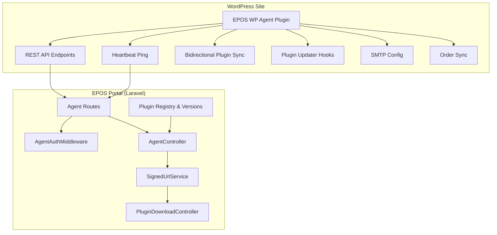
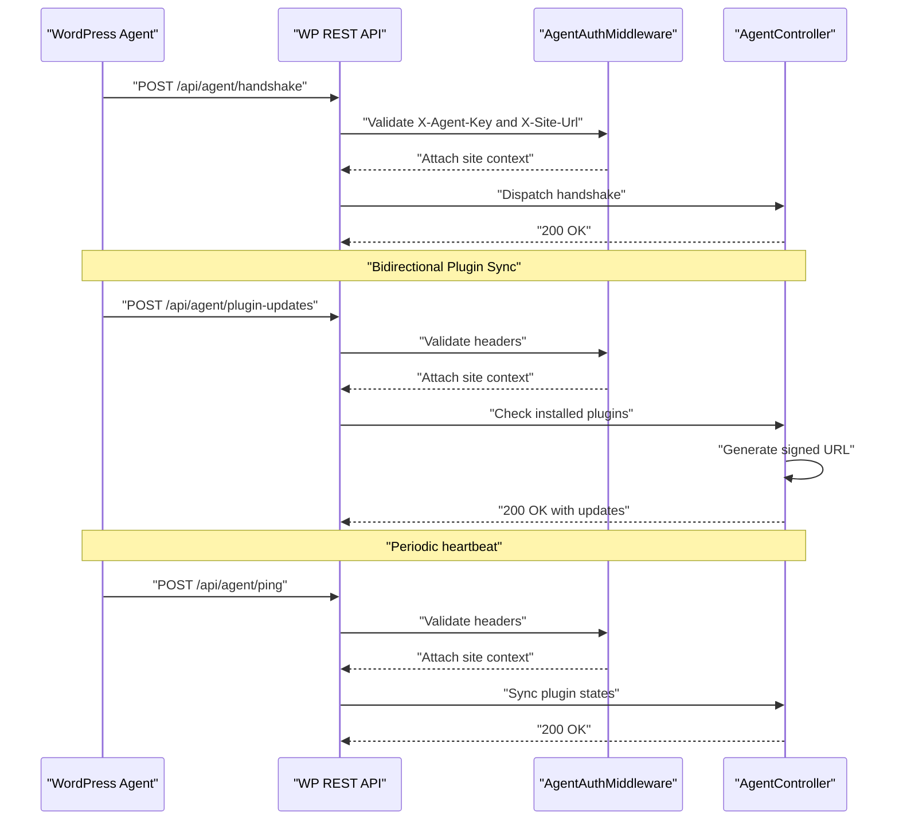
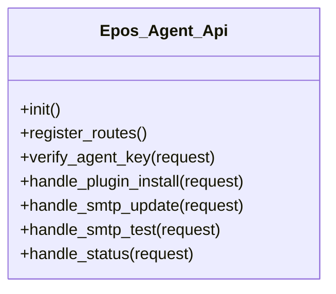
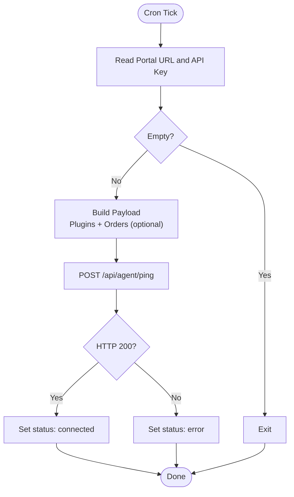
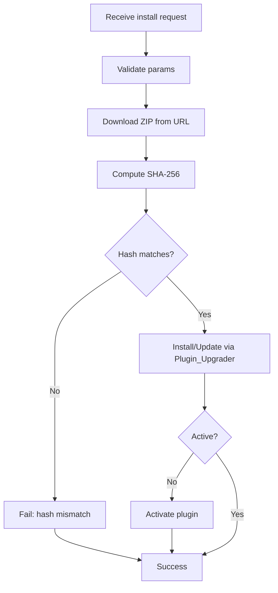
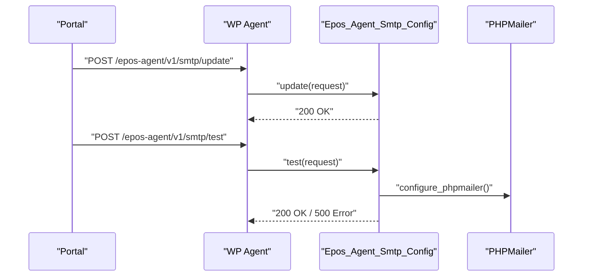
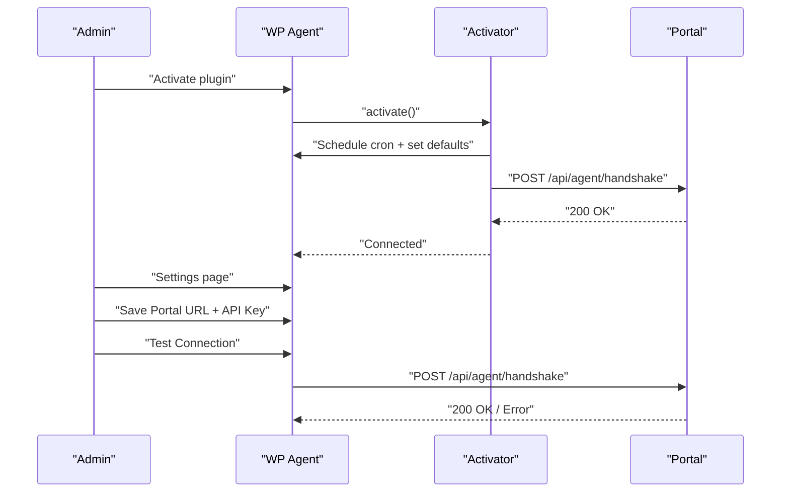
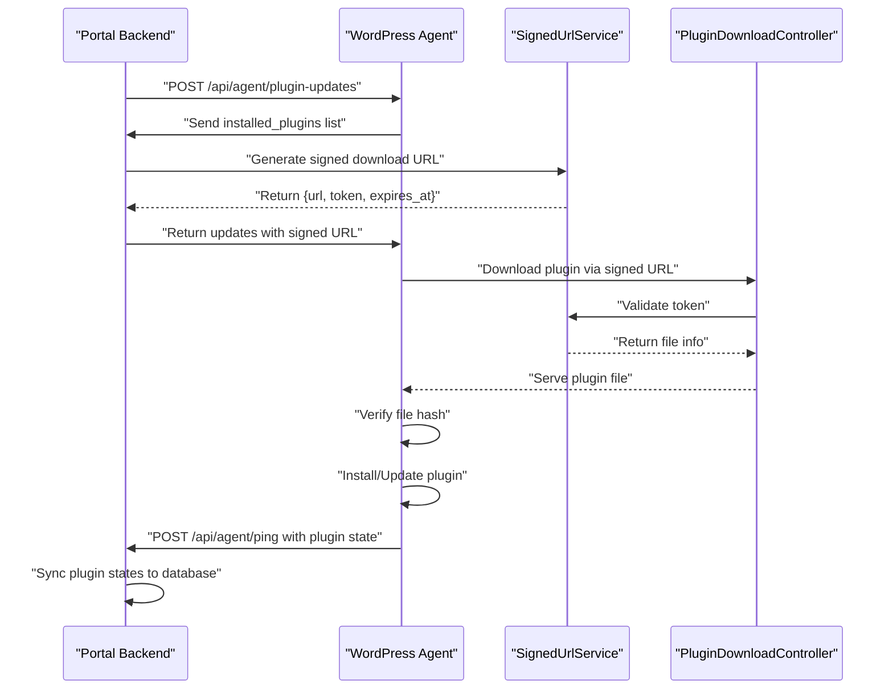
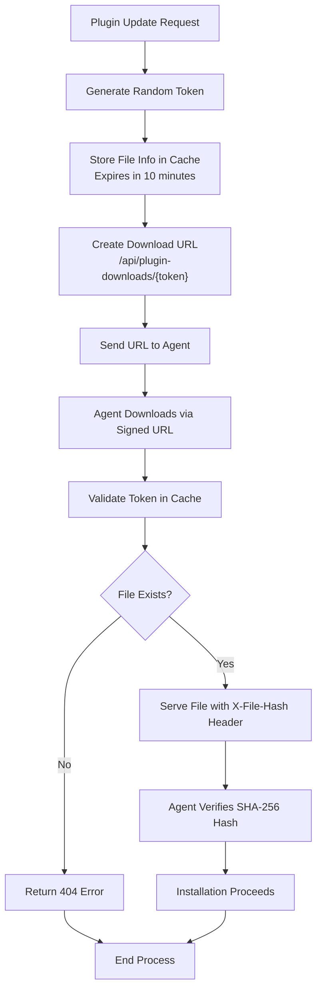
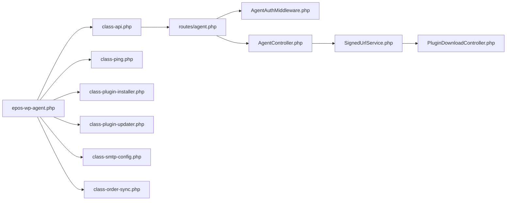

# WordPress Agent Integration

<cite>
**Referenced Files in This Document**
- [epos-wp-agent.php](file://agent/epos-wp-agent/epos-wp-agent.php)
- [class-api.php](file://agent/epos-wp-agent/includes/class-api.php)
- [class-ping.php](file://agent/epos-wp-agent/includes/class-ping.php)
- [class-order-sync.php](file://agent/epos-wp-agent/includes/class-order-sync.php)
- [class-plugin-installer.php](file://agent/epos-wp-agent/includes/class-plugin-installer.php)
- [class-plugin-updater.php](file://agent/epos-wp-agent/includes/class-plugin-updater.php)
- [class-smtp-config.php](file://agent/epos-wp-agent/includes/class-smtp-config.php)
- [class-activator.php](file://agent/epos-wp-agent/includes/class-activator.php)
- [class-deactivator.php](file://agent/epos-wp-agent/includes/class-deactivator.php)
- [settings-page.php](file://agent/epos-wp-agent/admin/settings-page.php)
- [readme.txt](file://agent/epos-wp-agent/readme.txt)
- [agent.php](file://portal/routes/agent.php)
- [AgentAuthMiddleware.php](file://portal/app/Http/Middleware/AgentAuthMiddleware.php)
- [AgentController.php](file://portal/app/Http/Controllers/Agent/AgentController.php)
- [SignedUrlService.php](file://portal/app/Services/SignedUrlService.php)
- [PluginDownloadController.php](file://portal/app/Http/Controllers/Portal/PluginDownloadController.php)
- [mail.php](file://portal/config/mail.php)
</cite>

## Update Summary
**Changes Made**
- Enhanced plugin synchronization with bidirectional communication between WordPress agent and Laravel portal
- Added plugin updates endpoint with signed URL generation for secure downloads
- Improved plugin installer/updater logic with comprehensive integrity verification
- Implemented full plugin lifecycle management with secure download and verification
- Added portal-side plugin version management with changelog support

## Table of Contents
1. [Introduction](#introduction)
2. [Project Structure](#project-structure)
3. [Core Components](#core-components)
4. [Architecture Overview](#architecture-overview)
5. [Detailed Component Analysis](#detailed-component-analysis)
6. [Bidirectional Plugin Synchronization](#bidirectional-plugin-synchronization)
7. [Enhanced Plugin Lifecycle Management](#enhanced-plugin-lifecycle-management)
8. [Dependency Analysis](#dependency-analysis)
9. [Performance Considerations](#performance-considerations)
10. [Security and Authentication](#security-and-authentication)
11. [Troubleshooting Guide](#troubleshooting-guide)
12. [Conclusion](#conclusion)

## Introduction
This document explains the WordPress Agent plugin integration system that connects WordPress sites to the EPOS Portal. The system now features enhanced bidirectional plugin synchronization, secure plugin updates with signed URLs, and comprehensive plugin lifecycle management. It covers the agent plugin architecture, the REST API bridge between WordPress and the Laravel backend, the heartbeat mechanism for periodic status updates, plugin management (installation, updates, and compatibility), order synchronization for WooCommerce, SMTP configuration and email service integration, security and authentication, and troubleshooting guidance for common communication issues.

## Project Structure
The integration consists of two parts:
- WordPress plugin (agent): Provides REST endpoints, heartbeat, bidirectional plugin management, SMTP configuration, and order synchronization.
- Laravel Portal backend: Validates agent requests, handles handshake and ping, manages plugin versions with signed URL generation, and orchestrates bidirectional plugin synchronization.

**Diagram sources**
- [epos-wp-agent.php:43-53](file://agent/epos-wp-agent/epos-wp-agent.php#L43-L53)
- [class-api.php:8-45](file://agent/epos-wp-agent/includes/class-api.php#L8-L45)
- [class-ping.php:7-13](file://agent/epos-wp-agent/includes/class-ping.php#L7-L13)
- [class-plugin-installer.php:13-92](file://agent/epos-wp-agent/includes/class-plugin-installer.php#L13-L92)
- [class-plugin-updater.php:16-45](file://agent/epos-wp-agent/includes/class-plugin-updater.php#L16-L45)
- [class-smtp-config.php:13-41](file://agent/epos-wp-agent/includes/class-smtp-config.php#L13-L41)
- [class-order-sync.php:13-47](file://agent/epos-wp-agent/includes/class-order-sync.php#L13-L47)
- [agent.php:16-19](file://portal/routes/agent.php#L16-L19)
- [AgentAuthMiddleware.php:20-55](file://portal/app/Http/Middleware/AgentAuthMiddleware.php#L20-L55)
- [AgentController.php:16-97](file://portal/app/Http/Controllers/Agent/AgentController.php#L16-L97)
- [SignedUrlService.php:17-36](file://portal/app/Services/SignedUrlService.php#L17-L36)
- [PluginDownloadController.php:16-43](file://portal/app/Http/Controllers/Portal/PluginDownloadController.php#L16-L43)

**Section sources**
- [epos-wp-agent.php:26-53](file://agent/epos-wp-agent/epos-wp-agent.php#L26-L53)
- [agent.php:16-19](file://portal/routes/agent.php#L16-L19)

## Core Components
- REST API Bridge: Exposes endpoints under a dedicated namespace for plugin management, SMTP configuration, and status reporting.
- Heartbeat Mechanism: Periodic pings to the Portal with site status and optionally recent orders.
- Bidirectional Plugin Synchronization: Real-time plugin state synchronization with the Portal for both directions.
- Enhanced Plugin Management: Installs and updates EPOS company plugins with integrity verification, secure downloads, and full lifecycle management.
- Plugin Updates Endpoint: Generates signed URLs for secure plugin downloads with token-based access control.
- SMTP Configuration: Applies remote SMTP settings and sends test emails.
- Order Synchronization: Collects recent WooCommerce orders for sync to the Portal.
- Authentication and Security: Uses a shared secret validated via a middleware on the Portal with enhanced security measures.

**Section sources**
- [class-api.php:15-45](file://agent/epos-wp-agent/includes/class-api.php#L15-L45)
- [class-ping.php:29-81](file://agent/epos-wp-agent/includes/class-ping.php#L29-L81)
- [class-plugin-installer.php:13-92](file://agent/epos-wp-agent/includes/class-plugin-installer.php#L13-L92)
- [class-plugin-updater.php:16-45](file://agent/epos-wp-agent/includes/class-plugin-updater.php#L16-L45)
- [class-smtp-config.php:13-78](file://agent/epos-wp-agent/includes/class-smtp-config.php#L13-L78)
- [class-order-sync.php:13-47](file://agent/epos-wp-agent/includes/class-order-sync.php#L13-L47)
- [AgentAuthMiddleware.php:20-55](file://portal/app/Http/Middleware/AgentAuthMiddleware.php#L20-L55)

## Architecture Overview
The agent plugin initializes and registers:
- REST API endpoints for the Portal to issue commands.
- A cron-based heartbeat that periodically pings the Portal.
- Plugin updater hooks for EPOS company plugins with bidirectional synchronization.
- Admin settings page for Portal URL and API key.

The Portal validates each request using a custom middleware that verifies the X-Agent-Key against a hashed secret stored per site and attaches the site context to the request. The system now supports bidirectional plugin synchronization with secure signed URL generation for downloads.

**Diagram sources**
- [epos-wp-agent.php:43-53](file://agent/epos-wp-agent/epos-wp-agent.php#L43-L53)
- [class-api.php:8-10](file://agent/epos-wp-agent/includes/class-api.php#L8-L10)
- [agent.php:16-19](file://portal/routes/agent.php#L16-L19)
- [AgentAuthMiddleware.php:20-55](file://portal/app/Http/Middleware/AgentAuthMiddleware.php#L20-L55)
- [AgentController.php:16-97](file://portal/app/Http/Controllers/Agent/AgentController.php#L16-L97)
- [AgentController.php:178-241](file://portal/app/Http/Controllers/Agent/AgentController.php#L178-L241)

## Detailed Component Analysis

### REST API Bridge
The plugin registers a namespace for agent-related endpoints and enforces agent key verification for each route. The endpoints include:
- Plugin install/update
- SMTP update
- SMTP test
- Status report

Verification relies on comparing the provided key with the stored key using a constant-time comparison.

**Diagram sources**
- [class-api.php:6-109](file://agent/epos-wp-agent/includes/class-api.php#L6-L109)

**Section sources**
- [class-api.php:15-45](file://agent/epos-wp-agent/includes/class-api.php#L15-L45)
- [class-api.php:50-71](file://agent/epos-wp-agent/includes/class-api.php#L50-L71)

### Heartbeat Mechanism
The agent schedules a custom 5-minute interval and posts a payload containing:
- Installed EPOS company plugins
- Recent orders (if WooCommerce is active)

It sets connection status based on HTTP response codes and logs errors in debug mode.

**Diagram sources**
- [class-ping.php:7-13](file://agent/epos-wp-agent/includes/class-ping.php#L7-L13)
- [class-ping.php:29-81](file://agent/epos-wp-agent/includes/class-ping.php#L29-L81)

**Section sources**
- [class-ping.php:18-24](file://agent/epos-wp-agent/includes/class-ping.php#L18-L24)
- [class-ping.php:29-81](file://agent/epos-wp-agent/includes/class-ping.php#L29-L81)

### Enhanced Plugin Management
The installer accepts parameters for slug, version, download URL, and file hash. It:
- Downloads the plugin archive
- Verifies SHA-256 integrity
- Uses the WordPress upgrader to install or update
- Activates the plugin if needed

The updater now implements bidirectional synchronization with the Portal, checking for updates and providing plugin information for WordPress update system integration.

**Diagram sources**
- [class-plugin-installer.php:13-92](file://agent/epos-wp-agent/includes/class-plugin-installer.php#L13-L92)

**Section sources**
- [class-plugin-installer.php:13-92](file://agent/epos-wp-agent/includes/class-plugin-installer.php#L13-L92)
- [class-plugin-updater.php:16-45](file://agent/epos-wp-agent/includes/class-plugin-updater.php#L16-L45)

### SMTP Configuration and Email Service Integration
The SMTP module:
- Persists SMTP settings upon receiving a remote update
- Hooks into PHPMailer to apply settings for all outgoing emails
- Sends a test email and returns success/failure

The Portal's mail configuration supports multiple mailers and global "From" settings.

**Diagram sources**
- [class-smtp-config.php:13-41](file://agent/epos-wp-agent/includes/class-smtp-config.php#L13-L41)
- [class-smtp-config.php:49-78](file://agent/epos-wp-agent/includes/class-smtp-config.php#L49-L78)
- [class-smtp-config.php:83-103](file://agent/epos-wp-agent/includes/class-smtp-config.php#L83-L103)
- [mail.php:38-100](file://portal/config/mail.php#L38-L100)

**Section sources**
- [class-smtp-config.php:13-78](file://agent/epos-wp-agent/includes/class-smtp-config.php#L13-L78)
- [class-smtp-config.php:83-103](file://agent/epos-wp-agent/includes/class-smtp-config.php#L83-L103)
- [mail.php:38-100](file://portal/config/mail.php#L38-L100)

### Order Synchronization (WooCommerce)
The order sync collects the most recent orders modified since the last sync, up to a fixed limit, and updates the last sync timestamp. This data is included in the heartbeat payload when WooCommerce is active.

**Diagram sources**
- [class-order-sync.php:13-47](file://agent/epos-wp-agent/includes/class-order-sync.php#L13-L47)

**Section sources**
- [class-order-sync.php:13-47](file://agent/epos-wp-agent/includes/class-order-sync.php#L13-L47)

### Initialization and Admin Settings
On activation, the agent schedules the heartbeat, sets default options, and attempts a handshake with the Portal. The admin settings page allows configuring the Portal URL and API key, saving them securely, and testing connectivity.

**Diagram sources**
- [class-activator.php:12-30](file://agent/epos-wp-agent/includes/class-activator.php#L12-L30)
- [class-activator.php:35-76](file://agent/epos-wp-agent/includes/class-activator.php#L35-L76)
- [settings-page.php:20-27](file://agent/epos-wp-agent/admin/settings-page.php#L20-L27)
- [settings-page.php:30-45](file://agent/epos-wp-agent/admin/settings-page.php#L30-L45)

**Section sources**
- [class-activator.php:12-30](file://agent/epos-wp-agent/includes/class-activator.php#L12-L30)
- [class-activator.php:35-76](file://agent/epos-wp-agent/includes/class-activator.php#L35-L76)
- [settings-page.php:20-27](file://agent/epos-wp-agent/admin/settings-page.php#L20-L27)
- [settings-page.php:30-45](file://agent/epos-wp-agent/admin/settings-page.php#L30-L45)

## Bidirectional Plugin Synchronization

### Enhanced Plugin Updates Flow
The system now supports bidirectional plugin synchronization through a comprehensive updates endpoint that generates secure signed URLs for plugin downloads. This enables both directions of communication:

1. **Portal-to-Agent Updates**: Portal checks installed plugins and sends update information
2. **Agent-to-Portal State Reporting**: Agent reports plugin states back to Portal
3. **Secure Download Process**: Signed URLs ensure secure plugin distribution

**Diagram sources**
- [AgentController.php:178-241](file://portal/app/Http/Controllers/Agent/AgentController.php#L178-L241)
- [SignedUrlService.php:17-36](file://portal/app/Services/SignedUrlService.php#L17-L36)
- [PluginDownloadController.php:16-43](file://portal/app/Http/Controllers/Portal/PluginDownloadController.php#L16-L43)
- [class-plugin-updater.php:30-113](file://agent/epos-wp-agent/includes/class-plugin-updater.php#L30-L113)

### Plugin State Synchronization
The AgentController now includes comprehensive plugin state synchronization that:
- Syncs company plugin installations to the site_plugins table
- Calculates latest stable versions for each plugin
- Handles plugin activation/deactivation states
- Removes orphaned records when plugins are uninstalled

**Section sources**
- [AgentController.php:107-152](file://portal/app/Http/Controllers/Agent/AgentController.php#L107-L152)
- [class-plugin-updater.php:30-113](file://agent/epos-wp-agent/includes/class-plugin-updater.php#L30-L113)

## Enhanced Plugin Lifecycle Management

### Secure Plugin Download System
The system implements a secure plugin download process using signed URLs:

1. **Token Generation**: Unique tokens with 10-minute expiration
2. **Cache Storage**: Temporary storage of file metadata in cache
3. **Single-Use Validation**: Token validation with automatic cleanup
4. **Integrity Verification**: SHA-256 hash verification during installation

**Diagram sources**
- [SignedUrlService.php:17-36](file://portal/app/Services/SignedUrlService.php#L17-L36)
- [PluginDownloadController.php:16-43](file://portal/app/Http/Controllers/Portal/PluginDownloadController.php#L16-L43)
- [class-plugin-installer.php:47-57](file://agent/epos-wp-agent/includes/class-plugin-installer.php#L47-L57)

### Improved Installer Logic
The enhanced installer now includes:
- Comprehensive parameter validation
- Secure file hash verification
- Overwrite handling for updates
- Automatic activation logic
- Detailed error reporting

**Section sources**
- [class-plugin-installer.php:19-110](file://agent/epos-wp-agent/includes/class-plugin-installer.php#L19-L110)
- [SignedUrlService.php:17-36](file://portal/app/Services/SignedUrlService.php#L17-L36)
- [PluginDownloadController.php:16-43](file://portal/app/Http/Controllers/Portal/PluginDownloadController.php#L16-L43)

## Dependency Analysis
The agent plugin depends on WordPress core APIs for REST, cron, HTTP requests, and plugin management. The Portal validates requests and orchestrates actions based on the authenticated site context, with enhanced plugin management capabilities.

**Diagram sources**
- [epos-wp-agent.php:26-34](file://agent/epos-wp-agent/epos-wp-agent.php#L26-L34)
- [class-api.php:8-10](file://agent/epos-wp-agent/includes/class-api.php#L8-L10)
- [agent.php:16-19](file://portal/routes/agent.php#L16-L19)
- [AgentAuthMiddleware.php:20-55](file://portal/app/Http/Middleware/AgentAuthMiddleware.php#L20-L55)
- [AgentController.php:16-97](file://portal/app/Http/Controllers/Agent/AgentController.php#L16-L97)
- [SignedUrlService.php:17-36](file://portal/app/Services/SignedUrlService.php#L17-L36)
- [PluginDownloadController.php:16-43](file://portal/app/Http/Controllers/Portal/PluginDownloadController.php#L16-L43)

**Section sources**
- [epos-wp-agent.php:26-34](file://agent/epos-wp-agent/epos-wp-agent.php#L26-L34)
- [agent.php:16-19](file://portal/routes/agent.php#L16-L19)

## Performance Considerations
- Heartbeat frequency: The 5-minute interval balances visibility and overhead. Adjustments should consider server load and network bandwidth.
- Order sync limits: The recent order collection is capped to reduce payload size and processing time.
- Plugin downloads: Large plugin archives increase memory and disk usage; ensure sufficient resources and timeouts.
- Signed URL caching: Cache-based token storage minimizes database load while maintaining security.
- Bidirectional sync: Plugin state synchronization reduces redundant data transfer and improves accuracy.
- SMTP operations: Email sending adds latency; batch operations or async processing can help if needed.

## Security and Authentication
- Shared secret validation: The Portal hashes the provided key and compares it securely. The agent verifies keys using a constant-time comparison.
- Headers: Both sides rely on X-Agent-Key and X-Site-Url for identification and authorization.
- HTTPS: Outbound requests enable SSL verification to protect data in transit.
- Integrity: Plugin installation validates file integrity via SHA-256 before upgrading.
- Signed URL Security: Token-based download URLs with 10-minute expiration prevent unauthorized access.
- Cache Security: Temporary cache storage with automatic cleanup prevents token reuse.
- Bidirectional Authentication: Both directions require proper key validation and site authorization.

Best practices:
- Rotate API keys periodically and re-test connections after changes.
- Restrict Portal URL and API key exposure; avoid logging sensitive values.
- Monitor connection status and investigate persistent errors promptly.
- Regularly review plugin update logs and security events.
- Implement proper cache configuration for production environments.

**Section sources**
- [AgentAuthMiddleware.php:20-55](file://portal/app/Http/Middleware/AgentAuthMiddleware.php#L20-L55)
- [class-api.php:50-71](file://agent/epos-wp-agent/includes/class-api.php#L50-L71)
- [class-ping.php:50-62](file://agent/epos-wp-agent/includes/class-ping.php#L50-L62)
- [class-plugin-installer.php:36-44](file://agent/epos-wp-agent/includes/class-plugin-installer.php#L36-L44)
- [SignedUrlService.php:17-36](file://portal/app/Services/SignedUrlService.php#L17-L36)

## Troubleshooting Guide
Common issues and resolutions:
- Missing or invalid API key
  - Symptom: Unauthorized responses from the Portal.
  - Action: Verify the API key in the settings page and re-test the connection.
  - Section sources
    - [class-api.php:50-71](file://agent/epos-wp-agent/includes/class-api.php#L50-L71)
    - [settings-page.php:30-45](file://agent/epos-wp-agent/admin/settings-page.php#L30-L45)

- Connection failures during handshake or ping
  - Symptom: Connection status shows error; logs indicate failures.
  - Action: Check network reachability to the Portal URL, firewall rules, and SSL certificates. Review debug logs if enabled.
  - Section sources
    - [class-activator.php:60-66](file://agent/epos-wp-agent/includes/class-activator.php#L60-L66)
    - [class-ping.php:64-70](file://agent/epos-wp-agent/includes/class-ping.php#L64-L70)

- Plugin installation failures
  - Symptom: Installation returns failure; errors indicate permission or integrity issues.
  - Action: Confirm server write permissions, available disk space, and that the file hash matches the expected value.
  - Section sources
    - [class-plugin-installer.php:29-34](file://agent/epos-wp-agent/includes/class-plugin-installer.php#L29-L34)
    - [class-plugin-installer.php:68-80](file://agent/epos-wp-agent/includes/class-plugin-installer.php#L68-L80)

- Plugin update failures
  - Symptom: Updates not detected or download fails.
  - Action: Verify signed URL generation, cache configuration, and file hash verification. Check plugin registry and version management.
  - Section sources
    - [class-plugin-updater.php:30-113](file://agent/epos-wp-agent/includes/class-plugin-updater.php#L30-L113)
    - [AgentController.php:178-241](file://portal/app/Http/Controllers/Agent/AgentController.php#L178-L241)
    - [SignedUrlService.php:17-36](file://portal/app/Services/SignedUrlService.php#L17-L36)

- SMTP test failures
  - Symptom: Test email fails to send.
  - Action: Validate SMTP credentials and server settings; ensure the PHPMailer configuration is applied and the mailer is reachable.
  - Section sources
    - [class-smtp-config.php:49-78](file://agent/epos-wp-agent/includes/class-smtp-config.php#L49-L78)
    - [class-smtp-config.php:83-103](file://agent/epos-wp-agent/includes/class-smtp-config.php#L83-L103)

- Heartbeat not updating status
  - Symptom: Connection remains pending or disconnects unexpectedly.
  - Action: Confirm cron is running, schedule is registered, and the Portal responds with HTTP 200.
  - Section sources
    - [class-ping.php:18-24](file://agent/epos-wp-agent/includes/class-ping.php#L18-L24)
    - [class-ping.php:72-81](file://agent/epos-wp-agent/includes/class-ping.php#L72-L81)

- Bidirectional sync issues
  - Symptom: Plugin states not updating or inconsistent data.
  - Action: Verify plugin state reporting in heartbeat, check database synchronization, and confirm plugin registry updates.
  - Section sources
    - [AgentController.php:107-152](file://portal/app/Http/Controllers/Agent/AgentController.php#L107-L152)
    - [class-activator.php:81-103](file://agent/epos-wp-agent/includes/class-activator.php#L81-L103)

## Conclusion
The WordPress Agent plugin provides a robust foundation for connecting WordPress sites to the EPOS Portal with enhanced bidirectional plugin synchronization capabilities. The system now features secure plugin lifecycle management with signed URL generation, comprehensive integrity verification, and real-time plugin state synchronization. It establishes secure, authenticated communication, maintains health via periodic heartbeats, manages EPOS company plugins with full lifecycle support, configures SMTP remotely, and synchronizes WooCommerce orders. The Laravel backend enforces strict authentication, manages plugin versions with secure downloads, and orchestrates bidirectional plugin synchronization for a complete integration solution.